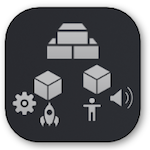
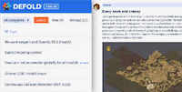

# Witamy w Defoldzie!

Defold jest platformą przeznaczoną do profesjonalnej produkcji gier, ułatwiającą grupom deweloperów projektować, budować i _przygotowywać_ gry na wspierane platformy. Defold skupia się na stworzeniu ogólnego środowiska, oddając Ci w ręce wszystkie podstawowe elementy, bez wprowadzania zbędnych, skomplikowanych komponentów. Wierzymy, że siłą Defolda jest danie użytkownikom zestawu prostych, ale potężnych narzędzi, które umożliwiają wspólną pracę nad grą. Oznacza to, że czasami będziesz wykonywać dodatkową pracę, aby stworzyć komponent dopasowany do Twoich potrzeb, ale daje Ci to całkowitą nad tym kontrolę, a sama droga do Twojego celu jest bardziej przejrzysta i zrozumiała dla Ciebie.

Jeśli jesteś początkującym albo doświadczonym deweloperem, może zająć chwilę, zanim załapiesz pewne koncepty. Zachęcamy do eksperymentowania i podążania za tutorialami, czytania instrukcji i dokumentacji API oraz do aktywności na naszym forum, gdzie użytkownicy i twórcy silnika pomogą Ci z każdym zagadnieniem dotyczącym silnika. Defold jest rozwijany nieustannie i co miesiąc wypuszczana jest nowa wersja, która jest kompatybilna wstecznie, więc aktualizacja nie powinna powodować błędów w Twoim obecnym projekcie.

## Gdzie rozpocząć?

Na stronach Defolda znajdziesz mnóstwo dokumentacji, instrukcji, przykładów i tutoriali. Jeśli nie wiesz od czego zacząć, poniżej przedstawiamy szybki wstęp:

#### Edytor Defold
{.left} [Instrukcja do edytora Defold](/manuals/editor/) opisuje edytor i pozwala Ci szybko zacząć swobodne poruszanie się w środowisku, używać narzędzi wizualnych i pisać kod. Jeśli jesteś zaznajomiony z innymi IDE lub programami do modelowania 3D część rzeczy może Cię zaskoczyć, ale zazwyczaj jest tak właśnie, że wygląd i funkcje różnią się między programami.

#### Proste przykłady
{.left} [Nasz zestaw prostych przykładów](/examples/) to dobre miejsce na start i zrozumienie jak składać małe elementy razem w coś, co działa. Znajdziesz tam funkcje i operacje w Defoldzie w minimaljnej formie.

#### Język Lua
{.left} [Defold wykorzystuje język Lua](/manuals/lua/) do tworzenia logiki gry. Silnik jest natomiast napisany w języku C++ i zoptymalizowany do szybkiego wykonywania zadań. Jeśli programowałeś już w Pythonie, Javascripcie lub innym wysoko poziomowym języku, Lua powinna być dla Ciebie prosta do zrozumienia i nauczenia się i bez problemu powinieneś móc przejść do tutoriali dotyczących bezpośrednio Defolda. W innym przypadku, warto najpierw przeczytać instrukcję języka Lua.

#### Tutoriale gier
{.left} Wierzymy, że najlepiej uczy się przez tworzenie. Przygotowaliśmy więc zbiór tutoriali na różnych poziomach zaawansowania, dostępnych bezpośrednio z poziomu [edytora](/manuals/editor/). Uruchom je i podążaj za instrukcjami, aby szybko nauczyć się jak budować rzeczy i jak działa Defold.

#### Podstawowe elementy
{.left} [Defold wykorzystuje kilka podstawowych elementów do budowania aplikacji](/manuals/building-blocks/), niektóre z nich mogą Ci się wydać już znajome lub analogiczne do elementów z innych silników. Jest kilka decyzji związanych z architekturą silnika Defold, które sprawiają, że te elementy mają specyficzny charakter, więc może zająć chwilę, aby czuć się z nimi komfortowo i używać ich w naturalny sposób. Służy to jednak zoptymalizowaniu tworzenia gier na silniku Defold. Nasza instrukcja dotycząca tych bloków to dobre miejsce, aby zacząć rozumieć koncepty Defolda i dowiedzieć się jak to dokładnie działa.

#### Forum
{.left} [Uczenie się od innych użytkowników](//forum.defold.com/) jest również często najlepszym sposobem na naukę. Nasza społeczność jest bardzo przyjazna, otwarta i wie dużo na temat tworzenia gier w ogólności, a także w szczególności na silniku Defold. Jeśli kiedykolwiek utkniesz, nie wahaj się, aby zapytać o rozwiązanie Twojego problemu na forum. (Będziesz musiał kontaktować się w języku angielskim, ale na forum, discordzie czy slacku możesz znaleźć kogoś, kto zna język polski w razie problemów - przyp. tłumacza)

Pamiętaj, że niezależnie od Twojego podejścia do nauki Defolda możesz zawsze wrócić tutaj i wyszukać na stronie szczegóły dotyczące różnych operacji i konceptów. Nie wahaj się wskazywać rzeczy, któych nie jesteś w stanie zrozumieć lub uważasz, że nie są prawidłowe. Wszystkie te instrukcje są dla Ciebie i będziemy pracować nad tym, żeby dopasować je do Twoich potrzeb.

Mamy nadzieję, że będziesz się cieszyć tworząc Twoją wymarzoną grę w Defoldzie!
