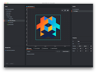
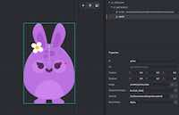
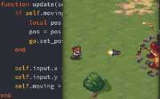
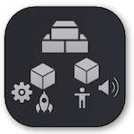
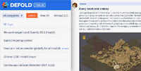

# Witamy w Defold

Defold to kompletne rozwiązanie, które oddaje w ręce twórców gry wszystkie potrzebne narzędzia, od projektowania po wdrożenie. Pełna lista możliwości platformy jest dostępna na stronie [przeglądu możliwości silnika Defold](/product).

Spędziliśmy dużo czasu na uproszczeniu kluczowych elementów procesu tworzenia gier, tak aby praca w silniku Defold była możliwie sprawna. Uważamy, że właśnie to wyróżnia Defold, dlatego zachęcamy do zapoznania się z powodami, dla których uznajemy go za dobry wybór. Szczegóły znajdziesz na stronie [dlaczego uważamy, że warto używać silnika Defold](/why).

## Od czego zacząć?

Zachęcamy do eksperymentowania, korzystania z tutoriali, czytania podręczników i dokumentacji API oraz do udziału w forum, by uczyć się od innych użytkowników i śledzić rozwój silnika Defold. Na stronie znajduje się sporo materiałów: podręczniki, referencje API, przykłady i przeglądy technologii. Jeśli czujesz się zagubiony, poniżej znajdziesz kilka wskazówek, od czego zacząć:

#### Edytor
{.left} [Przegląd edytora](/manuals/editor/) przedstawia podstawy korzystania z edytora, pomoże Ci rozpoznać elementy interfejsu, obsługiwać narzędzia wizualne i pisać kod. Jeżeli znasz inne środowiska programistyczne lub aplikacje do modelowania 3D, większość rzeczy będzie Ci znajoma, choć pewne detale mogą wyglądać inaczej.

#### Proste przykłady
{.left} [Nasz zbiór prostych przykładów](/examples/) pokazuje, jak łączyć elementy silnika Defold w działające rozwiązania. Znajdziesz tam minimalne przykłady popularnych mechanik, dzięki którym łatwiej zrozumiesz, jak pracować z poszczególnymi komponentami.

#### Język Lua
{.left} [Defold używa języka Lua](/manuals/lua/) do implementacji logiki. Silnik jest napisany w C++, ale sterujesz nim z poziomu Lua. Jeśli programowałeś już w Pythonie, JavaScripcie lub innym języku wysokiego poziomu, nauka Lua powinna być prosta i szybko poradzisz sobie z kolejnymi tutorialami. W przeciwnym razie warto zacząć od podręcznika do Lua.

#### Tutoriale gier
{.left} Uczysz się najlepiej, robiąc coś samodzielnie. Dlatego w [edytorze](/manuals/editor/) znajdziesz zestaw tutoriali o różnym poziomie trudności. Uruchom jeden z nich i przechodź kolejne kroki, aby zobaczyć, jak budować projekty i jak działa Defold.

#### Podstawowe elementy silnika Defold
{.left} [Gry w silniku Defold buduje się przez składanie prostych elementów](/manuals/building-blocks/), a niektóre pojawiają się też w innych silnikach. Istnieją jednak decyzje architektoniczne, które nadają naszym blokom specyficzny charakter, więc może minąć chwilę, zanim poczujesz się z nimi swobodnie. Instrukcja dotycząca podstawowych elementów to dobry punkt wyjścia, jeśli chcesz zrozumieć, jak działa alfabet silnika Defold.

#### Forum
{.left} [Uczenie się od innych](//forum.defold.com/) często jest najskuteczniejszym sposobem na naukę. Nasza społeczność jest przyjazna i zna się na tworzeniu gier w ogóle, a szczególnie na pracy z Defold. Jeśli utkniesz, śmiało zajrzyj na forum i poproś o pomoc.

Pamiętaj, że bez względu na to, jaką ścieżkę wybierzesz, zawsze możesz wrócić do tego podręcznika po dokładniejsze wyjaśnienia dotyczące funkcji i konceptów silnika Defold. Nie wahaj się zgłaszać, kiedy coś wydaje się niejasne lub nieprawidłowe — te strony są dla Ciebie i chcemy, żeby były jak najbardziej pomocne.

Mamy nadzieję, że tworzenie kolejnej świetnej gry w silniku Defold sprawi Ci satysfakcję!
