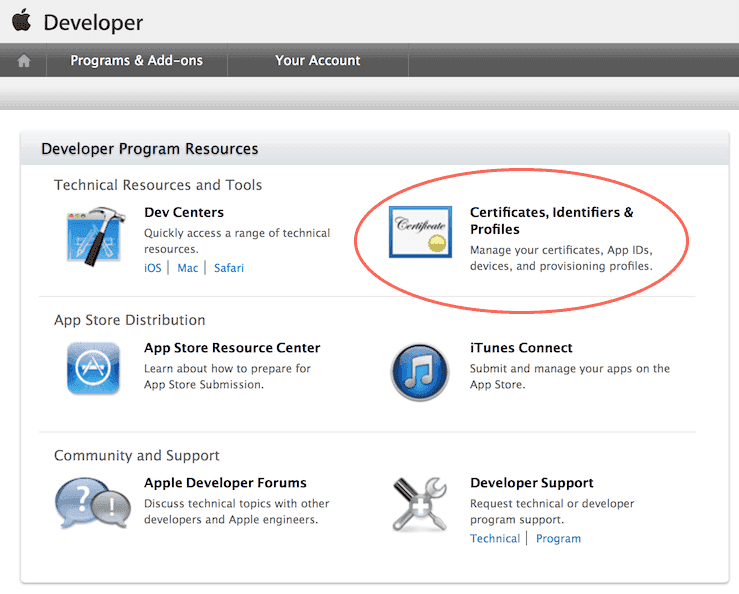
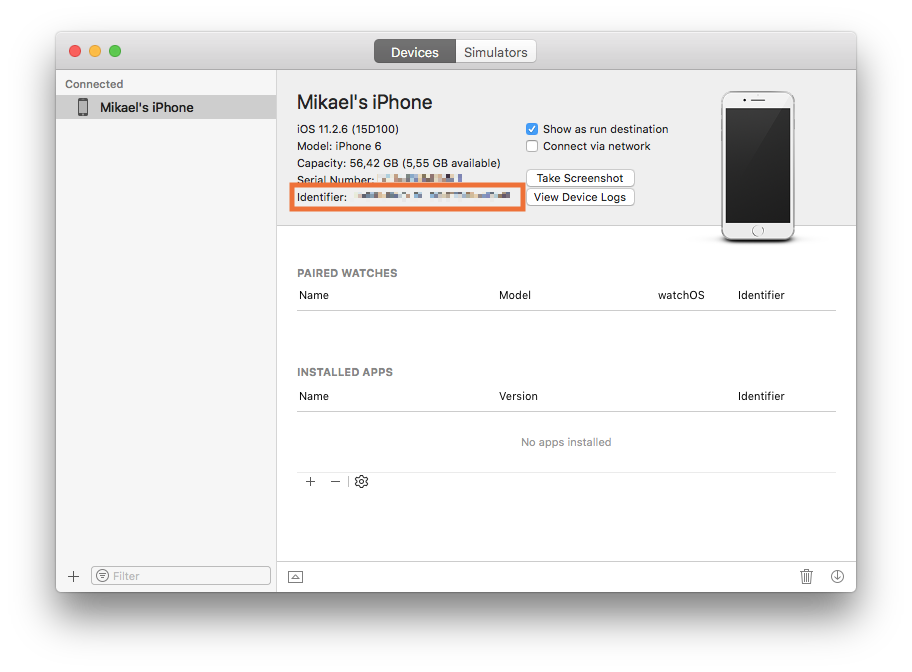
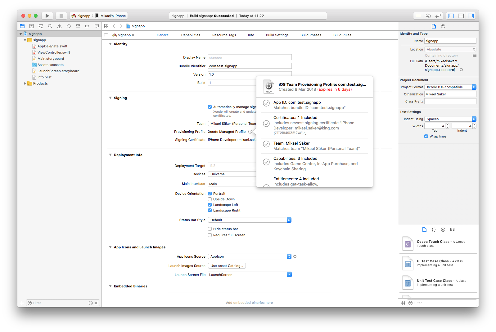
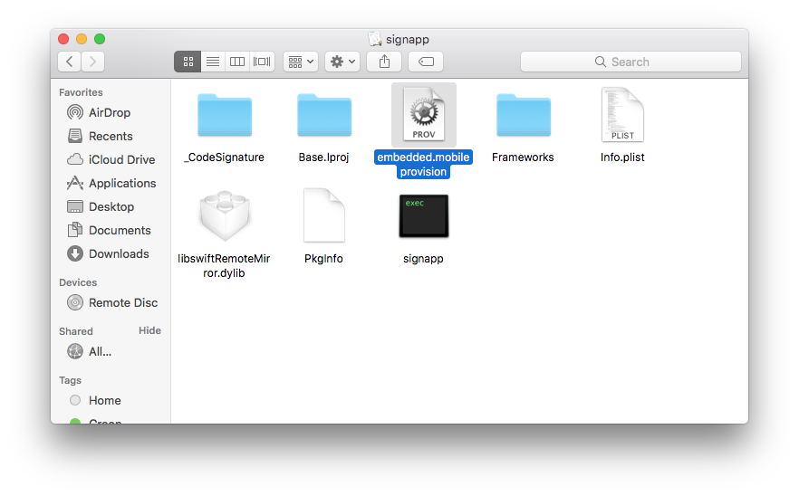
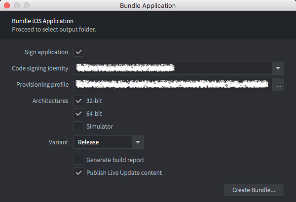

# Tworzenie na iOS

::: sidenote
Bundlowanie gry dla iOS jest dostępne tylko w edytorze Defold na Macu.
:::

iOS wymaga, aby każda aplikacja, którą zbudujesz i chcesz uruchomić na telefonie lub tablecie, była podpisana certyfikatem wydanym przez Apple i profilem provisioningowym. Ta instrukcja opisuje kroki potrzebne do zbundlowania gry na iOS. Podczas tworzenia często lepiej jest uruchamiać grę przez [development app](/manuals/dev-app), ponieważ umożliwia to szybkie przeładowywanie zawartości i kodu bezpośrednio na urządzenie.

## Proces podpisywania kodu Apple

Mechanizmy bezpieczeństwa związane z aplikacjami iOS składają się z kilku elementów. Dostęp do wymaganych narzędzi uzyskasz po zapisaniu się do iOS Developer Program firmy Apple. Gdy już się zarejestrujesz, przejdź do [Apple Developer Member Center](https://developer.apple.com/membercenter/index.action).



Sekcja *Certificates, Identifiers & Profiles* zawiera wszystkie narzędzia, których potrzebujesz. Stąd możesz tworzyć, usuwać i edytować:

Certificates
: Certyfikaty wydane przez Apple, które identyfikują Cię jako dewelopera. Możesz tworzyć certyfikaty deweloperskie lub produkcyjne. Certyfikaty deweloperskie pozwalają testować niektóre funkcje, takie jak mechanizm zakupów wewnątrz aplikacji, w piaskownicy testowej. Certyfikaty produkcyjne służą do podpisywania finalnej aplikacji przed wysłaniem do App Store. Do podpisania aplikacji przed instalacją na urządzeniu potrzebujesz certyfikatu.

Identifiers
: Identyfikatory do różnych zastosowań. Można rejestrować identyfikatory wieloznacznikowe, np. `some.prefix.*`, które można używać z kilkoma aplikacjami. App ID mogą zawierać informacje o Application Services, na przykład o włączeniu integracji z Passbook, Game Center itd. Takie App ID nie mogą być identyfikatorami wieloznacnikowymi. Aby Application Services działały, *bundle identifier* Twojej aplikacji musi zgadzać się z identyfikatorem App ID.

Devices
: Każde urządzenie deweloperskie trzeba zarejestrować, podając jego UDID (Unique Device Identifier, patrz niżej).

Provisioning Profiles
: Profile provisioningowe powiązują certyfikaty z App ID i listą urządzeń. Określają, która aplikacja, od którego dewelopera, może znajdować się na których urządzeniach.

Podczas podpisywania gier i aplikacji w Defold potrzebujesz poprawnego certyfikatu i poprawnego profilu provisioningowego.

::: sidenote
Niektóre rzeczy, które możesz zrobić na stronie głównej Member Center, możesz też wykonać z poziomu środowiska deweloperskiego Xcode, jeśli masz je zainstalowane.
:::

Device identifier (UDID)
: UDID urządzenia iOS można znaleźć, podłączając je do komputera przez Wi-Fi lub kabel. Otwórz Xcode i wybierz <kbd>Window ▸ Devices and Simulators</kbd>. Po wybraniu urządzenia wyświetlą się numer seryjny i identyfikator.

  

  Jeśli nie masz zainstalowanego Xcode, identyfikator znajdziesz w iTunes. Kliknij ikonę urządzeń i wybierz swoje urządzenie.

  

  1. Na stronie *Summary* znajdź pole *Serial Number*.
  2. Kliknij *Serial Number* raz, aby pole zmieniło się w *UDID*. Jeśli będziesz klikać dalej, pojawią się kolejne informacje o urządzeniu. Klikaj, aż pojawi się *UDID*.
  3. Kliknij prawym przyciskiem długi ciąg UDID i wybierz <kbd>Copy</kbd>, aby skopiować identyfikator do schowka i łatwo wkleić go do pola UDID podczas rejestrowania urządzenia w Apple Developer Member Center.

## Tworzenie za pomocą bezpłatnego konta Apple Developer

Od Xcode 7 każdy może zainstalować Xcode i tworzyć na urządzeniu za darmo. Nie musisz rejestrować się w iOS Developer Program. Zamiast tego Xcode automatycznie wystawi certyfikat deweloperski (ważny 1 rok) oraz profil provisioningowy dla Twojej aplikacji (ważny 1 tydzień) dla konkretnego urządzenia.

1. Podłącz urządzenie.
2. Zainstaluj Xcode.
3. Dodaj nowe konto do Xcode i zaloguj się przy użyciu Apple ID.
4. Utwórz nowy projekt. Najprostsza opcja, "Single View App", działa bez problemu.
5. Wybierz swój "Team" (utworzony automatycznie) i nadaj aplikacji identyfikator bundla.

::: important
Zanotuj identyfikator bundla, ponieważ musisz użyć tego samego identyfikatora bundla w projekcie Defold.
:::

6. Upewnij się, że Xcode utworzył dla aplikacji *Provisioning Profile* i *Signing Certificate*.

   

7. Zbuduj aplikację na urządzeniu. Przy pierwszym uruchomieniu Xcode poprosi o włączenie trybu deweloperskiego i przygotuje urządzenie ze wsparciem debuggera. Może to chwilę potrwać.
8. Gdy potwierdzisz, że aplikacja działa, znajdź ją na dysku. Lokalizację budowania zobaczysz w raporcie budowania w "Report Navigator".

   

9. Znajdź aplikację, kliknij ją prawym przyciskiem i wybierz <kbd>Show Package Contents</kbd>.

   

10. Skopiuj plik "embedded.mobileprovision" w miejsce na dysku, w którym będziesz go łatwo mógł znaleźć.

   

Ten plik provisioningowy możesz wykorzystać razem z tożsamością podpisywania kodu, aby podpisywać aplikacje w Defold przez tydzień.

Gdy profil wygaśnie, musisz ponownie zbudować aplikację w Xcode i uzyskać nowy tymczasowy plik provisioningowy, jak opisano powyżej.

## Tworzenie bundla aplikacji iOS

Gdy masz tożsamość podpisywania kodu i profil provisioningowy, możesz utworzyć samodzielny bundle aplikacji dla swojej gry z poziomu edytora. Po prostu wybierz <kbd>Project ▸ Bundle... ▸ iOS Application...</kbd> z menu.



Wybierz tożsamość podpisywania kodu i wskaż plik profilu provisioningowego. Wybierz także, dla jakich architektur chcesz zbudować bundle (32-bit, 64-bit i symulator iOS) oraz wariant (Debug lub Release). Opcjonalnie możesz odznaczyć pole wyboru `Sign application`, aby pominąć proces podpisywania i podpisać bundle ręcznie później.

::: important
Musisz **odznaczyć** pole `Sign application`, gdy testujesz grę na symulatorze iOS. Aplikację będzie można zainstalować, ale nie uruchomi się.
:::

Naciśnij <kbd>Create Bundle</kbd>, a potem zostaniesz poproszony o wskazanie miejsca na komputerze, w którym bundle ma zostać utworzony.

{.left}

Ikonę aplikacji, storyboard ekranu startowego i inne ustawienia określasz w pliku ustawień projektu *game.project* w [sekcji iOS](/manuals/project-settings/#ios).

:[Warianty budowania](../shared/build-variants.md)

## Instalowanie i uruchamianie bundla na podłączonym iPhonie

Zbudowany bundle możesz zainstalować i uruchomić, używając w oknie Bundle pól wyboru edytora <kbd>Install on connected device</kbd> i <kbd>Launch installed app</kbd>:


Do działania tej funkcji wymagane jest zainstalowane narzędzie wiersza poleceń `ios-deploy`. Najprościej zainstalować je przez Homebrew:
```
$ brew install ios-deploy
```

Jeśli edytor nie może wykryć lokalizacji instalacji narzędzia `ios-deploy`, musisz podać ją w [Preferences](/manuals/editor-preferences/#tools).

### Tworzenie storyboardu

Storyboard tworzysz w Xcode. Uruchom Xcode i utwórz nowy projekt. Wybierz <kbd>iOS</kbd> oraz <kbd>Single View App</kbd>:


Kliknij <kbd>Next</kbd> i przejdź do konfiguracji projektu. Wpisz wartość w polu <kbd>Product Name</kbd>:


Kliknij <kbd>Create</kbd>, aby zakończyć proces. Projekt jest już utworzony i możemy przejść do tworzenia storyboardu:


Przeciągnij i upuść obraz, aby zaimportować go do projektu. Następnie wybierz `Assets.xcassets` i upuść obraz do `Assets.xcassets`:


Otwórz `LaunchScreen.storyboard` i kliknij przycisk plusa (<kbd>+</kbd>). Wpisz `imageview` w oknie dialogowym, aby znaleźć komponent <kbd>Image View</kbd>.


Przeciągnij komponent <kbd>Image View</kbd> na storyboard:


Wybierz obraz, który wcześniej dodałeś do `Assets.xcassets`, z listy <kbd>Image</kbd>:


Ustaw pozycję obrazu i wprowadź inne potrzebne poprawki, na przykład dodając `Label` albo inny element interfejsu. Gdy skończysz, ustaw aktywny schemat na <kbd>Build ▸ Any iOS Device (`arm64`, `armv7`)</kbd> (albo <kbd>Generic iOS Device</kbd>) i wybierz <kbd>Product ▸ Build</kbd>. Poczekaj, aż proces budowania się zakończy.

::: sidenote
Jeśli w opcji <kbd>Any iOS Device (arm64)</kbd> masz tylko `arm64`, zmień `iOS Deployment target` na 10.3 w ustawieniach <kbd>Project ▸ Basic ▸ Deployment</kbd>. Dzięki temu storyboard będzie zgodny z urządzeniami `armv7` (na przykład iPhone5c).
:::

Jeśli używasz obrazów w storyboardzie, nie zostaną one automatycznie uwzględnione w `LaunchScreen.storyboardc`. Aby dołączyć zasoby, użyj pola `Bundle Resources` w *game.project*. Na przykład utwórz folder `LaunchScreen` w projekcie Defold oraz folder `ios` wewnątrz niego (`ios` jest potrzebny, aby dołączać te pliki tylko dla bundli iOS), a następnie umieść pliki w `LaunchScreen/ios/`. Dodaj tę ścieżkę w `Bundle Resources`.


Ostatnim krokiem jest skopiowanie skompilowanego pliku `LaunchScreen.storyboardc` do projektu Defold. Otwórz Finder w następującej lokalizacji i skopiuj plik `LaunchScreen.storyboardc` do projektu Defold:

    /Library/Developer/Xcode/DerivedData/YOUR-PRODUCT-NAME-cbqnwzfisotwygbybxohrhambkjy/Build/Intermediates.noindex/YOUR-PRODUCT-NAME.build/Debug-iphonesimulator/YOUR-PRODUCT-NAME.build/Base.lproj/LaunchScreen.storyboardc

::: sidenote
Użytkownik forum Sergey Lerg przygotował [samouczek wideo pokazujący ten proces](https://www.youtube.com/watch?v=6jU8wGp3OwA&feature=emb_logo).
:::

Gdy masz już plik storyboardu, możesz odwołać się do niego w *game.project*.


### Tworzenie katalogu zasobów ikon

::: sidenote
Wymagane od Defold 1.2.175.
:::

Korzystanie z katalogu zasobów jest preferowanym przez Apple sposobem zarządzania ikonami aplikacji. W praktyce jest to jedyny sposób na dostarczenie ikony używanej w App Store. Katalog zasobów tworzysz tak samo jak storyboard, używając Xcode. Uruchom Xcode i utwórz nowy projekt. Wybierz <kbd>iOS</kbd> oraz <kbd>Single View App</kbd>:


Kliknij <kbd>Next</kbd> i przejdź do konfiguracji projektu. Wpisz wartość w polu <kbd>Product Name</kbd>:


Kliknij <kbd>Create</kbd>, aby zakończyć proces. Projekt jest już utworzony i możemy przejść do tworzenia katalogu zasobów:


Przeciągnij i upuść obrazy do pustych pól odpowiadających różnym obsługiwanym rozmiarom ikon:


::: sidenote
Nie dodawaj żadnych ikon dla `Notifications`, `Settings` ani `Spotlight`.
:::

Gdy skończysz, ustaw aktywny schemat na <kbd>Build ▸ Any iOS Device (arm64)</kbd> (albo <kbd>Generic iOS Device</kbd>) i wybierz <kbd>Product ▸ Build</kbd>. Poczekaj, aż proces budowania się zakończy.

::: sidenote
Upewnij się, że budujesz dla <kbd>Any iOS Device (arm64)</kbd> albo <kbd>Generic iOS Device</kbd>, bo w przeciwnym razie podczas wysyłania builda pojawi się błąd `ERROR ITMS-90704`.
:::


Ostatnim krokiem jest skopiowanie skompilowanego pliku `Assets.car` do projektu Defold. Otwórz Finder w następującej lokalizacji i skopiuj plik `Assets.car` do projektu Defold:

    /Library/Developer/Xcode/DerivedData/YOUR-PRODUCT-NAME-cbqnwzfisotwygbybxohrhambkjy/Build/Products/Debug-iphoneos/Icons.app/Assets.car

Gdy masz już plik katalogu zasobów, możesz odwołać się do niego i do ikon w *game.project*:


::: sidenote
Ikony App Store nie trzeba odwoływać w *game.project*. Są automatycznie wyodrębniane z pliku `Assets.car` podczas wysyłania do iTunes Connect.
:::


## Instalowanie bundla aplikacji iOS

Edytor zapisuje plik *.ipa*, który jest bundlem aplikacji iOS. Aby zainstalować ten plik na urządzeniu, możesz użyć jednego z poniższych narzędzi:

* Xcode przez okno <kbd>Devices and Simulators</kbd>
* narzędzia wiersza poleceń [`ios-deploy`](https://github.com/ios-control/ios-deploy)
* [`Apple Configurator 2`](https://apps.apple.com/us/app/apple-configurator-2/) z macOS App Store
* iTunes

Możesz też użyć narzędzia wiersza poleceń `xcrun simctl`, aby pracować z symulatorami iOS dostępnymi przez Xcode:

```
# pokaż listę dostępnych urządzeń
xcrun simctl list

# uruchom symulator iPhone X
xcrun simctl boot "iPhone X"

# zainstaluj your.app na uruchomionym symulatorze
xcrun simctl install booted your.app

# uruchom symulator
open /Applications/Xcode.app/Contents/Developer/Applications/Simulator.app
```

:[Apple Privacy Manifest](../shared/apple-privacy-manifest.md)


## Informacje o zgodności eksportowej

Gdy zgłaszasz grę do App Store, zostaniesz poproszony o podanie informacji o zgodności eksportowej dotyczącej użycia szyfrowania w grze. [Apple wyjaśnia, dlaczego jest to wymagane](https://developer.apple.com/documentation/security/complying_with_encryption_export_regulations):

> Gdy zgłaszasz aplikację do TestFlight lub App Store, wysyłasz ją na serwer w Stanach Zjednoczonych. Jeśli dystrybuujesz aplikację poza USA lub Kanadą, podlega ona amerykańskim przepisom eksportowym, niezależnie od miejsca rejestracji Twojej firmy. Jeśli aplikacja używa, uzyskuje dostęp do, zawiera, implementuje lub włącza szyfrowanie, jest to traktowane jako eksport oprogramowania szyfrującego, co oznacza, że aplikacja podlega wymaganiom zgodności eksportowej USA oraz wymaganiom importowym krajów, w których ją dystrybuujesz.

Silnik Defold używa szyfrowania w następujących celach:

* wykonywanie połączeń przez bezpieczne kanały, czyli HTTPS i SSL
* ochrona praw autorskich kodu Lua, aby zapobiec kopiowaniu

Te zastosowania szyfrowania w silniku Defold są zwolnione z wymogu dokumentacji zgodności eksportowej na mocy prawa Stanów Zjednoczonych i Unii Europejskiej. Większość projektów Defold nadal będzie zwolniona, ale dodanie innych metod kryptograficznych może zmienić ten status. To Twoja odpowiedzialność, aby upewnić się, że Twój projekt spełnia wymagania tych przepisów i reguły App Store. Więcej informacji znajdziesz w [Export Compliance Overview](https://help.apple.com/app-store-connect/#/dev88f5c7bf9).

Jeśli uważasz, że Twój projekt jest zwolniony, ustaw klucz [`ITSAppUsesNonExemptEncryption`](https://developer.apple.com/documentation/bundleresources/information-property-list/itsappusesnonexemptencryption) na `False` w pliku `Info.plist` projektu. Więcej szczegółów znajdziesz w [Application Manifests](/manuals/extensions-manifest-merge-tool).

## FAQ
:[FAQ dotyczące iOS](../shared/ios-faq.md)
