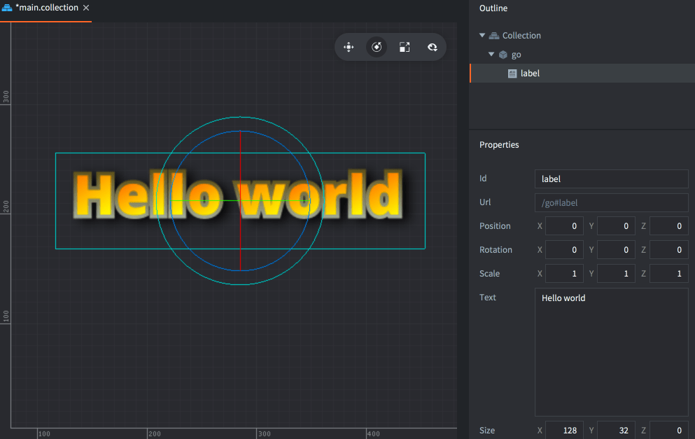
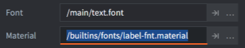
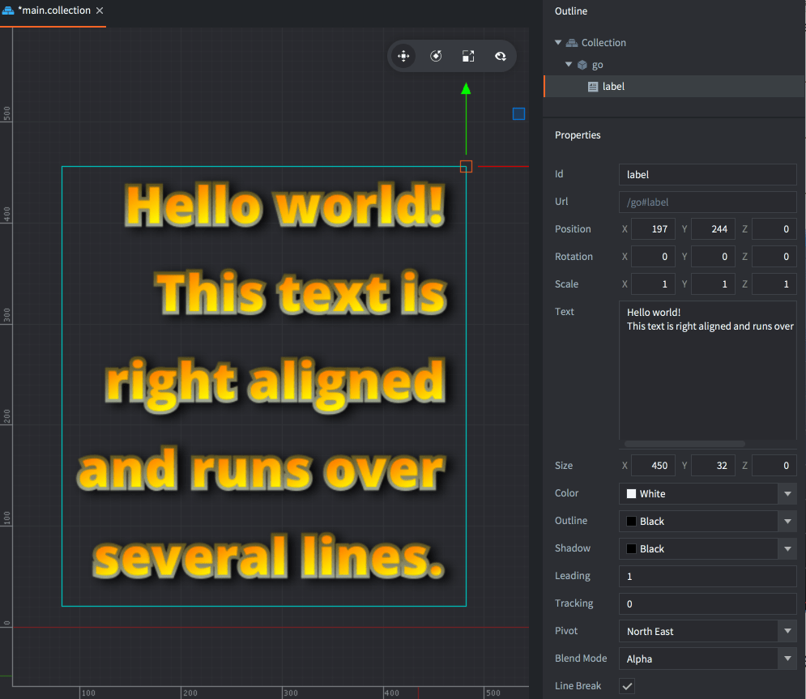

# Etykieta (Label)

Komponent Etykieta (ang. Label) renderuje fragment tekstu na ekranie w przestrzeni gry. Domyślnie jest sortowany i rysowany razem z wszystkimi grafikami sprite i kafelkami. Komponent ten ma zestaw właściwości, które regulują sposób renderowania tekstu. GUI w Defoldzie obsługuje tekst, ale może być trudno umieścić elementy GUI w przestrzeni świata gry, razem z obiektami gry. Etykiety ułatwiają to.

## Tworzenie etykiety

Aby utworzyć komponent etykiety - label, <kbd>kliknij prawym przyciskiem myszy</kbd> na obiekcie gry i wybierz <kbd>Add Component ▸ Label</kbd>.


(Jeśli chcesz utworzyć kilka etykiet na podstawie tego samego szablonu, możesz także utworzyć nowy plik komponentu etykiety: <kbd>kliknij prawym przyciskiem myszy</kbd> na folder w panelu *Assets* i wybierz <kbd>New... ▸ Label</kbd>, a następnie dodaj plik jako komponent do dowolnych obiektów gry).



Ustaw właściwość *Font* na font, który chcesz użyć, i upewnij się, że właściwość *Material* ma materiał, który pasuje do rodzaju fontu:



## Właściwości etykiety

Oprócz właściwości *Id*, *Position*, *Rotation* i *Scale*, istnieje kilka specyficznych dla komponentu właściwości (properties):

*Text*
: Zawartość tekstu etykiety.

*Size*
: Rozmiar obwiedni tekstu. Jeśli ustawiona jest *Line Break* (Łamanie linii), szerokość określa punkt, w którym tekst ma być złamany.

*Color*
: Kolor tekstu.

*Outline*
: Kolor obramowania tekstu.

*Shadow*
: Kolor cienia tekstu.

::: sidenote
Należy zauważyć, że domyślny materiał wyłącza renderowanie cieni ze względów wydajnościowych.
:::

*Leading*
: Interlinia - skalowalna liczba dla odstępu między liniami. Wartość 0 oznacza brak odstępu między liniami. Domyślnie wynosi 1.

*Tracking*
: Śledzenie - skalowalna liczba dla odstępu między literami. Domyślnie wynosi 0.

*Pivot*
: Punkt obrotu tekstu. Używaj go, aby zmieniać wyrównanie tekstu (patrz poniżej).

*Blend Mode*
: Tryb mieszania do użycia podczas renderowania etykiety.

*Line Break*
: Łamanie linii - wyrównanie tekstu podąża za ustawieniem *pivot* i ustawienie tej właściwości pozwala na przepływ tekstu na kilka linii. Szerokość komponentu określa, gdzie tekst ma się zawijać. Należy zauważyć, że tekst musi zawierać spacje, aby mógł się złamać.

*Font*
: Zasób fontu do użycia w tej etykiecie.

*Material*
: Materiał do użycia podczas renderowania tej etykiety. Upewnij się, że wybierasz materiał stworzony dla rodzaju czcionki, którą używasz (mapa bitowa (bitmap), pole odległości (distance field) lub BMFont).

### Tryby mieszania
: [Tryby mieszania - blend-modes opisane są tutaj](../shared/blend-modes.md)

### Pivot i wyrównanie

Ustawiając właściwość *Pivot*, możesz zmienić tryb wyrównania tekstu.

*Center*
: Środek - jeśli pivot jest ustawiony na `Center`, `North` lub `South`, tekst jest wyrównywany do środka.

*Left*
: Do lewej - jeśli pivot jest ustawiony na którykolwiek z trybów `West`, tekst jest wyrównywany do lewej.

*Right*
: Do prawej - jeśli pivot jest ustawiony na którykolwiek z trybów `East`, tekst jest wyrównywany do prawej.



## Manipulacja etykietą w czasie rzeczywistym

Możesz manipulować etykietami w czasie działania programu, uzyskując i ustawiając tekst etykiety oraz różne inne właściwości.

`color`
: Kolor etykiety (typ `vector4`)

`outline`
: Kolor obrysu etykiety (typ `vector4`)

`shadow`
: Kolor cienia etykiety (typ `vector4`)

`scale`
: Skala etykiety, albo typu `number` dla jednolitej skali, albo `vector3` dla indywidualnej skali wzdłuż każdej osi.

`size`
: Rozmiar etykiety (typ `vector3`)

```lua
function init(self)
    -- Ustaw tekst komponentu "my_label" w tym samym obiekcie gry
    -- co ten skrypt.
    label.set_text("#my_label", "New text")
end
```

```lua
function init(self)
    -- Ustaw kolor komponentu "my_label" w tym samym obiekcie gry.
    -- Kolor jest wartością RGBA przechowywaną w wektorze 4-składnikowym.
    local grey = vmath.vector4(0.5, 0.5, 0.5, 1.0)
    go.set("#my_label", "color", grey)

    -- ... i usuń obrys, ustawiając jego alfa na 0 ...
    go.set("#my_label", "outline.w", 0)

    -- ... i powiększ go dwukrotnie wzdłuż osi x
    local scale_x = go.get("#my_label", "scale.x")
    go.set("#my_label", "scale.x", scale_x * 2)
end
```

## Konfiguracja projektu

Plik *game.project* ma kilka [ustawień projektu związanych z etykietami](/manuals/project-settings#label.
