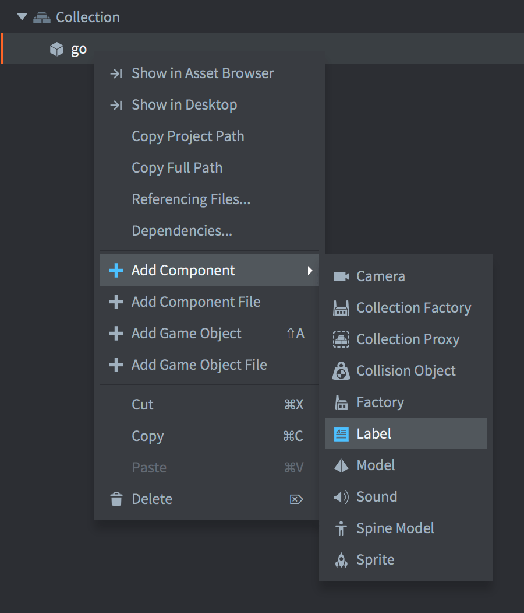
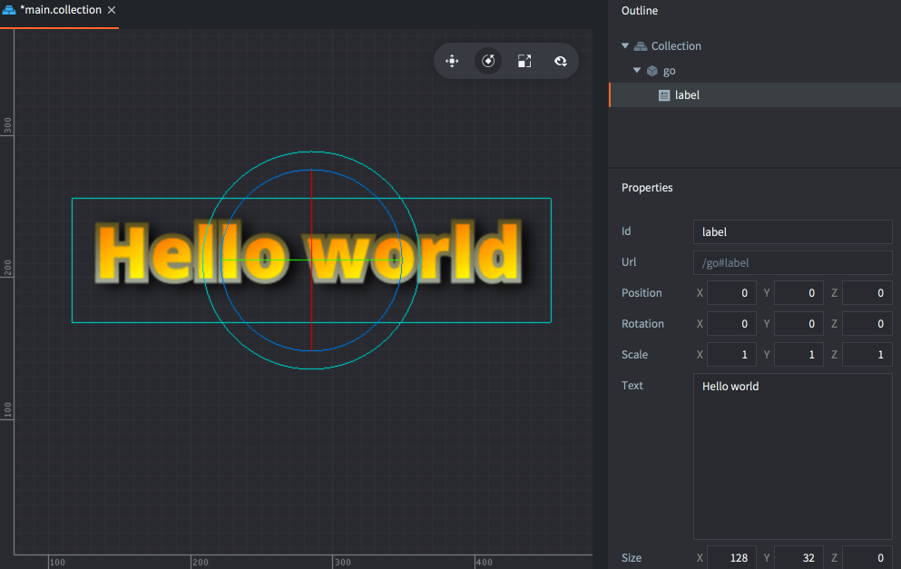
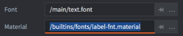
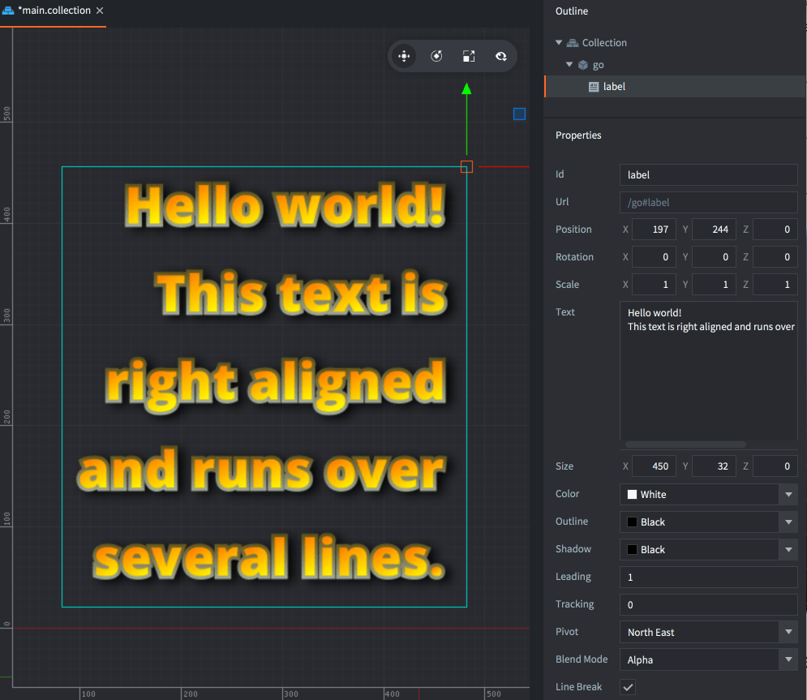

# Label

Komponent *Label* renderuje fragment tekstu na ekranie, w przestrzeni gry. Domyślnie jest sortowany i rysowany razem ze wszystkimi grafikami sprite i tile. Komponent ma zestaw właściwości, które określają sposób renderowania tekstu. GUI w Defold obsługuje tekst, ale umieszczanie elementów GUI w świecie gry może być trudne. Label ułatwia to zadanie.

## Tworzenie Label

Aby utworzyć komponent Label, <kbd>kliknij prawym przyciskiem myszy</kbd> obiekt gry i wybierz <kbd>Add Component ▸ Label</kbd>.



(Jeśli chcesz utworzyć kilka Label z tego samego szablonu, możesz też utworzyć nowy plik komponentu Label: <kbd>kliknij prawym przyciskiem myszy</kbd> folder w przeglądarce *Assets* i wybierz <kbd>New... ▸ Label</kbd>, a następnie dodaj ten plik jako komponent do dowolnych obiektów gry.)



Ustaw właściwość *Font* na font, którego chcesz użyć, i upewnij się, że właściwość *Material* wskazuje materiał zgodny z typem fontu:



## Właściwości Label

Oprócz właściwości *Id*, *Position*, *Rotation* i *Scale* istnieją też następujące właściwości specyficzne dla komponentu:

*Text*
: Treść tekstu Label.

*Size*
: Rozmiar ramki ograniczającej tekst. Jeśli ustawiono *Line Break*, szerokość określa miejsce, w którym tekst zostanie zawinięty.

*Color*
: Kolor tekstu.

*Outline*
: Kolor obrysu.

*Shadow*
: Kolor cienia.

::: sidenote
Należy pamiętać, że domyślny materiał ma renderowanie cienia wyłączone ze względów wydajnościowych.
:::

*Leading*
: Skalowany współczynnik odstępu między wierszami. Wartość 0 oznacza brak odstępu między wierszami. Domyślnie wynosi 1.

*Tracking*
: Skalowany współczynnik odstępu między literami. Domyślnie wynosi 0.

*Pivot*
: Punkt zaczepienia tekstu. Użyj go, aby zmienić wyrównanie tekstu (patrz niżej).

*Blend Mode*
: Tryb mieszania używany podczas renderowania Label.

*Line Break*
: Wyrównanie tekstu zależy od ustawienia pivot, a włączenie tej właściwości pozwala tekstowi płynąć w kilku wierszach. Szerokość komponentu określa miejsce zawijania tekstu. Pamiętaj, że w tekście musi być spacja, aby mogło dojść do złamania.

*Font*
: Zasób fontu używany przez ten Label.

*Material*
: Materiał używany do renderowania tego Label. Upewnij się, że wybierasz materiał utworzony dla typu fontu, którego używasz (bitmap, distance field lub BMFont).

### Tryby mieszania
:[blend-modes](../shared/blend-modes.md)

### Pivot i wyrównanie

Ustawiając właściwość *Pivot*, możesz zmienić sposób wyrównania tekstu.

*Center*
: Jeśli pivot jest ustawiony na `Center`, `North` lub `South`, tekst jest wyrównany do środka.

*Left*
: Jeśli pivot jest ustawiony na dowolny z trybów `West`, tekst jest wyrównany do lewej.

*Right*
: Jeśli pivot jest ustawiony na dowolny z trybów `East`, tekst jest wyrównany do prawej.



## Modyfikowanie w czasie działania

Możesz modyfikować Label w czasie działania, odczytując i ustawiając tekst Label oraz inne właściwości.

`color`
: Kolor Label (`vector4`)

`outline`
: Kolor obrysu Label (`vector4`)

`shadow`
: Kolor cienia Label (`vector4`)

`scale`
: Skala Label, jako `number` dla jednolitego skalowania albo `vector3` dla osobnego skalowania wzdłuż każdej osi.

`size`
: Rozmiar Label (`vector3`)

```lua
function init(self)
    -- Ustaw tekst komponentu "my_label" w tym samym obiekcie gry
    -- co ten skrypt.
    label.set_text("#my_label", "New text")
end
```

```lua
function init(self)
    -- Ustaw kolor komponentu "my_label" w tym samym obiekcie gry.
    -- Kolor to wartość RGBA przechowywana w vector4.
    local grey = vmath.vector4(0.5, 0.5, 0.5, 1.0)
    go.set("#my_label", "color", grey)

    -- ...i usuń obrys, ustawiając jego alfę na 0...
    go.set("#my_label", "outline.w", 0)

    -- ...i przeskaluj go 2x wzdłuż osi x.
    local scale_x = go.get("#my_label", "scale.x")
    go.set("#my_label", "scale.x", scale_x * 2)
end
```

## Konfiguracja projektu

Plik *game.project* ma kilka [ustawień projektu](/manuals/project-settings#label) związanych z Label.
