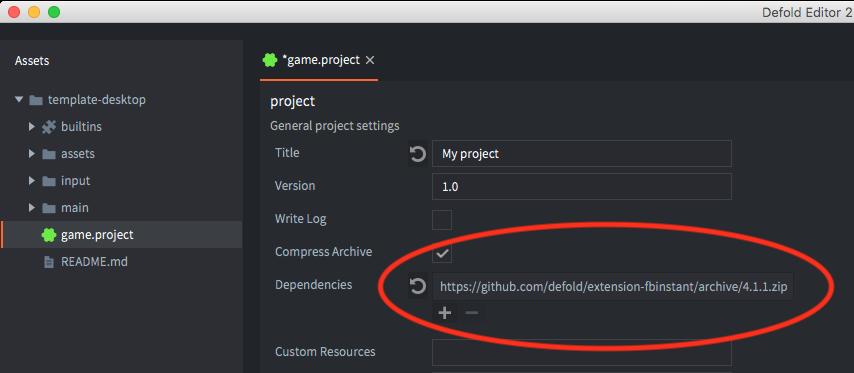
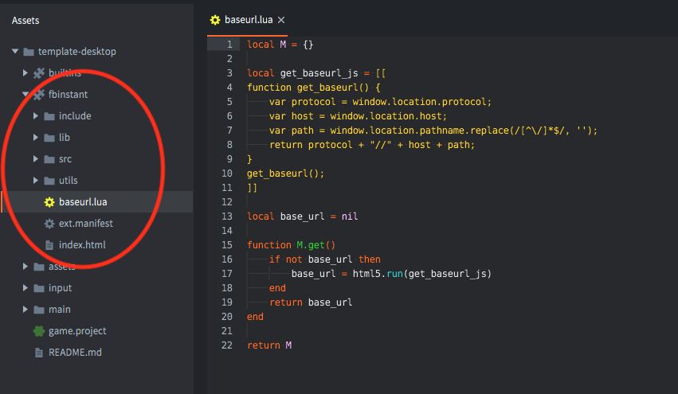

# Biblioteki

Biblioteki pozwalają na dzielenie zasobów między projektami. To proste, ale i potężne narzędzie, które możesz używać na wiele sposobów.

Biblioteki są przydatne, kiedy chcesz:

* skopiować zasoby z jednego projektu do innego. Przykładowo, gdy tworzysz sequel swojej wcześniejszej gry, to bardzo łatwo jest przenieść sprawdzone funkcjonalności do nowego projektu.
* zbudować bibliotekę szablonów, którą następnie możesz skopiować do dowolnego projektu i dostosować albo wyspecjalizować do niego.
* zbudować jedną lub więcej bibliotek gotowych obiektów lub skryptów, z których możesz bezpośrednio korzystać. Przydatne do przetrzymywania często używanych skryptów lub do zbudowania wspólnych zasobów graficznych lub dźwiękowych.

## Ustawianie udostępniania biblioteki

Załóżmy, że chcesz zbudować bibliotekę zawierającą sprite'y i źródła kafelków (tile sources). Rozpoczynasz przez [utworzenie nowego projektu](/manuals/project-setup/). Zdecyduj, które foldery z danego projektu chcesz udostępnić i dołącz ich ścieżki do *include_dirs* w ustawieniach projektu w pliku *game.project*. Jeśli chcesz dodać więcej niż jedną lokalizację, oddziel je spacjami:

Zanim będziemy mogli dodać bibliotekę do innego projektu, musimy określić w nim, gdzie szukać bibliotek:

## URL biblioteki

Biblioteki mają standardowy URL. Dla projektu umieszczonego na GitHubie może to być URL do projektu:

::: important
Zalecane jest, żeby zawsze polegać na konretnej wersji (release) biblioteki zamiast wersji z gałęzi głównej (master). W ten sposób to Ty decydujesz kiedy podpiąć do Twojego projektu nowszą wersję, która później może zostać wydana przez twórcę biblioteki na bazie zmian z mastera, aby uniknąć zmian w bibliotece, które mogłyby coś zepsuć w Twoim projekcie.
:::

::: important
Zauważ, że musisz mieć prawa odczytu do lokalizacji biblioteki. Dla projektów na GitHubie oznacza to, że projekt musi być publiczny albo musisz mieć wyenerowany token dostępu do niego.
:::

## Ustawienie zależności do biblioteki

Otwórz projekt, w którym chcesz mieć dostęp do danej biblioteki. W ustawieniach projektu dodaj URL bibliotekido polae *dependencies*. Możesz określić tutaj wiele zależności. Dodaje się przez kliknięcie pzycisku `+`, a usuwa przez klinięcie przycisku `-`:

Teraz, kliknij <kbd>Project ▸ Fetch Libraries</kbd>, żeby zaktualizować zależności do bibliotek. Dzieję się to też automatycznie podczas otwierania projektu, więc będziesz musieć do zrobić tylko w przypadku, gdy chcesz odświeżyć bilbioteki bez otwierania projektu ponownie, np. gdy dodajesz lub usuwasz bibliotekę lub któraś z bibiliotek jest zmieniana przez kogoś innego.

Folder, który udostępniłeś pojawi się w panelu *Assets* i będziesz mógł używać wszystkiego co jest tam udostępnione. Każda zsynchronizowana zmiana biblioteki będzie dostępna w Twoim projekcie.

## Zepsute zależności

Udostępnianie bibliotek działa tylko dla plików, które znajdują się w udostępnionym folderze. Jeśli utworzysz w nim coś, co zawiera referencję do innego pliku z innego folderu, ścieżka referencji będzie nieprawidłowa.

## Kolizja nazw

Ponieważ możesz dołączać wiele projektów w polu *dependencies* ustawień projektu możesz napotkać sytuację kolizji nazw. Zdarza się to, gdy dwa lub więcej plików w udostępnionych folderach posiada taką samą nazwę folderu w polu *include_dirs* ustawień projektu.

Defold rozwiązuje kolizje nazw ignorując wszystko poza ostatnią referencją do folderu o takiej samej nazwie w kolejności podawania zależności w liście *dependencies* ustawień projektu. Na przykład, jeśli wskażesz 3 biblioteki, które będą zawierać folder nazwany *items*, to tylko jeden folder *items* będzie dostępny --- ten należący do projektu, który jest dołączony jako ostatni na liście zależności.
