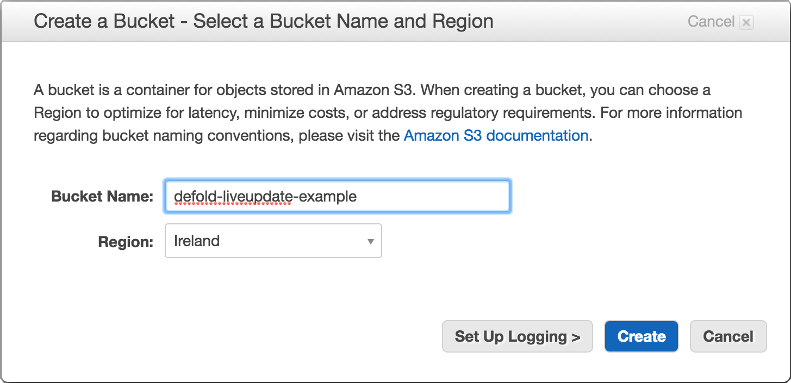
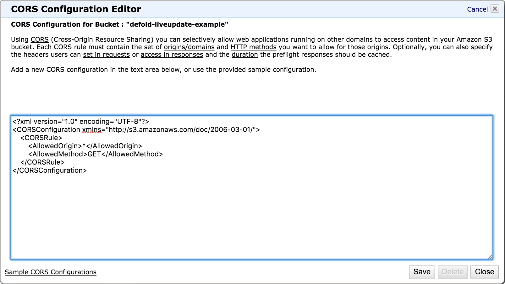
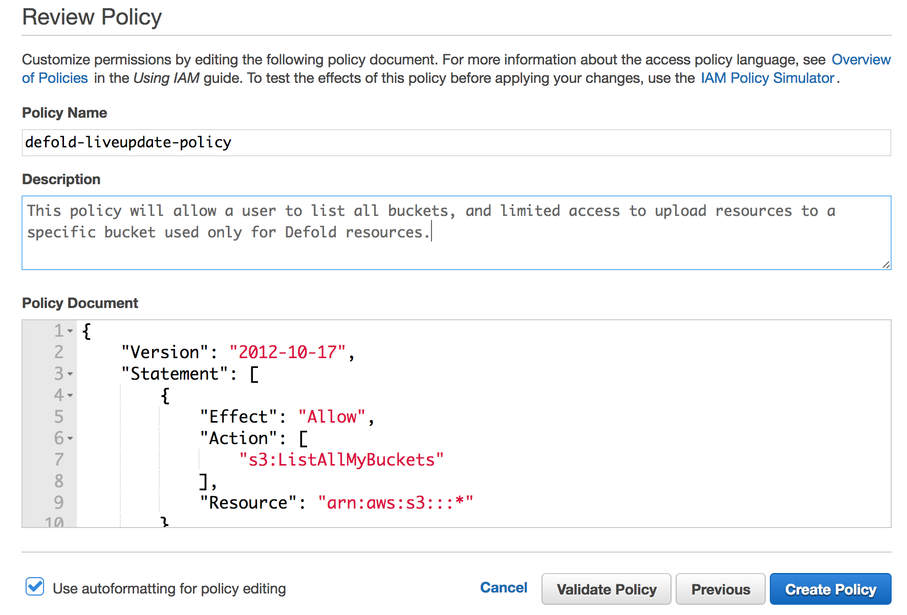
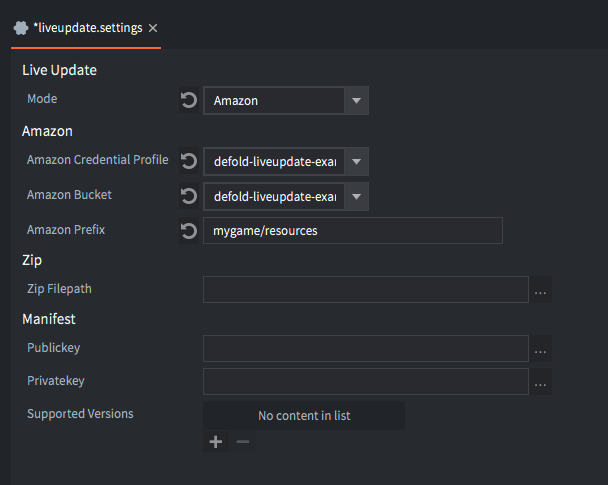

# Konfigurowanie Amazon Web Services

Aby korzystać z funkcji Live update razem z usługami Amazon, potrzebujesz konta Amazon Web Services. Jeśli jeszcze go nie masz, możesz je utworzyć tutaj: https://aws.amazon.com/.

Ta sekcja wyjaśnia, jak utworzyć nowego użytkownika z ograniczonym dostępem w Amazon Web Services, którego można używać razem z edytorem Defold do automatycznego wysyłania zasobów Live update podczas bundlowania gry, a także jak skonfigurować Amazon S3, aby klienci gry mogli pobierać zasoby. Dodatkowe informacje o konfiguracji Amazon S3 znajdziesz w [dokumentacji Amazon S3](http://docs.aws.amazon.com/AmazonS3/latest/dev/Welcome.html).

1. Utwórz bucket dla zasobów Live update

    Otwórz menu <kbd>Services</kbd> i wybierz <kbd>S3</kbd>, które znajduje się w kategorii _Storage_ ([Amazon S3 Console](https://console.aws.amazon.com/s3)). Zobaczysz wszystkie istniejące buckety oraz opcję utworzenia nowego bucketa. Choć można użyć istniejącego bucketa, zalecamy utworzenie nowego bucketa dla zasobów Live update, aby łatwiej ograniczyć dostęp.

    

2. Dodaj politykę bucketa

    Wybierz bucket, którego chcesz użyć, otwórz panel <kbd>Properties</kbd> i rozwiń w nim opcję <kbd>Permissions</kbd>. Otwórz politykę bucketa, klikając przycisk <kbd>Add bucket policy</kbd>. Polityka bucketa w tym przykładzie pozwoli anonimowemu użytkownikowi pobierać pliki z bucketa, co umożliwi klientowi gry pobieranie zasobów Live update wymaganych przez grę. Dodatkowe informacje o politykach bucketa znajdziesz w [dokumentacji Amazon](https://docs.aws.amazon.com/AmazonS3/latest/dev/using-iam-policies.html).

    ```json
    {
        "Version": "2012-10-17",
        "Statement": [
            {
                "Sid": "AddPerm",
                "Effect": "Allow",
                "Principal": "*",
                "Action": "s3:GetObject",
                "Resource": "arn:aws:s3:::defold-liveupdate-example/*"
            }
        ]
    }
    ```

    

3. Dodaj do bucketu konfigurację CORS (opcjonalnie)

    [Cross-Origin Resource Sharing (CORS)](https://en.wikipedia.org/wiki/Cross-origin_resource_sharing) to mechanizm, który pozwala stronie internetowej pobierać zasoby z innej domeny przy użyciu JavaScriptu. Jeśli zamierzasz opublikować grę jako klienta HTML5, musisz dodać do bucketa konfigurację CORS.

    Wybierz bucket, którego chcesz użyć, otwórz panel <kbd>Properties</kbd> i rozwiń w nim opcję <kbd>Permissions</kbd>. Otwórz konfigurację CORS, klikając przycisk <kbd>Add CORS Configuration</kbd>. Konfiguracja z tego przykładu pozwoli na dostęp z dowolnej strony internetowej dzięki użyciu symbolu wieloznacznego dla domeny, choć można ten dostęp ograniczyć bardziej, jeśli wiesz, na jakich domenach Twoja gra będzie dostępna. Dodatkowe informacje o konfiguracji CORS w Amazon znajdziesz w [dokumentacji Amazon](https://docs.aws.amazon.com/AmazonS3/latest/dev/cors.html).

    ```xml
    <?xml version="1.0" encoding="UTF-8"?>
    <CORSConfiguration xmlns="http://s3.amazonaws.com/doc/2006-03-01/">
        <CORSRule>
            <AllowedOrigin>*</AllowedOrigin>
            <AllowedMethod>GET</AllowedMethod>
        </CORSRule>
    </CORSConfiguration>
    ```

    

4. Utwórz politykę IAM

    Otwórz menu <kbd>Services</kbd> i wybierz <kbd>IAM</kbd>, które znajduje się w kategorii _Security, Identity & Compliance_ ([Amazon IAM Console](https://console.aws.amazon.com/iam)). Wybierz <kbd>Policies</kbd> w menu po lewej stronie, a zobaczysz wszystkie istniejące polityki oraz opcję utworzenia nowej polityki.

    Kliknij przycisk <kbd>Create Policy</kbd>, a następnie wybierz <kbd>Create Your Own Policy</kbd>. Polityka z tego przykładu pozwoli użytkownikowi wyświetlać listę wszystkich bucketów, co jest potrzebne tylko podczas konfigurowania projektu Defold dla Live update. Pozwoli też użytkownikowi pobrać Access Control List (ACL) i wysyłać zasoby do konkretnego bucketa używanego dla zasobów Live update. Dodatkowe informacje o Amazon Identity and Access Management (IAM) znajdziesz w [dokumentacji Amazon](http://docs.aws.amazon.com/IAM/latest/UserGuide/access.html).

    ```json
    {
        "Version": "2012-10-17",
        "Statement": [
            {
                "Effect": "Allow",
                "Action": [
                    "s3:ListAllMyBuckets"
                ],
                "Resource": "arn:aws:s3:::*"
            },
            {
                "Effect": "Allow",
                "Action": [
                    "s3:GetBucketAcl"
                ],
                "Resource": "arn:aws:s3:::defold-liveupdate-example"
            },
            {
                "Effect": "Allow",
                "Action": [
                    "s3:PutObject"
                ],
                "Resource": "arn:aws:s3:::defold-liveupdate-example/*"
            }
        ]
    }
    ```

    

5. Utwórz użytkownika do dostępu programowego

    Otwórz menu <kbd>Services</kbd> i wybierz <kbd>IAM</kbd>, które znajduje się w kategorii _Security, Identity & Compliance_ ([Amazon IAM Console](https://console.aws.amazon.com/iam)). Wybierz <kbd>Users</kbd> w menu po lewej stronie, a zobaczysz wszystkich istniejących użytkowników oraz opcję dodania nowego użytkownika. Choć można użyć istniejącego użytkownika, zalecamy utworzenie nowego użytkownika dla zasobów Live update, aby łatwiej ograniczyć dostęp.

    Kliknij przycisk <kbd>Add User</kbd>, podaj nazwę użytkownika i wybierz <kbd>Programmatic access</kbd> jako <kbd>Access type</kbd>, a następnie naciśnij <kbd>Next: Permissions</kbd>. Wybierz <kbd>Attach existing policies directly</kbd> i wskaż politykę utworzoną w kroku 4.

    Po zakończeniu procesu otrzymasz <kbd>Access key ID</kbd> oraz <kbd>Secret access key</kbd>.

    ::: important
    Bardzo ważne jest, aby zapisać te klucze, ponieważ po opuszczeniu tej strony nie będzie można ich odzyskać z Amazon.
    :::

6. Utwórz plik profilu poświadczeń

    Na tym etapie powinieneś już utworzyć bucket, skonfigurować politykę bucketa, dodać konfigurację CORS, utworzyć politykę użytkownika i utworzyć nowego użytkownika. Pozostało już tylko utworzenie [pliku profilu poświadczeń](https://aws.amazon.com/blogs/security/a-new-and-standardized-way-to-manage-credentials-in-the-aws-sdks), aby edytor Defold mógł uzyskać dostęp do bucketa w Twoim imieniu.

    Utwórz nowy katalog *.aws* w folderze domowym i utwórz w nim plik o nazwie *credentials*.

    ```bash
    $ mkdir ~/.aws
    $ touch ~/.aws/credentials
    ```

    Plik *~/.aws/credentials* będzie zawierał Twoje poświadczenia do uzyskiwania dostępu do Amazon Web Services przez dostęp programowy i jest standardowym sposobem zarządzania poświadczeniami AWS. Otwórz plik w edytorze tekstu i wpisz swój <kbd>Access key ID</kbd> oraz <kbd>Secret access key</kbd> w formacie pokazanym poniżej.

    ```ini
    [defold-liveupdate-example]
    aws_access_key_id = <Access key ID>
    aws_secret_access_key = <Secret access key>
    ```

    Identyfikator podany w nawiasach, w tym przykładzie _defold-liveupdate-example_, jest tym samym identyfikatorem, który należy podać podczas konfigurowania ustawień Live update projektu w edytorze Defold.

    
