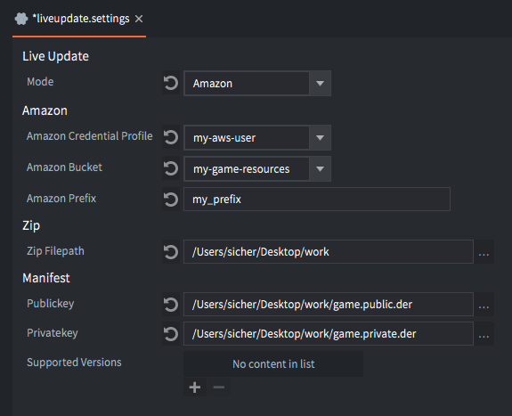
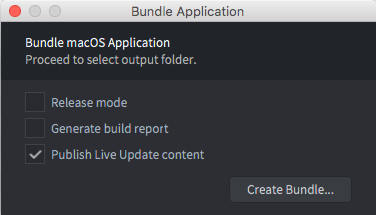
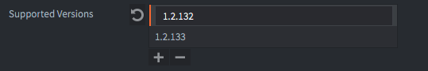
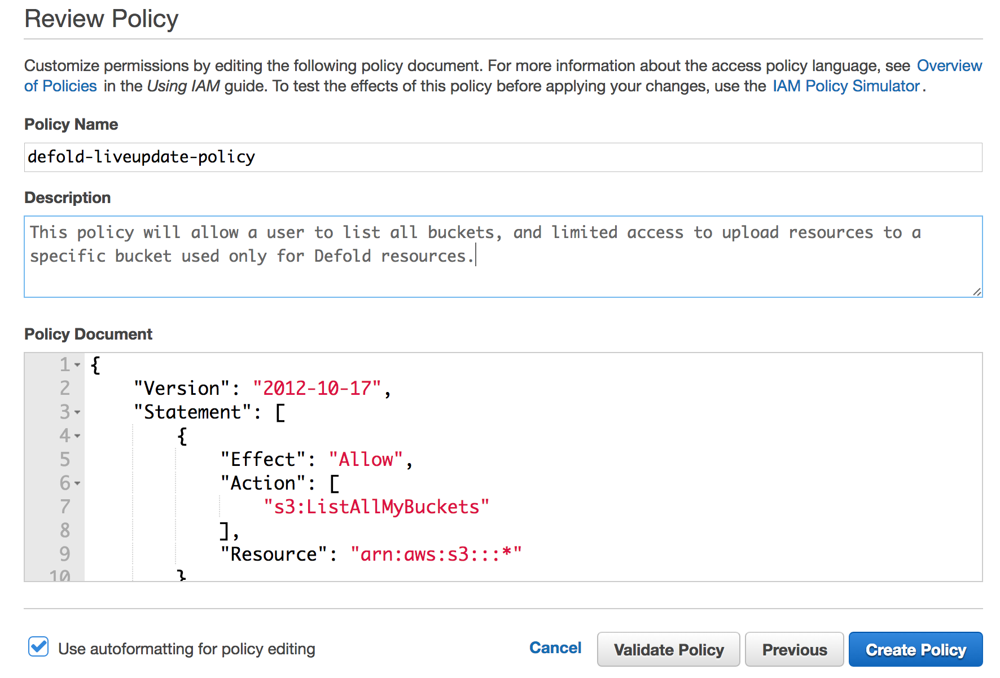
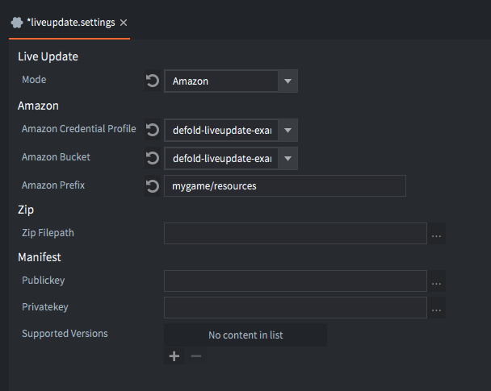
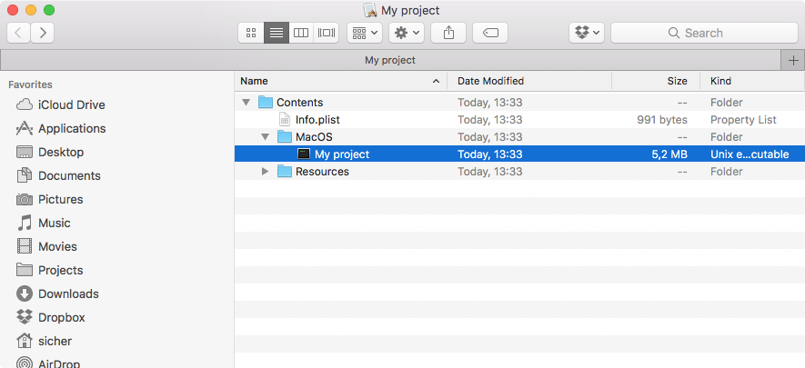
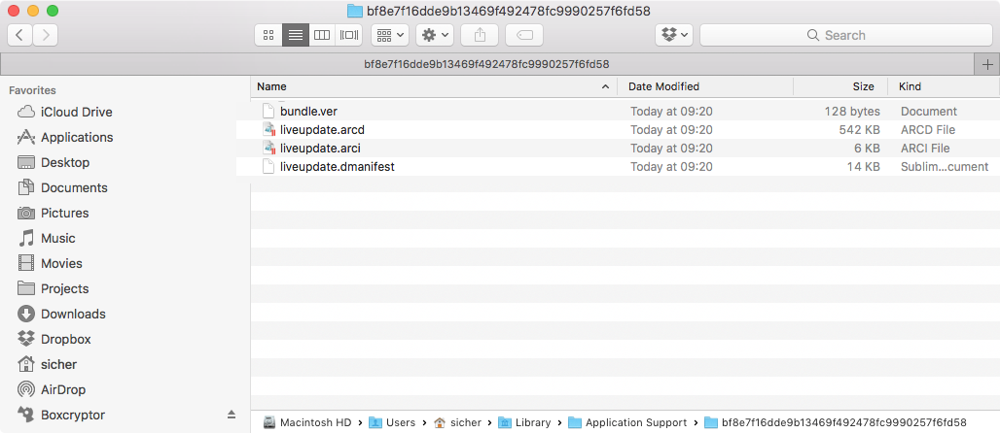

# Aktualizacja na żywo (Live Update)

Podczas pakowania gry, Defold pakuje wszystkie zasoby gry do końcowego pakietu specyficznego dla platformy. W większości przypadków jest to preferowane rozwiązanie, ponieważ działający silnik ma natychmiastowy dostęp do wszystkich zasobów i może szybko je ładować. Jednak istnieją sytuacje, w których chcielibyśmy odłożyć ładowanie zasobów na późniejszy etap. Na przykład:

- Twoja gra zawiera serię odcinków/części, a chcesz uwzględnić tylko pierwszy, aby gracze mogli go wypróbować, zanim zdecydują, czy chcą kontynuować resztę gry.
- Twoja gra jest przeznaczona na HTML5. W przeglądarce ładowanie aplikacji z pamięci oznacza, że cały pakiet aplikacji musi zostać pobrany przed uruchomieniem. Na takiej platformie możesz chcieć wysłać minimalny pakiet startowy i uruchomić aplikację szybko, zanim pobierzesz pozostałe zasoby gry, dzięki czemu gracze wypróbują grę, a gdy będzie wymagane pobranie dodatkowej zawartości może to być wykonane na późniejszym etapie.
- Twoja gra zawiera bardzo duże zasoby (obrazy, filmy itp.), których pobieranie chciałbyś odłożyć do momentu, gdy są gotowe do wyświetlenia w grze. Jest to celem utrzymania rozmiaru instalacji na niskim poziomie.

Funkcja Aktualizacji na żywo Live Update) rozszerza koncepcję pełnomocnika kolekcji (collection proxy), oferując mechanizm, który pozwala na pobieranie i przechowywanie zasobów w pakiecie aplikacji, które celowo zostały pominięte podczas tworzenia pakietu na etapie kompilacji.

## Przygotowanie treści do Aktualizacji na żywo

Załóżmy, że tworzymy grę zawierającą duże zasoby graficzne o wysokiej rozdzielczości. Gra przechowuje te obrazy w kolekcjach z obiektami gry i sprite'ami wykorzystującymi te obrazy:


Aby silnik mógł dynamicznie ładować taką kolekcję, możemy po prostu dodać komponent pełnomocnika kolekcji, będącego pełnomocnikiem właśnie kolekcji `monalisa.collection`. Teraz gra może wybrać, kiedy załadować zawartość kolekcji do pamięci, wysyłając komunikat `load` do pełnomocnika kolekcji. Jeśli chcielibyśmy pójść dalej i kontrolować ładowanie zasobów zawartych w kolekcji samodzielnie możemy to zrobić, zaznaczając opcję *Exclude* w właściwościach pełnomocnika kolekcji, informując kompilator, że zawartość w `monalisa.collection` powinna być pominięta podczas tworzenia pakietu aplikacji.


## Ustawienia Aktualizacji na żywo

Kiedy kompilator tworzy pakiet aplikacji, musi gdzieś przechować te wykluczone zasoby. Ustawienia projektu dla Aktualizacji na żywo (Live update settings) określają lokalizację tych zasobów. Ustawienia te znajdują się w <kbd>Project ▸ Live update Settings...</kbd>. Kliknięcie w tę opcję spowoduje utworzenie pliku ustawień, jeśli jeszcze nie istnieje. W pliku `game.project` wybierz, które ustawienia Aktualizacji na żywo chcesz użyć podczas kompilacji. Dzięki temu można używać różnych ustawień Aktualizacji na żywo w różnych środowiskach, na przykład na żywo, w QA, w trybie deweloperskim itp.

When Defold creates an application bundle it needs to store any excluded resources somewhere. The project settings for Live update govern the location for those resources. The settings are found under <kbd>Project ▸ Live update Settings...</kbd>. This will create a settings file if none exists. In *game.project*, select which liveupdate settings file to use when bundling. This allows for using different liveupdate settings for different environments, for example for live, QA, dev etc.



Obecnie istnieją dwie metody, które Defold może wykorzystać do przechowywania zasobów. Wybierz metodę z rozwijanego menu *Mode* w oknie ustawień:

`Amazon`
: Ta opcja mówi Defoldowi, aby automatycznie przesyłał wykluczone zasoby do Amazon Web Service (AWS) S3 bucket. Wprowadź nazwę swojego *Credential profile* (profilu uwierzytelnienia) AWS, wybierz odpowiedni *Bucket* (Kubełek) i podaj *Prefix*. Zobacz [szczegóły dotyczące](#setting_up_amazon_web_service).

`Zip`
: Ta opcja mówi Defoldowi, aby utworzyć plik archiwum Zip z wykluczonymi zasobami. Archiwum jest zapisywane w lokalizacji określonej w ustawieniu *Export path* (ścieżka eksportu).

## Programowanie z wykluczonymi pełnomocnikami kolekcji

Pełnomocnik kolekcji (collection proxy), które zostały wykluczone z kompilacji, działają jak zwykłe proksy kolekcji, z jedną ważną różnicą. Wysłanie im komunikatu `load`, podczas gdy wciąż mają zasoby, które nie są dostępne w składzie pakietu, spowoduje ich niepowodzenie.

Dlatego zanim wyślemy komunikat `load`, musimy sprawdzić, czy brakuje jakichkolwiek zasobów. Jeśli tak, musimy je pobrać, a następnie przechować. Poniższy, przykładowy kod zakłada, że zasoby są przechowywane w Amazon S3, w kubełku o nazwie `"my-game-bucket"` z prefiksem `my-resources`.

```lua
function init(self)
    self.resources_pending = 0 -- <1>
    msg.post("#", "attempt_load_resources")
end

-- This function is called whenever we have tried to store a downloaded resource
-- necessary for our collection proxy to load.
local function resource_store_response(self, hexdigest, status)
    if status == true then
        -- Successfully loaded resource
        print("Resource data stored: " .. hexdigest)

        -- One less resource to go...
        self.resources_pending = self.resources_pending - 1

        -- That was all of them, time to load the proxied collection.
        if self.resources_pending == 0 then
            msg.post("#proxy", "load") -- <8>
        end
    else
        -- ERROR! Failed to store the data!
        print("Failed to store resource data: " .. hexdigest)
    end
end

function on_message(self, message_id, message, sender)
    if message_id == hash("attempt_load_resources") then
        local missing_resources = collectionproxy.missing_resources("#proxy") -- <2>

        -- initiate a download request for each of the missing resources that has not yet been tried.
        for _,resource_hash in ipairs(missing_resources) do
            msg.post("#", "attempt_download", { resource_hash = resource_hash})
        end

        self.resources_pending = #missing_resources -- <3>

        -- if we're running from editor all resources are there from the start.
        if self.resources_pending == 0 then
            msg.post("#proxy", "load")
        end
    elseif message_id == hash("attempt_download") then
        local manifest = resource.get_current_manifest() -- <4>
        local base_url = "https://my-game-bucket.s3.amazonaws.com/my-resources/" -- <5>
        http.request(base_url .. message.resource_hash, "GET", function(self, id, response)
            if response.status == 200 or response.status == 304 then -- <6>
                -- We got the response ok.
                print("storing " .. message.resource_hash)
                resource.store_resource(manifest, response.response, message.resource_hash, resource_store_response) -- <7>
            else
                -- ERROR! Failed to download resource!
                print("Failed to download resource: " .. message.resource_hash)
            end
        end)
    elseif message_id == hash("proxy_loaded") then
        msg.post(sender, "init")
        msg.post(sender, "enable")
    end
end
```
1. Prosty licznik mówiący nam, ile zasobów musimy jeszcze pobrać i przechować, zanim będziemy mogli załadować kolekcję proxy. Należy zauważyć, że ten kod w ogóle nie zajmuje się obsługą błędów, więc w kodzie produkcyjnym należy śledzić operacje pobierania i przechowywania.
2. Pobierz wszelkie zasoby, które musimy pobrać i przechować.
3. Przechowaj liczbę brakujących zasobów, abyśmy mogli je zliczyć.
4. Potrzebujemy bieżącego manifestu, ponieważ zawiera on listę wszystkich zasobów w bundlu oraz informacje, czy są dostępne, czy nie.
5. Przechowujemy nasze zasoby na Amazon S3. Jeśli tworzysz archiwum Zip z zasobami, musisz hostować pliki w określonym miejscu i odnosić się do ich lokalizacji podczas pobierania ich za pomocą `http.request()`.
6. Amazon zwraca status 304, gdy pliki są w pamięci podręcznej.
7. Mamy dane w tym punkcie. Spróbujmy je przechować.
8. Przechowywanie było udane, a liczba brakujących zasobów spadła do zera. Teraz bezpiecznie możemy wysłać komunikat `"load"` do kolekcji proxy. Należy zauważyć, że jeśli pobieranie lub przechowywanie zawiedzie w którymś momencie, licznik nigdy nie osiągnie zera.

Z kodem ładowania możemy przetestować aplikację. Jednak uruchamianie jej z edytora nie spowoduje pobierania niczego. Dzieje się tak, ponieważ funkcja Live update to funkcja paczki. W środowisku edytora nie wyklucza się żadnych zasobów. Aby upewnić się, że wszystko działa prawidłowo, trzeba utworzyć paczkę (bundle).

## Pakowanie z funkcją Live update

Pakowanie (bundle) z funkcją aktualizacji na żywo jest proste. Wybierz <kbd>Project ▸ Bundle ▸ ...</kbd>, a następnie platformę, dla której chcesz utworzyć pakiet aplikacji. Otwiera to okno dialogowe do pakowania:



Podczas pakowania wszelkie wykluczone zasoby zostaną pominięte w pakiecie aplikacji. Zaznaczając pole wyboru *Publish Live update content* (Opublikuj zawartość aktualizacji na żywo), informujesz Defolda, żeby albo przesyłał wykluczone zasoby na Amazon, albo tworzył archiwum Zip, w zależności od tego, jak skonfigurowałeś ustawienia aktualizacji na żywo (patrz wyżej). Plik manifestu dla paczki zostanie również uwzględniony w wykluczonych zasobach.

Kliknij *Package* i wybierz lokalizację pakietu aplikacji. Teraz możesz uruchomić aplikację i sprawdzić, czy wszystko działa zgodnie z oczekiwaniami.

## Manifest

Manifest to wewnętrzna struktura danych zawierająca listę wszystkich zasobów zawartych w buildzie oraz wartość skrótu każdego zasobu. Funkcjonalność Live update wykorzystuje manifest do śledzenia, co jest częścią zbudowanej gry, co można załadować z zewnętrznych źródeł i, jeśli tak się stanie, sprawdzenie, czy załadowane dane są nietknięte.

Z perspektywy użytkownika manifest to liczbowy uchwyt, ukrywający detale, jak jest zarządzany, w silniku.

## Aktualizacja manifestu w funkcji Live update

Z funkcją aktualizacji na żywo nowy manifest można przechowywać lokalnie w trakcie działania programu. Manifest lokalny zostanie użyty podczas uruchamiania aplikacji zamiast tego, który jest dołączony w pakiecie aplikacji. Jest to przydatne do modyfikowania lub dodawania zasobów aktualizacji na żywo do opublikowanej gry, które nie były znane podczas budowy, bez konieczności publikowania pełnej wersji.

Podczas publikowania zasobów aktualizacji na żywo na Amazon Web Service lub do archiwum ZIP, manifest będzie uwzględniony w pakiecie obok zasobów. Nazwa pliku manifestu to `liveupdate.game.dmanifest`.

Rozpoczęcie pracy z silnikiem Defold po raz pierwszy po przechowywaniu manifestu spowoduje utworzenie pliku identyfikatora paczki `bundle.ver` obok manifestu. Służy to do wykrywania, czy paczka uległa zmianie od czasu przechowywania manifestu, na przykład po pełnej aktualizacji sklepu z aplikacjami. Jeśli tak się stanie, przechowany manifest zostanie usunięty z systemu plików, a nowszy manifest z paczki zastąpi go. Oznacza to, że pełna aktualizacja sklepu z aplikacjami usunie wcześniej przechowywany manifest. Wszystkie istniejące zasoby aktualizacji na żywo pozostaną jednak nietknięte.

### Weryfikacja manifestu

Podczas przechowywania nowego manifestu jego dane zostaną zweryfikowane, zanim zostaną faktycznie zapisane na dysku. Weryfikacja składa się z kilku sprawdzeń:

* Poprawny format pliku binarnego.
* Obsługuje obecną wersję silnika lub jakąkolwiek inną obsługiwaną wersję z ustawień.
* Sygnatura kryptograficzna.
* Podpisany przy użyciu tej samej pary kluczy publicznych i prywatnych co załączony manifest.
* Zweryfikowanie, że wszystkie zasoby, których manifest oczekuje w paczce, rzeczywiście znajdują się w niej.

Z perspektywy użytkownika proces weryfikacji jest zupełnie niewidoczny, ale ważne jest zrozumienie kroków, które są zaangażowane, aby uniknąć najczęstszych problemów.

::: important
Jeśli widzisz błąd `"ERROR:RESOURCE: Byte mismatch in decrypted manifest signature. Different keys used for signing?"` w konsoli w trakcie budowania gry na HTML5, to prawdopodobnie oznacza, że Twój serwer WWW nie serwuje wykluczonych zasobów, ani zaktualizowanego pliku manifestu z właściwym typem MIME. Upewnij się, że typ MIME to `application/octet-stream`. Możesz dodać plik `.htaccess` z pojedynczą linią `AddType application/octet-stream .` do folderu, z którego pobierane są zasoby aktualizacji na żywo.
:::

### Obsługiwane wersje silnika Defold

Manifest zawsze będzie obsługiwać wersję Defolda używaną do jego generowania. Jeśli chcesz obsługiwać dodatkowe wersje silnika, dodaj je do listy w ustawieniach aktualizacji na żywo. Jest to przydatne, jeśli Twoja gra na żywo używa innej wersji Defolda niż ta, którą używasz do generowania manifestu.



### Generowanie kluczy do podpisu

Sygnatura manifestu służy do weryfikowania, że nikt ze złymi zamiarami nie będzie mógł grzebać w jego treści, i że załączony manifest i nowy manifest były podpisane tymi samymi kluczami. Podpisanie jest wykonywane w procesie budowania paczki (bundlowania).

Do kryptograficznego podpisywania manifestu używa się pary kluczy publicznych/prywatnych. Podpisanie jest realizowane przy użyciu kluczy RSA o długości 512/1024/2048 bitów w formacie `.der`, które użytkownik musi dostarczyć. Możesz wygenerować je przykładowo za pomocą narzędzia `openssl`:

```sh
$ openssl genrsa -out private_raw.key 1024
$ openssl pkcs8 -topk8 -inform pem -in private_raw.key -outform der -nocrypt -out private.der
$ openssl rsa -in private_raw.key -outform DER -RSAPublicKey_out -pubout -out public.der
```

To spowoduje wygenerowanie plików `private_raw.key` (można go bezpiecznie usunąć), `private.der` i `public.der`. Aby użyć kluczy do podpisywania, otwórz widok ustawień aktualizacji na żywo (live update settings) i wskaz odpowiednie pola na wygenerowane klucze.


### Programowanie z manifestem aktualizacji na żywo
Dodając do powyższego przykładu skryptu, dodajmy poniższą funkcję zwrotną:

```lua
local function store_manifest_cb(self, status)
    if status == resource.LIVEUPDATE_OK then
        print("Successfully stored manifest!")
    else
        print("Failed to store manifest, status: ", status)
    end
end
```
i następujący kod do funkcji `on_message`, aby obsłużyć wiadomość `attempt_download_manifest`:

```lua
...
elseif message_id == hash("attempt_download_manifest") then
    local base_url = "https://my-game-bucket.s3.amazonaws.com/my-resources/" -- <1>
    http.request(base_url .. MANIFEST_FILENAME, "GET", function(self, id, response)
        if response.status == 200 or response.status == 304 then
            -- We got the response ok.
            print("verifying and storing manifest " .. MANIFEST_FILENAME)
            resource.store_manifest(response.response, store_manifest_cb) -- <2>
        else
            -- ERROR! Failed to download manifest!
            print("Failed to download manifest: " .. MANIFEST_FILENAME)
        end
    end)
end
```

1. Manifest zostanie przechowywany na Amazon S3 obok reszty zasobów aktualizacji na żywo. Tak, jak poprzedniu, jeśli tworzysz archiwum Zip z zasobami, musisz hostować je gdzieś i podać referencję do ich lokalizacji podczas pobierania przy użyciu `http.request()`.
2. Podobnie jak w przypadku pobierania i przechowywania zasobów, wywołanie `resource.store_manifest` przyjmuje dane manifestu do pobrania i funkcję zwrotną jako argumenty. Funkcja zwrotna zweryfikuje manifest i zapisze go w pamięci lokalnej.

Jeśli `resource.store_manifest` zakończy się powodzeniem, nowy manifest będzie teraz w pamięci lokalnej. Następnym razem, gdy silnik zostanie uruchomiony, używany będzie ten nowy manifest zamiast tego, który był dołączony do gry.

### Uwagi

Istnieją pewne rzeczy, o których warto wiedzieć, jeśli planujesz użyć tej funkcji do przechowywania nowego manifestu z aktualizacją na żywo.

* Możliwe jest tylko dodawanie lub modyfikowanie zasobów używanych przez kolekcje proxy oznaczone jako `Exclude` w nowym manifeście. Nie można dokonywać zmian w już dodanych zasobach lub zasobach, które nie znajdują się w wykluczonych pełnomocnikach kolekcji. Na przykład, wprowadzenie zmian w skrypcie używanym przez dołączoną kolekcję spowoduje, że system zasobów będzie szukał tego zasobu w archiwum danych paczki. Jednak ponieważ paczka gry nie zmieniła się (zmienił się tylko manifest), zmienionego skryptu nie można odnaleźć i w konsekwencji nie można go załadować.

* Nawet jeśli funkcjonalność ta pozwala na bardzo szybkie wprowadzanie zmian lub łatanie błędów bez pełnego, nowego release aplikacji w sklepie, live update należy używać z zachowaniem szczególnej ostrożności. Dołączenie nowego manifestu powinno poprzedzać wszystko, co jest potrzebne przy faktycznym wydaniu nowej wersji gry (testowanie, QA, itd.).

## Konfiguracja Amazon Web Service

Aby korzystać z funkcji Defold Live Update razem z usługami Amazon, potrzebujesz konta Amazon Web Services. Jeśli jeszcze nie masz konta, możesz je utworzyć [tutaj](https://aws.amazon.com/).

W tej sekcji wyjaśnimy, jak utworzyć nowego użytkownika z ograniczonym dostępem w usługach Amazon Web Services, który może być wykorzystywany razem z edytorem Defold do automatycznego przesyłania zasobów aktualizacji na żywo podczas pakowania gry oraz jak skonfigurować Amazon S3, aby umożliwić klientom gier pobieranie zasobów. Dodatkowe informacje na temat konfigurowania Amazon S3 znajdziesz w [dokumentacji Amazon S3](http://docs.aws.amazon.com/AmazonS3/latest/dev/Welcome.html).

1. Utwórz bucket (kubełek) na zasoby aktualizacji na żywo

    Otwórz menu `Services` i wybierz `S3`, które znajduje się w kategorii _Storage_ ([Amazon S3 Console](https://console.aws.amazon.com/s3)). Zobaczysz swoje istniejące kubełki wraz z opcją utworzenia nowego kubełka. Choć możliwe jest użycie istniejącego kubełka, zalecamy utworzenie nowego kubełka na zasoby aktualizacji na żywo, aby łatwo ograniczyć dostęp.

    

2. Dodaj politykę kubełka (bucket policy) do swojego kubełka

    Wybierz kubełek, który chcesz użyć, otwórz panel *Properties* i rozwiń opcje *Permissions* w panelu. Otwórz politykę kubełka, klikając przycisk *Add bucket policy*. Polityka kubełka w tym przykładzie umożliwi anonimowemu użytkownikowi pobieranie plików z kubełka, co umożliwi graczowi pobieranie zasobów aktualizacji na żywo wymaganych przez grę. Dodatkowe informacje na temat polityk kubełka znajdziesz w [dokumentacji Amazon o polityce](https://docs.aws.amazon.com/AmazonS3/latest/dev/using-iam-policies.html).

    ```json
    {
        "Version": "2012-10-17",
        "Statement": [
            {
                "Sid": "AddPerm",
                "Effect": "Allow",
                "Principal": "*",
                "Action": "s3:GetObject",
                "Resource": "arn:aws:s3:::defold-liveupdate-example/*"
            }
        ]
    }
    ```

    

3. Dodaj konfigurację CORS do swojego kubełka (opcjonalnie)

    Udostępnianie zasobów z różnych domen ([Cross-Origin Resource Sharing - CORS](https://en.wikipedia.org/wiki/Cross-origin_resource_sharing)) to mechanizm, który umożliwia witrynie pobieranie zasobu z innej domeny za pomocą JavaScript. Jeśli planujesz opublikować swoją grę jako klienta HTML5, będziesz musiał dodać konfigurację CORS do swojego kubełka.

    Wybierz kubełek, który chcesz użyć, otwórz panel *Properties* i rozwiń opcje *Permissions*. Otwórz konfigurację CORS klikając przycisk *Add CORS Configuration*. Konfiguracja w tym przykładzie umożliwi dostęp z dowolnej witryny, określając domenę wieloznaczną, choć możliwe jest bardziej restrykcyjne ograniczenie dostępu, jeśli wiesz, na jakich domenach zamierzasz udostępnić swoją grę. Dodatkowe informacje na temat konfiguracji CORS w Amazonie znajdziesz w [dokumentacji Amazono CORS](https://docs.aws.amazon.com/AmazonS3/latest/dev/cors.html).

    ```xml
    <?xml version="1.0" encoding="UTF-8"?>
    <CORSConfiguration xmlns="http://s3.amazonaws.com/doc/2006-03-01/">
        <CORSRule>
            <AllowedOrigin>*</AllowedOrigin>
            <AllowedMethod>GET</AllowedMethod>
        </CORSRule>
    </CORSConfiguration>
    ```

    

4. Utwórz politykę IAM

    Otwórz menu *Services* i wybierz *IAM*, które znajduje się w kategorii _Security, Identity & Compliance_ category ([Amazon IAM Console](https://console.aws.amazon.com/iam)). Wybierz *Policies* w menu po lewej stronie i zobaczysz swoje istniejące polityki, wraz z opcją utworzenia nowej polityki.

    Kliknij przycisk *Create Policy* i wybierz _Create Your Own Policy_. Polityka w tym przykładzie umożliwi użytkownikowi wyświetlenie wszystkich kubełków, co jest wymagane tylko podczas konfigurowania projektu Defold dla aktualizacji na żywo. Będzie również umożliwiać użytkownikowi uzyskanie listy kontroli dostępu (Access Control List - ACL) i przesyłanie zasobów do konkretnej nazwy kubełka używanej do zasobów aktualizacji na żywo. Dodatkowe informacje na temat Amazon Identity and Access Management (IAM) znajdziesz w [dokumentacji Amazon](http://docs.aws.amazon.com/IAM/latest/UserGuide/access.html).

    ```json
    {
        "Version": "2012-10-17",
        "Statement": [
            {
                "Effect": "Allow",
                "Action": [
                    "s3:ListAllMyBuckets"
                ],
                "Resource": "arn:aws:s3:::*"
            },
            {
                "Effect": "Allow",
                "Action": [
                    "s3:GetBucketAcl"
                ],
                "Resource": "arn:aws:s3:::defold-liveupdate-example"
            },
            {
                "Effect": "Allow",
                "Action": [
                    "s3:PutObject"
                ],
                "Resource": "arn:aws:s3:::defold-liveupdate-example/*"
            }
        ]
    }
    ```

    

5. Utwórz użytkownika do dostępu programistycznego

    Otwórz menu *Services* i wybierz *IAM*, które znajduje się w kategorii _Security, Identity & Compliance_ category ([Amazon IAM Console](https://console.aws.amazon.com/iam)). Wybierz *Users* w menu po lewej stronie i zobaczysz swoich istniejących użytkowników wraz z opcją dodania nowego użytkownika. Choć możliwe jest użycie istniejącego użytkownika, zalecamy dodanie nowego użytkownika do zasobów aktualizacji na żywo, aby łatwo ograniczyć dostęp.

    Kliknij przycisk *Add User*, podaj nazwę użytkownika i wybierz *Programmatic access* jako *Access type*, a następnie kliknij *Next: Permissions*. Wybierz *Attach existing policies directly* i wybierz politykę, którą utworzyłeś w kroku 4.

    Po zakończeniu procesu zostaniesz dostarczony z *Access key ID* i *Secret access key*.

    ::: important
    *Bardzo ważne* jest, aby zachować te klucze, ponieważ nie będziesz w stanie ich odzyskać z Amazon po opuszczeniu strony.
    :::

6. Utwórz plik profilu poświadczeń

    W tym momencie powinieneś już mieć kubełek (bucket), skonfigurowaną politykę kubełka, dodaną konfigurację CORS, utworzoną politykę użytkownika i utworzonego nowego użytkownika. Jedyną rzeczą, która pozostała, jest utworzenie [pliku profilu poświadczeń](https://aws.amazon.com/blogs/security/a-new-and-standardized-way-to-manage-credentials-in-the-aws-sdks), aby Defold mógł uzyskać dostęp do kubełka w twoim imieniu.

Utwórz nowy katalog `~/.aws` w folderze domowym i utwórz w nim plik o nazwie `credentials`.

    ```bash
    $ mkdir ~/.aws
    $ touch ~/.aws/credentials
    ```
    Plik `~/.aws/credentials` zawiera twoje poświadczenia dostępu do Amazon Web Services poprzez dostęp programistyczny i jest standaryzowany sposób na zarządzanie poświadczeniami AWS. Otwórz plik w edytorze tekstowym i wprowadź swoje *Access key ID* i *Secret access key* w formacie pokazanym poniżej.

    ```ini
    [defold-liveupdate-example]
    aws_access_key_id = <Access key ID>
    aws_secret_access_key = <Secret access key>
    ```
    Identyfikator określony w nawiasach kwadratowych, w tym przykładzie `_defold-liveupdate-example_`, jest taki sam jak identyfikator, który powinieneś podać podczas konfigurowania ustawień aktualizacji na żywo projektu w edytorze Defold.

    

## Uwagi dotyczące rozwoju oprogramowania

Debugowanie
: Podczas uruchamiania spakowanej wersji swojej gry nie masz bezpośredniego dostępu do konsoli. To może sprawić problemy z debugowaniem. Niemniej jednak, możesz uruchomić aplikację z wiersza poleceń lub podwójnie klikając na plik wykonywalny w paczce:

  

  Teraz gra zaczyna się z oknem konsoli, które będzie wyświetlać wszystkie instrukcje `print()`:

  

Wymuszanie ponownego pobierania zasobów
: Gdy aplikacja przechowuje zasoby, trafiają one na dysk lokalny komputera lub urządzenia przenośnego. Gdy zrestartujesz aplikację, zasoby są dostępne i gotowe do użycia. Podczas pracy nad projektem gry może być potrzeba usunięcia zasobów i wymuszenia na aplikacji ich ponownego pobrania.

  Defold tworzy folder o nazwie hasha stworzonej paczki na urządzeniu w folderze obsługi aplikacji. Jeśli usuniesz pliki z tego folderu, aplikacja unieważni zasoby z manifestu, dzięki czemu będziesz mógł je pobrać i ponownie przechować.

  
  
  Lokalizacja folderu obsługi aplikacji zależy od systemu operacyjnego. Możesz ją znaleźć, używając polecenia `print(sys.get_save_file("", ""))`.
