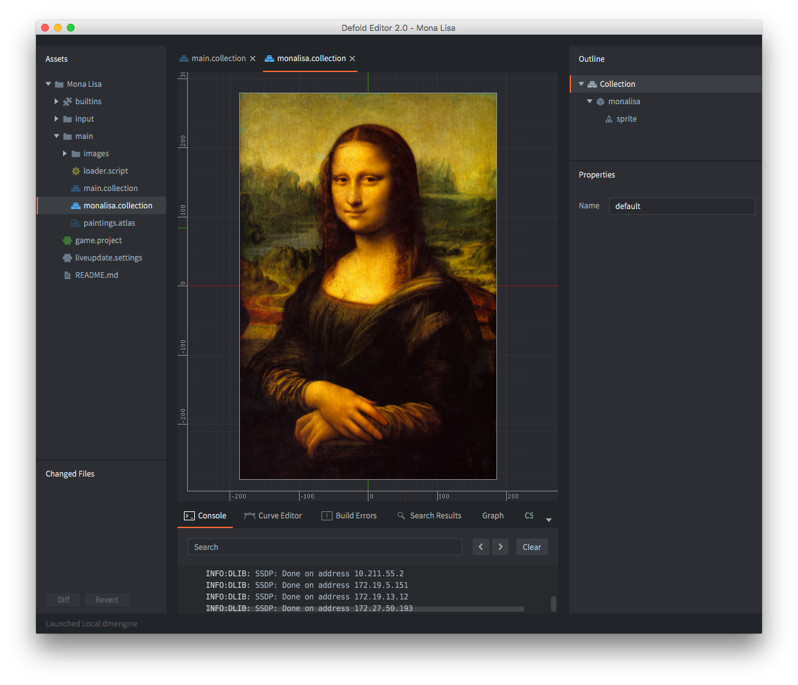
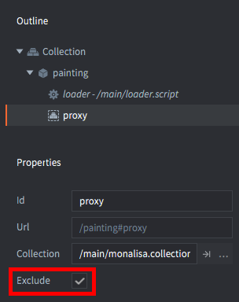
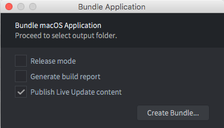
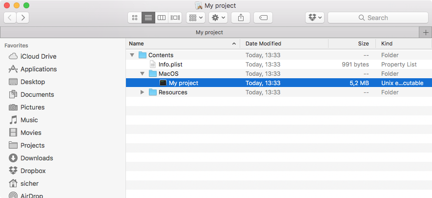

# Aktualizacja na żywo (Live Update)

Podczas pakowania gry, Defold pakuje wszystkie zasoby gry do końcowego pakietu specyficznego dla platformy. W większości przypadków jest to preferowane rozwiązanie, ponieważ działający silnik ma natychmiastowy dostęp do wszystkich zasobów i może szybko je ładować. Jednak istnieją sytuacje, w których chcielibyśmy odłożyć ładowanie zasobów na późniejszy etap. Na przykład:

- Twoja gra zawiera serię odcinków/części, a chcesz uwzględnić tylko pierwszy, aby gracze mogli go wypróbować, zanim zdecydują, czy chcą kontynuować resztę gry.
- Twoja gra jest przeznaczona na HTML5. W przeglądarce ładowanie aplikacji z pamięci oznacza, że cały pakiet aplikacji musi zostać pobrany przed uruchomieniem. Na takiej platformie możesz chcieć wysłać minimalny pakiet startowy i uruchomić aplikację szybko, zanim pobierzesz pozostałe zasoby gry, dzięki czemu gracze wypróbują grę, a gdy będzie wymagane pobranie dodatkowej zawartości może to być wykonane na późniejszym etapie.
- Twoja gra zawiera bardzo duże zasoby (obrazy, filmy itp.), których pobieranie chciałbyś odłożyć do momentu, gdy są gotowe do wyświetlenia w grze. Jest to celem utrzymania rozmiaru instalacji na niskim poziomie.

Funkcja Aktualizacji na żywo Live Update) rozszerza koncepcję pełnomocnika kolekcji (collection proxy), oferując mechanizm, który pozwala na pobieranie i przechowywanie zasobów w pakiecie aplikacji, które celowo zostały pominięte podczas tworzenia pakietu na etapie kompilacji.

## Przygotowanie treści do Aktualizacji na żywo

Załóżmy, że tworzymy grę zawierającą duże zasoby graficzne o wysokiej rozdzielczości. Gra przechowuje te obrazy w kolekcjach z obiektami gry i sprite'ami wykorzystującymi te obrazy:



Aby silnik mógł dynamicznie ładować taką kolekcję, możemy po prostu dodać komponent pełnomocnika kolekcji, będącego pełnomocnikiem właśnie kolekcji `monalisa.collection`. Teraz gra może wybrać, kiedy załadować zawartość kolekcji do pamięci, wysyłając komunikat `load` do pełnomocnika kolekcji. Jeśli chcielibyśmy pójść dalej i kontrolować ładowanie zasobów zawartych w kolekcji samodzielnie możemy to zrobić, zaznaczając opcję *Exclude* w właściwościach pełnomocnika kolekcji, informując kompilator, że zawartość w `monalisa.collection` powinna być pominięta podczas tworzenia pakietu aplikacji.



## Ustawienia Aktualizacji na żywo

Kiedy kompilator tworzy pakiet aplikacji, musi gdzieś przechować te wykluczone zasoby. Ustawienia projektu dla Aktualizacji na żywo (Live update settings) określają lokalizację tych zasobów. Ustawienia te znajdują się w <kbd>Project ▸ Live update Settings...</kbd>. Kliknięcie w tę opcję spowoduje utworzenie pliku ustawień, jeśli jeszcze nie istnieje. W pliku `game.project` wybierz, które ustawienia Aktualizacji na żywo chcesz użyć podczas kompilacji. Dzięki temu można używać różnych ustawień Aktualizacji na żywo w różnych środowiskach, na przykład na produkcji, w QA lub w trybie deweloperskim.


Obecnie istnieją trzy metody, których Defold może użyć do przechowywania zasobów. Wybierz metodę z rozwijanego menu *Mode* w oknie ustawień:

`Amazon`
: Ta opcja mówi Defoldowi, aby automatycznie przesyłał wykluczone zasoby do Amazon Web Service (AWS) S3 bucket. Wprowadź nazwę swojego *Credential profile* (profilu uwierzytelnienia) AWS, wybierz odpowiedni *Bucket* (Kubełek) i podaj *Prefix*. Zobacz [szczegóły dotyczące](#setting_up_amazon_web_service).

`Zip`
: Ta opcja mówi Defoldowi, aby utworzyć plik archiwum Zip z wykluczonymi zasobami. Archiwum jest zapisywane w lokalizacji określonej w ustawieniu *Export path* (ścieżka eksportu).

`Folder`
: Ta opcja mówi Defoldowi, aby utworzyć folder ze wszystkimi wykluczonymi zasobami. Działa podobnie jak `Zip`, ale używa katalogu zamiast archiwum. Może to być przydatne, jeśli chcesz dodatkowo przetworzyć pliki przed wysłaniem ich na serwer lub samodzielnie spakować je później do archiwum.

## Programowanie z wykluczonymi pełnomocnikami kolekcji

Pełnomocnik kolekcji (collection proxy), które zostały wykluczone z kompilacji, działają jak zwykłe proksy kolekcji, z jedną ważną różnicą. Wysłanie im komunikatu `load`, podczas gdy wciąż mają zasoby, które nie są dostępne w składzie pakietu, spowoduje ich niepowodzenie.

W aktualnym przepływie opartym na archiwach zwykle z góry określasz, które archiwum lub archiwa są potrzebne dla danego proxy, i montujesz je przed załadowaniem. Jeśli chcesz sprawdzić, czy proxy odwołuje się do wykluczonej zawartości, użyj `collectionproxy.get_resources()`. Starsza funkcja `collectionproxy.missing_resources()` należy do przestarzałego przepływu Live Update opartego na pobieraniu pojedynczych zasobów.

Gdy włączona jest opcja *Strip Live Update Entries from Main Manifest*, która domyślnie jest aktywna przy publikowaniu archiwalnej zawartości Live Update:

* jeśli żadne zamontowane archiwum nie zawiera wykluczonej zawartości dla danego proxy, `collectionproxy.get_resources("#proxy")` zwraca pustą tabelę `{}`;
* po zamontowaniu odpowiedniego archiwum `collectionproxy.get_resources("#proxy")` zwraca niepustą tabelę z hashami zasobów tego proxy, na przykład:

```lua
{
    "a1b2c3...", -- kolekcja docelowa
    "d4e5f6...", -- obiekt gry
    "7890ab...", -- skrypt
}
```

Poniższy przykład zakłada, że archiwum jest dostępne pod adresem URL określonym w ustawieniu `game.http_url`.

```lua
-- Trzeba śledzić, które archiwum zawiera jaki kontent.
-- W tym przykładzie używamy tylko jednego archiwum liveupdate zawierającego
-- wszystkie zasoby potrzebne dla danego proxy.
local lu_infos = {
    liveupdate = {
        name = "liveupdate",
        priority = 10,
    }
}

local function get_lu_info_for_level(level_name)
    if level_name == "level1" then
        return lu_infos["liveupdate"]
    end
end

local function mount_zip(self, name, priority, path, callback)
    liveupdate.add_mount(name, "zip:" .. path, priority, function(_uri, _path, _status) -- <1>
        callback(_uri, _path, _status)
    end)
end

local function has_mount(name)
    for _, mount in ipairs(liveupdate.get_mounts()) do
        if mount.name == name then
            return true
        end
    end
    return false
end

function init(self)
    self.http_url = sys.get_config_string("game.http_url", nil) -- <2>

    local level_name = "level1"
    local info = get_lu_info_for_level(level_name) -- <3>

    msg.post("#", "load_level", { level = "level1", info = info }) -- <4>
end

function on_message(self, message_id, message, sender)
    if message_id == hash("load_level") then
        local proxy_resources = collectionproxy.get_resources("#" .. message.level) -- <5>

        -- Przy włączonym Strip Live Update Entries from Main Manifest ta tabela
        -- jest pusta, dopóki odpowiednie archiwum nie zostanie zamontowane.
        -- Po zamontowaniu zawiera hashe zasobów należących do proxy.
        if message.info and #proxy_resources == 0 and not has_mount(message.info.name) then
            msg.post("#", "download_archive", message) -- <6>
        else
            msg.post("#" .. message.level, "load")
        end

    elseif message_id == hash("download_archive") then
        local zip_filename = message.info.name .. ".zip"
        local download_path = sys.get_save_file("mygame", zip_filename)
        local url = self.http_url .. "/" .. zip_filename

        http.request(url, "GET", function(self, id, response) -- <7>
            if response.status == 200 or response.status == 304 then
                mount_zip(self, message.info.name, message.info.priority, download_path, function(uri, path, status) -- <8>
                    msg.post("#", "load_level", message)
                end)
            else
                print("Nie udało się pobrać archiwum ", download_path, "z", url, ":", response.status)
            end
        end, nil, nil, { path = download_path })

    elseif message_id == hash("proxy_loaded") then
        msg.post(sender, "init")
        msg.post(sender, "enable")
    end
end
```
1. `liveupdate.add_mount()` montuje pojedyncze archiwum pod zadaną nazwą i priorytetem. Dane stają się natychmiast dostępne bez restartu silnika.
2. Archiwum trzeba udostępnić online, na przykład na S3, skąd będzie można je pobrać.
3. Na podstawie nazwy collection proxy trzeba określić, które archiwum lub archiwa należy pobrać i jak je zamontować.
4. Przy starcie próbujemy załadować poziom.
5. Za pomocą `collectionproxy.get_resources()` sprawdzamy wykluczoną zawartość proxy. Przy domyślnym ustawieniu stripped-manifest funkcja zwraca `{}` do momentu zamontowania odpowiedniego archiwum, a po zamontowaniu zwraca niepustą tabelę hashy zasobów proxy.
6. Jeśli proxy korzysta z zawartości Live Update i odpowiednie archiwum nie jest jeszcze zamontowane, pobieramy je i montujemy przed załadowaniem proxy.
7. Wysyłamy żądanie HTTP i pobieramy archiwum do `download_path`.
8. Po pobraniu danych montujemy je w działającym silniku.

Z kodem ładowania możemy przetestować aplikację. Jednak uruchamianie jej z edytora nie spowoduje pobierania niczego. Dzieje się tak, ponieważ funkcja Live update to funkcja paczki. W środowisku edytora nie wyklucza się żadnych zasobów. Aby upewnić się, że wszystko działa prawidłowo, trzeba utworzyć paczkę (bundle).

## Pakowanie z funkcją Live update

Pakowanie (bundle) z funkcją aktualizacji na żywo jest proste. Wybierz <kbd>Project ▸ Bundle ▸ ...</kbd>, a następnie platformę, dla której chcesz utworzyć pakiet aplikacji. Otwiera to okno dialogowe do pakowania:



Podczas pakowania wszelkie wykluczone zasoby zostaną pominięte w pakiecie aplikacji. Zaznaczając pole wyboru *Publish Live update content* (Opublikuj zawartość aktualizacji na żywo), informujesz Defolda, żeby albo przesyłał wykluczone zasoby na Amazon, albo tworzył archiwum Zip, w zależności od tego, jak skonfigurowałeś ustawienia aktualizacji na żywo (patrz wyżej). Opublikowana zawartość Live Update nadal zawiera `liveupdate.game.dmanifest`, czyli pełną listę zasobów potrzebnych do zdalnego dostarczania treści.

Przy publikowaniu archiwalnej zawartości Live Update opcja *Strip Live Update Entries from Main Manifest* (`liveupdate.exclude_entries_from_main_manifest`) jest domyślnie włączona. Gdy ta opcja jest aktywna, zasoby przeznaczone wyłącznie dla Live Update są usuwane z dołączonego `game.dmanifest`, co zmniejsza rozmiar paczki i zużycie pamięci w czasie działania. Wyłączaj ją tylko wtedy, gdy potrzebujesz przestarzałego zachowania, w którym wykluczone wpisy nadal pozostają w dołączonym `game.dmanifest`.

Przy ustawieniu domyślnym `collectionproxy.get_resources()` zwraca `{}` do momentu zamontowania odpowiedniego archiwum, a po zamontowaniu zwraca hashe zasobów tego proxy.

Kliknij *Package* i wybierz lokalizację pakietu aplikacji. Teraz możesz uruchomić aplikację i sprawdzić, czy wszystko działa zgodnie z oczekiwaniami.

## Przestarzały przepływ pojedynczych zasobów i manifestów

Starszy przepływ Live Update oparty na pobieraniu pojedynczych zasobów oraz ręcznej podmianie manifestu w czasie działania jest przestarzały i nie powinien być używany w nowych projektach.

Dotyczy to w szczególności `collectionproxy.missing_resources()`, przestarzałych API manifestu (`liveupdate.get_current_manifest()`, `liveupdate.store_resource()`, `liveupdate.store_manifest()`, `liveupdate.store_archive()`, `liveupdate.is_using_liveupdate_data()`), a także starych aliasów `resource.get_current_manifest()`, `resource.store_resource()`, `resource.store_manifest()`, `resource.store_archive()` i `resource.is_using_liveupdate_data()`.

Współczesny przepływ polega na publikowaniu archiwów Live Update, montowaniu ich za pomocą `liveupdate.add_mount()`, zarządzaniu nimi przy użyciu `liveupdate.get_mounts()` i `liveupdate.remove_mount()`, oraz opcjonalnym używaniu `collectionproxy.get_resources()`, gdy trzeba sprawdzić, czy dany proxy ma wykluczone zasoby. Stare klucze podpisywania manifestu nie są już częścią tego procesu: pola `publickey` i `privatekey` w `liveupdate.settings` są przestarzałe i nieużywane, a plik `game.public.der` nie jest już generowany ani dołączany do paczki.

Podczas publikowania zawartości Live Update Defold nadal generuje plik `liveupdate.game.dmanifest`, ale jest on obsługiwany automatycznie jako część procesu bundlowania i publikacji. Nie trzeba już ręcznie pobierać ani zapisywać manifestów ani konfigurować par kluczy publicznych/prywatnych do podpisywania manifestu.

## Konfiguracja Amazon Web Service

Aby korzystać z funkcji Defold Live Update razem z usługami Amazon, potrzebujesz konta Amazon Web Services. Jeśli jeszcze nie masz konta, możesz je utworzyć [tutaj](https://aws.amazon.com/).

W tej sekcji wyjaśnimy, jak utworzyć nowego użytkownika z ograniczonym dostępem w usługach Amazon Web Services, który może być wykorzystywany razem z edytorem Defold do automatycznego przesyłania zasobów aktualizacji na żywo podczas pakowania gry oraz jak skonfigurować Amazon S3, aby umożliwić klientom gier pobieranie zasobów. Dodatkowe informacje na temat konfigurowania Amazon S3 znajdziesz w [dokumentacji Amazon S3](http://docs.aws.amazon.com/AmazonS3/latest/dev/Welcome.html).

1. Utwórz bucket (kubełek) na zasoby aktualizacji na żywo

    Otwórz menu `Services` i wybierz `S3`, które znajduje się w kategorii _Storage_ ([Amazon S3 Console](https://console.aws.amazon.com/s3)). Zobaczysz swoje istniejące kubełki wraz z opcją utworzenia nowego kubełka. Choć możliwe jest użycie istniejącego kubełka, zalecamy utworzenie nowego kubełka na zasoby aktualizacji na żywo, aby łatwo ograniczyć dostęp.

    

2. Dodaj politykę kubełka (bucket policy) do swojego kubełka

    Wybierz kubełek, który chcesz użyć, otwórz panel *Properties* i rozwiń opcje *Permissions* w panelu. Otwórz politykę kubełka, klikając przycisk *Add bucket policy*. Polityka kubełka w tym przykładzie umożliwi anonimowemu użytkownikowi pobieranie plików z kubełka, co umożliwi graczowi pobieranie zasobów aktualizacji na żywo wymaganych przez grę. Dodatkowe informacje na temat polityk kubełka znajdziesz w [dokumentacji Amazon o polityce](https://docs.aws.amazon.com/AmazonS3/latest/dev/using-iam-policies.html).

    ```json
    {
        "Version": "2012-10-17",
        "Statement": [
            {
                "Sid": "AddPerm",
                "Effect": "Allow",
                "Principal": "*",
                "Action": "s3:GetObject",
                "Resource": "arn:aws:s3:::defold-liveupdate-example/*"
            }
        ]
    }
    ```

    

3. Dodaj konfigurację CORS do swojego kubełka (opcjonalnie)

    Udostępnianie zasobów z różnych domen ([Cross-Origin Resource Sharing - CORS](https://en.wikipedia.org/wiki/Cross-origin_resource_sharing)) to mechanizm, który umożliwia witrynie pobieranie zasobu z innej domeny za pomocą JavaScript. Jeśli planujesz opublikować swoją grę jako klienta HTML5, będziesz musiał dodać konfigurację CORS do swojego kubełka.

    Wybierz kubełek, który chcesz użyć, otwórz panel *Properties* i rozwiń opcje *Permissions*. Otwórz konfigurację CORS klikając przycisk *Add CORS Configuration*. Konfiguracja w tym przykładzie umożliwi dostęp z dowolnej witryny, określając domenę wieloznaczną, choć możliwe jest bardziej restrykcyjne ograniczenie dostępu, jeśli wiesz, na jakich domenach zamierzasz udostępnić swoją grę. Dodatkowe informacje na temat konfiguracji CORS w Amazonie znajdziesz w [dokumentacji Amazono CORS](https://docs.aws.amazon.com/AmazonS3/latest/dev/cors.html).

    ```xml
    <?xml version="1.0" encoding="UTF-8"?>
    <CORSConfiguration xmlns="http://s3.amazonaws.com/doc/2006-03-01/">
        <CORSRule>
            <AllowedOrigin>*</AllowedOrigin>
            <AllowedMethod>GET</AllowedMethod>
        </CORSRule>
    </CORSConfiguration>
    ```

    

4. Utwórz politykę IAM

    Otwórz menu *Services* i wybierz *IAM*, które znajduje się w kategorii _Security, Identity & Compliance_ category ([Amazon IAM Console](https://console.aws.amazon.com/iam)). Wybierz *Policies* w menu po lewej stronie i zobaczysz swoje istniejące polityki, wraz z opcją utworzenia nowej polityki.

    Kliknij przycisk *Create Policy* i wybierz _Create Your Own Policy_. Polityka w tym przykładzie umożliwi użytkownikowi wyświetlenie wszystkich kubełków, co jest wymagane tylko podczas konfigurowania projektu Defold dla aktualizacji na żywo. Będzie również umożliwiać użytkownikowi uzyskanie listy kontroli dostępu (Access Control List - ACL) i przesyłanie zasobów do konkretnej nazwy kubełka używanej do zasobów aktualizacji na żywo. Dodatkowe informacje na temat Amazon Identity and Access Management (IAM) znajdziesz w [dokumentacji Amazon](http://docs.aws.amazon.com/IAM/latest/UserGuide/access.html).

    ```json
    {
        "Version": "2012-10-17",
        "Statement": [
            {
                "Effect": "Allow",
                "Action": [
                    "s3:ListAllMyBuckets"
                ],
                "Resource": "arn:aws:s3:::*"
            },
            {
                "Effect": "Allow",
                "Action": [
                    "s3:GetBucketAcl"
                ],
                "Resource": "arn:aws:s3:::defold-liveupdate-example"
            },
            {
                "Effect": "Allow",
                "Action": [
                    "s3:PutObject"
                ],
                "Resource": "arn:aws:s3:::defold-liveupdate-example/*"
            }
        ]
    }
    ```

    

5. Utwórz użytkownika do dostępu programistycznego

    Otwórz menu *Services* i wybierz *IAM*, które znajduje się w kategorii _Security, Identity & Compliance_ category ([Amazon IAM Console](https://console.aws.amazon.com/iam)). Wybierz *Users* w menu po lewej stronie i zobaczysz swoich istniejących użytkowników wraz z opcją dodania nowego użytkownika. Choć możliwe jest użycie istniejącego użytkownika, zalecamy dodanie nowego użytkownika do zasobów aktualizacji na żywo, aby łatwo ograniczyć dostęp.

    Kliknij przycisk *Add User*, podaj nazwę użytkownika i wybierz *Programmatic access* jako *Access type*, a następnie kliknij *Next: Permissions*. Wybierz *Attach existing policies directly* i wybierz politykę, którą utworzyłeś w kroku 4.

    Po zakończeniu procesu zostaniesz dostarczony z *Access key ID* i *Secret access key*.

    ::: important
    *Bardzo ważne* jest, aby zachować te klucze, ponieważ nie będziesz w stanie ich odzyskać z Amazon po opuszczeniu strony.
    :::

6. Utwórz plik profilu poświadczeń

    W tym momencie powinieneś już mieć kubełek (bucket), skonfigurowaną politykę kubełka, dodaną konfigurację CORS, utworzoną politykę użytkownika i utworzonego nowego użytkownika. Jedyną rzeczą, która pozostała, jest utworzenie [pliku profilu poświadczeń](https://aws.amazon.com/blogs/security/a-new-and-standardized-way-to-manage-credentials-in-the-aws-sdks), aby Defold mógł uzyskać dostęp do kubełka w twoim imieniu.

Utwórz nowy katalog `~/.aws` w folderze domowym i utwórz w nim plik o nazwie `credentials`.

    ```bash
    $ mkdir ~/.aws
    $ touch ~/.aws/credentials
    ```
    Plik `~/.aws/credentials` zawiera twoje poświadczenia dostępu do Amazon Web Services poprzez dostęp programistyczny i jest standaryzowany sposób na zarządzanie poświadczeniami AWS. Otwórz plik w edytorze tekstowym i wprowadź swoje *Access key ID* i *Secret access key* w formacie pokazanym poniżej.

    ```ini
    [defold-liveupdate-example]
    aws_access_key_id = <Access key ID>
    aws_secret_access_key = <Secret access key>
    ```
    Identyfikator określony w nawiasach kwadratowych, w tym przykładzie `_defold-liveupdate-example_`, jest taki sam jak identyfikator, który powinieneś podać podczas konfigurowania ustawień aktualizacji na żywo projektu w edytorze Defold.

    

## Uwagi dotyczące rozwoju oprogramowania

Debugowanie
: Podczas uruchamiania spakowanej wersji swojej gry nie masz bezpośredniego dostępu do konsoli. To może sprawić problemy z debugowaniem. Niemniej jednak, możesz uruchomić aplikację z wiersza poleceń lub podwójnie klikając na plik wykonywalny w paczce:

  

  Teraz gra zaczyna się z oknem konsoli, które będzie wyświetlać wszystkie instrukcje `print()`:

  

Wymuszanie ponownego pobierania zasobów
: Gdy aplikacja przechowuje zasoby, trafiają one na dysk lokalny komputera lub urządzenia przenośnego. Gdy zrestartujesz aplikację, zasoby są dostępne i gotowe do użycia. Podczas pracy nad projektem gry może być potrzeba usunięcia zasobów i wymuszenia na aplikacji ich ponownego pobrania.

  Defold tworzy folder o nazwie hasha stworzonej paczki na urządzeniu w folderze obsługi aplikacji. Jeśli usuniesz pliki z tego folderu, aplikacja unieważni zasoby z manifestu, dzięki czemu będziesz mógł je pobrać i ponownie przechować.

  
  
  Lokalizacja folderu obsługi aplikacji zależy od systemu operacyjnego. Możesz ją znaleźć, używając polecenia `print(sys.get_save_file("", ""))`.
