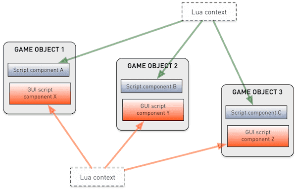
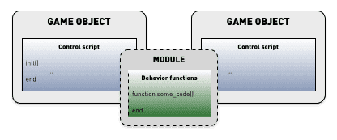

# Lua w Defoldzie

Silnik Defold ma wbudowany język Lua do skryptowania. Lua to lekki język dynamiczny, który jest potężny, szybki i łatwy do osadzenia. Jest powszechnie używany jako język skryptowy w grach wideo. Programy w Lua są napisane w prostym składni proceduralnym. Język jest dynamicznie typowany i uruchamiany przez interpreter kodu bajtowego. Posiada automatyczne zarządzanie pamięcią z inkrementalnym zbieraniem śmieci.

Ta instrukcja przedstawi krótkie wprowadzenie do podstaw programowania w Lua ogólnie oraz to, na co należy zwrócić uwagę podczas pracy z Lua w Defoldzie. Jeśli masz pewne doświadczenie z Pythonem, Perlem, Rubym, Javascriptem lub podobnym językiem dynamicznym, szybko się dostosujesz. Jeśli jesteś zupełnie nowy w programowaniu, możesz rozpocząć od książki o Lua skierowanej dla początkujących. Jest ich wiele do wyboru.

## Wersje Lua

Staramy się, aby Defold był taki sam na wszystkich platformach, ale obecnie mamy kilka drobnych rozbieżności w wersji języka Lua między platformami:

| Platforma        | Wersja Lua          | JIT Włączony |
|------------------|---------------------|--------------|
| Windows          | LuaJIT 2.1.0-beta3  | Tak          |
| macOS            | LuaJIT 2.1.0-beta3  | Tak          |
| Linux            | LuaJIT 2.1.0-beta3  | Tak          |
| Android          | LuaJIT 2.1.0-beta3  | Tak          |
| iOS              | LuaJIT 2.1.0-beta3  | Nie*         |
| Nintendo Switch  | LuaJIT 2.1.0-beta3  | Nie*         |
| HTML5            | Lua 5.1.4           | N/A          |

*=Kod kompilowany JIT nie jest dozwolony

[LuaJIT](https://luajit.org/) to bardzo zoptymalizowana wersja Lua, odpowiednia do użycia w grach i innych krytycznych pod względem wydajności oprogramowaniu. LuaJIT jest w pełni kompatybilny w górę z Lua 5.1. Obsługuje wszystkie standardowe funkcje biblioteki Lua oraz pełen zestaw funkcji Lua/C API.

LuaJIT dodaje również kilka [rozszerzeń języka](https://luajit.org/extensions.html) i niektóre funkcje z Lua 5.2.

::: important
Aby zagwarantować, że Twoja gra działa na wszystkich obsługiwanych platformach, gorąco zalecamy korzystanie TYLKO z funkcji języka z wersji Lua 5.1.
:::

### Biblioteki standardowe i rozszerzenia
Defold zawiera wszystkie [standardowe biblioteki Lua 5.1](http://www.lua.org/manual/5.1/manual.html#5), a także bibliotekę do operacji na gniazdach i operacji bitowych:

  - base (`assert()`, `error()`, `print()`, `ipairs()`, `require()`, itp.)
  - coroutine
  - package
  - string
  - table
  - math
  - io
  - os
  - debug
  - socket (z [LuaSocket](https://github.com/diegonehab/luasocket))
  - bitop (z [BitOp](http://bitop.luajit.org/api.html))

Wszystkie biblioteki są udokumentowane w [dokumentacji API](/ref/go).

## Książki i zasoby Lua

### Zasoby online
* [Programowanie w Lua (pierwsza edycja)](http://www.lua.org/pil/contents.html) Dostępne są późniejsze edycje w wersji drukowanej.
* [Podręcznik referencyjny Lua 5.1](http://www.lua.org/manual/5.1/)
* [Naucz się Lua w 15 minut](http://tylerneylon.com/a/learn-lua/)
* [Niesamowita Lua - sekcja z tutorialami](https://github.com/LewisJEllis/awesome-lua#tutorials)

### Książki
* [Programowanie w Lua](https://www.amazon.com/gp/product/8590379868/ref=dbs_a_def_rwt_hsch_vapi_taft_p1_i0) - Programowanie w Lua to oficjalna książka o języku, stanowiąca solidną podstawę dla każdego programisty, który chce używać Lua. Autorstwa Roberto Ierusalimschy, głównego architekta języka.
* [Lua programming gems](https://www.amazon.com/gp/product/8590379868/ref=dbs_a_def_rwt_hsch_vapi_taft_p1_i0) - Lua Programming Gems to zbiór krótkich i zrozumiałych przepisów, stworzonych przez różnych doświadczonych programistów Lua. Książka ta oferuje wiele przydatnych porad i trików dotyczących programowania w Lua.
* [Beginning Lua Programming](https://www.amazon.com/gp/product/1484219602/ref=dbs_a_def_rwt_hsch_vapi_taft_p1_i0) - Ta książka zawiera wiele praktycznych przykładów i projektów, które pomogą Ci opanować język Lua. Jest odpowiednia dla początkujących programistów, ale oferuje także bardziej zaawansowane tematy dla tych, którzy chcą pogłębić swoją wiedzę.
* [Programming in Lua](https://www.amazon.com/gp/product/8590379868/ref=dbs_a_def_rwt_hsch_vapi_taft_p1_i0) - Kolejna dobra książka na temat Lua, napisana przez Roberto Ierusalimschy, jednego z autorów języka Lua. Obejmuje wiele aspektów języka Lua i dostarcza praktyczne wskazówki oraz porady dotyczące programowania w nim.

Oczywiście, istnieje wiele innych dostępnych materiałów i samouczków do nauki Lua, więc możesz wybrać te, które najlepiej odpowiadają Twoim potrzebom i poziomowi umiejętności.

## Składnia języka Lua

Programy w Lua mają prostą, czytelną składnię. Instrukcje zapisywane są jedna na każdej linii, i nie ma potrzeby oznaczania końca instrukcji. Opcjonalnie można używać średników `;` do oddzielania instrukcji. Bloki kodu są ograniczane słowem kluczowym `end`. Komentarze mogą być blokowe lub do końca linii:

```lua
--[[
Oto blok komentarzy, który może zajmować
wiele linii w pliku źródłowym.
--]]

a = 10
b = 20 ; c = 30 -- dwie instrukcje w jednej linii

if my_variable == 3 then
    call_some_function(true) -- To jest komentarz w jednej linii
else
    call_another_function(false)
end
```

## Zmienne i typy danych

Lua jest językiem dynamicznym, co oznacza, że zmienne nie mają określonych typów, ale wartości już mają. W odróżnieniu od języków o typach statycznych, możesz przypisać dowolną wartość do dowolnej zmiennej. W Lua istnieje osiem podstawowych typów wartości:

`nil`
: Ten typ ma tylko jedna wartość, `nil`. Zazwyczaj reprezentuje brak przydatnej wartości, na przykład nieprzypisane zmienne.

  ```lua
  print(my_var) -- wyświetli 'nil', ponieważ 'moja_zmienna' nie ma jeszcze przypisanej wartości
  ```

`boolean`
: Ma wartość `true` (prawda) lub `false` (fałsz). Warunki, które są `false` lub `nil`, uznawane są za fałsz. Każda inna wartość jest uważana za prawdę.

  ```lua
  flag = true
  if flag then
      print("flag is true")
  else
      print("flag is false")
  end

  if my_var then
      print("my_var is not nil nor false!")
  end

  if not my_var then
      print("my_var is either nil or false!")
  end
  ```

`number`
: Liczby są reprezentowane wewnętrznie jako 64-bitowe liczby całkowite (_integers_) lub 64-bitowe liczby zmiennoprzecinkowe (_floating point_). Lua automatycznie przelicza te reprezentacje, więc zazwyczaj nie musisz się tym martwić.

  ```lua
  print(10) --> prints '10'
  print(10.0) --> '10'
  print(10.000000000001) --> '10.000000000001'

  a = 5 -- integer
  b = 7/3 -- float
  print(a - b) --> '2.6666666666667'
  ```

`string`
: Stringi to ciągi znaków; są niemutowalnymi sekwencjami bajtów, które mogą zawierać dowolną wartość 8-bitową, włączając w to znaki zerowe (`\0`). Lua nie zakłada żadnych założeń co do zawartości ciągu, więc można w nich przechowywać dowolne dane. Ciągi znaków zapisuje się w pojedynczych lub podwójnych cudzysłowach. Lua przelicza liczby na ciągi znaków w trakcie wykonywania programu. Ciągi znaków można łączyć za pomocą operatora `..`.

  Ciągi znaków mogą zawierać następujące sekwencje unikodowe w stylu C:

  | Sekwencja | Znak      |
  | --------- | --------- |
  | `\a`      | dzwonek/alert |
  | `\b`      | backspace |
  | `\f`      | form feed (przewiń stronę) |
  | `\n`      | newline (nowa linia) |
  | `\r`      | carriage return (powrót karetki) |
  | `\t`      | tabulacja pozioma |
  | `\v`      | tabulacja pionowa |
  | `\\`      | ukośnik wsteczny |
  | `\"`      | podwójny cudzysłów |
  | `\'`      | pojedynczy cudzysłów |
  | `\[`      | lewy nawias kwadratowy |
  | `\]`      | prawy nawias kwadratowy |
  | `\ddd`    | znak określony wartością liczbową, gdzie ddd to sekwencja od jednej do trzech dziesiętnych cyfr |

  ```lua
  my_string = "hello"
  another_string = 'world'
  print(my_string .. another_string) --> "helloworld"

  print("10.2" + 1) --> 11.2
  print(my_string + 1) -- błąd, nie można przekonwertować "hello"
  print(my_string .. 1) --> "hello1"

  print("one\nstring") --> one
                       --> string

  print("\097bc") --> "abc"

  multi_line_string = [[
  Oto kawałek tekstu, który rozciąga się na wiele linii. To jest wszystko
  umieszczone w ciągu znaków i czasami jest to bardzo przydatne.
  ]]
  ```

function
: Funkcje w Lua są wartościami pierwszej klasy, co oznacza, że można je przekazywać jako parametry do funkcji i zwracać jako wartości. Zmienne przypisane do funkcji zawierają referencję do funkcji. Możesz przypisywać zmienne do anonimowych funkcji, ale Lua dostarcza składni ułatwiającej pracę (`function nazwa(param1, param2) ... end`).

  ```lua
  -- Przypisz 'my_plus' do funkcji
  my_plus = function(p, q)
      return p + q
  end

  print(my_plus(4, 5)) --> 9

  -- Wygodna składnia do przypisania funkcji do zmiennej 'my_mult'
  function my_mult(p, q)
      return p * q
  end

  print(my_mult(4, 5)) --> 20

  -- Przyjmuje funkcję jako parametr 'func'
  function operate(func, p, q)
      return func(p, q) -- Wywołuje podaną funkcję z parametrami 'p' i 'q'
  end

  print(operate(my_plus, 4, 5)) --> 9
  print(operate(my_mult, 4, 5)) --> 20

  -- Stwórz funkcję dodawania i zwróć ją
  function create_adder(n)
      return function(a)
          return a + n
      end
  end

  adder = create_adder(2)
  print(adder(3)) --> 5
  print(adder(10)) --> 12
  ```

`table`
: Tabele są jedynym typem danych strukturalnych w Lua. Są to _obiekty_ tablic asocjacyjnych, które służą do reprezentowania list, tablic, sekwencji, tabel symboli, zbiorów, rekordów, grafów, drzew itp. Tabele są zawsze anonimowe, a zmienne, do których przypisuje się tabelę, nie zawierają samej tabeli, lecz odniesienie do niej. Podczas inicjalizacji tabeli jako sekwencji pierwszy indeks to `1`, a nie `0`.

  ```lua
  -- Zainicjuj tabelę jako sekwencję
  weekdays = {"Sunday", "Monday", "Tuesday", "Wednesday",
              "Thursday", "Friday", "Saturday"}
  print(weekdays[1]) --> "Sunday"
  print(weekdays[5]) --> "Thursday"

  -- Zainicjuj tabelę jako rekord z wartościami sekwencyjnymi
  moons = { Earth = { "Moon" },
            Uranus = { "Puck", "Miranda", "Ariel", "Umbriel", "Titania", "Oberon" } }
  print(moons.Uranus[3]) --> "Ariel"

  -- Zbuduj tabelę za pomocą pustego konstruktora {}
  a = 1
  t = {}
  t[1] = "first"
  t[a + 1] = "second"
  t.x = 1 -- to samo co t["x"] = 1

  -- Przechodzenie przez pary klucz-wartość w tabeli
  for key, value in pairs(t) do
      print(key, value)
  end
  --> 1   first
  --> 2   second
  --> x   1

  u = t -- u teraz odnosi się do tej samej tabeli co t
  u[1] = "changed"

  for key, value in pairs(t) do -- nadal iteracja po t!
      print(key, value)
  end
  --> 1   changed
  --> 2   second
  --> x   1
  ```

`userdata`
: Userdata (dane użytkownika) pozwala na przechowywanie dowolnych danych C w zmiennych Lua. W Defoldzie, userdata Lua służy do przechowywania wartości Hash (`hash`), obiektów URL (`url`), obiektów Math (`vector3`, `vector4`, `matrix4`, `quaternion`), obiektów gry, węzłów GUI (`GUI node`), predykatów renderowania (`predicate`), celów renderowania (`render_target`) oraz buforów stałych renderowania (`constant_buffer`).

`thread`
: Wątki reprezentują niezależne wątki wykonywania i są używane do implementacji korygujących. Zobacz poniżej dla szczegółów.

## Operatory

Operatory arytmetyczne
: Operatory matematyczne `+`, `-`, `*`, `/`, unarny `-` (negacja) i eksponenta `^`.

  ```lua
  a = -1
  print(a * 2 + 3 / 4^5) --> -1.9970703125
  ```

  Lua zapewnia automatyczną konwersję między liczbami i ciągami znaków (strings) w trakcie działania programu. Każda operacja numeryczna stosowana do ciągu znaków próbuje przekształcić ciąg w liczbę:

  ```lua
  print("10" + 1) --> 11
  ```

Operatory relacyjne/porównania
: `<` (mniejsze niż), `>` (większe niż), `<=` (mniejsze lub równe), `>=` (większe lub równe), `==` (równe), `~=` (nierówne). Operatory te zawsze zwracają `true` lub `false`. Wartości różnych typów są uważane za różne. Jeśli typy są takie same, są porównywane na podstawie ich wartości. Lua porównuje tabele, userdata i funkcje na podstawie odniesienia. Dwie takie same wartości są uważane za równe tylko wtedy, gdy odnoszą się do tego samego obiektu.

  ```lua
  a = 5
  b = 6

  if a <= b then
      print("a is less than or equal to b")
  end

  print("A" < "a") --> true
  print("aa" < "ab") --> true
  print(10 == "10") --> false
  print(tostring(10) == "10") --> true
  ```

Operatory logiczne
: `and`, `or`, oraz `not`. Operator `and` zwraca swój pierwszy argument, jeśli jest on `false`, w przeciwnym razie zwraca swój drugi argument. Operator `or` zwraca swój pierwszy argument, jeśli nie jest on `false`, w przeciwnym razie zwraca swój drugi argument.

  ```lua
  print(true or false) --> true
  print(true and false) --> false
  print(not false) --> true

  if a == 5 and b == 6 then
      print("a is 5 and b is 6")
  end
  ```

Konkatenacja
: Ciągi znaków (string) można konkatenować za pomocą operatora `...` Liczby są przeliczane na ciągi znaków podczas konkatenacji.

  ```lua
  print("donkey" .. "kong") --> "donkeykong"
  print(1 .. 2) --> "12"
  ```

Długość
: Jednoargumentowy operator długości (length) `#`. Długość ciągu znaków to liczba jego bajtów. Długość tabeli to jej długość sekwencji, czyli liczba indeksów o numerze od `1` wzwyż, gdzie wartość nie jest `nil`. Uwaga: Jeśli w sekwencji są "dziury" z wartością `nil`, długość może być indeksem poprzedzającym wartość `nil`.

  ```lua
  s = "donkey"
  print(#s) --> 6

  t = { "a", "b", "c", "d" }
  print(#t) --> 4

  u = { a = 1, b = 2, c = 3 }
  print(#u) --> 0

  v = { "a", "b", nil }
  print(#v) --> 2
  ```

## Kontrola przepływu danych

ua dostarcza standardowy zestaw konstrukcji sterowania przepływem (flow control).

if---then---else
: Testuje warunek, wykonuje część `then`, jeśli warunek jest prawdziwy, w przeciwnym razie wykonuje (opcjonalną) część `else`. Zamiast zagnieżdżać instrukcje `if`, można używać `elseif`. To zastępuje instrukcję `switch`, której Lua nie ma.

  ```lua
  a = 5
  b = 4

  if a < b then
      print("a is smaller than b")
  end

  if a == '1' then
      print("a is 1")
  elseif a == '2' then
      print("a is 2")
  elseif a == '3' then
      print("a is 3")
  else
      print("I have no idea what a is...")
  end
  ```

while
: Testuje warunek i wykonuje blok tak długo, jak warunek jest prawdziwy (`true`).

  ```lua
  weekdays = {"Sunday", "Monday", "Tuesday", "Wednesday",
              "Thursday", "Friday", "Saturday"}

  -- Print each weekday
  i = 1
  while weekdays[i] do
      print(weekdays[i])
      i = i + 1
  end
  ```

repeat---until
: Powtarza blok aż warunek stanie się prawdziwy (`true`). Warunek jest testowany po bloku kodu, więc blok zostanie wykonany co najmniej raz.

  ```lua
  weekdays = {"Sunday", "Monday", "Tuesday", "Wednesday",
              "Thursday", "Friday", "Saturday"}

  -- Print each weekday
  i = 0
  repeat
      i = i + 1
      print(weekdays[i])
  until weekdays[i] == "Saturday"
  ```

for
: Lua posiada dwa rodzaje pętli `for`: numeryczną i ogólną. Numeryczna pętla `for` przyjmuje 2 lub 3 wartości liczbowe, natomiast ogólna pętla `for` iteruje po wszystkich wartościach zwracanych przez funkcję _iteratora_.

  ```lua
  -- Wyświetla liczby do 1 do 10
  for i = 1, 10 do
      print(i)
  end

  -- Wyświetla liczby od 1 do 10 z krokiem 2
  for i = 1, 10, 2 do
      print(i)
  end

  -- Wyświetla liczby od 10 do 1
  for i=10, 1, -1 do
      print(i)
  end

  t = { "a", "b", "c", "d" }
  -- Iteruje po sekwencji i wyświetla wartości
  for i, v in ipairs(t) do
      print(v)
  end
  ```

break and return
: Użyj instrukcji `break`, aby przerwać blok pętli `for`, `while` lub `repeat`. Użyj `return`, aby zwrócić wartość z funkcji lub zakończyć jej wykonywanie i wrócić do wywołującego. `break` lub `return` mogą występować tylko jako ostatnia instrukcja bloku.

  ```lua
  a = 1
  while true do
      a = a + 1
      if a >= 100 then
          break
      end
  end

  function my_add(a, b)
      return a + b
  end

  print(my_add(10, 12)) --> 22
  ```

## Lokalne zmienne, zmienne globalne i zasięg leksykalny

Wszystkie zmienne, które deklarujesz, są domyślnie globalne, co oznacza, że są dostępne we wszystkich częściach kontekstu uruchomienia Lua. Możesz wyraźnie zadeklarować zmienne jako `local`, co oznacza, że zmienna istnieje tylko w bieżącym zakresie (ang. scope).

Każdy plik źródłowy Lua definiuje osobny zakres. Lokalne deklaracje na najwyższym poziomie w pliku oznaczają, że zmienna jest lokalna w skrypcie Lua. Każda funkcja tworzy inny zagnieżdżony zakres, a każdy blok struktury sterującej tworzy dodatkowe zakresy. Możesz wyraźnie tworzyć zakresy za pomocą słów kluczowych `do` i `end`. Lua działa w zakresie leksykalnym, co oznacza, że zakres ma pełny dostęp do _lokalnych_ zmiennych z otaczającego zakresu. Należy zauważyć, że zmienne lokalne muszą być zadeklarowane przed ich użyciem.

```lua
function my_func(a, b)
    -- 'a' i 'b' są lokalne w tej funkcji i dostępne w jej zakresie

    do
        local x = 1
    end

    print(x) --> nil. 'x' nie jest dostępne poza zakresem do-end
    print(foo) --> nil. 'foo' jest zadeklarowane poza 'moja_funkcja'
    print(foo_global) --> "value 2", ponieważ jest globalna
end

local foo = "value 1"
foo_global = "value 2"

print(foo) --> "value 1". 'foo' jest dostępne w najwyższym zakresie po deklaracji.
```

Należy zauważyć, że jeśli deklarujesz funkcje jako `local` w pliku skryptu (co jest ogólnie dobrym pomysłem), musisz uważać na kolejność kodu. Możesz użyć deklaracji przód, jeśli masz funkcje, które nawzajem się wywołują.

```lua
local func2 -- Forward declaration: 'func2'

local function func1(a)
    print("func1")
    func2(a)
end

function func2(a) -- lub func2 = function(a)
    print("func2")
    if a < 10 then
        func1(a + 1)
    end
end

function init(self)
    func1(1)
end
```

Jeśli napiszesz funkcję zamkniętą w innej funkcji, ma ona także pełen dostęp do lokalnych zmiennych z otaczającej funkcji. To jest bardzo potężna konstrukcja.

```lua
function create_counter(x)
    -- 'x' to zmienna lokalna w 'create_counter'
    return function()
        x = x + 1
        return x
    end
end

count1 = create_counter(10)
count2 = create_counter(20)
print(count1()) --> 11
print(count2()) --> 21
print(count1()) --> 12
```

## Zasłanianie zmiennych

Lokalne zmienne zadeklarowane w bloku zasłonią zmienne o tej samej nazwie w otaczającym bloku.

```lua
my_global = "global"
print(my_global) -->"global"

local v = "local"
print(v) --> "local"

local function test(v)
    print(v)
end

function init(self)
    v = "apple"
    print(v) --> "apple"
    test("banana") --> "banana"
end
```

## Korutyny

Funkcje wykonują się od początku do końca, i nie ma sposobu, aby zatrzymać je w połowie. Korutyny (ang. coroutines) umożliwiają to, co może być bardzo wygodne w niektórych przypadkach. Załóżmy, że chcemy stworzyć bardzo konkretną animację klatka po klatce, w której przesuwamy obiekt gry z pozycji Y `0` do niektórych konkretnych pozycji Y od klatki 1 do klatki 5. Moglibyśmy rozwiązać to za pomocą licznika w funkcji `update()` (patrz poniżej) i listy pozycji. Jednak z użyciem korutyny uzyskujemy bardzo czystą implementację, która jest łatwa do rozbudowy i pracy. Cały stan jest zawarty w samej korutynie.

Gdy korutyna jest zawieszona, zwraca kontrolę do wywołującego, ale pamięta swój punkt wykonania, więc może kontynuować od tego momentu później.

```lua
-- To nasza korutyna
local function sequence(self)
    coroutine.yield(120)
    coroutine.yield(320)
    coroutine.yield(510)
    coroutine.yield(240)
    return 440 -- zwraca wartość końcową
end

function init(self)
    self.co = coroutine.create(sequence) -- Tworzy korutynę. 'self.co' to obiekt wątku
    go.set_position(vmath.vector3(100, 0, 0)) -- Ustawia pozycję początkową
end

function update(self, dt)
    local status, y_pos = coroutine.resume(self.co, self) -- Kontynuuje wykonywanie koriutyny.
    if status then
        -- Jeśli korutyna nie jest jeszcze zakończona, używa wartości zwróconej przez nią jako nowej pozycji
        go.set_position(vmath.vector3(100, y_pos, 0))
    end
end
```


## Konteksty Lua w Defoldzie

Wszystkie zmienne, które deklarujesz, są domyślnie globalne, co oznacza, że są dostępne we wszystkich częściach kontekstu uruchomienia Lua (ang. Lua runtime context). W Defoldzie istnieje opcja *shared_state* w pliku *game.project*, która kontroluje ten kontekst. Jeśli opcja jest ustawiona, wszystkie skrypty, skrypty GUI i skrypt renderowania są oceniane w tym samym kontekście Lua, a zmienne globalne są widoczne wszędzie. Jeśli opcja nie jest ustawiona, silnik wykonuje skrypty, skrypty GUI i skrypt renderowania w osobnych kontekstach.



Defold pozwala na użycie tego samego pliku skryptu w kilku osobnych komponentach obiektu gry. Wszystkie zmienne zadeklarowane lokalnie są udostępniane między komponentami, które używają tego samego pliku skryptu.

```lua
-- 'my_global_value' będzie dostępna we wszystkich skryptach, skryptach GUI, skrypcie renderowania i modułach (plikach Lua)
my_global_value = "global scope"

-- ta wartość będzie współdzielona między wszystkimi instancjami komponentu, które używają tego konkretnego pliku skryptu
local script_value = "script scope"

function init(self, dt)
    -- Ta wartość będzie dostępna w bieżącej instancji komponentu skryptu
    self.foo = "self scope"

    -- ta wartość będzie dostępna wewnątrz funkcji init() i po jej deklaracji
    local local_foo = "local scope"
    print(local_foo)
end

function update(self, dt)
    print(self.foo)
    print(my_global_value)
    print(script_value)
    print(local_foo) -- wypisze nil, ponieważ local_foo jest widoczne tylko w init()
end
```

## Rozważania dotyczące wydajności

W grach o wysokiej wydajności, które mają działać płynnie w 60 FPS, niewielkie błędy wydajności mogą mieć duży wpływ na doświadczenie. Istnieją pewne ogólne rzeczy do rozważenia, a także niektóre, które na pierwszy rzut oka mogą się nie wydawać problematyczne.

Zacznijmy od prostych rzeczy. Zawsze warto jest pisać prosty kod, który nie zawiera zbędnych pętli. Czasami konieczne jest iterowanie przez listy rzeczy, ale należy być ostrożnym, jeśli lista jest dosyć duża. Poniższy przykład działa w nieco ponad 1 milisekundę na dość dobrym laptopie, co może mieć ogromne znaczenie, jeśli każda klatka trwa tylko 16 milisekund (przy 60 FPS), a silnik, skrypt renderowania, symulacja fizyki i inne czynniki już pochłaniają część tego czasu.

```lua
local t = socket.gettime()
local table = {}
for i=1,2000 do
    table[i] = vmath.vector3(i, i, i)
end
print((socket.gettime() - t) * 1000)

-- DEBUG:SCRIPT: 0.40388
```

Aby sprawdzić wydajność wątpliwego kodu, można użyć wartości zwracanej przez `socket.gettime()` (liczba sekund od tzw. epoki systemowej).

## Pamięć i gromadzenie śmieci

Gromadzenie śmieci (ang. garbage collection) w Lua działa domyślnie w tle i zwalnia pamięć, którą alokował runtime Lua. Gromadzenie dużej ilości śmieci może być czasochłonnym zadaniem, dlatego warto ograniczać liczbę obiektów, które trzeba będzie zniszczyć:

* Zmienne lokalne same w sobie nie generują śmieci (np. `local v = 42`).
* Każdy nowy unikalny ciąg (string) tworzy nowy obiekt. Zapisywanie `local s = "some_string"` stworzy nowy obiekt i przypisze go do `s`. Zmienna lokalna `s` sama w sobie nie generuje śmieci, ale obiekt ciągu tak.
* Za każdym razem, gdy jest wykonywany konstruktor tabeli (`{ ... }`), tworzona jest nowa tabela.
* Wykonanie deklaracji funkcji tworzy obiekt zamknięcia (ang. closure object). (np. wykonanie deklaracji `function () ... end`, a nie wywołanie zdefiniowanej funkcji)
* Funkcje o zmiennej liczbie argumentów, tzw. vararg (`function(v, ...) end`) tworzą tabelę dla wielokropka za każdym razem, gdy funkcja jest wywoływana (w Lua przed wersją 5.2 lub jeśli nie używasz LuaJIT).
* `dofile()` i `dostring()`
* Obiekty użytkownika (Userdata)

Istnieją sytuacje, w których można uniknąć tworzenia nowych obiektów i zamiast tego ponownie używać tych już istniejących. Na przykład, na końcu każdej funkcji `update()` można znaleźć:

```lua
-- Resetuj prędkość
self.velocity = vmath.vector3()
```

Łatwo jest zapomnieć, że każde wywołanie `vmath.vector3()` tworzy nowy obiekt. Sprawdźmy, ile pamięci zajmuje jeden obiekt `vector3`:

```lua
print(collectgarbage("count") * 1024)       -- 88634
local v = vmath.vector3()
print(collectgarbage("count") * 1024)       -- 88704. Razem przypisano 70 bajtów
```

Między wywołaniami `collectgarbage()` przydzielono 70 bajtów, ale obejmuje to alokacje większe niż obiekt `vector3`. Każde wyświetlenie wyniku z `collectgarbage()` generuje ciąg, co samo w sobie dodaje 22 bajty śmieci:

```lua
print(collectgarbage("count") * 1024)       -- 88611
print(collectgarbage("count") * 1024)       -- 88633. Przydzielono 22 bajty
```

Dlatego `vector3` zajmuje 70-22 = 48 bajtów. To nie jest wiele, ale jeśli tworzysz jeden obiekt w każdej klatce w grze o 60 FPS, nagle masz 2,8 kB śmieci na sekundę. Z 360 komponentami skryptowymi, które każdy tworzą jeden `vector3` co klatka, otrzymujemy 1 MB śmieci generowanych na sekundę. Te liczby mogą bardzo szybko się zwiększać. Gdy runtime Lua automatycznie zbiera śmieci, może to zabrać wiele cennych milisekund, zwłaszcza na platformach mobilnych.

Jednym ze sposobów unikania alokacji jest stworzenie `vector3` i pracowanie dalej na tym samym obiekcie. Na przykład, aby zresetować `vector3`, można użyć następującej konstrukcji:

```lua
-- Zamiast robić self.velocity = vmath.vector3(), co tworzy nowy obiekt
-- zerujemy składowe istniejącego obiektu wektora prędkości
self.velocity.x = 0
self.velocity.y = 0
self.velocity.z = 0
```

Domyślna konfiguracja gromadzenia śmieci może nie być optymalna w przypadku aplikacji o dużym nacisku na czas. Jeśli widzisz szarpanie w grze lub aplikacji, warto dostosować sposób gromadzenia śmieci w Lua za pomocą funkcji [`collectgarbage()`](/ref/base/#collectgarbage). Możesz na przykład uruchamiać zbieracz przez krótki czas w każdej klatce z niską wartością `step`. Aby dowiedzieć się, ile pamięci zużywa twoja gra lub aplikacja, możesz wydrukować aktualną liczbę bajtów śmieci za pomocą:

```lua
print(collectgarbage("count") * 1024)
```

## Najlepsze praktyki

Jednym z podstawowych aspektów projektowania jest sposób strukturyzowania kodu dla współdzielonych zachowań. Istnieje kilka możliwych podejść.

Zachowania w module
: Umieszczenie zachowania w module pozwala na łatwe dzielenie kodu między różnymi komponentami obiektów gry (i skryptami GUI). Podczas pisania funkcji modułu zazwyczaj warto pisać kod ściśle funkcyjny. Są przypadki, w których przechowywanie stanu lub skutki uboczne są koniecznością (lub prowadzą do czystszej struktury). Jeśli trzeba przechowywać stan w module, trzeba pamiętać, że komponenty współdzielą konteksty Lua. Zobacz szczegóły w [instrukcji do modułów](/manuals/modules).

  
  
  Ponadto, nawet jeśli modułowi jest możliwe bezpośrednie modyfikowanie wewnętrznych danych obiektu gry (przesyłanie `self` do funkcji modułu), zdecydowanie odradzamy to, ponieważ prowadzi to do bardzo silnego sprzężenia.

Pomocniczy obiekt gry z zamkniętym zachowaniem
: Tak samo, jak można umieścić kod skryptu w module Lua, można go umieścić w obiekcie gry z komponentem skryptowym. Różnica polega na tym, że umieszczenie go w obiekcie gry pozwala na komunikację z nim tylko poprzez przekazywanie wiadomości.

  
  
Grupowanie obiektu gry z pomocniczym obiektem zachowania wewnątrz kolekcji
: W tym projekcie można stworzyć obiekt gry, który automatycznie działa na innym docelowym obiekcie gry, albo przez zdefiniowaną nazwę (użytkownik musi zmienić nazwę docelowego obiektu gry, aby pasowała), albo poprzez adres URL `go.property()`, który wskazuje na docelowy obiekt gry.

  

  Zaletą tego rozwiązania jest to, że można umieścić obiekt gry zachowania w kolekcji zawierającej docelowy obiekt. Nie jest wymagany żaden dodatkowy kod.

  W przypadkach, gdy musisz zarządzać dużą ilością obiektów gry, to rozwiązanie nie jest zalecane, ponieważ obiekt zachowania jest duplikowany dla każdej instancji, a każdy obiekt będzie kosztować pamięć.
