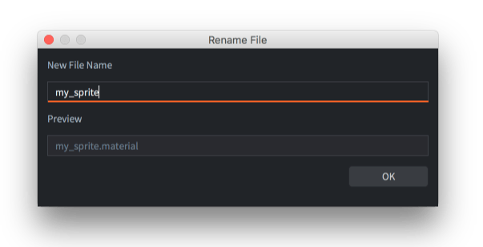
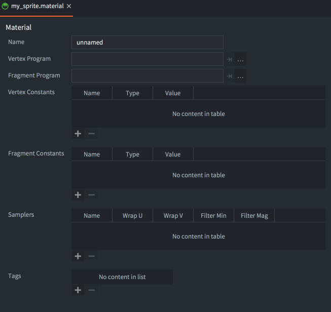
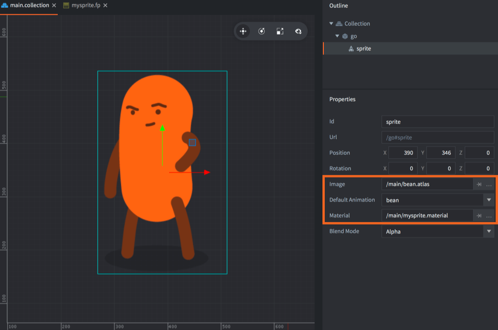
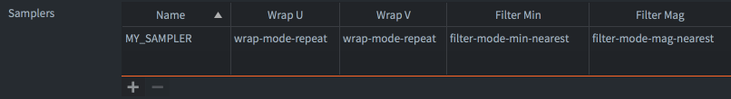
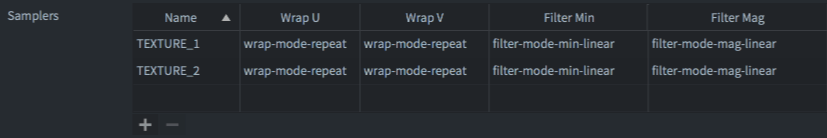
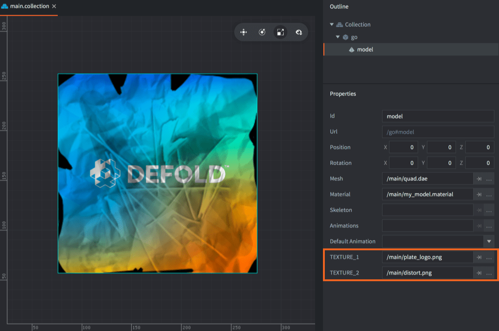

# Materiały

Materiały służą do określania, jak powinien być renderowany komponent graficzny (sprite, mapa kafelków, font, węzeł GUI, model itd.).

Materiał przechowuje _tagi_, czyli informacje używane w potoku renderowania do wyboru obiektów, które mają zostać wyrenderowane. Zawiera też odwołania do _programów shaderów_, które są kompilowane przez dostępny sterownik graficzny, wgrywane do sprzętu graficznego i wykonywane za każdym razem, gdy komponent jest renderowany w danej klatce.

* Więcej informacji o potoku renderowania znajdziesz w [dokumentacji renderowania](/manuals/render).
* Szczegółowe wyjaśnienie programów shaderów znajdziesz w [dokumentacji shaderów](/manuals/shader).

## Tworzenie materiału

Aby utworzyć materiał, <kbd>right click</kbd> docelowy folder w przeglądarce *Assets* i wybierz <kbd>New... ▸ Material</kbd>. (Możesz też wybrać <kbd>File ▸ New...</kbd> z menu, a następnie <kbd>Material</kbd>). Nadaj nowemu plikowi materiału nazwę i naciśnij <kbd>Ok</kbd>.



Nowy materiał otworzy się w *Material Editor*.



Plik materiału zawiera następujące informacje:

Name
: Tożsamość materiału. Ta nazwa służy do umieszczenia materiału w zasobie *Render*, aby uwzględnić go w czasie budowania. Jest też używana w funkcji API `render.enable_material()`. Nazwa powinna być unikalna.

Vertex Program
: Plik programu shadera wierzchołków (*`.vp`*) używany podczas renderowania z tym materiałem. Program shadera wierzchołków działa na GPU dla każdego wierzchołka prymitywu komponentu. Oblicza pozycję każdego wierzchołka na ekranie i opcjonalnie generuje też zmienne „varying”, które są interpolowane i przekazywane do programu fragmentów.

Fragment Program
: Plik programu shadera fragmentów (*`.fp`*) używany podczas renderowania z tym materiałem. Program działa na GPU dla każdego fragmentu (piksela) prymitywu i służy do określenia koloru każdego fragmentu. Zwykle robi się to przez odczyty tekstur i obliczenia oparte na zmiennych wejściowych (zmiennych varying albo stałych).

Vertex Constants
: Uniformy przekazywane do programu shadera wierzchołków. Poniżej znajdziesz listę dostępnych stałych.

Fragment Constants
: Uniformy przekazywane do programu shadera fragmentów. Poniżej znajdziesz listę dostępnych stałych.

Samplers
: W pliku materiału możesz opcjonalnie skonfigurować konkretne samplery. Dodaj sampler, nazwij go zgodnie z nazwą używaną w programie shadera i ustaw parametry wrap oraz filter według potrzeb.

Tags
: Tagi powiązane z materiałem. W silniku tagi są reprezentowane jako _maska bitowa_, z której [`render.predicate()`](/ref/render#render.predicate) korzysta do zbierania komponentów, które powinny zostać narysowane razem. Więcej informacji o tym, jak to zrobić, znajdziesz w [dokumentacji renderowania](/manuals/render). Maksymalna liczba tagów, których możesz użyć w projekcie, to 32.

## Atrybuty

Atrybuty shadera (nazywane też strumieniami wierzchołków albo atrybutami wierzchołków) to mechanizm, dzięki któremu GPU pobiera wierzchołki z pamięci, aby renderować geometrię. Program shadera wierzchołków określa zestaw strumieni za pomocą słowa kluczowego `attribute` i w większości przypadków Defold tworzy oraz wiąże dane automatycznie w tle na podstawie nazw strumieni. Zdarza się jednak, że chcesz przekazać więcej danych na wierzchołek, aby uzyskać konkretny efekt, którego silnik sam nie produkuje. Atrybut wierzchołka można skonfigurować za pomocą następujących pól:

Name
: Nazwa atrybutu. Podobnie jak w przypadku stałych shaderów, konfiguracja atrybutu zostanie użyta tylko wtedy, gdy będzie zgodna z atrybutem określonym w programie wierzchołków.

Semantic type
: Typ semantyczny określa znaczenie semantyczne tego, *czym* jest atrybut i/lub *jak* powinien być wyświetlany w edytorze. Na przykład wskazanie atrybutu z `SEMANTIC_TYPE_COLOR` spowoduje, że w edytorze pojawi się wybierak koloru, a dane nadal będą przekazywane bez zmian z silnika do shadera.

  - `SEMANTIC_TYPE_NONE` Domyślny typ semantyczny. Nie ma żadnego innego wpływu na atrybut poza bezpośrednim przekazaniem danych materiału dla tego atrybutu do bufora wierzchołków (domyślnie)
  - `SEMANTIC_TYPE_POSITION` Generuje dane pozycji dla atrybutu na poziomie wierzchołka. Można go łączyć z przestrzenią współrzędnych, aby określić silnikowi sposób obliczania pozycji
  - `SEMANTIC_TYPE_TEXCOORD` Generuje współrzędne tekstury dla atrybutu na poziomie wierzchołka
  - `SEMANTIC_TYPE_PAGE_INDEX` Generuje indeksy stron dla atrybutu na poziomie wierzchołka
  - `SEMANTIC_TYPE_COLOR` Wpływa na sposób interpretacji atrybutu przez edytor. Jeśli atrybut ma semantykę koloru, w inspektorze pojawi się widżet wyboru koloru
  - `SEMANTIC_TYPE_NORMAL` Generuje dane normalnej dla atrybutu na poziomie wierzchołka
  - `SEMANTIC_TYPE_TANGENT` Generuje dane stycznej dla atrybutu na poziomie wierzchołka
  - `SEMANTIC_TYPE_WORLD_MATRIX` Generuje dane macierzy świata dla atrybutu na poziomie wierzchołka
  - `SEMANTIC_TYPE_NORMAL_MATRIX` Generuje dane macierzy normalnych dla atrybutu na poziomie wierzchołka

Data type
: Typ danych, na których oparty jest atrybut.

  - `TYPE_BYTE` Wartości 8-bitowe ze znakiem
  - `TYPE_UNSIGNED_BYTE` Wartości 8-bitowe bez znaku
  - `TYPE_SHORT` Wartości 16-bitowe ze znakiem
  - `TYPE_UNSIGNED_SHORT` Wartości 16-bitowe bez znaku
  - `TYPE_INT` Wartości całkowite ze znakiem
  - `TYPE_UNSIGNED_INT` Wartości całkowite bez znaku
  - `TYPE_FLOAT` Wartości zmiennoprzecinkowe (domyślnie)

Normalize
: Jeśli ma wartość true, wartości atrybutu zostaną znormalizowane przez sterownik GPU. Może to być przydatne, gdy nie potrzebujesz pełnej precyzji, ale chcesz wykonać obliczenie bez znajomości konkretnych limitów. Na przykład wektor koloru zwykle potrzebuje tylko wartości bajtowych z zakresu 0..255, a mimo to w shaderze jest traktowany jak wartość 0..1.

Coordinate space
: Niektóre typy semantyczne obsługują dostarczanie danych w różnych przestrzeniach współrzędnych. Aby uzyskać efekt billboardingu ze sprite'ami, zazwyczaj chcesz mieć atrybut pozycji w przestrzeni lokalnej, a także w pełni przekształconą pozycję w przestrzeni świata, co daje najlepsze możliwości batchowania.

Vector type
: Typ wektora atrybutu.

  - `VECTOR_TYPE_SCALAR` Pojedyncza wartość skalarna
  - `VECTOR_TYPE_VEC2` Wektor 2D
  - `VECTOR_TYPE_VEC3` Wektor 3D
  - `VECTOR_TYPE_VEC4` Wektor 4D (domyślnie)
  - `VECTOR_TYPE_MAT2` Macierz 2D
  - `VECTOR_TYPE_MAT3` Macierz 3D
  - `VECTOR_TYPE_MAT4` Macierz 4D

Step function
: Określa, w jaki sposób dane atrybutu mają być przekazywane do funkcji wierzchołków. Ma to znaczenie tylko przy instancing.

  - `Vertex` Raz na wierzchołek, np. atrybut pozycji zwykle jest przekazywany do funkcji wierzchołków dla każdego wierzchołka w siatce (domyślnie)
  - `Instance` Raz na instancję, np. atrybut macierzy świata zwykle jest przekazywany do funkcji wierzchołków raz na instancję

Value
: Wartość atrybutu. Wartości atrybutu mogą być nadpisywane osobno dla każdego komponentu, ale poza tym działają jako wartość domyślna atrybutu wierzchołka. Uwaga: dla atrybutów *domyślnych* (pozycja, współrzędne tekstury i indeksy stron) wartość zostanie zignorowana.

::: sidenote
Własne atrybuty można też wykorzystać do zmniejszenia zużycia pamięci po stronie CPU i GPU, przestawiając strumienie na mniejszy typ danych albo inną liczbę elementów.
:::

### Domyślne semantyki atrybutów

System materiałów automatycznie przypisze domyślny typ semantyczny na podstawie nazwy atrybutu w czasie działania dla następującego zestawu nazw:

  - `position` - semantic type: `SEMANTIC_TYPE_POSITION`
  - `texcoord0` - semantic type: `SEMANTIC_TYPE_TEXCOORD`
  - `texcoord1` - semantic type: `SEMANTIC_TYPE_TEXCOORD`
  - `page_index` - semantic type: `SEMANTIC_TYPE_PAGE_INDEX`
  - `color` - semantic type: `SEMANTIC_TYPE_COLOR`
  - `normal` - semantic type: `SEMANTIC_TYPE_NORMAL`
  - `tangent` - semantic type: `SEMANTIC_TYPE_TANGENT`
  - `mtx_world` - semantic type: `SEMANTIC_TYPE_WORLD_MATRIX`
  - `mtx_normal` - semantic type: `SEMANTIC_TYPE_NORMAL_MATRIX`

Jeśli w materiale masz wpisy dla tych atrybutów, domyślny typ semantyczny zostanie zastąpiony tym, który skonfigurowałeś w Material Editor.

### Ustawianie własnych danych atrybutów wierzchołka

Podobnie jak w przypadku stałych shaderów zdefiniowanych przez użytkownika, możesz też aktualizować atrybuty wierzchołków w czasie działania, wywołując go.get(), go.set() i go.animate():


```lua
go.set("#sprite", "tint", vmath.vector4(1,0,0,1))

go.animate("#sprite", "tint", go.PLAYBACK_LOOP_PINGPONG, vmath.vector4(1,0,0,1), go.EASING_LINEAR, 2)
```

Aktualizowanie atrybutów wierzchołków ma jednak pewne ograniczenia. To, czy komponent może użyć danej wartości, zależy od typu semantycznego atrybutu. Na przykład komponent sprite obsługuje `SEMANTIC_TYPE_POSITION`, więc jeśli zaktualizujesz atrybut mający ten typ semantyczny, komponent zignoruje nadpisaną wartość, ponieważ typ semantyczny określa, że dane powinny być zawsze generowane przez pozycję sprite'a.

::: sidenote
Ustawianie własnych danych wierzchołków w czasie działania jest obecnie obsługiwane tylko dla komponentów sprite.
:::

W przypadkach, gdy atrybut wierzchołka jest skalarem albo wektorem innym niż `Vec4`, nadal możesz ustawić dane za pomocą `go.set`:

```lua
-- Ostatnie dwa komponenty wektora vec4 nie będą używane!
go.set("#sprite", "sprite_position_2d", vmath.vector4(my_x,my_y,0,0))
go.animate("#sprite", "sprite_position_2d", go.PLAYBACK_LOOP_PINGPONG, vmath.vector4(1,2,0,0), go.EASING_LINEAR, 2)
```

To samo dotyczy atrybutów macierzowych. Jeśli atrybut jest macierzą inną niż `Mat4`, nadal możesz ustawić dane za pomocą `go.set`.

### Instancjonowanie

Instancjonowanie (instancing) to technika używana do wydajnego rysowania wielu kopii tego samego obiektu w scenie. Zamiast tworzyć osobną kopię obiektu za każdym razem, gdy jest używany, instancjonowanie pozwala silnikowi graficznemu utworzyć jeden obiekt, a następnie wielokrotnie go wykorzystywać. Na przykład w grze z dużym lasem, zamiast tworzyć osobny model drzewa dla każdego drzewa, instancjonowanie pozwala utworzyć jeden model drzewa i umieścić go setki lub tysiące razy w różnych pozycjach i skalach. Las można wtedy wyrenderować jednym wywołaniem rysowania zamiast osobnymi wywołaniami dla każdego drzewa.

::: sidenote
Instancing jest obecnie dostępny tylko dla komponentów Model.
:::

Instancing jest włączane automatycznie, gdy to możliwe. Defold mocno opiera się na batchowaniu stanu rysowania tak bardzo, jak to możliwe - aby instancing działał, muszą być spełnione pewne wymagania:

- Ten sam materiał musi być użyty dla wszystkich instancji. Instancing nadal zadziała, jeśli ustawiono niestandardowy materiał przez `render.enable_material()`
- Materiał musi być skonfigurowany do używania lokalnej przestrzeni wierzchołków
- Materiał musi mieć co najmniej jeden atrybut wierzchołka powtarzany dla każdej instancji
- Wartości stałych muszą być takie same dla wszystkich instancji. Zamiast tego wartości stałych można umieścić we własnych atrybutach wierzchołków albo w innym mechanizmie przechowywania, na przykład w teksturze
- Zasoby shadera, takie jak tekstury lub bufory storage, muszą być takie same dla wszystkich instancji

Aby skonfigurować atrybut wierzchołka tak, żeby był powtarzany dla każdej instancji, trzeba ustawić `Step function` na `Instance`. Dla niektórych typów semantycznych dzieje się to automatycznie na podstawie nazwy (zobacz tabelę `Default attribute semantics` powyżej), ale można też ustawić to ręcznie w edytorze materiałów, ustawiając `Step function` na `Instance`.

W prostym przykładzie poniższa scena ma cztery obiekty gry, każdy z komponentem modelu:


Materiał jest skonfigurowany w ten sposób, z jednym własnym atrybutem wierzchołka, który jest powtarzany dla każdej instancji:


Program shadera wierzchołków ma zdefiniowanych kilka atrybutów per instancję:

```glsl
// Atrybuty per wierzchołek
attribute highp vec4 position;
attribute mediump vec2 texcoord0;
attribute mediump vec3 normal;

// Atrybuty per instancja
attribute mediump mat4 mtx_world;
attribute mediump mat4 mtx_normal;
attribute mediump vec4 instance_color;
```

Zwróć uwagę, że `mtx_world` i `mtx_normal` będą domyślnie skonfigurowane do używania funkcji kroku `Instance`. Można to zmienić w edytorze materiałów, dodając dla nich wpis i ustawiając `Step function` na `Vertex`, co sprawi, że atrybut będzie powtarzany dla każdego wierzchołka zamiast dla każdej instancji.

Aby sprawdzić, czy instancing działa w tym przypadku, możesz zajrzeć do web profiler. Ponieważ jedyną rzeczą, która różni się między instancjami pudełka, są atrybuty per instancję, całość można wyrenderować jednym wywołaniem rysowania:


#### Zgodność wsteczna

Na adapterach graficznych opartych na OpenGL instancing wymaga co najmniej OpenGL 3.1 na desktopie i OpenGL ES 3.0 na urządzeniach mobilnych. Oznacza to, że bardzo stare urządzenia korzystające z OpenGL ES2 albo starszych wersji OpenGL mogą nie obsługiwać instancing. W takim przypadku renderowanie nadal będzie działać domyślnie bez żadnych specjalnych działań ze strony dewelopera, ale może być mniej wydajne niż przy rzeczywistym instancing. Obecnie nie ma sposobu, aby wykryć, czy instancing jest obsługiwane, ale ta funkcjonalność zostanie dodana w przyszłości, tak aby można było użyć tańszego materiału albo całkowicie pominąć rzeczy, które zwykle byłyby dobrymi kandydatami do instancing, na przykład roślinność lub drobne elementy otoczenia.

## Stałe wierzchołków i fragmentów

Stałe shaderów, czyli "uniformy", to wartości przekazywane z silnika do programów shaderów wierzchołków i fragmentów. Aby użyć stałej, definiujesz ją w pliku materiału jako właściwość *Vertex Constant* albo *Fragment Constant*. Odpowiadające im zmienne `uniform` muszą zostać zdefiniowane w programie shadera. W materiale można ustawić następujące stałe:

`CONSTANT_TYPE_WORLD`
: Macierz świata. Używana do przekształcania wierzchołków do przestrzeni świata. W przypadku niektórych typów komponentów wierzchołki są już w przestrzeni świata, gdy trafiają do programu wierzchołków (z powodu batchowania). W takich przypadkach mnożenie przez macierz świata w shaderze da nieprawidłowy wynik.

`CONSTANT_TYPE_VIEW`
: Macierz widoku. Używana do przekształcania wierzchołków do przestrzeni widoku (kamery).

`CONSTANT_TYPE_PROJECTION`
: Macierz projekcji. Używana do przekształcania wierzchołków do przestrzeni ekranu.

`CONSTANT_TYPE_VIEWPROJ`
: Macierz, w której macierze widoku i projekcji są już pomnożone.

`CONSTANT_TYPE_WORLDVIEW`
: Macierz, w której macierze świata i widoku są już pomnożone.

`CONSTANT_TYPE_WORLDVIEWPROJ`
: Macierz, w której macierze świata, widoku i projekcji są już pomnożone.

`CONSTANT_TYPE_NORMAL`
: Macierz do obliczania orientacji normalnej. Transformacja świata może zawierać nierównomierne skalowanie, które psuje ortogonalność połączonej transformacji świat-widok. Macierz normalnych służy do unikania problemów z kierunkiem podczas przekształcania normalnych. (Macierz normalnych jest transponowaną macierzą odwrotną macierzy world-view).

`CONSTANT_TYPE_USER`
: Stała vector4, której możesz użyć dla dowolnych niestandardowych danych, jakie chcesz przekazać do swoich programów shaderów. Początkową wartość stałej możesz ustawić w definicji stałej, ale można ją zmieniać za pomocą funkcji [go.set()](/ref/stable/go/#go.set) / [go.animate()](/ref/stable/go/#go.animate). Wartość można też odczytać przez [go.get()](/ref/stable/go/#go.get). Zmiana stałej materiału dla pojedynczej instancji komponentu [zrywa batchowanie renderowania i spowoduje dodatkowe wywołania rysowania](/manuals/render/#draw-calls-and-batching).

Przykład:

```lua
go.set("#sprite", "tint", vmath.vector4(1,0,0,1))

go.animate("#sprite", "tint", go.PLAYBACK_LOOP_PINGPONG, vmath.vector4(1,0,0,1), go.EASING_LINEAR, 2)
```

`CONSTANT_TYPE_USER_MATRIX4`
: Stała matrix4, której możesz użyć dla dowolnych niestandardowych danych, jakie chcesz przekazać do swoich programów shaderów. Początkową wartość stałej możesz ustawić w definicji stałej, ale można ją zmieniać za pomocą funkcji [go.set()](/ref/stable/go/#go.set) / [go.animate()](/ref/stable/go/#go.animate). Wartość można też odczytać przez [go.get()](/ref/stable/go/#go.get). Zmiana stałej materiału dla pojedynczej instancji komponentu [zrywa batchowanie renderowania i spowoduje dodatkowe wywołania rysowania](/manuals/render/#draw-calls-and-batching).

Przykład:

```lua
go.set("#sprite", "m", vmath.matrix4())
```

::: sidenote
Aby stała materiału typu `CONSTANT_TYPE_USER` albo `CONSTANT_TYPE_MATRIX4` była dostępna przez `go.get()` i `go.set()`, musi być używana w programie shadera. Jeśli stała jest zdefiniowana w materiale, ale nie jest używana w programie, zostanie usunięta z materiału i nie będzie dostępna w czasie działania.
:::

## Samplery

Samplery służą do pobierania informacji o kolorze z tekstury (źródła kafelków lub atlasu). Informacje o kolorze można następnie wykorzystać do obliczeń w programie shadera.

Komponenty sprite, tilemap, GUI i efektów cząsteczkowych automatycznie dostają ustawiony `sampler2D`. Pierwszy zadeklarowany `sampler2D` w programie shadera jest automatycznie wiązany z obrazem wskazanym przez komponent graficzny. Dlatego obecnie nie ma potrzeby określania jakichkolwiek samplerów w pliku materiału dla tych komponentów. Co więcej, te typy komponentów obecnie obsługują tylko jedną teksturę. (Jeśli potrzebujesz wielu tekstur w shaderze, możesz użyć [`render.enable_texture()`](/ref/render/#render.enable_texture) i ustawić samplery tekstur ręcznie ze swojego skryptu do renderowania.)



```glsl
-- mysprite.fp
varying mediump vec2 var_texcoord0;
uniform lowp sampler2D MY_SAMPLER;
void main()
{
    gl_FragColor = texture2D(MY_SAMPLER, var_texcoord0.xy);
}
```

Ustawienia samplera komponentu możesz określić, dodając sampler po nazwie w pliku materiału. Jeśli nie skonfigurujesz samplera w pliku materiału, zostaną użyte globalne ustawienia projektu *Graphics*.



Dla komponentów modelu musisz określić samplery w pliku materiału z ustawieniami, jakie chcesz. Edytor pozwoli wtedy ustawić tekstury dla dowolnego komponentu modelu, który używa tego materiału:



```glsl
-- mymodel.fp
varying mediump vec2 var_texcoord0;
uniform lowp sampler2D TEXTURE_1;
uniform lowp sampler2D TEXTURE_2;
void main()
{
    lowp vec4 color1 = texture2D(TEXTURE_1, var_texcoord0.xy);
    lowp vec4 color2 = texture2D(TEXTURE_2, var_texcoord0.xy);
    gl_FragColor = color1 * color2;
}
```



## Ustawienia samplerów

Name
: Nazwa samplera. Ta nazwa powinna pasować do `sampler2D` zadeklarowanego w shaderze fragmentów.

Wrap U/W
: Tryb zawijania dla osi U i V:

  - `WRAP_MODE_REPEAT` powtórzy dane tekstury poza zakresem [0,1].
  - `WRAP_MODE_MIRRORED_REPEAT` powtórzy dane tekstury poza zakresem [0,1], ale co drugie powtórzenie będzie odbite lustrzanie.
  - `WRAP_MODE_CLAMP_TO_EDGE` ustawi dane tekstury dla wartości większych niż 1.0 na 1.0, a wszystkie wartości mniejsze niż 0.0 na 0.0, czyli piksele krawędzi zostaną powtórzone do brzegu.

Filter Min/Mag
: Filtrowanie dla powiększania i zmniejszania. Filtrowanie najbliższego sąsiada wymaga mniej obliczeń niż interpolacja liniowa, ale może powodować artefakty aliasingu. Interpolacja liniowa często daje gładszy wynik:

  - `Default` używa domyślnej opcji filtra określonej w pliku `game.project` w sekcji *Graphics* jako `Default Texture Min Filter` i `Default Texture Mag Filter`.
  - `FILTER_MODE_NEAREST` używa texela o współrzędnych najbliższych środkowi piksela.
  - `FILTER_MODE_LINEAR` ustawia ważoną średnią liniową z układu 2x2 texeli położonych najbliżej środka piksela.
  - `FILTER_MODE_NEAREST_MIPMAP_NEAREST` wybiera wartość najbliższego texela w pojedynczym mipmapie.
  - `FILTER_MODE_NEAREST_MIPMAP_LINEAR` wybiera najbliższy texel z dwóch najlepszych najbliższych mipmap, a następnie interpoluje liniowo między tymi dwoma wartościami.
  - `FILTER_MODE_LINEAR_MIPMAP_NEAREST` interpoluje liniowo wewnątrz pojedynczego mipmapa.
  - `FILTER_MODE_LINEAR_MIPMAP_LINEAR` używa interpolacji liniowej do obliczenia wartości w każdej z dwóch map, a następnie interpoluje liniowo między tymi dwiema wartościami.

Max Anisotropy
: Filtrowanie anizotropowe to zaawansowana technika filtrowania, która pobiera wiele próbek i miesza wyniki. To ustawienie kontroluje poziom anizotropii dla samplerów tekstur. Jeśli GPU nie obsługuje filtrowania anizotropowego, parametr nie będzie miał żadnego efektu, a domyślnie zostanie ustawiony na 1.

## Bufory stałych

Gdy potok renderowania rysuje, pobiera wartości stałych z domyślnego systemowego bufora stałych. Możesz utworzyć własny bufor stałych, aby nadpisać wartości domyślne i zamiast tego ustawiać uniformy programów shaderów programowo w skrypcie do renderowania:

```lua
self.constants = render.constant_buffer() -- <1>
self.constants.tint = vmath.vector4(1, 0, 0, 1) -- <2>
...
render.draw(self.my_pred, {constants = self.constants}) -- <3>
```
1. Utwórz nowy bufor stałych
2. Ustaw stałą `tint` na jaskrawą czerwień
3. Narysuj predykat, używając naszego niestandardowego bufora stałych

Zwróć uwagę, że elementy stałych w buforze są odwoływane jak zwykła tabela Lua, ale nie można iterować po buforze za pomocą `pairs()` ani `ipairs()`.
