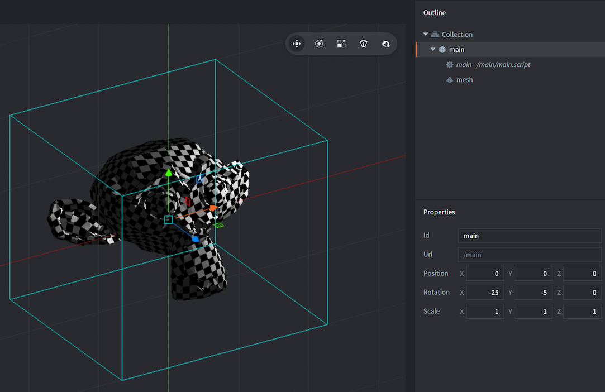

# Komponent Mesh (Siatka)

Defold to od podstaw silnik 3D. Nawet w przypadku pracy tylko z materiałem 2D, całe renderowanie jest wykonywane w 3D, ale rzutowane ortograficznie na ekran. Defold pozwala na korzystanie z pełnej zawartości 3D poprzez dodawanie i tworzenie komponentów 3D w czasie wykonywania w kolekcjach. Możesz tworzyć gry w czystym 3D, korzystając tylko z aktywów 3D, lub mieszać zawartość 3D i 2D według własnych preferencji. Komponent typu Mesh - Siatka jest jednym z komponentów do obsługi elementów trójwymiarowych.

## Tworzenie komponentu Siatki

Komponenty Siatki - mesh są tworzone tak samo jak każdy inny komponent obiektu gry. Możesz to zrobić na dwa sposoby:

- Utwórz plik Mesh <kbd>klikając prawym przyciskiem myszy</kbd> w lokalizacji w panelu *Assets* i wybierając <kbd>New... ▸ Mesh</kbd>.
- Utwórz komponent osadzony bezpośrednio w obiekcie gry <kbd>klikając prawym przyciskiem myszy</kbd> na obiekcie gry w panelu *Outline* i wybierając <kbd>Add Component ▸ Mesh</kbd>.



Po utworzeniu Siatki musisz określić szereg właściwości (properties):

### Właściwości Siatki

Oprócz właściwości *Id*, *Position* i *Rotation* istnieją następujące właściwości specyficzne dla komponentu typu Mesh:

*Material*
: Materiał do użycia podczas renderowania Siatki trójwymiarowej.

*Vertices*
: Plik bufora opisujący dane Siatki dla strumienia.

*Primitive Type*
: Typ prymitywu: Linie, Trójkąty lub Trójkąty Strip (Lines, Triangles or Triangle Strip).

*Position Stream*
: Strumień pozycji - ta właściwość powinna zawierać nazwę strumienia *position*. Strumień jest automatycznie dostarczany jako wejście do vertex shadera (shadera wierzchołków).

*Normal Stream*
: Strumień normalnych - ta właściwość powinna zawierać nazwę strumienia *normal*. Strumień jest automatycznie dostarczany jako wejście do vertex shadera.

*tex0*
: Ustaw to na teksturę do użycia na siatce.

## Manipulacja w Edytorze

Dzięki komponentowi typu Mesh możesz swobodnie edytować i manipulować komponentem i/lub otaczającym obiektem gry za pomocą standardowych narzędzi Edytora sceny (*Scene Editor*), aby dostosować pozycję, obrót i skalowanie Siatki według swojego uznania.

## Manipulacja w czasie rzeczywistym

Możesz manipulować meshami w czasie wykonania programu, korzystając z buforów Defolda. Oto przykład tworzenia sześcianu z pasów trójkątów:

```Lua

-- definicja wierzchołków sześcianu
local vertices = {
	0, 0, 0,
	0, 1, 0,
	1, 0, 0,
	1, 1, 0,
	1, 1, 1,
	0, 1, 0,
	0, 1, 1,
	0, 0, 1,
	1, 1, 1,
	1, 0, 1,
	1, 0, 0,
	0, 0, 1,
	0, 0, 0,
	0, 1, 0
}

-- utwórz bufor z danymi pozycji
local buf = buffer.create(#vertices / 3, {
	{ name = hash("position"), type=buffer.VALUE_TYPE_FLOAT32, count = 3 }
})

-- pobierz strumień pozycji i zapisz wierzchołki
local positions = buffer.get_stream(buf, "position")
for i, value in ipairs(vertices) do
	positions[i] = vertices[i]
end

-- ustaw bufor z wierzchołkami w siatce
local res = go.get("#mesh", "vertices")
resource.set_buffer(res, buf)
```

Aby uzyskać więcej informacji na temat korzystania z komponentu Mesh, w tym projektów przykładowych i fragmentów kodu, zapoznaj się z [postem ogłoszeniowym na forum](https://forum.defold.com/t/mesh-component-in-defold-1-2-169-beta/65137.

## Frustum culling

Frustum culling, czyli odrzucanie widoku spoza bryły widoku to funkcjonalność pozwalająca usuwać powierzchnie spoza widoku określonego przez specjalną bryłę (frustum) w celu zyskiwaniu na szybkości renderowania. Komponenty typu Mesh nie są automatycznie odrzucane ze względu na ich dynamiczną naturę i fakt, że niemożliwe jest dokładne ustalenie, w jaki sposób dane pozycyjne są kodowane. Aby odrzucić mesh, należy ustawić prostopadłościenne obramowanie otaczające mesh jako metadane w buforze za pomocą 6 liczb zmiennoprzecinkowych (AABB min/max):

```lua
buffer.set_metadata(buf, hash("AABB"), { 0, 0, 0, 1, 1, 1 }, buffer.VALUE_TYPE_FLOAT32)
```

## Stałe materiałowe



`tint`
: odcień/barwa Siatki (typu `vector4`). Wektor 4-składnikowy jest używany do reprezentowania odcienia z X, Y, Z i W odpowiadającymi kolorami czerwonym, zielonym, niebieskim i alfa (przezroczystości).

## Przestrzeń wierzchołkowa lokalna a przestrzeń świata
Jeśli ustawienia Przestrzeni wierzchołka (Vertex Space setting) materiału Siatki są ustawione na Przestrzeń lokalną (vertex local space), dane zostaną dostarczone do shadera w postaci, w jakiej są, i będziesz musiał przekształcać wierzchołki/normalne na GPU, tak jak zwykle.

Jeśli ustawienia Przestrzeni wierzchołka materiału meshu są ustawione na Przestrzeń świata (world space), musisz albo dostarczyć domyślny strumień "position" i "normal", albo wybrać go z listy rozwijanej podczas edycji Siatki. Ma to na celu przekształcenie danych do przestrzeni świata w celu ich grupowania z innymi obiektami.
