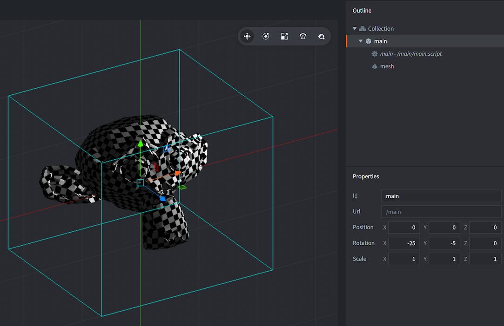

# Komponent Mesh

Defold jest w swojej istocie silnikiem 3D. Nawet jeśli pracujesz wyłącznie z materiałami 2D, całe renderowanie odbywa się w 3D, a następnie jest rzutowane ortograficznie na ekran. Defold pozwala wykorzystywać pełną zawartość 3D, dodając i tworząc siatki 3D w czasie działania w kolekcjach. Możesz budować gry wyłącznie w 3D albo dowolnie łączyć zawartość 3D i 2D.

## Tworzenie komponentu Mesh

Komponenty Mesh tworzy się tak samo jak inne komponenty obiektów gry. Można to zrobić na dwa sposoby:

- Utwórz plik *Mesh* przez <kbd>right-clicking</kbd> w wybranym miejscu panelu *Assets* i wybierz <kbd>New... ▸ Mesh</kbd>.
- Utwórz komponent osadzony bezpośrednio w obiekcie gry przez <kbd>right-clicking</kbd> obiektu gry w widoku *Outline* i wybierz <kbd>Add Component ▸ Mesh</kbd>.



Po utworzeniu siatki musisz ustawić kilka właściwości:

### Właściwości komponentu Mesh

Poza właściwościami *Id*, *Position* i *Rotation* dostępne są następujące właściwości specyficzne dla tego komponentu:

*Material*
: Materiał używany do renderowania siatki.

*Vertices*
: Plik bufora opisujący dane siatki dla poszczególnych strumieni.

*Primitive Type*
: Lines, Triangles lub Triangle Strip.

*Position Stream*
: Nazwa strumienia *position*. Ten strumień jest automatycznie przekazywany jako wejście do vertex shadera.

*Normal Stream*
: Nazwa strumienia *normal*. Ten strumień jest automatycznie przekazywany jako wejście do vertex shadera.

*tex0*
: Ustaw to na teksturę używaną przez siatkę.

## Edycja w edytorze

Po dodaniu komponentu Mesh możesz edytować i przekształcać zarówno sam komponent, jak i obiekt gry, który go zawiera, za pomocą standardowych narzędzi *Scene Editor*, aby przesuwać, obracać i skalować siatkę według potrzeb.

## Modyfikacja w czasie działania

Siatki można modyfikować w czasie działania przy użyciu buforów Defold. Przykład utworzenia sześcianu z pasów trójkątów:

```Lua

-- sześcian
local vertices = {
	0, 0, 0,
	0, 1, 0,
	1, 0, 0,
	1, 1, 0,
	1, 1, 1,
	0, 1, 0,
	0, 1, 1,
	0, 0, 1,
	1, 1, 1,
	1, 0, 1,
	1, 0, 0,
	0, 0, 1,
	0, 0, 0,
	0, 1, 0
}

-- utwórz bufor ze strumieniem pozycji
local buf = buffer.create(#vertices / 3, {
	{ name = hash("position"), type=buffer.VALUE_TYPE_FLOAT32, count = 3 }
})

-- pobierz strumień pozycji i zapisz wierzchołki
local positions = buffer.get_stream(buf, "position")
for i, value in ipairs(vertices) do
	positions[i] = vertices[i]
end

-- ustaw bufor z wierzchołkami w komponencie Mesh
local res = go.get("#mesh", "vertices")
resource.set_buffer(res, buf)
```

Więcej informacji o korzystaniu z komponentu Mesh, wraz z przykładowymi projektami i fragmentami kodu, znajdziesz w [poście ogłoszeniowym na forum](https://forum.defold.com/t/mesh-component-in-defold-1-2-169-beta/65137).

## Odrzucanie spoza bryły widokowej

Komponenty Mesh nie są automatycznie odrzucane, ponieważ mają dynamiczny charakter i nie da się jednoznacznie określić, jak zakodowano dane pozycyjne. Aby włączyć odrzucanie siatki, trzeba zapisać w metadanych bufora ograniczający ją axis-aligned bounding box za pomocą 6 liczb zmiennoprzecinkowych (AABB min/max):

```lua
buffer.set_metadata(buf, hash("AABB"), { 0, 0, 0, 1, 1, 1 }, buffer.VALUE_TYPE_FLOAT32)
```

## Stałe materiału



`tint`
: Odcień koloru siatki (`vector4`). Wektor vector4 reprezentuje odcień, gdzie x, y, z i w odpowiadają odpowiednio kanałom czerwieni, zieleni, błękitu i alfa.

## Lokalna przestrzeń wierzchołków a przestrzeń świata

Jeśli ustawienie Vertex Space materiału siatki ma wartość Local Space, dane zostaną przekazane do shadera bez zmian i musisz samodzielnie przekształcać wierzchołki oraz normalne na GPU, tak jak zwykle.

Jeśli ustawienie Vertex Space materiału siatki ma wartość World Space, musisz albo dostarczyć domyślny strumień "position" i "normal", albo wybrać go z listy rozwijanej podczas edycji siatki. Dzięki temu silnik może przekształcić dane do przestrzeni świata i zgrupować je podczas renderowania razem z innymi obiektami.
