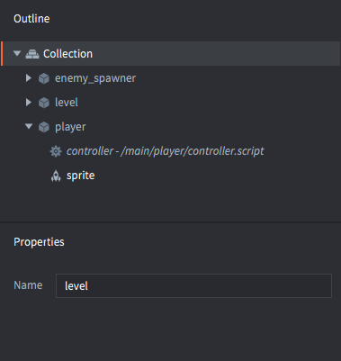

# Przekazywanie wiadomości

Przekazywanie wiadomości to mechanizm umożliwiający obiektom gry (ang. game objects) w Defoldzie komunikację. Ten materiał wymaga uprzedniego zaznajomienia się z [mechanizmem adresowania](/manuals/addressing) i [podstawowymi elementami Defolda](/manuals/building-blocks).

Defold nie jest zorientowany obiektowo w tym sensie, że aplikację zdefiniować można poprzez utworzenie hierarchii klas z dziedziczeniem i metodami w obiektach (jak np. w Javie, C++ czy C#). Zamiast tego, Defold rozszerza możliwości języka Lua o prosty i potężny mechanizm obiektowy, gdzie stan obiektów jest przetrzymywany wewnątrz skryptów (ang. script) dostępny przez referencję do siebie, tzw. `self`. Obiekty mogą być ponadto całkowicie odseparowane od mechanizmu przekazywania asynchronicznych wiadomości Objects can furthermore be fully decoupled with asynchronous message passing jako środka komunikacji między nimi.


## Przykłady użycia

Spójrzmy najpierw na kilka przykładów przekazywania wiadomości. Załóżmy, że budujesz grę, w której znajduje się:

1. Głowna kolekcja nazwana "main" z jednym obiektem gry z komponentem typu GUI nazwanym "interface" (z minimapą i licznikiem zdobytych punktów).
2. Druga kolekcja nazwana "level" z dwoma obiektami gry: jednym dla postaci bohatera/gracza ("hero"), a drugim dla postaci przeciwnika ("enemy").


::: sidenote
Zawartość tego przykładu jest podzielona na dwa dwa osobne pliki - jeden dla kolekcji głównej "main" oraz drugi dla kolekcji "level". Pamiętaj jednak, że same nazwy plików _nie mają znaczenia_ w Defoldzie. Znaczenie ma identyfikator (id) przypisany do instancji.
:::

Gra składa się z kilku prostych zasad, które wymagają komunikacji między obiektami:


① Bohater trafia przeciwnika
: Dla tej funkcjonalności, wiadomość o nazwie `"punch"` (z ang. cios) jest wysłana ze skryptu obiektu gracza "hero" do skryptu obiektu przeciwnika "enemy". Ponieważ obydwa obiekty są w hierarchi tej samej kolekcji, można użyć adresowania pośredniego (bez nazwy kolekcji):

  ```lua
  -- Send "punch" from the "hero" script to "enemy" script
  msg.post("enemy#controller", "punch")
  ```

  W grze jest tylko jeden rodzaj ruchu ataku, więc wiadomość nie musi zawierać żadnych innych informacji oprócz samej nazwy "punch".

  W skrypcie obiektu przeciwnika, utwórz funkcję do obsługi przysłanej wiadomości:

  ```lua
  function on_message(self, message_id, message, sender)
    if message_id == hash("punch") then
      self.health = self.health - 100
    end
  end
  ```

  W tym przypadku kod sprawdza nazwę wiadomości (wysłanej jak skrócony hash string w polu "message_id"). Kod nie bierze pod uwagę ani danych zawartych w wiadomości, ani kto był nadawcą - więc *każdy* wysyłający wiadomość "punch" spowoduje, że biedny przeciwnik otrzyma obrażenia.

② Bohater zdobywa punkty
: Kiedy bohater pokona przeciwnika, licznik jego punktów wzrasta. Wiadomość nazwana `"update_score"` (z ang. zaktualizuj wynik) jest wysła ze skryptu obiektu gracza "hero" do komponentu "gui" obiektu "interface".

  ```lua
  -- Enemy defeated. Increase score counter by 100.
  self.score = self.score + 100
  msg.post("/interface#gui", "update_score", { score = self.score })
  ```

  W tym przypadku nie jest możliwe użycie pośredniego adresu, ponieważ obiekt "interface" jest w hierarchi w innej kolekcji, niż obiekt gracza "hero". Wiadomość zostaje wysłana do komponentu GUI, który ma dołączony do siebie skrypt GUI, więc w tym skrypcie możemy zareagować na otrzymaną wiadomość. Wiadomości możemy wysyłać dowolnie między wszystkimi trzema typami skyptów: skryptami, skryptami GUI oraz skryptami do renderowania (render script).

  The message `"update_score"` is coupled with score data. The data is passed as a Lua table in the `message` parameter:

  ```lua
  function on_message(self, message_id, message, sender)
    if message_id == hash("update_score") then
      -- set the score counter to new score
      local score_node = gui.get_node("score")
      gui.set_text(score_node, "SCORE: " .. message.score)
    end
  end
  ```

③ Pozycja przeciwnika jest aktualizowana na minimapie.
: Gracz patrząc na minmapę z pozycjami przeciwników może łatwiej ich zlokalizować i śledzić ruchy. Każdy przeciwniki sygnalizuje więc swoją pozycję, wysyłając wiadomość nazwaną `"update_minimap"` (z ang. zaktualizuj minimapę) do komponentu "gui" obiektu "interface":

  ```lua
  -- Send the current position to update the interface minimap
  local pos = go.get_position()
  msg.post("/interface#gui", "update_minimap", { position = pos })
  ```

  Skrypt GUI musi śledzić pozycję każdego przeciwnika, a jeśli przeciwnik wyśle aktualizację swojej pozycji, to jego ostatnia pozycja musi być zaktualizowana. Nazwa nadawcy wiadomości (przekazana w polu `sender`) może być użyta jako klucz w tablicy Lua z pozycjami:

  ```lua
  function init(self)
    self.minimap_positions = {}
  end

  local function update_minimap(self)
    for url, pos in pairs(self.minimap_positions) do
      -- update position on map
      ...
    end
  end

  function on_message(self, message_id, message, sender)
    if message_id == hash("update_score") then
      -- set the score counter to new score
      local score_node = gui.get_node("score")
      gui.set_text(score_node, "SCORE: " .. message.score)
    elseif message_id == hash("update_minimap") then
      -- update the minimap with new positions
      self.minimap_positions[sender] = message.position
      update_minimap(self)
    end
  end
  ```

## Wysyłanie wiadomości

Mechanizm wysyłania wiadomości, jak w przykładach powyżej, jest bardzo prosty. Wywołujesz funkcję `msg.post()`, która przekierowuje wiadomość do kolejki wiadomości. Następnie, w każdej ramce, silnik Defold przegląda tę kolejkę i dostarcza każdą z wiadomości do odbiorców. Dla niektórych wiadomości systemowych (jak `"enable"`, `"disable"`, `"set_parent"` itd.) silnik sam odpowiada w odpowiedni sposób na taką wiadomość. Silnik tworzy również wiadomości systemowe (jak `"collision_response"` w przypadku kolizji fizycznych), które są rozsyłane do odpowiednich obiektów gry. W przypadku wiadomości użytkownika wysyłanych do skryptów silnik wywołuje specjalną funkcję `on_message()`.

Możesz wysyłać dowolne wiadomości do istniejących obiektów lub komponentów, a już decyzja, czy i jak zareagować na daną wiadomość zależy od kodu funkcji. Jeśli wyślesz wiadomość do skryptu, a skrypt zignoruje ją, jest to w porządku. Odpowiedzialność za obsługę wiadomości leży w całości po stronie odbiorcy.

Silnik sprawdza docelowy adres wiadomości. Jeśli próbujesz wysłać wiadomość do nieznanego lub nieistniejącego odbiorcy, Defold powiadomi Cię o tym stosowną informacją z błędem w konsoli:

```lua
-- Try to post to a non existing object
msg.post("dont_exist#script", "hello")
```

```txt
ERROR:GAMEOBJECT: Instance '/dont_exists' could not be found when dispatching message 'hello' sent from main:/my_object#script
```

Kompletna sygnatura dla funkcji `msg.post()` to:

`msg.post(receiver, message_id, [message])`

receiver
: Odbiorca, id komponentu lub obiektu gry, do którego wiadomość ma być wysłana. Uwaga! Jeśli wiadomość jest wysłana do obiektu gry, a nie pojedynczego komponentu (np. skryptu), to każdy komponent w hierarchii ooiektu otrzymuje tę samą wiadomość.

message_id
: Nazwa wiadomości, identyfikator będący skróconym ciągiem znaków (hash string).

[message]
: Opcjonalna tablica Lua z parami klucz-wartość zawierającymi dane. Niemal każdy typ danych może być załączony w tablicy Lua - możesz dołączyć liczby, string, boolean, adresy URL, hashe czy zagnieżdżone tablice Lua. Nie można dołączyć funkcji.

  ```lua
  -- Send table data containing a nested table
  local inventory_table = { sword = true, shield = true, bow = true, arrows = 9 }
  local stats = { score = 100, stars = 2, health = 4, inventory = inventory_table }
  msg.post("other_object#script", "set_stats", stats)
  ```

::: sidenote
Istnieje konkretny i niezmienialny limit na wielkość danych przesyłanych jako tablica Lua w polu w wiadomości `message` i wynosi 2 kilobajty. Nie istnieje obecnie prosty sposób na sprawdzenie zajętej pamięci przez tablicę w Lua, ale można przykładowo porównać wartość zwracaną przez funkcję `collectgarbage("count")` z momentu przed dodaniem danych do tablicy oraz po ich umieszczeniu, aby monitorować użycie pamięci.
:::

### Skróty

Defold wprowadza dwa przydatne skróty, których można używać, zamiast określania konretnego adresu (co pozwala na stworzenie bardziej ogólnej funkcji w jednym skrypcie, której można użyć np. w wielu, różnych obiektach):

:[Shorthands](../shared/url-shorthands.md)


## Odbieranie wiadomości

Odbieranie wiadomości polega jedynie na zapewnieniu obsługi wiadomości w skrypcie przy użyciu specjalnej funkcji `on_message()`. Funkcja ta przyjmuje 4 parametry:

`function on_message(self, message_id, message, sender)`

`self`
: Referencja do własnej instancji skryptu, tablica unikalna dla każdego stworzonego skryptu.

`message_id`
: Nazwa wiadomości, unikalny _skrócony_ (hash) identyfikator.

`message`
: Zawiera dane wiadomości, tablicę Lua. Jeśli nie ma żadnych danych przekazanych w wiadomości, tablica jest, ale pusta.

`sender`
: Zawiera pełny adres URL nadawcy.

```lua
function on_message(self, message_id, message, sender)
    print(message_id) --> hash: [my_message_name]

    pprint(message) --> {
                    -->   score = 100,
                    -->   value = "some string"
                    --> }

    print(sender) --> url: [main:/my_object#script]
end
```

## Wysyłanie wiadomości między światami gry (game worlds)

Jeśli używasz pełnomocników kolekcji (collection proxy) to wczytywania nowych światów gry dynamicznie, możesz chcieć przesyłać do utworzonych światów wiadomości. Załóżmy, że wczytano kolekcję o nazwie "level" przy użyciu pełnomocnika kolekcji:



Kiedy tylko kolekcja zostanie wczytana, zainijcjalizowana i aktywowana, możesz wysyłać wiadomości do każdego z jej komponentów lub obiektów gry w tym nowym świecie poprzez określenie w adresie pola "socket":

```lua
-- Send a message to the player in the new game world
msg.post("level:/player#controller", "wake_up")
```
Więcej szczegółów na temat działania pełnomocników kolekcji znajdziesz w tej [instrukcji do pełnomocników](/manuals/collection-proxy).

## Łańcuchy wiadomości

Kiedy wiadomość zostaje wysłana, może być odczytana przez jednego z odbiorców w wywołaniu funkcji `on_message()`. Możliwe i często stosowane jest przesłanie kolejnej wiadomości do kolejki wiadomości w odpowiedzi na odebraną wiadomość.

Kiedy silnik rozpoczyna rozładowywanie kolejki wiadomości w danej ramce, dla każdej z nich wywoła funkcję `on_message()` nadawcy i tak do momentu, aż kolejka będzie pusta. Jeśli obecnie rozsyłana wiadomość doda nową wiadomość do kolejki, silnik będzie rozsyłał wiadomości z kolejki ponownie. Jest jednak stały, określony limit określający ile razy kolejka może być przez silnik rozładowywana, czego skutkiem jest również limit długości łańcucha wiadomości na ramkę. Możesz sprawdzić jak wiele wiadomości w łańcuchu silnik jest w stanie rozładować między kolejnymi wywołaniami funkcji `update()`, czyli w ciągu trwania jednej ramki, używajać poniższego skryptu:

```lua
function init(self)
    -- We’re starting a long message chain during object init
    -- and keeps it running through a number of update() steps.
    print("INIT")
    msg.post("#", "msg")
    self.updates = 0
    self.count = 0
end

function update(self, dt)
    if self.updates < 5 then
        self.updates = self.updates + 1
        print("UPDATE " .. self.updates)
        print(self.count .. " dispatch passes before this update.")
        self.count = 0
    end
end

function on_message(self, message_id, message, sender)
    if message_id == hash("msg") then
        self.count = self.count + 1
        msg.post("#", "msg")
    end
end
```

Uruchomienie skryptu powinno spowodować wypisanie podobnych informacji:

```txt
DEBUG:SCRIPT: INIT
INFO:ENGINE: Defold Engine 1.2.36 (5b5af21)
DEBUG:SCRIPT: UPDATE 1
DEBUG:SCRIPT: 10 dispatch passes before this update.
DEBUG:SCRIPT: UPDATE 2
DEBUG:SCRIPT: 75 dispatch passes before this update.
DEBUG:SCRIPT: UPDATE 3
DEBUG:SCRIPT: 75 dispatch passes before this update.
DEBUG:SCRIPT: UPDATE 4
DEBUG:SCRIPT: 75 dispatch passes before this update.
DEBUG:SCRIPT: UPDATE 5
DEBUG:SCRIPT: 75 dispatch passes before this update.
```

Widzimy, że ta wersja silnika Defold jest w stanie wykonać 10 przejść rozładowywania kolejki wiadomości między wywołaniem funkcji `init()` oraz pierwszym wywołaniem funkcji `update()`. Następnie jest w stanie wykonać 75 przejść kolejki w każdej ramce.
