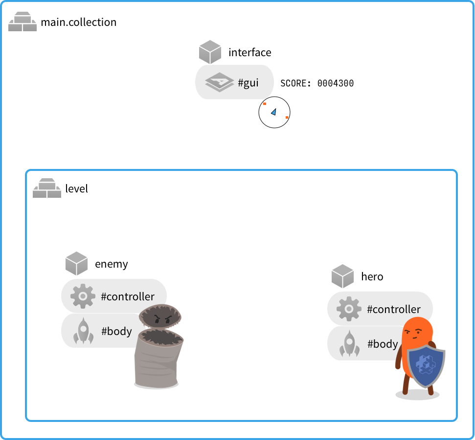
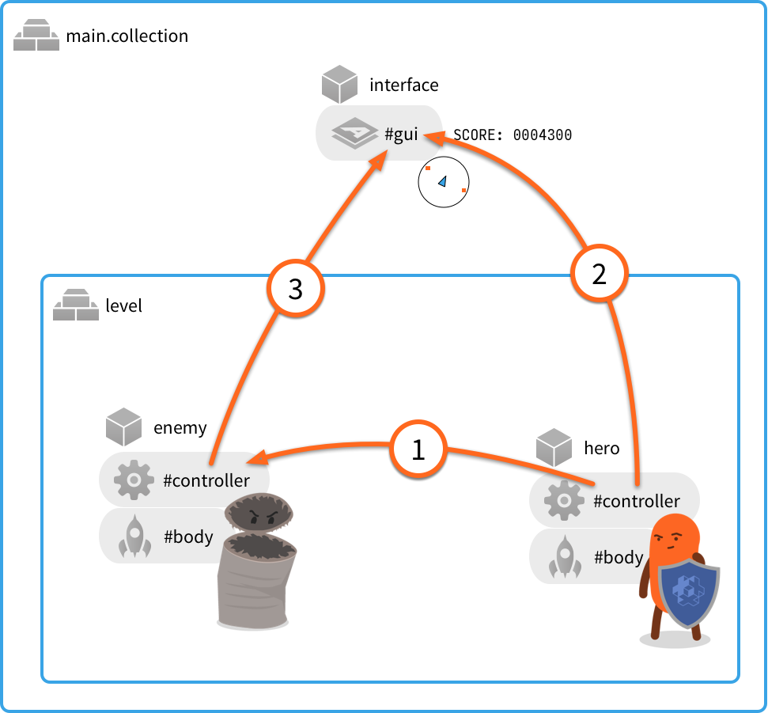
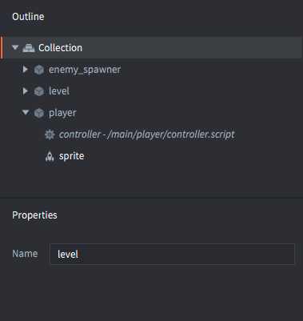

# Przekazywanie wiadomości

Przekazywanie wiadomości to mechanizm pozwalający obiektom gry w silniku Defold komunikować się między sobą. Ten materiał zakłada, że znasz podstawy [mechanizmu adresowania](/manuals/addressing) w silniku Defold oraz [podstawowych elementów budujących grę](/manuals/building-blocks).

Defold nie realizuje programowania obiektowego w tym sensie, że definiujesz aplikację przez tworzenie hierarchii klas ze zdziedziczeniem i metodami członkowskimi w obiektach (jak w Javie, C++ czy C#). Zamiast tego Defold rozszerza Luę o prosty i skuteczny model obiektowy, w którym stan obiektów przechowywany jest wewnętrznie w komponentach skryptowych, dostępnym przez referencję `self`. Obiekty mogą być ponadto całkowicie odseparowane i komunikować się za pomocą asynchronicznego przekazywania wiadomości.

## Przykłady użycia

Najpierw przyjrzyjmy się kilku prostym przykładom. Załóżmy, że tworzysz grę składającą się z:

1. Głównej kolekcji bootstrap zawierającej obiekt gry z komponentem GUI (GUI składa się z minimapy i licznika punktów). Znajduje się tam także kolekcja o identyfikatorze "level".
2. Kolekcja nazwana "level" zawiera dwa obiekty gry: bohatera i przeciwnika.



::: sidenote
Treść tego przykładu mieści się w dwóch oddzielnych plikach. Jeden plik odpowiada głównej kolekcji bootstrap, drugi kolekcji o identyfikatorze "level". W silniku Defold nazwy plików _nie mają znaczenia_. Liczy się tożsamość, jaką nadajesz instancjom.
:::

W grze występuje kilka prostych mechanik wymagających komunikacji między obiektami:



① Bohater uderza przeciwnika
: W ramach tej mechaniki komponent skryptowy bohatera wysyła wiadomość `"punch"` do komponentu skryptowego przeciwnika. Ponieważ oba obiekty żyją w tej samej gałęzi hierarchii kolekcji, preferowane jest adresowanie względne:

  ```lua
  -- Send "punch" from the "hero" script to "enemy" script
  msg.post("enemy#controller", "punch")
  ```

  W grze jest tylko jeden ruch zadający silny cios, więc wiadomość nie musi zawierać żadnych dodatkowych danych poza nazwą `"punch"`.

  W komponencie skryptowym przeciwnika tworzysz funkcję odbierającą wiadomość:

  ```lua
  function on_message(self, message_id, message, sender)
    if message_id == hash("punch") then
      self.health = self.health - 100
    end
  end
  ```

  W tym przypadku kod patrzy tylko na nazwę wiadomości (przekazywaną jako hashowany ciąg w parametrze `message_id`). Kod nie interesuje się danymi ani nadawcą — *każdy*, kto wyśle wiadomość `"punch"`, zada obrażenia biednemu przeciwnikowi.

② Bohater zdobywa punkty
: Kiedy gracz pokonuje przeciwnika, wynik gracza rośnie. Wiadomość `"update_score"` jest wysyłana z komponentu skryptowego obiektu gry bohatera do komponentu GUI w obiekcie gry "interface".

  ```lua
  -- Enemy defeated. Increase score counter by 100.
  self.score = self.score + 100
  msg.post("/interface#gui", "update_score", { score = self.score })
  ```

  W tym przypadku nie da się użyć adresowania względnego, bo "interface" znajduje się w korzeniu hierarchii nazw, a "hero" nie. Wiadomość wysyłana jest do komponentu GUI, do którego dołączony jest skrypt, aby mógł odpowiednio zareagować. Wiadomości można wysyłać swobodnie między skryptami, skryptami GUI i skryptami renderującymi.

  Wiadomość `"update_score"` zawiera dane o wyniku. Dane przesyłane są jako tabela Lua w parametrze `message`:

  ```lua
  function on_message(self, message_id, message, sender)
    if message_id == hash("update_score") then
      -- set the score counter to new score
      local score_node = gui.get_node("score")
      gui.set_text(score_node, "SCORE: " .. message.score)
    end
  end
  ```

③ Pozycja przeciwnika na minimapie
: Gracz ma na ekranie minimapę, która pomaga lokalizować i śledzić przeciwników. Każdy przeciwnik odpowiada za przekazywanie swojej pozycji, wysyłając wiadomość `"update_minimap"` do komponentu GUI w obiekcie gry "interface":

  ```lua
  -- Send the current position to update the interface minimap
  local pos = go.get_position()
  msg.post("/interface#gui", "update_minimap", { position = pos })
  ```

  Skrypt GUI musi śledzić pozycje wszystkich przeciwników, a jeśli ten sam przeciwnik przekaże nową pozycję, starsza powinna zostać zastąpiona. Nadawca wiadomości (przekazany w parametrze `sender`) może posłużyć jako klucz tabeli Lua przechowującej pozycje:

  ```lua
  function init(self)
    self.minimap_positions = {}
  end

  local function update_minimap(self)
    for url, pos in pairs(self.minimap_positions) do
      -- update position on map
      ...
    end
  end

  function on_message(self, message_id, message, sender)
    if message_id == hash("update_score") then
      -- set the score counter to new score
      local score_node = gui.get_node("score")
      gui.set_text(score_node, "SCORE: " .. message.score)
    elseif message_id == hash("update_minimap") then
      -- update the minimap with new positions
      self.minimap_positions[sender] = message.position
      update_minimap(self)
    end
  end
  ```

## Wysyłanie wiadomości

Mechanika wysyłania wiadomości jest, jak już widzieliśmy, bardzo prosta. Wywołujesz funkcję `msg.post()`, która umieszcza wiadomość w kolejce wiadomości. Następnie co klatkę silnik przetwarza kolejkę i doręcza każdą wiadomość do wskazanego adresata. W przypadku niektórych wiadomości systemowych (jak `"enable"`, `"disable"`, `"set_parent"` itp.) kod silnika obsługuje wiadomość. Silnik również generuje wiadomości systemowe (np. `"collision_response"` przy kolizjach fizycznych), które trafiają do twoich obiektów. W przypadku wiadomości użytkownika wysyłanych do komponentów skryptowych silnik po prostu wywołuje specjalną funkcję w języku Lua o nazwie `on_message()`.

Możesz wysłać dowolną wiadomość do istniejącego obiektu lub komponentu i to kod po stronie odbiorcy decyduje, jak na nią zareagować. Jeśli wiadomość trafi do komponentu skryptowego, który ją zignoruje, nic się nie stanie — obsługa komunikatów należy do odbiorcy.

Silnik sprawdza adresat wiadomości. Jeśli spróbujesz wysłać wiadomość do nieznanego odbiorcy, Defold zgłosi błąd w konsoli:

```lua
-- Try to post to a non existing object
msg.post("dont_exist#script", "hello")
```

```txt
ERROR:GAMEOBJECT: Instance '/dont_exists' could not be found when dispatching message 'hello' sent from main:/my_object#script
```

Pełna sygnatura wywołania `msg.post()` to:

`msg.post(receiver, message_id, [message])`

receiver
: Id celowego komponentu lub obiektu gry. Zwróć uwagę, że gdy adresatem jest obiekt gry, wiadomość zostanie rozesłana do wszystkich komponentów tego obiektu.

message_id
: Ciąg znaków lub hashowany ciąg z nazwą wiadomości.

[message]
: Opcjonalna tabela Lua zawierająca pary klucz-wartość z danymi wiadomości. W tabeli można przekazać niemal każdy typ danych: liczby, ciągi znaków, wartości logiczne, adresy URL, hashe i zagnieżdżone tabele. Nie można przekazać funkcji.

  ```lua
  -- Send table data containing a nested table
  local inventory_table = { sword = true, shield = true, bow = true, arrows = 9 }
  local stats = { score = 100, stars = 2, health = 4, inventory = inventory_table }
  msg.post("other_object#script", "set_stats", stats)
  ```

::: sidenote
Istnieje twardy limit rozmiaru tabeli przekazywanej jako parametr `message`. Limit wynosi 2 kilobajty. Obecnie nie ma prostego sposobu określenia, ile dokładnie pamięci zajmuje tabela, ale możesz użyć `collectgarbage("count")` przed i po dodaniu tabeli, aby monitorować zużycie pamięci.
:::

### Skróty

Defold udostępnia dwa wygodne skróty, dzięki którym możesz wysyłać wiadomości bez podawania pełnego adresu URL:

:[Skróty](../shared/url-shorthands.md)

## Odbieranie wiadomości

Odbieranie wiadomości sprowadza się do zapewnienia, że docelowy komponent skryptowy zawiera funkcję `on_message()`. Funkcja przyjmuje cztery parametry:

`function on_message(self, message_id, message, sender)`

`self`
: Referencja do komponentu skryptowego.

`message_id`
: Zawiera nazwę wiadomości. Nazwa jest _hashowana_.

`message`
: Zawiera dane wiadomości. To tabela Lua. Jeśli brak danych, tabela jest pusta.

`sender`
: Zawiera pełny URL nadawcy.

```lua
function on_message(self, message_id, message, sender)
    print(message_id) --> hash: [my_message_name]

    pprint(message) --> {
                    -->   score = 100,
                    -->   value = "some string"
                    --> }

    print(sender) --> url: [main:/my_object#script]
end
```

## Wysyłanie wiadomości między światami gry

Jeśli używasz komponentu pełnomocnika kolekcji (`collection proxy`), aby załadować nowy świat gry do runtime, będziesz chciał wymieniać wiadomości między światami gry. Załóżmy, że załadowałeś kolekcję przez pełnomocnika, a kolekcja ma ustawioną właściwość *Name* na "level":



Gdy tylko kolekcja zostanie załadowana, zainicjowana i włączona, możesz wysyłać wiadomości do dowolnego komponentu lub obiektu w nowym świecie gry, podając nazwę świata gry w polu adresata `socket`:

```lua
-- Send a message to the player in the new game world
msg.post("level:/player#controller", "wake_up")
```

Szczegółowy opis działania pełnomocników kolekcji znajdziesz w instrukcji [Collection Proxies](/manuals/collection-proxy).

## Łańcuchy wiadomości

Gdy wiadomość zostanie wrzucona do kolejki i ostatecznie doręczona, wywoływana jest funkcja `on_message()` odbiorcy. Często kod obsługujący wiadomość przesyła nowe wiadomości, które trafiają na koniec kolejki.

Gdy silnik zaczyna przetwarzać kolejkę, przechodzi po niej i wywołuje funkcję `on_message()` każdego odbiorcy, kontynuując tak długo, aż kolejka zostanie opróżniona. Jeśli podczas tego przejścia dodane zostaną nowe wiadomości, silnik wykona kolejne przejście. Istnieje jednak twardy limit liczby prób opróżnienia kolejki w jednej klatce, co skutkuje ograniczeniem długości łańcuchów wiadomości, które można spodziewać się, że zostaną w pełni przetworzone w ramach jednej klatki. Możesz łatwo sprawdzić, ile przejść po kolejce wykonuje silnik między kolejnymi wywołaniami `update()` przy pomocy poniższego skryptu:

```lua
function init(self)
    -- We’re starting a long message chain during object init
    -- and keeps it running through a number of update() steps.
    print("INIT")
    msg.post("#", "msg")
    self.updates = 0
    self.count = 0
end

function update(self, dt)
    if self.updates < 5 then
        self.updates = self.updates + 1
        print("UPDATE " .. self.updates)
        print(self.count .. " dispatch passes before this update.")
        self.count = 0
    end
end

function on_message(self, message_id, message, sender)
    if message_id == hash("msg") then
        self.count = self.count + 1
        msg.post("#", "msg")
    end
end
```

Uruchomienie tego skryptu wypisze coś w rodzaju:

```txt
DEBUG:SCRIPT: INIT
INFO:ENGINE: Defold Engine 1.2.36 (5b5af21)
DEBUG:SCRIPT: UPDATE 1
DEBUG:SCRIPT: 10 dispatch passes before this update.
DEBUG:SCRIPT: UPDATE 2
DEBUG:SCRIPT: 75 dispatch passes before this update.
DEBUG:SCRIPT: UPDATE 3
DEBUG:SCRIPT: 75 dispatch passes before this update.
DEBUG:SCRIPT: UPDATE 4
DEBUG:SCRIPT: 75 dispatch passes before this update.
DEBUG:SCRIPT: UPDATE 5
DEBUG:SCRIPT: 75 dispatch passes before this update.
```

Widzimy, że ta wersja silnika Defold wykonuje 10 przejść po kolejce wiadomości między `init()` a pierwszym wywołaniem `update()`. W kolejnych pętlach `update` liczba przejść wynosi 75.
