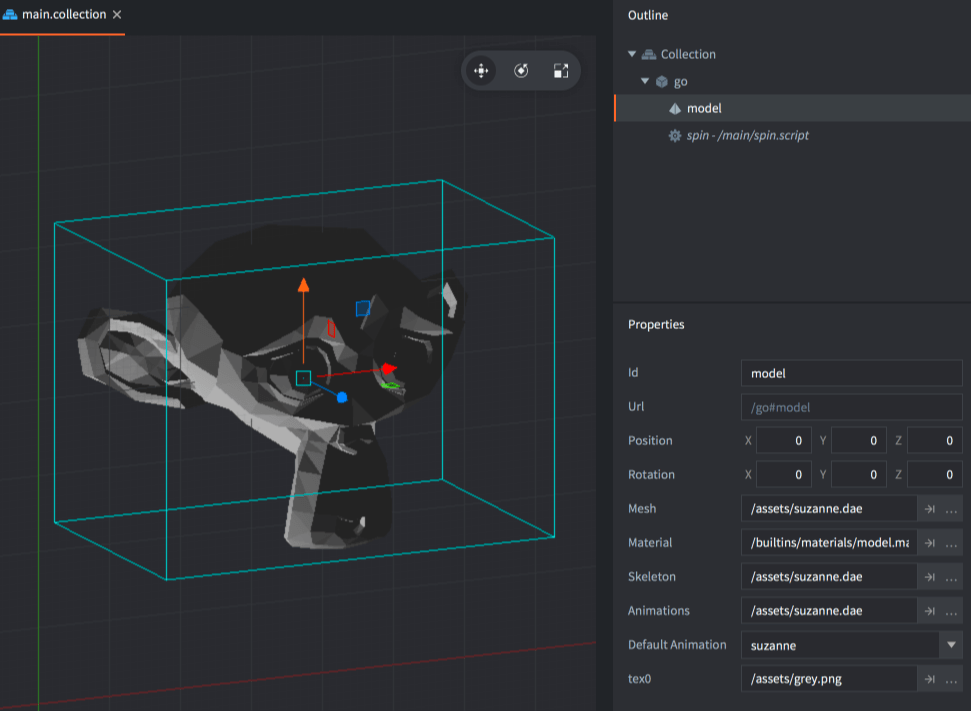
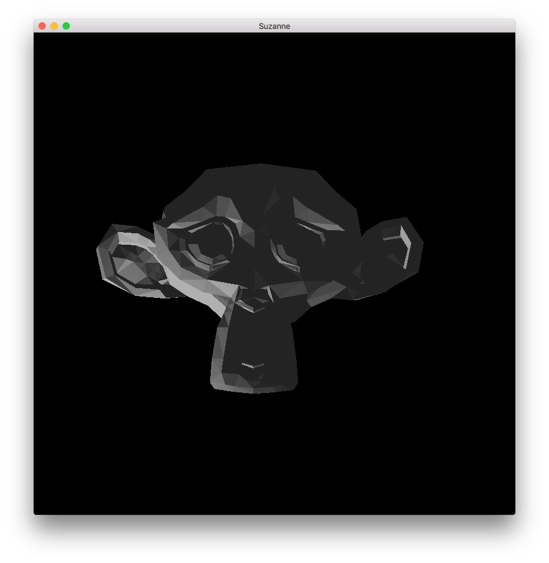

# Komponent Model

Defold jest w swej istocie silnikiem 3D. Nawet gdy pracujesz wyłącznie z materiałami 2D, całe renderowanie odbywa się w 3D, ale jest rzutowane na ekran w projekcji ortograficznej. Defold pozwala korzystać z pełnej zawartości 3D przez dodawanie zasobów 3D, czyli _Models_, do kolekcji. Możesz budować gry wyłącznie w 3D, używając tylko zasobów 3D, albo łączyć zawartość 3D i 2D według własnych potrzeb.

## Tworzenie komponentu modelu

Komponenty modelu tworzy się tak samo jak każdy inny komponent obiektu gry. Możesz to zrobić na dwa sposoby:

- Utwórz plik *Model* przez <kbd>kliknięcie prawym przyciskiem myszy</kbd> lokalizacji w przeglądarce *Assets* i wybranie <kbd>New... ▸ Model</kbd>.
- Utwórz komponent osadzony bezpośrednio w obiekcie gry przez <kbd>kliknięcie prawym przyciskiem myszy</kbd> obiektu gry w widoku *Outline* i wybranie <kbd>Add Component ▸ Model</kbd>.



Gdy model jest już utworzony, musisz określić kilka właściwości:

### Właściwości modelu

Oprócz właściwości *Id*, *Position* i *Rotation* istnieją następujące właściwości specyficzne dla komponentu:

*Mesh*
: Ta właściwość powinna wskazywać plik glTF *.gltf* zawierający siatkę, której chcesz użyć. Jeśli plik zawiera wiele siatek, odczytywana jest tylko pierwsza z nich.

*Create GO Bones*
: Zaznacz tę opcję, aby utworzyć obiekt gry dla każdej kości modelu. Takie obiekty gry możesz wykorzystać do dołączania innych obiektów, na przykład broni do kości dłoni.

*Skeleton*
: Ta właściwość powinna wskazywać plik glTF *.gltf* zawierający szkielet używany do animacji. Pamiętaj, że Defold wymaga pojedynczej kości głównej w hierarchii.

*Animations*
: Ustaw tę właściwość na *Animation Set File* zawierający animacje, których chcesz używać na modelu.

*Default Animation*
: To animacja z zestawu animacji, która będzie automatycznie odtwarzana na modelu.

Oprócz właściwości powyżej będzie też pole, w którym można przypisać materiał do każdej siatki modelu:

*Material*
: Ustaw tę właściwość na materiał, który utworzyłeś i który nadaje się do teksturowanego obiektu 3D. Jako punkt wyjścia możesz wykorzystać kilka wbudowanych materiałów:

  * Use *model.material* for static non-instanced models
  * Use *model_instances.material* for static instanced models
  * Use *model_skinned.material* for skinned (animated) non-instanced models
  * Use *model_skinned_instances.material* for skinned (animated) instanced models

W zależności od materiału będzie dostępna jedna lub więcej właściwości tekstury:

*Texture*
: Ta właściwość powinna wskazywać plik obrazu tekstury, który ma zostać zastosowany do obiektu.


## Modyfikowanie w edytorze

Mając komponent modelu na miejscu, możesz swobodnie edytować i przekształcać komponent albo otaczający go obiekt gry za pomocą zwykłych narzędzi *Scene Editor*, aby przesuwać, obracać i skalować model według własnego uznania.



## Modyfikowanie w czasie działania

Możesz manipulować modelami w czasie działania gry za pomocą wielu różnych funkcji i właściwości (zobacz [dokumentację API dotyczącą użycia](/ref/model/)).

### Animacja w czasie działania

Defold zapewnia rozbudowane wsparcie dla sterowania animacją w czasie działania gry. Więcej informacji znajdziesz w [instrukcji animacji modelu](/manuals/model-animation):

```lua
local play_properties = { blend_duration = 0.1 }
model.play_anim("#model", "jump", go.PLAYBACK_ONCE_FORWARD, play_properties)
```

Kursor odtwarzania animacji można animować ręcznie albo za pomocą systemu animacji właściwości:

```lua
-- ustaw animację biegu
model.play_anim("#model", "run", go.PLAYBACK_NONE)
-- animuj kursor
go.animate("#model", "cursor", go.PLAYBACK_LOOP_PINGPONG, 1, go.EASING_LINEAR, 10)
```

### Zmienianie właściwości

Model ma też kilka właściwości, którymi można manipulować za pomocą `go.get()` i `go.set()`:

`animation`
: Bieżąca animacja modelu (`hash`) (TYLKO DO ODCZYTU). Animację zmieniasz za pomocą `model.play_anim()` (zobacz wyżej).

`cursor`
: Znormalizowany kursor animacji (`number`).

`material`
: Materiał modelu (`hash`). Możesz go zmieniać za pomocą właściwości zasobu materiału i `go.set()`. Przykład znajdziesz w [dokumentacji API](/ref/model/#material).

`playback_rate`
: Szybkość odtwarzania animacji (`number`).

`textureN`
: Tekstury modelu, gdzie N ma wartość od 0 do 7 (`hash`). Możesz je zmieniać za pomocą właściwości zasobu tekstury i `go.set()`. Przykład znajdziesz w [dokumentacji API](/ref/model/#textureN).


## Materiał

Oprogramowanie 3D zwykle pozwala ustawiać na wierzchołkach obiektu właściwości, takie jak kolor i teksturowanie. Informacje te trafiają do pliku glTF *.gltf*, który eksportujesz z programu 3D. W zależności od potrzeb gry musisz wybrać i/lub utworzyć odpowiednie i _wydajne_ materiały dla swoich obiektów. Materiał łączy _programy cieniujące_ z zestawem parametrów renderowania obiektu.

Istnieje kilka wbudowanych materiałów, których możesz użyć jako punktu wyjścia:

  * Use *model.material* for static non-instanced models
  * Use *model_instances.material* for static instanced models
  * Use *model_skinned.material* for skinned (animated) non-instanced models
  * Use *model_skinned_instances.material* for skinned (animated) instanced models

Jeśli chcesz tworzyć własne materiały dla modeli, zajrzyj do [dokumentacji materiałów](/manuals/material), aby uzyskać więcej informacji. [Instrukcja shaderów](/manuals/shader) zawiera informacje o tym, jak działają programy cieniujące.


### Stałe materiału



`tint`
: Odcień kolorystyczny modelu (`vector4`). Wektor typu vector4 służy do reprezentowania odcienia, a składowe x, y, z i w odpowiadają odpowiednio za odcień czerwony, zielony, niebieski i alfa.


## Renderowanie

Domyślny skrypt do renderowania jest zaprojektowany specjalnie z myślą o grach 2D i nie działa z modelami 3D. Jednak po skopiowaniu domyślnego skryptu do renderowania i dodaniu kilku linii kodu możesz włączyć renderowanie modeli. Na przykład:

  ```lua

  function init(self)
    self.model_pred = render.predicate({"model"})
    ...
  end

  function update()
    ...
    render.set_depth_mask(true)
    render.enable_state(render.STATE_DEPTH_TEST)
    render.set_projection(stretch_projection(-1000, 1000))  -- ortograficzna
    render.draw(self.model_pred)
    render.set_depth_mask(false)
    ...
  end
  ```

Szczegóły działania skryptów do renderowania znajdziesz w [dokumentacji renderowania](/manuals/render).
