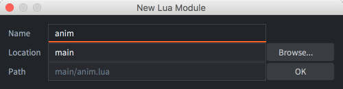

# Moduły Lua

Moduły Lua pozwalają na strukturyzację projektu i tworzenie wielokrotnie używanego kodu bibliotecznego. Ogólnie warto unikać duplikacji w projektach. Defold pozwala korzystać z funkcjonalności modułu Lua, aby dołączać pliki skryptowe do innych plików skryptowych. Dzięki temu można zawierać funkcje (i dane) w zewnętrznym pliku skryptowym, aby ponownie używać ich w plikach skryptów obiektów gry i plikach skryptów GUI.

## Wymaganie/załączanie plików Lua

Kod Lua przechowywany w plikach z rozszerzeniem ".lua" w dowolnym miejscu w strukturze projektu gry może być wymagany (dołączony) w plikach skryptowych i plikach skryptów GUI. Aby utworzyć nowy plik modułu Lua, kliknij prawym przyciskiem myszy folder, w którym chcesz go utworzyć w widoku *Assets*, a następnie wybierz <kbd>New... ▸ Lua Module</kbd>. Nadaj plikowi unikalną nazwę i naciśnij <kbd>Ok</kbd>:



Załóżmy, że poniższy kod jest dodany do pliku "main/anim.lua":

```lua
function direction_animation(direction, char)
    local d = ""
    if direction.x > 0 then
        d = "right"
    elseif direction.x < 0 then
        d = "left"
    elseif direction.y > 0 then
        d = "up"
    elseif direction.y < 0 then
        d = "down"
    end
    return hash(char .. "-" .. d)
end
```

Następnie dowolny skrypt może zażądać (ang. require) tego pliku i używać funkcji:

```lua
require "main.anim"

function update(self, dt)
    -- zaktualizuj pozycję, ustaw kierunek itp.
    ...

    -- ustaw animację
    local anim = direction_animation(self.dir, "player")
    if anim ~= self.current_anim then
        sprite.play_flipbook("#sprite", anim)
        self.current_anim = anim
    end
end
```

Funkcja `require` wczytuje podany moduł. Na początek przegląda tabelę [`package.loaded`](/ref/package/#package.loaded), aby sprawdzić, czy moduł jest już załadowany. Jeśli tak, funkcja `require` zwraca wartość przechowywaną w `package.loaded[module_name]`. W przeciwnym przypadku wczytuje i ewaluuje plik za pomocą ładowacza (ang. loader).

Składnia łańcucha nazwy pliku (filename string) przekazywanej do require jest nieco specjalna. Lua zamienia znaki `"."` w łańcuchu nazwy pliku na znaki separatora ścieżki: `'/'` na macOS i Linux oraz `'\'` na systemie Windows.

Należy zauważyć, że zazwyczaj nie jest dobrym pomysłem używanie zakresu globalnego do przechowywania stanu i definiowania funkcji, tak jak w przykładzie powyżej. Istnieje ryzyko kolizji nazw, ujawnienia stanu modułu lub wprowadzenia zależności między użytkownikami modułu.

## Modułu

Aby inkapsulować dane i funkcje, Lua używa _modułów_. Moduł Lua to zwykła tabela Lua służąca do zawierania funkcji i danych. Tabela jest deklarowana jako lokalna, aby nie zanieczyszczać zakresu globalnego:

```lua
local M = {}

-- private
local message = "Hello world!"

function M.hello()
    print(message)
end

return M
```

Moduł można następnie używać. Ponownie, preferuje się przypisanie go do zmiennej lokalnej:

```lua
local m = require "mymodule"
m.hello() --> "Hello world!"
```

## Ładowanie modułów w trakcie działania (hot reloading)

Rozważmy prosty moduł:

```lua
-- module.lua
local M = {} -- tworzy nową tabelę w zakresie lokalnym
M.value = 4711
return M
```

I użytkownika modułu:

```lua
local m = require "module"
print(m.value) --> "4711" (nawet jeśli plik "module.lua" zostanie zmieniony i na nowo załadowany)
```

Jeśli ponownie załadujesz plik modułu, kod zostanie uruchomiony ponownie, ale nic się nie dzieje z `m.value`. Dlaczego?

Po pierwsze, tabela utworzona w pliku "module.lua" jest tworzona w zakresie lokalnym, a odniesienie do tej tabeli jest zwracane użytkownikowi. Ponowne wczytanie pliku "module.lua" ocenia kod modułu ponownie, ale tworzy nową tabelę w zakresie lokalnym zamiast aktualizować tabelę `m`.

Po drugie, Lua przechowuje w pamięci podręcznej załadowane pliki. Pierwszym razem, gdy plik jest wymagany, jest on dodawany do tabeli [`package.loaded`](/ref/package/#package.loaded), aby można go było szybciej odczytywać podczas kolejnych wymagań. Aby wymusić ponowne odczytanie pliku z dysku, można ustawić wpis pliku na `nil`: `package.loaded["my_module"] = nil`.

Aby prawidłowo ponownie załadować moduł, musisz ponownie załadować moduł, zresetować pamięć podręczną i następnie ponownie załadować wszystkie pliki, które używają modułu. Jest to jednak dalekie od optymalnego.

Zamiast tego możesz rozważyć obejście do użycia w _trakcie rozwoju programu_: umieścić tabelę modułu w zakresie globalnym i spowodować, aby `M` odnosiło się do globalnej tabeli, zamiast tworzyć nową tabelę za każdym razem, gdy plik jest używany ponownie. Ponowne wczytanie modułu zmienia zawartość globalnej tabeli:

```lua
--- module.lua

-- Zamiast tego użyj "local M = {}" w ostatecznej wersji
uniquevariable12345 = uniquevariable12345 or {}
local M = uniquevariable12345

M.value = 4711
return M
```

## Moduły a stan

Moduły z zachowaniem stanu przechowują stan wewnętrzny, który jest współdzielony między wszystkimi użytkownikami modułu i można go porównać do singletonów:

```lua
local M = {}

-- wszyscy użytkownicy modułu będą współdzielić tę tabelę
local state = {}

function M.do_something(foobar)
    table.insert(state, foobar)
end

return M
```

Z kolei moduł bezstanowy nie przechowuje wewnętrznego stanu. Zamiast tego dostarcza mechanizm do wyeksternalizowania stanu do osobnej tabeli lokalnej dla użytkownika modułu. Oto kilka różnych sposobów, aby to zaimplementować:

Korzystanie z tabeli stanu
: Być może najprostszym podejściem jest użycie funkcji konstruktora, która zwraca nową tabelę zawierającą tylko stan. Stan jest jawnie przekazywany do modułu jako pierwszy parametr każdej funkcji manipulującej tabelą stanu.

  ```lua
  local M = {}
  
  function M.alter_state(the_state, v)
      the_state.value = the_state.value + v
  end
  
  function M.get_state(the_state)
      return the_state.value
  end
  
  function M.new(v)
      local state = {
          value = v
      }
      return state
  end
  
  return M
  ```
  
  Użyj modułu w ten sposób:
  
  ```lua
  local m = require "main.mymodule"
  local my_state = m.new(42)
  m.alter_state(my_state, 1)
  print(m.get_state(my_state)) --> 43
  ```

Korzystanie z metatablic
: Innym podejściem jest użycie funkcji konstruktora, która zwraca nową tabelę ze stanem oraz publiczne funkcje modułu za każdym razem, gdy jest wywoływana:

  ```lua
  local M = {}
  
  function M:alter_state(v)
      -- self jest dodawane jako pierwszy argument, gdy używa się notacji ":"
      self.value = self.value + v
  end
  
  function M:get_state()
      return self.value
  end
  
  function M.new(v)
      local state = {
          value = v
      }
      return setmetatable(state, { __index = M })
  end
  
  return M
  ```

  Use the module like this:

  ```lua
  local m = require "main.mymodule"
  local my_state = m.new(42)
  my_state:alter_state(1) -- "my_state" jest dodawane jako pierwszy argument przy użyciu notacji ":"
  print(my_state:get_state()) --> 43
  ```

Korzystanie z domknięć
: Trzeci sposób to zwrócenie domknięcia (ang. closure) zawierającego cały stan i funkcje. Nie trzeba przekazywać instancji jako argumentu (ani jawnie, ani niejawnie, używając operatora dwukropka), jak w przypadku użycia metatablic. Metoda ta jest również nieco szybsza niż korzystanie z metatablic (ang. metatables), ponieważ wywołania funkcji nie muszą przechodzić przez metametodę `__index`, ale każde domknięcie zawiera własną kopię funkcji, co zwiększa zużycie pamięci.

  ```lua
  local M = {}
  
  function M.new(v)
      local state = {
          value = v
      }
  
      state.alter_state = function(v)
          state.value = state.value + v
      end
  
      state.get_state = function()
          return state.value
      end
  
      return state
  end
  
  return M
  ```

  Użyj modułu w ten sposób:

  ```lua
  local m = require "main.mymodule"
  local my_state = m.new(42)
  my_state.alter_state(1)
  print(my_state.get_state()) 
  ```
