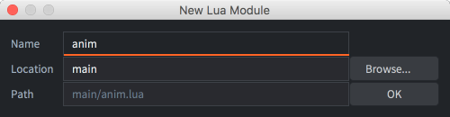

# Moduły Lua

Moduły Lua pozwalają strukturyzować projekt i tworzyć wielokrotnego użytku kod biblioteczny. Zazwyczaj warto unikać duplikacji w projektach. Defold pozwala korzystać z funkcjonalności modułów Lua, aby wczytywać pliki skryptowe do innych plików skryptowych. Dzięki temu można enkapsulować funkcje (i dane) w zewnętrznym pliku skryptowym, aby ponownie wykorzystywać je w plikach skryptów obiektów gry i plikach skryptów GUI.

## Wczytywanie plików Lua

Kod Lua przechowywany w plikach z rozszerzeniem ".lua" w dowolnym miejscu struktury projektu gry można wczytać do plików skryptowych i plików skryptów GUI. Aby utworzyć nowy plik modułu Lua, kliknij prawym przyciskiem myszy folder, w którym chcesz go utworzyć w widoku *Assets*, a następnie wybierz <kbd>New... ▸ Lua Module</kbd>. Nadaj plikowi unikalną nazwę i naciśnij <kbd>Ok</kbd>:



Załóżmy, że poniższy kod został dodany do pliku `main/anim.lua`:

```lua
function direction_animation(direction, char)
    local d = ""
    if direction.x > 0 then
        d = "right"
    elseif direction.x < 0 then
        d = "left"
    elseif direction.y > 0 then
        d = "up"
    elseif direction.y < 0 then
        d = "down"
    end
    return hash(char .. "-" .. d)
end
```

Następnie dowolny skrypt może wczytać ten plik za pomocą require i używać funkcji:

```lua
require "main.anim"

function update(self, dt)
    -- zaktualizuj pozycję, ustaw kierunek itp.
    ...

    -- ustaw animację
    local anim = direction_animation(self.dir, "player")
    if anim ~= self.current_anim then
        sprite.play_flipbook("#sprite", anim)
        self.current_anim = anim
    end
end
```

Funkcja `require` wczytuje podany moduł. Na początek przegląda tabelę `package.loaded`, aby sprawdzić, czy moduł jest już załadowany. Jeśli tak, `require` zwraca wartość przechowywaną w `package.loaded[module_name]`. W przeciwnym razie wczytuje i wykonuje plik za pomocą ładowacza (ang. loader).

Łańcuch nazwy pliku przekazywany do `require` ma nieco szczególną składnię. Lua zamienia znaki "." w nazwie pliku na separatory ścieżki: "/" w macOS i Linux oraz "\" w Windows.

Warto zauważyć, że zwykle nie jest dobrym pomysłem przechowywanie stanu i definiowanie funkcji w zakresie globalnym, tak jak w przykładzie powyżej. Grozi to kolizjami nazw, ujawnieniem stanu modułu albo wprowadzeniem sprzężenia między użytkownikami modułu.

## Moduły

Aby enkapsulować dane i funkcje, Lua używa _modułów_. Moduł Lua to zwykła tabela Lua służąca do przechowywania funkcji i danych. Tabela jest deklarowana jako lokalna, aby nie zanieczyszczać zakresu globalnego:

```lua
local M = {}

-- prywatne
local message = "Hello world!"

function M.hello()
    print(message)
end

return M
```

Moduł można następnie używać. Ponownie, najlepiej przypisać go do zmiennej lokalnej:

```lua
local m = require "mymodule"
m.hello() --> "Hello world!"
```

## Szybkie przeładowanie modułów

Rozważmy prosty moduł:

```lua
-- module.lua
local M = {} -- tworzy nową tabelę w zakresie lokalnym
M.value = 4711
return M
```

A teraz przykład użycia modułu:

```lua
local m = require "module"
print(m.value) --> "4711" (nawet jeśli plik "module.lua" zostanie zmieniony i na nowo załadowany)
```

Jeśli ponownie załadujesz plik modułu, kod zostanie uruchomiony ponownie, ale z `m.value` nic się nie dzieje. Dlaczego?

Po pierwsze, tabela utworzona w pliku "module.lua" powstaje w zakresie lokalnym, a użytkownikowi zwracane jest _odwołanie_ do tej tabeli. Ponowne wczytanie pliku "module.lua" wykonuje kod modułu jeszcze raz, ale tworzy nową tabelę w zakresie lokalnym zamiast aktualizować tabelę `m`.

Po drugie, Lua przechowuje w pamięci podręcznej wczytane pliki. Gdy plik jest wczytywany po raz pierwszy, trafia do tabeli [`package.loaded`](/ref/package/#package.loaded), aby kolejne wczytania mogły być szybsze. Aby wymusić ponowne odczytanie pliku z dysku, można ustawić wpis pliku na `package.loaded["my_module"] = nil`.

Aby poprawnie przeładować moduł, trzeba przeładować sam moduł, wyczyścić pamięć podręczną, a następnie ponownie załadować wszystkie pliki, które z niego korzystają. To jednak dalekie od optymalnego rozwiązania.

Zamiast tego można rozważyć obejście używane _na czas pracy nad projektem_: umieścić tabelę modułu w zakresie globalnym i sprawić, aby `M` odwoływało się do globalnej tabeli zamiast tworzyć nową tabelę za każdym razem, gdy plik jest wykonywany ponownie. Przeładowanie modułu zmienia wtedy zawartość globalnej tabeli:

```lua
--- module.lua

-- Zamiast tego użyj "local M = {}" po zakończeniu pracy
uniquevariable12345 = uniquevariable12345 or {}
local M = uniquevariable12345

M.value = 4711
return M
```

## Moduły i stan

Moduły ze stanem przechowują stan wewnętrzny, który jest współdzielony przez wszystkich użytkowników modułu, i można je porównać do singletonów:

```lua
local M = {}

-- wszyscy użytkownicy modułu będą współdzielić tę tabelę
local state = {}

function M.do_something(foobar)
    table.insert(state, foobar)
end

return M
```

Z kolei moduł bez stanu nie przechowuje stanu wewnętrznego. Zamiast tego udostępnia mechanizm wyniesienia stanu do osobnej tabeli lokalnej dla użytkownika modułu. Oto kilka różnych sposobów, by to zaimplementować:

Korzystanie z tabeli stanu
: Być może najprostszym podejściem jest użycie funkcji konstruktora, która zwraca nową tabelę zawierającą wyłącznie stan. Stan jest jawnie przekazywany do modułu jako pierwszy parametr każdej funkcji, która manipuluje tabelą stanu.

  ```lua
  local M = {}
  
  function M.alter_state(the_state, v)
      the_state.value = the_state.value + v
  end
  
  function M.get_state(the_state)
      return the_state.value
  end
  
  function M.new(v)
      local state = {
          value = v
      }
      return state
  end
  
  return M
  ```
  
  Użyj modułu w ten sposób:
  
  ```lua
  local m = require "main.mymodule"
  local my_state = m.new(42)
  m.alter_state(my_state, 1)
  print(m.get_state(my_state)) --> 43
  ```

Korzystanie z metatablic
: Innym podejściem jest użycie funkcji konstruktora, która przy każdym wywołaniu zwraca nową tabelę ze stanem oraz publicznymi funkcjami modułu:

  ```lua
  local M = {}
  
  function M:alter_state(v)
      -- self jest dodawane jako pierwszy argument, gdy używa się notacji ":"
      self.value = self.value + v
  end
  
  function M:get_state()
      return self.value
  end
  
  function M.new(v)
      local state = {
          value = v
      }
      return setmetatable(state, { __index = M })
  end
  
  return M
  ```

  Użyj modułu w ten sposób:

  ```lua
  local m = require "main.mymodule"
  local my_state = m.new(42)
  my_state:alter_state(1) -- "my_state" jest dodawane jako pierwszy argument przy użyciu notacji ":"
  print(my_state:get_state()) --> 43
  ```

Korzystanie z domknięć
: Trzeci sposób polega na zwróceniu domknięcia (ang. closure) zawierającego cały stan i funkcje. Nie trzeba przekazywać instancji jako argumentu, ani jawnie, ani niejawnie za pomocą operatora dwukropka, jak w przypadku metatablic. Ta metoda jest też nieco szybsza niż korzystanie z metatablic (ang. metatables), ponieważ wywołania funkcji nie muszą przechodzić przez metametodę `__index`, ale każde domknięcie zawiera własną kopię metod, więc zużycie pamięci jest większe.

  ```lua
  local M = {}
  
  function M.new(v)
      local state = {
          value = v
      }
  
      state.alter_state = function(v)
          state.value = state.value + v
      end
  
      state.get_state = function()
          return state.value
      end
  
      return state
  end
  
  return M
  ```

  Użyj modułu w ten sposób:

  ```lua
  local m = require "main.mymodule"
  local my_state = m.new(42)
  my_state.alter_state(1)
  print(my_state.get_state()) 
  ```
