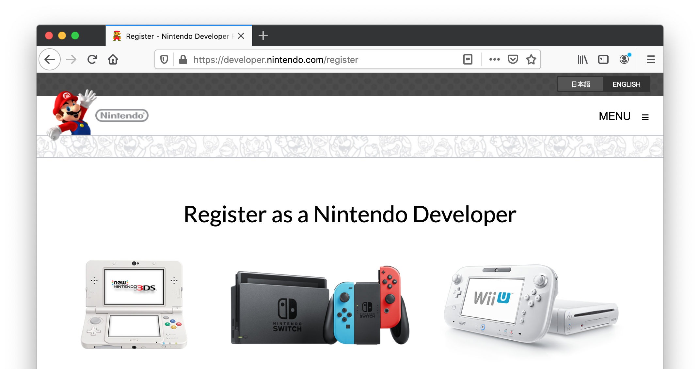

# Tworzenie gier na Nintendo Switch

Ze względu na ograniczenia licencyjne Nintendo dostęp do wersji Defold z obsługą platformy Nintendo Switch nie jest częścią standardowej wersji Defold. Aby uzyskać dostęp do wersji Defold z obsługą Nintendo Switch, musisz zostać zatwierdzonym twórcą gier na Nintendo Switch.

## Rejestracja jako twórca Nintendo Switch

Możesz zarejestrować się jako twórca gier na Nintendo Switch w [Nintendo Developer Portal](https://developer.nintendo.com/register):

Gdy Nintendo zatwierdzi Twoje zgłoszenie, uzyskasz dostęp do strony Tools and Middleware w Nintendo Developer Portal, gdzie możesz zgłosić się po dostęp do Defold. Po zarejestrowaniu dostępu do Defold otrzymamy od Nintendo wiadomość e-mail potwierdzającą, że jesteś zarejestrowanym twórcą Nintendo Switch.

## Dostęp do Nintendo Switch w Defold

Gdy potwierdzimy, że masz status zatwierdzonego twórcy Nintendo Switch, zapewnimy Ci dostęp do następujących elementów:

* Dostęp do kodu źródłowego rozszerzenia Nintendo Switch z integracjami API specyficznymi dla konsoli.
* Dostęp do kodu źródłowego wersji silnika Defold z obsługą Nintendo Switch. Zwróć uwagę, że dostęp do kodu źródłowego nie jest wymagany do tworzenia gier na Nintendo Switch, ale udostępniamy go na wypadek, gdybyś chciał wnieść własny wkład w kod źródłowy silnika.
* [Narzędzie wiersza poleceń](/manuals/bob) z obsługą tworzenia pakietów na platformę Nintendo Switch. Tworzenie pakietów z edytora Defold nie jest obsługiwane.
* Forum, na którym możesz uzyskać pomoc dotyczącą Nintendo Switch.

## FAQ
:[FAQ dotyczące konsol](../shared/consoles-faq.md)
