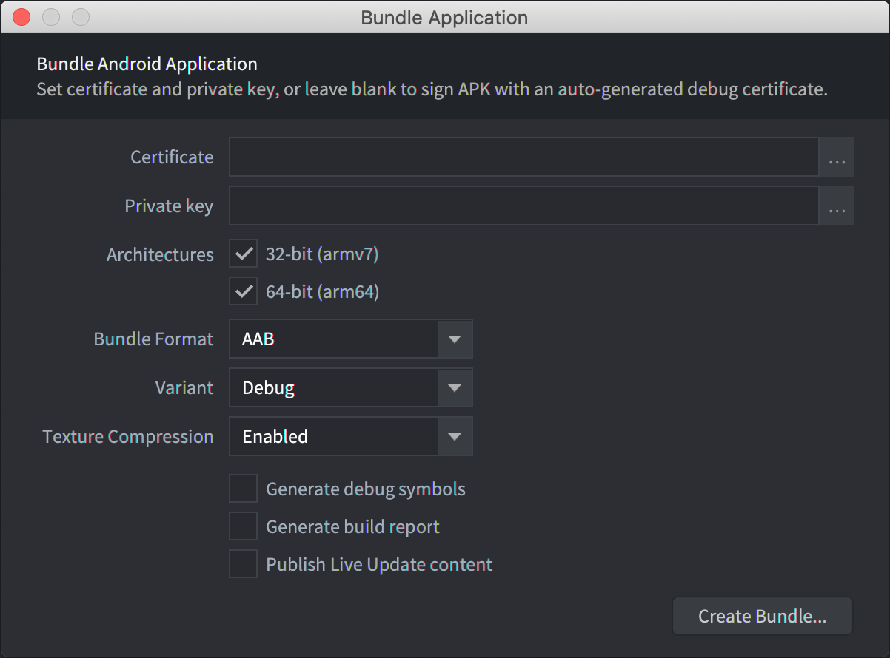

# Optymalizacja rozmiaru gry

Rozmiar gry może mieć kluczowe znaczenie dla platform takich jak sieć i urządzenia mobilne, natomiast na komputerach stacjonarnych i konsolach ma mniejsze znaczenie, ponieważ miejsce na dysku jest tam tańsze i zwykle dostępne w dużej ilości.

### iOS i Android
Apple i Google zdefiniowały limity rozmiaru aplikacji podczas pobierania przez sieci komórkowe, w przeciwieństwie do pobierania przez Wi-Fi. W przypadku Androida limit wynosi 200 MB dla aplikacji publikowanych jako [app bundles](https://developer.android.com/guide/app-bundle#size_restrictions). Na iOS użytkownik zobaczy ostrzeżenie, jeśli aplikacja ma więcej niż 200 MB, ale nadal będzie mógł rozpocząć pobieranie.

::: sidenote
Według badania z 2017 roku wykazano, że „na każde zwiększenie rozmiaru APK o 6 MB obserwujemy spadek współczynnika konwersji instalacji o 1%”. ([źródło](https://medium.com/googleplaydev/shrinking-apks-growing-installs-5d3fcba23ce2))
:::

### HTML5
Poki i wiele innych platform z grami webowymi zaleca, aby początkowe pobieranie nie przekraczało 5 MB.

Facebook zaleca, aby gra Facebook Instant Game uruchamiała się w mniej niż 5 sekund, a najlepiej w mniej niż 3 sekundy. Co to oznacza w praktyce dla rozmiaru aplikacji, nie jest jasno zdefiniowane, ale mowa tu o rozmiarach rzędu do 20 MB.

Reklamy grywalne są zwykle ograniczone do przedziału od 2 do 5 MB, zależnie od sieci reklamowej.

## Strategie optymalizacji rozmiaru
Rozmiar aplikacji można optymalizować na dwa sposoby: zmniejszając rozmiar silnika lub zmniejszając rozmiar zasobów gry.

Aby lepiej zrozumieć, z czego składa się rozmiar aplikacji, podczas bundlowania możesz [wygenerować raport budowania](/manuals/bundling/#build-reports). Bardzo często to dźwięki i grafika zajmują większość miejsca w każdej grze.

::: important
Podczas budowania i bundlowania aplikacji Defold tworzy drzewo zależności. System budowania zaczyna od kolekcji bootstrapowej wskazanej w pliku *game.project* i analizuje każdą odwołaną kolekcję, obiekt gry oraz komponent, aby utworzyć listę używanych zasobów. Tylko te zasoby zostaną dołączone do końcowego bundla aplikacji. Wszystko, co nie jest bezpośrednio odwołane, zostanie wykluczone. Warto wiedzieć, że nieużywane zasoby nie trafią do aplikacji, ale jako programista nadal musisz brać pod uwagę to, co ostatecznie znajdzie się w aplikacji, rozmiar pojedynczych zasobów oraz łączny rozmiar bundla aplikacji.
:::

## Optymalizacja rozmiaru silnika
Szybkim sposobem na zmniejszenie rozmiaru silnika jest usunięcie funkcjonalności, z których nie korzystasz. Służy do tego [plik manifestu aplikacji](https://defold.com/manuals/app-manifest/), w którym można usunąć niepotrzebne komponenty silnika. Przykłady:

* Physics - jeśli twoja gra nie korzysta z fizyki Box2D ani Bullet3D, zdecydowanie zaleca się usunięcie tych silników fizyki
* LiveUpdate - jeśli twoja gra nie korzysta z LiveUpdate, można ją usunąć
* Image loaded - jeśli twoja gra nie wczytuje i nie dekoduje obrazów ręcznie za pomocą `image.load()`
* BasisU - jeśli twoja gra ma niewiele tekstur, porównaj rozmiar builda bez BasisU (usuniętego przez app manifest) i bez kompresji tekstur z buildem z BasisU i skompresowanymi teksturami. W przypadku gier z ograniczoną liczbą tekstur bardziej opłacalne może być zmniejszenie rozmiaru binarnego i pominięcie kompresji tekstur. Dodatkowo rezygnacja z transkodera może zmniejszyć ilość pamięci potrzebnej do uruchomienia gry.

## Optymalizacja rozmiaru zasobów
Największe korzyści z optymalizacji rozmiaru zasobów zwykle daje zmniejszenie rozmiaru dźwięków i tekstur.

### Optymalizacja dźwięków
Defold obsługuje następujące formaty:
* .wav
* .ogg
* .opus

Pliki dźwiękowe muszą korzystać z 16-bitowych próbek.
Dekodery dźwięku będą automatycznie podnosić lub obniżać częstotliwość próbkowania w zależności od potrzeb bieżącego urządzenia audio.

Krótsze dźwięki, takie jak efekty dźwiękowe, są zwykle mocniej kompresowane, natomiast pliki muzyczne mają mniejszą kompresję.
Defold nie wykonuje kompresji, więc programista musi zadbać o nią osobno dla każdego formatu audio.

Możesz edytować dźwięki w zewnętrznym programie do edycji audio albo z wiersza poleceń, na przykład przy użyciu [ffmpeg](https://ffmpeg.org), aby zmniejszyć jakość albo przekonwertować pliki między formatami. Warto też rozważyć konwersję dźwięków ze stereo do mono, aby dodatkowo zmniejszyć rozmiar zawartości.

### Optymalizacja tekstur
Masz kilka możliwości optymalizacji tekstur używanych przez grę, ale pierwszą rzeczą, którą należy zrobić, jest sprawdzenie rozmiaru obrazów dodawanych do atlasu albo używanych jako źródło kafelków. Nigdy nie należy używać obrazów większych niż rzeczywiście potrzebne w grze. Importowanie dużych obrazów i skalowanie ich w dół do odpowiedniego rozmiaru to marnowanie pamięci tekstur i należy tego unikać. Zacznij od dopasowania rozmiaru obrazów w zewnętrznym programie do edycji grafiki do rzeczywistego rozmiaru potrzebnego w grze. W przypadku takich elementów jak obrazy tła czasem można też użyć małego obrazu i przeskalować go w górę do pożądanego rozmiaru. Gdy obrazy mają już właściwy rozmiar i zostały dodane do atlasów albo użyte jako źródła kafelków, trzeba też uwzględnić rozmiar samych atlasów. Maksymalny rozmiar atlasu, którego można użyć, różni się zależnie od platformy i sprzętu graficznego.

::: sidenote
[Ten wpis na forum](https://forum.defold.com/t/texture-management-in-defold/8921/17?u=britzl) podaje kilka wskazówek, jak zmieniać rozmiar wielu obrazów przy użyciu skryptów albo oprogramowania firm trzecich.
:::

* Maksymalny rozmiar tekstury dla HTML5, zgłoszony do [projektu Web3D Survey](https://web3dsurvey.com/webgl/parameters/MAX_TEXTURE_SIZE)
* Maksymalny rozmiar tekstury na iOS:
  * iPad: 2048x2048
  * iPhone 4: 2048x2048
  * iPad 2, 3, Mini, Air, Pro: 4096x4096
  * iPhone 4s, 5, 6+, 6s: 4096x4096
* Maksymalny rozmiar tekstury na Androidzie bardzo się różni, ale ogólnie wszystkie względnie nowe urządzenia obsługują co najmniej 4096x4096.

Jeśli atlas jest zbyt duży, trzeba go albo podzielić na kilka mniejszych atlasów, albo użyć atlasów wielostronicowych, albo przeskalować cały atlas za pomocą profilu tekstur. System profili tekstur w Defold pozwala nie tylko skalować całe atlasy, ale też stosować algorytmy kompresji, aby zmniejszyć rozmiar atlasu na dysku. Więcej informacji o profilach tekstur znajdziesz w [instrukcji](/manuals/texture-profiles/). Jeśli nie wiesz, od czego zacząć, spróbuj tych ustawień jako punktu wyjścia do dalszych dostosowań:

* mipmaps: false
* premultiply_alpha: true
* format: TEXTURE_FORMAT_RGBA
* compression_level: NORMAL
* compression_type: COMPRESSION_TYPE_BASIS_UASTC

::: sidenote
Więcej informacji o optymalizacji i zarządzaniu teksturami znajdziesz w [tym wpisie na forum](https://forum.defold.com/t/texture-management-in-defold/8921).
:::

### Optymalizacja czcionek
Rozmiar czcionek będzie mniejszy, jeśli określisz, jakich znaków zamierzasz używać, i ustawisz to w [Characters](/manuals/font/#properties) zamiast zaznaczać pole wyboru All Chars.

### Wykluczanie zawartości pobieranej na żądanie
Innym sposobem na zmniejszenie początkowego rozmiaru aplikacji jest wykluczenie części zawartości gry z bundla aplikacji i pobieranie jej na żądanie. Defold udostępnia system Live Update służący do wykluczania zawartości pobieranej na żądanie.

Wykluczona zawartość może obejmować wszystko, od całych poziomów po odblokowywane postacie, skórki, bronie lub pojazdy. Jeśli twoja gra ma dużo zawartości, zorganizuj proces ładowania tak, aby kolekcja bootstrapowa i kolekcja pierwszego poziomu zawierały tylko absolutne minimum zasobów wymaganych dla tego poziomu. Osiąga się to za pomocą pełnomocników kolekcji lub fabryk z zaznaczonym polem wyboru "Exclude". Podziel zasoby zgodnie z postępem gracza. Takie podejście zapewnia wydajne ładowanie zasobów i utrzymuje niskie początkowe zużycie pamięci. Więcej informacji znajdziesz w [instrukcji Live Update](/manuals/live-update/).

## Optymalizacje rozmiaru specyficzne dla Androida
Kompilacje na Androida muszą obsługiwać zarówno 32-bitowe, jak i 64-bitowe architektury CPU. Podczas [bundlowania dla Androida](/manuals/android) możesz określić, które architektury CPU mają zostać uwzględnione:

Google Play obsługuje [wiele APK](https://developer.android.com/google/play/publishing/multiple-apks) dla jednego wydania gry, co oznacza, że możesz zmniejszyć rozmiar aplikacji, generując dwa APK, po jednym dla każdej architektury CPU, i przesyłając oba do Google Play.

Możesz też skorzystać z połączenia [APK Expansion Files](https://developer.android.com/google/play/expansion-files) oraz zawartości [Live Update](/manuals/live-update) dzięki rozszerzeniu [APKX](https://defold.com/assets/apkx/) w Asset Portal.
