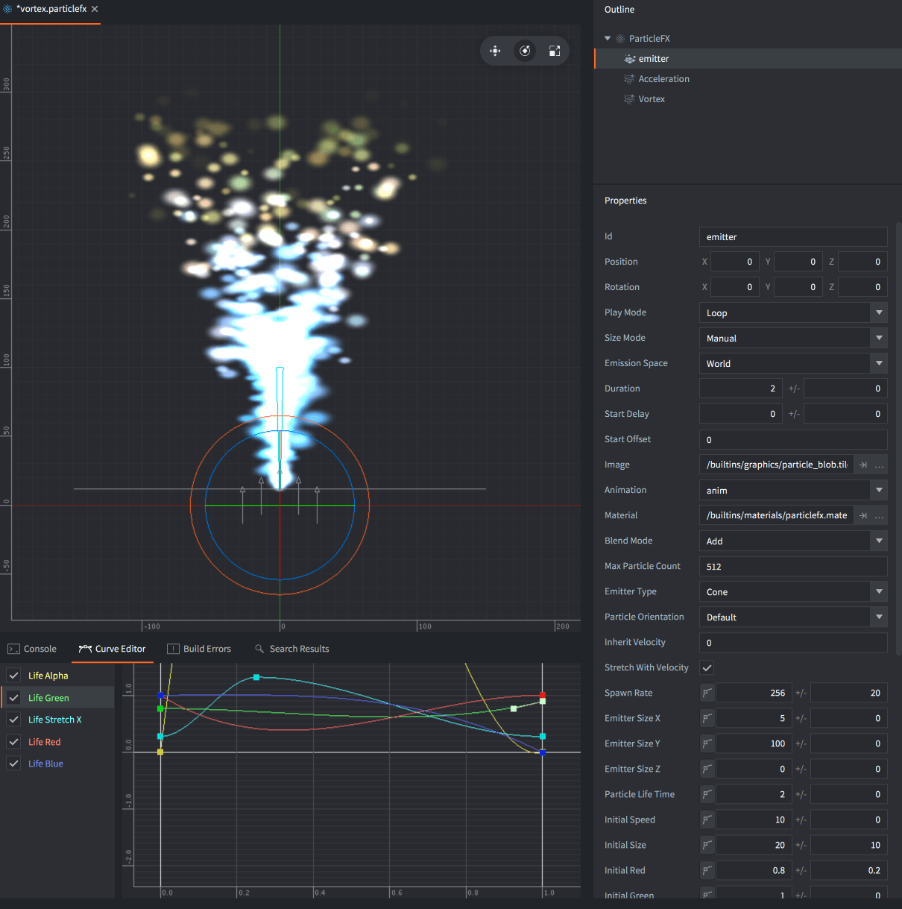
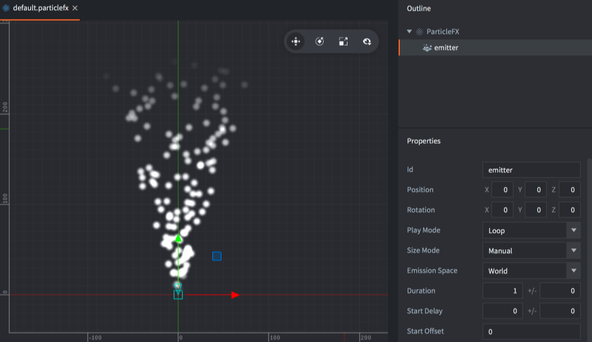
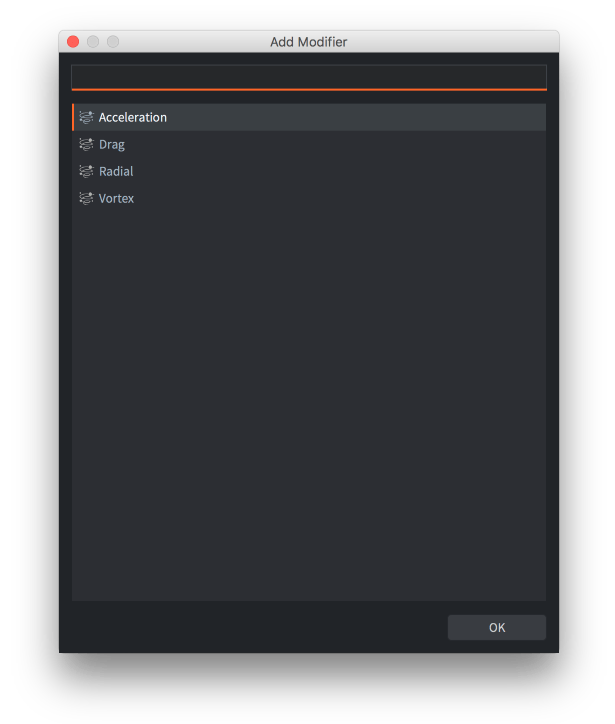
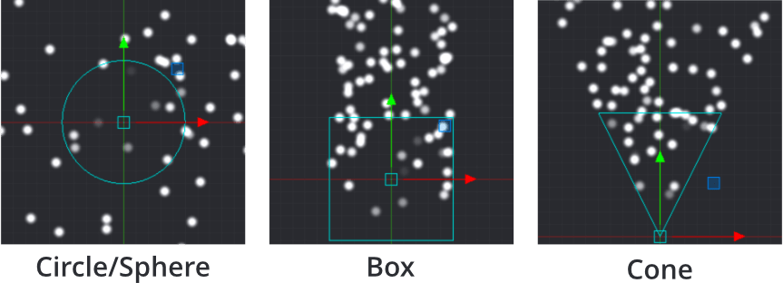
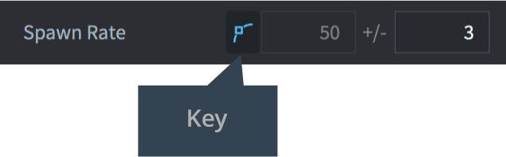
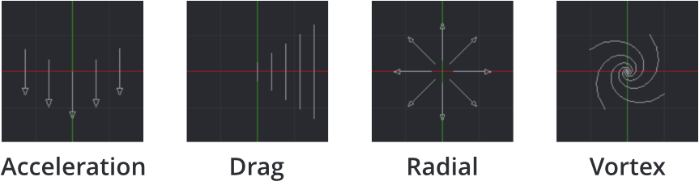

# Efekty cząsteczkowe (Particle FX)

Efekty cząsteczkowe (ang. particle effects) to wydajne elementy wizualne złożone z wielu powtarzalnych lub nie elementów (cząsteczek) i służą do wizualnego wzbogacania gier. Możesz ich używać do tworzenia eksplozji, rozprysku krwi, śladów, efektów pogodowych i wielu innych.



Efekty cząsteczkowe składają się z wielu emiterów (emitters) i opcjonalnych modyfikatorów (modifiers):

Emitter
: Emiter to umieszczony w przestrzeni kształt, który emituje cząsteczki równomiernie rozłożone na powierzchni tego kształtu. Emiter zawiera właściwości, które kontrolują generowanie cząsteczek oraz obraz lub animację, czas życia, kolor, kształt i prędkość poszczególnych cząstek.

Modifier
: Modyfikator wpływa na prędkość generowanych cząsteczek, sprawiając, że przyspieszają lub zwalniają w określonym kierunku, poruszają się promieniowo lub krążą wokół punktu. Modyfikatory mogą wpływać na pojedyncze cząsteczki jednego lub każdego emitera.

## Tworzenie efektu cząsteczkowego

Wybierz opcję <kbd>New... ▸ Particle FX</kbd> z menu kontekstowego w panelu *Assets*. Nadaj nowemu plikowi efektu cząsteczkowego nazwę. Edytor zostanie teraz otwarty w pliku z użyciem [Edytora Sceny](/manuals/editor/#the-scene-editor).

W panelu *Outline* wyświetlany jest domyślny emiter. Wybierz emiter, aby wyświetlić jego właściwości w dolnym panelu *Properties* (Właściwości).



Aby dodać nowy emiter do efektu, <kbd>kliknij prawym przyciskiem myszy</kbd> na korzeniu (root) w panelu *Outline* i wybierz <kbd>Add Emitter ▸ [type]</kbd> z menu kontekstowego. Zauważ, że można nawet później zmienić typ emitera w jego właściwościach.

Aby dodać nowy modyfikator, <kbd>kliknij prawym przyciskiem myszy</kbd> w miejscu modyfikatora w panelu *Outline* (korzeń efektu lub konkretny emiter) i wybierz <kbd>Add Modifier</kbd>, a następnie wybierz typ modyfikatora.




Modyfikator osadzony na korzeniu efektu (nie jest dzieckiem emitera) wpływa na wszystkie cząsteczki w efekcie.

Modyfikator, który jest dodany jako dziecko emitera, wpływa tylko na cząsteczki tego emitera.

## Podgląd efektu

* Wybierz opcję <kbd>View ▸ Play</kbd> z menu, aby zobaczyć podgląd efektu. Być może będziesz musiał oddalić kamerę, aby właściwie zobaczyć efekt.
* Wybierz ponownie <kbd>View ▸ Play</kbd>, aby zapauzować efekt.
* Wybierz <kbd>View ▸ Stop</kbd> aby zatrzymać efekt. Ponowne uruchomienie go rozpoczyna od jego stanu początkowego.

Podczas edytowania emitera lub modyfikatora, wynik jest natychmiast widoczny w edytorze, nawet gdy efekt jest zatrzymany:


## Właściwości emitera

Id
: Identyfikator emitera (używany przy ustawianiu stałych renderowania dla określonych emiterów).

Position/Rotation
: Transformacja emitera względem komponentu ParticleFX.

Play Mode
: Tryb Odtwarzania - kontroluje sposób odtwarzania emitera:
  - `Once` zatrzymuje emitera po osiągnięciu swojego czasu trwania.
  - `Loop` ponownie uruchamia emitera po osiągnięciu czasu trwania.

Size Mode
: Tryb Rozmiaru - kontroluje, jak będą skalowane animacje poklatkowe atlasu:
  - `Auto` - Automatyczny - zachowuje rozmiar każdej klatki animacji atlasu zgodnie z obrazem źródłowym.
  - `Manual` - Manualny - ustawia rozmiar cząsteczki zgodnie z właściwością rozmiaru.

Emission Space
: Przestrzeń Emisji - w jakiej przestrzeni będą istniały generowane cząsteczki:
  - `World` - Przestrzeń Świata - przemieszcza cząsteczki niezależnie od emitera.
  - `Emitter` - Przestrzeń Emitera przemieszcza cząsteczki względem emitera.

Duration
: Czas Trwania - liczba sekund, przez które emiter powinien emitować cząsteczki.

Start Delay
: Opóźnienie Początku Emitowania - liczba sekund, na którą emiter powinien poczekać przed emisją cząsteczek.

Start Offset
: Odsunięcie Początku Emitowania - liczba sekund, po której symulacji cząsteczki emiter powinien rozpocząć, innymi słowy, jak długo emiter powinien "rozgrzewać" efekt.

Image
: Plik obrazu (Źródło Kafelków lub Atlas), który ma służyć do teksturyzacji i animacji cząsteczek.

Animation
: Animacja z pliku *Image*, która ma być używana na cząsteczkach.

Material
: Materiał do użycia do cieniowania (shading) cząsteczek.

Blend Mode
: Dostępne tryby mieszania to `Alpha`, `Add` i `Multiply`.

Max Particle Count
Maksymalna Liczba Cząsteczek - liczba cząstek pochodzących z tego emitera, która może istnieć jednocześnie.

Emitter Type
: Typ kształtu emitera
  - `Circle` - Koło - emituje cząsteczki z losowej lokalizacji wewnątrz koła. Cząsteczki są skierowane na zewnątrz od centrum. Średnicę koła definiuje *Emitter Size X*.

  - `2D Cone` - Stożek 2D - emituje cząsteczki z losowej lokalizacji wewnątrz płaskiego stożka (trójkąta). Cząsteczki są skierowane do góry stożka. *Emitter Size X* definiuje szerokość góry, a *Emitter Size Y* definiuje wysokość.

  - `Box` - Sześcian - emituje cząsteczki z losowej lokalizacji wewnątrz sześcianu. Cząsteczki są skierowane w górę wzdłuż osi Y sześcianu. *Emitter Size X*, *Y* i *Z* definiują odpowiednio szerokość, wysokość i głębokość. Dla prostokąta 2D zachowaj rozmiar Z na zero.

  - `Sphere` - Sfera - emituje cząsteczki z losowej lokalizacji wewnątrz kuli. Cząsteczki są skierowane na zewnątrz od centrum. Średnicę kuli definiuje *Emitter Size X*.

  - `Cone` - Stożek - emituje cząsteczki z losowej lokalizacji wewnątrz stożka 3D. Cząsteczki kierują się na zewnątrz przez szeroki dysk stożka. *Emitter Size X* definiuje średnicę szerokiego dysku, a *Emitter Size Y* definiuje wysokość stożka.

  

Particle Orientation
: Orientacja Cząsteczek - jak są ustawione cząsteczki emitowane:
  - `Default` - Domyślna - ustawia orientację na orientację jednostkową.
  - `Initial Direction` - Początkowy Kierunek - zachowuje początkową orientację emitowanych cząsteczk.
  - `Movement Direction` - Kierunek Ruchu - dostosowuje orientację cząsteczek zgodnie z ich prędkością.

Inherit Velocity
: Dziedziczenie Prędkości - skalowany współczynnik, który określa, ile cząsteczki powinny dziedziczyć z prędkości emitera. Ta wartość jest dostępna tylko wtedy, gdy *Emission Space* jest ustawiona na `World`. Prędkość emitera jest obliczana co klatkę.

Stretch With Velocity
Rozciągnięcie z Prędkością - zaznacz, aby skalować rozciągnięcie cząsteczek w kierunku ruchu.

### Tryby Mieszania
:[Tryby Mieszania - blend-modes](../shared/blend-modes.md)

## Kluczowe właściwości emitera

Te właściwości mają dwa pola: wartość (value) i rozprzestrzenienie (spread). Rozprzestrzenienie to zmienna losowa, która jest stosowana losowo dla każdej wygenerowanej cząsteczki. Na przykład, jeśli wartość wynosi 50, a rozprzestrzenienie wynosi 3, każda wygenerowana cząsteczka otrzyma wartość między 47 a 53 (50 +/- 3).


Zaznaczając przycisk klucza (key button), wartość właściwości jest kontrolowana za pomocą krzywej w trakcie trwania emitera. Aby zresetować właściwość z klucza, odznacz przycisk klucza.



Edytor Krzywej *Curve Editor* (dostępny w zakładkach w dolnym widoku) służy do modyfikacji krzywej. Właściwości z kluczem nie mogą być edytowane w widoku *Properties* , tylko w Edytorze Krzywej właśnie. <kbd>Kliknij i przeciągnij</kbd> punkty i styczne, aby zmodyfikować kształt krzywej. <kbd>Podwójne kliknięcie</kbd> na krzywej dodaje punkty kontrolne. Aby usunąć punkt kontrolny, podwójnie kliknij na niego.


Aby automatycznie przybliżyć Edytor Krzywej w celu wyświetlenia wszystkich krzywych, naciśnij <kbd>F</kbd>.

Następujące właściwości można regulować w czasie trwania emitera:

Spawn Rate
: Częstotliwość Emisji - liczba cząsteczek do wyemitowania na sekundę.

Emitter Size X/Y/Z
: Rozmiar Emitera X/Y/Z - wymiary kształtu emitera, zobacz szczegóły prz opisie *Emitter Type* powyżej.

Particle Life Time
: Czas Życia Cząsteczki - długość życia każdej wyemitowanej cząsteczki, w sekundach.

Initial Speed
: Początkowa Prędkość każdej wyemitowanej cząsteczki.

Initial Size
: Początkowy Rozmiar każdej wyemitowanej cząsteczki. Jeśli ustawisz Tryb Rozmiaru *Size Mode* na `Automatic` i użyjesz animacji atlasu jako źródła obrazu, to właściwość ta jest ignorowana.

Initial Red/Green/Blue/Alpha
: Początkowe wartości składowych koloru dla cząsteczek, odpowiednio: Czerwony, Zielony, Niebieski, Alfa.

Initial Rotation
: Początkowe wartości obrotu (w stopniach) dla cząsteczek.

Initial Stretch X/Y
: Początkowe wartości rozciągnięcia (w jednostkach) dla cząsteczek.

Initial Angular Velocity
: Początkowa prędkość kątowa (w stopniach/sekundę) każdej wyemitowanej cząsteczki.

Następujące właściwości można regulować w trakcie życia cząsteczek:

Life Scale
: Skala - wartość skali w trakcie życia każdej cząsteczki.

Life Red/Green/Blue/Alpha
: Wartość odcienia koloru w trakcie życia każdej cząsteczki, odpowiednio: Czerwony, Zielony, Niebieski, Alfa.

Life Rotation
: Wartość obrotu (w stopniach) w trakcie życia każdej cząsteczki.

Life Stretch X/Y
: Wartość rozciągnięcia (w jednostkach) w trakcie życia każdej cząsteczki.

Life Angular Velocity
: Prędkość kątowa (w stopniach/sekundę) w trakcie życia każdej cząsteczki.

## Modyfikatory

Dostępne są cztery rodzaje modyfikatorów, które wpływają na prędkość cząsteczek:

`Acceleration`
: Przyspieszenie w ogólnym kierunku.

`Drag`
: Opór - zmniejsza przyspieszenie cząsteczek proporcjonalnie do prędkości cząsteczki.

`Radial`
: Przyciąga lub odpycha cząsteczki w kierunku lub z dala od określonej pozycji dookoła.

`Vortex`
: Wir - wpływa na cząsteczki w kierunku okręgu lub spiralnie wokół swojej pozycji.

  

## Właściwości Modyfikatora

Position/Rotation
: Pozycja/Obrót - transformacja modyfikatora względem swojego rodzica.

Magnitude
: Wielkość wpływy modyfikatora na cząsteczki.

Max Distance
: Maksymalna odległość, w jakiej cząsteczki są w ogóle brane pod uwagę przez ten modyfikator. Dotyczy tylko modyfikatorów Radial i Vortex.

## Kontrola efektu cząsteczkowego

Aby uruchomić i zatrzymać efekt cząsteczkowy z poziomu skryptu:

```lua
-- uruchom komponent efektu "cząsteczki" w bieżącym obiekcie gry
particlefx.play("#particles")

-- zatrzymaj komponent efektu "cząsteczki" w bieżącym obiekcie gry
particlefx.stop("#particles")
```

Aby uruchomić i zatrzymać efekt cząsteczkowy z poziomu skryptu GUI zobacz: [instrukcję dla GUI Particle FX](/manuals/gui-particlefx#controlling-the-effect).

::: sidenote
Efekt cząsteczkowy będzie nadal emitować cząsteczki nawet wtedy, gdy obiekt gry, do którego należy komponent efektu cząsteczkowego, zostanie usunięty.
:::

Zobacz szczegóły w [dokumentacji Efektów Cząsteczkowych]](/ref/particlefx).

## Stałe materiału

Domyślny materiał Efektu cząsteczkowego posiada następujące stałe, które można zmieniać za pomocą `particlefx.set_constant()` i resetować za pomocą `particlefx.reset_constant()` (zobacz szczegóły w [instrukcji do Materiałów](/manuals/material/#vertex-and-fragment-constants)):

`tint`
: Kolor odcienia efektu cząsteczkowego (`vector4`). Wektor 4-składnikowy jest używany do reprezentowania odcienia koloru, gdzie X, Y, Z i W odpowiadają czerwieni, zieleni, niebieskiemu i odcieniowi alfa. Więcej szczegółów w [dokumentacji API](/ref/particlefx/#particlefx.set_constant:url-constant-value).

## Konfiguracja projektu

Plik *game.project* zawiera kilka [ustawień projektu związanych z cząsteczkami](/manuals/project-settings#particle-fx).
