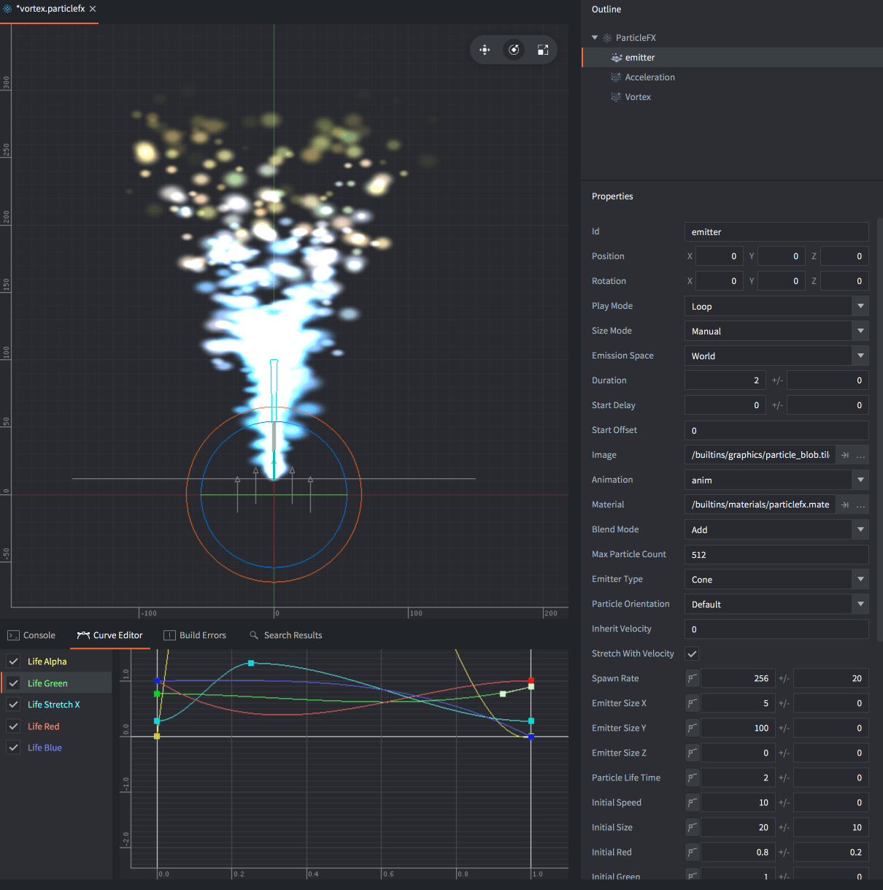
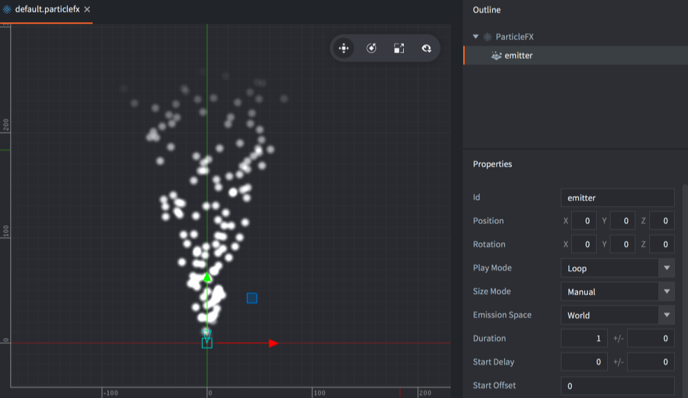
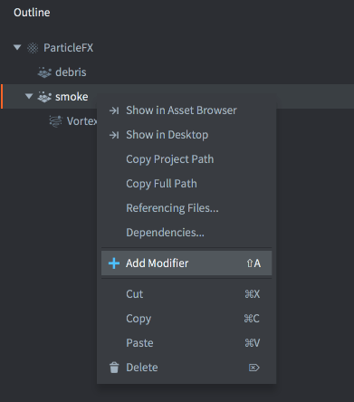
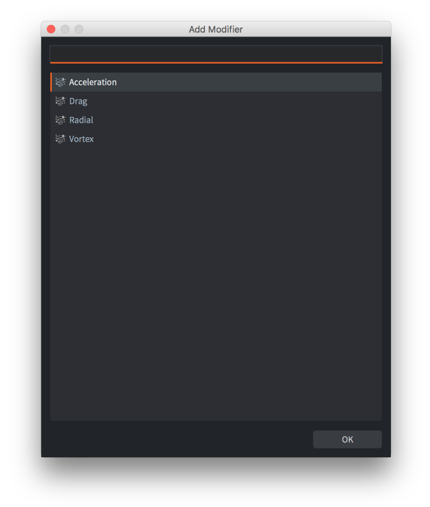
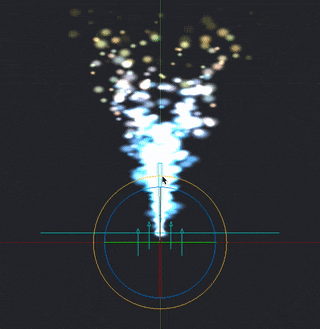
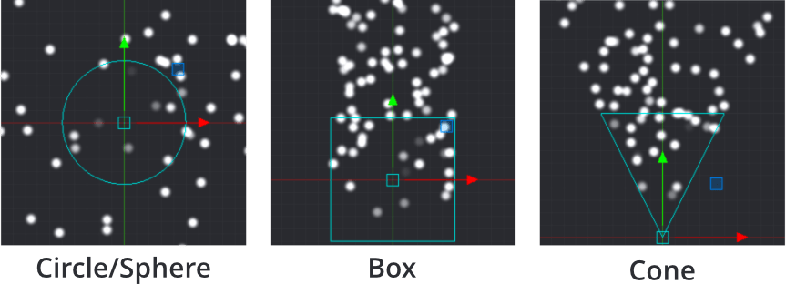
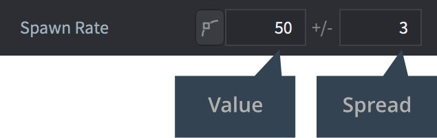
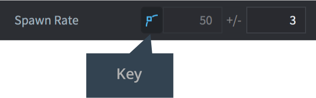
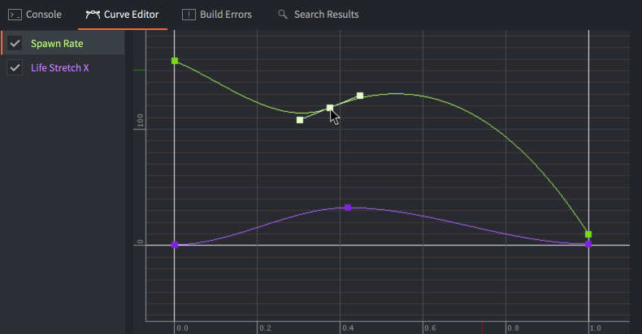
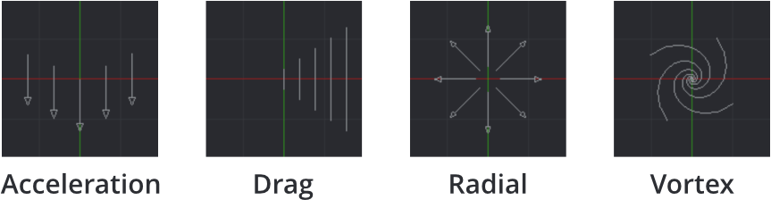

# Particle FX

Efekty cząsteczkowe służą do wizualnego wzbogacania gier. Możesz ich używać do tworzenia eksplozji, rozprysków krwi, smug, efektów pogodowych lub innych efektów.



Efekty cząsteczkowe składają się z kilku emitterów i opcjonalnych modifierów:

Emitter
: Emitter to umieszczony w przestrzeni kształt, który emituje cząsteczki równomiernie rozłożone na jego powierzchni. Emitter zawiera właściwości sterujące generowaniem cząsteczek, a także obraz lub animację, czas życia, kolor, kształt i prędkość poszczególnych cząsteczek.

Modifier
: Modifier wpływa na prędkość wyemitowanych cząsteczek, dzięki czemu mogą przyspieszać lub zwalniać w określonym kierunku, poruszać się promieniowo albo wirować wokół punktu. Modifiery mogą działać na cząsteczki jednego emitera albo na cząsteczki całego efektu.

## Tworzenie efektu

Wybierz <kbd>New... ▸ Particle FX</kbd> z menu kontekstowego w panelu *Assets*. Nadaj nowemu plikowi efektu nazwę. Edytor otworzy plik w [Scene Editor](/manuals/editor/#the-scene-editor).

Panel *Outline* pokazuje domyślny emitter. Zaznacz emitter, aby wyświetlić jego właściwości w panelu *Properties* poniżej.



Aby dodać nowy emitter do efektu, <kbd>right click</kbd> root panelu *Outline* i wybierz <kbd>Add Emitter ▸ [type]</kbd> z menu kontekstowego. Możesz później zmienić typ emitera w jego właściwościach.

Aby dodać nowy modifier, <kbd>right click</kbd> miejsce w panelu *Outline*, w którym ma się on znaleźć (root efektu albo konkretny emitter), i wybierz <kbd>Add Modifier</kbd>, a następnie typ modifiera.





Modifier umieszczony na rootcie efektu, a nie jako dziecko emitera, wpływa na wszystkie cząsteczki w efekcie.

Modifier dodany jako dziecko emitera wpływa tylko na cząsteczki tego emitera.

## Podgląd efektu

* Wybierz <kbd>View ▸ Play</kbd> z menu, aby podejrzeć efekt. Może być konieczne oddalenie kamery, żeby zobaczyć efekt poprawnie.
* Wybierz ponownie <kbd>View ▸ Play</kbd>, aby wstrzymać efekt.
* Wybierz <kbd>View ▸ Stop</kbd>, aby zatrzymać efekt. Ponowne uruchomienie zaczyna go od stanu początkowego.

Podczas edytowania emitera albo modifiera wynik jest od razu widoczny w edytorze, nawet jeśli efekt jest wstrzymany:



## Emitter properties

Id
: Identyfikator emitera, używany przy ustawianiu render constants dla konkretnych emitterów.

Position/Rotation
: Transform emitera względem komponentu ParticleFX.

Play Mode
: Określa sposób odtwarzania emitera:
  - `Once` zatrzymuje emitter po osiągnięciu czasu trwania.
  - `Loop` restartuje emitter po osiągnięciu czasu trwania.

Size Mode
: Określa sposób skalowania animacji flipbook:
  - `Auto` zachowuje rozmiar każdej klatki flipbooka zgodny z obrazem źródłowym.
  - `Manual` ustawia rozmiar cząsteczki zgodnie z właściwością size.

Emission Space
: Określa przestrzeń geometryczną, w której będą istnieć wyemitowane cząsteczki:
  - `World` sprawia, że cząsteczki poruszają się niezależnie od emitera.
  - `Emitter` sprawia, że cząsteczki poruszają się względem emitera.

Duration
: Liczba sekund, przez które emitter powinien emitować cząsteczki.

Start Delay
: Liczba sekund, jaką emitter powinien odczekać przed rozpoczęciem emisji cząsteczek.

Start Offset
: Liczba sekund symulacji cząsteczek, od których emitter ma zacząć, czyli inaczej czas, przez jaki emitter powinien wstępnie rozgrzać efekt.

Image
: Plik obrazu, czyli Tile source albo Atlas, używany do teksturowania i animowania cząsteczek.

Animation
: Animacja z pliku *Image*, która ma być używana na cząsteczkach.

Material
: Materiał używany do cieniowania cząsteczek.

Blend Mode
: Dostępne tryby mieszania to `Alpha`, `Add` i `Multiply`.

Max Particle Count
: Liczba cząsteczek pochodzących z tego emitera, które mogą istnieć jednocześnie.

Emitter Type
: Kształt emitera:
  - `Circle` emituje cząsteczki z losowego miejsca wewnątrz koła. Cząsteczki są kierowane na zewnątrz od środka. Średnicę koła określa *Emitter Size X*.

  - `2D Cone` emituje cząsteczki z losowego miejsca wewnątrz płaskiego stożka (trójkąta). Cząsteczki są kierowane na zewnątrz z górnej części stożka. *Emitter Size X* określa szerokość górnej części, a *Y* określa wysokość.

  - `Box` emituje cząsteczki z losowego miejsca wewnątrz pudełka. Cząsteczki są kierowane w górę wzdłuż lokalnej osi Y pudełka. *Emitter Size X*, *Y* i *Z* określają odpowiednio szerokość, wysokość i głębokość. W przypadku prostokąta 2D ustaw rozmiar Z na zero.

  - `Sphere` emituje cząsteczki z losowego miejsca wewnątrz sfery. Cząsteczki są kierowane na zewnątrz od środka. Średnicę sfery określa *Emitter Size X*.

  - `Cone` emituje cząsteczki z losowego miejsca wewnątrz stożka 3D. Cząsteczki są kierowane na zewnątrz przez górny dysk stożka. *Emitter Size X* określa średnicę górnego dysku, a *Y* określa wysokość stożka.

  

Particle Orientation
: Sposób orientacji wyemitowanych cząsteczek:
  - `Default` ustawia orientację na jednostkową.
  - `Initial Direction` zachowuje początkową orientację wyemitowanych cząsteczek.
  - `Movement Direction` dostosowuje orientację cząsteczek do ich prędkości.

Inherit Velocity
: Wartość skali określająca, ile prędkości emitera mają odziedziczyć cząsteczki. Ta wartość jest dostępna tylko wtedy, gdy *Space* jest ustawione na `World`. Prędkość emitera jest szacowana w każdej klatce.

Stretch With Velocity
: Zaznacz, aby skalować rozciągnięcie każdej cząsteczki w kierunku ruchu.

### Blend modes
:[blend-modes](../shared/blend-modes.md)

## Keyable emitter properties

Te właściwości mają dwa pola: wartość i spread. Spread to odchylenie stosowane losowo do każdej wyemitowanej cząsteczki. Na przykład, jeśli wartość wynosi 50, a spread 3, każda wyemitowana cząsteczka otrzyma wartość od 47 do 53 (50 +/- 3).



Po zaznaczeniu przycisku key wartością właściwości steruje krzywa w czasie trwania emitera. Aby zresetować właściwość z kluczem, odznacz przycisk key.



The *Curve Editor* (dostępny w zakładkach w dolnym widoku) służy do modyfikowania krzywej. Właściwości z kluczem nie można edytować w widoku *Properties*, tylko w *Curve Editor*. <kbd>Click and drag</kbd> punkty i styczne, aby zmienić kształt krzywej. <kbd>Double-click</kbd> na krzywej dodaje punkty kontrolne. Aby usunąć punkt kontrolny, <kbd>double click</kbd> go.



Aby automatycznie dopasować Curve Editor do wszystkich krzywych, naciśnij <kbd>F</kbd>.

Poniższe właściwości można kluczować w czasie trwania emitera:

Spawn Rate
: Liczba cząsteczek emitowanych na sekundę.

Emitter Size X/Y/Z
: Wymiary kształtu emitera, zobacz *Emitter Type* powyżej.

Particle Life Time
: Czas życia każdej wyemitowanej cząsteczki, w sekundach.

Initial Speed
: Początkowa prędkość każdej wyemitowanej cząsteczki.

Initial Size
: Początkowy rozmiar każdej wyemitowanej cząsteczki. Jeśli ustawisz *Size Mode* na `Auto` i użyjesz animacji flipbook jako źródła obrazu, ta właściwość jest ignorowana.

Initial Red/Green/Blue/Alpha
: Początkowe wartości składowych koloru cząsteczek.

Initial Rotation
: Początkowe wartości rotacji cząsteczek w stopniach.

Initial Stretch X/Y
: Początkowe wartości rozciągnięcia cząsteczek w jednostkach.

Initial Angular Velocity
: Początkowa prędkość kątowa każdej wyemitowanej cząsteczki w stopniach na sekundę.

Poniższe właściwości można kluczować w czasie życia cząsteczek:

Life Scale
: Wartość skali w całym życiu każdej cząsteczki.

Life Red/Green/Blue/Alpha
: Wartość składowych koloru w całym życiu każdej cząsteczki.

Life Rotation
: Wartość rotacji każdej cząsteczki w stopniach w trakcie jej życia.

Life Stretch X/Y
: Wartość rozciągnięcia każdej cząsteczki w jednostkach w trakcie jej życia.

Life Angular Velocity
: Prędkość kątowa każdej cząsteczki w stopniach na sekundę w trakcie jej życia.

## Modifiers

Dostępne są cztery typy modifierów, które wpływają na prędkość cząsteczek:

`Acceleration`
: Przyspieszenie w ogólnym kierunku.

`Drag`
: Zmniejsza przyspieszenie cząsteczek proporcjonalnie do ich prędkości.

`Radial`
: Przyciąga cząsteczki do pozycji albo je od niej odpycha.

`Vortex`
: Wpływa na cząsteczki ruchem po okręgu lub spiralą wokół swojej pozycji.

  

## Modifier properties

Position/Rotation
: Transform modifiera względem jego rodzica.

Magnitude
: Siła działania modifiera na cząsteczki.

Max Distance
: Maksymalna odległość, w której cząsteczki są w ogóle objęte działaniem tego modifiera. Używane tylko przez Radial i Vortex.

## Kontrolowanie efektu cząsteczkowego

Aby uruchomić i zatrzymać efekt cząsteczkowy ze skryptu:

```lua
-- uruchom komponent efektu "particles" w bieżącym obiekcie gry
particlefx.play("#particles")

-- zatrzymaj komponent efektu "particles" w bieżącym obiekcie gry
particlefx.stop("#particles")
```

Aby uruchomić i zatrzymać efekt cząsteczkowy ze skryptu GUI, zobacz więcej w [instrukcji GUI Particle FX](/manuals/gui-particlefx#controlling-the-effect).

::: sidenote
Efekt cząsteczkowy będzie nadal emitował cząsteczki, nawet jeśli obiekt gry, do którego należał komponent efektu cząsteczkowego, zostanie usunięty.
:::

Zobacz [dokumentację referencyjną Particle FX](/ref/particlefx), aby uzyskać więcej informacji.

## Material constants

Domyślny materiał efektu cząsteczkowego ma następujące constants, które można zmieniać za pomocą `particlefx.set_constant()` i resetować za pomocą `particlefx.reset_constant()` (zobacz [instrukcję Material po więcej szczegółów](/manuals/material/#vertex-and-fragment-constants)):

`tint`
: Odcień koloru efektu cząsteczkowego (`vector4`). Vector4 służy do reprezentowania odcienia przez wartości x, y, z i w odpowiadające kolejno czerwieni, zieleni, niebieskiemu i alfie. Zobacz [przykład w dokumentacji API](/ref/particlefx/#particlefx.set_constant:url-constant-value).


## Konfiguracja projektu

Plik *game.project* ma kilka [ustawień projektu](/manuals/project-settings#particle-fx) związanych z cząsteczkami.
