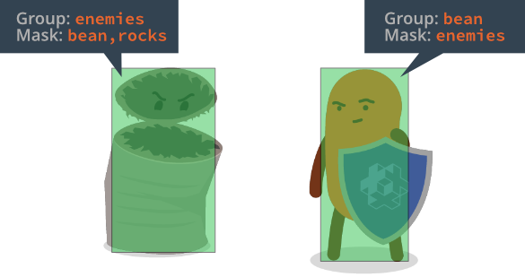

# Grupa i maska

Silnik fizyki pozwala grupować obiekty fizyczne i określać, jak powinny ze sobą kolidować. Odpowiadają za to nazwane _grupy kolizji_. Dla każdego obiektu kolizji tworzysz dwie właściwości, *Group* i *Mask*, które kontrolują sposób kolizji z innymi obiektami.

Aby kolizja między dwoma obiektami została zarejestrowana, oba obiekty muszą wzajemnie wskazywać grupy drugiej strony w polu *Mask*.

Pole *Mask* może zawierać wiele nazw grup, co pozwala tworzyć złożone scenariusze interakcji.

## Wykrywanie kolizji

Gdy dwa obiekty kolizji o pasujących grupach i maskach zderzają się, silnik fizyki generuje [wiadomości o kolizji](/manuals/physics-messages), które można wykorzystać w grze do reagowania na kolizje.
