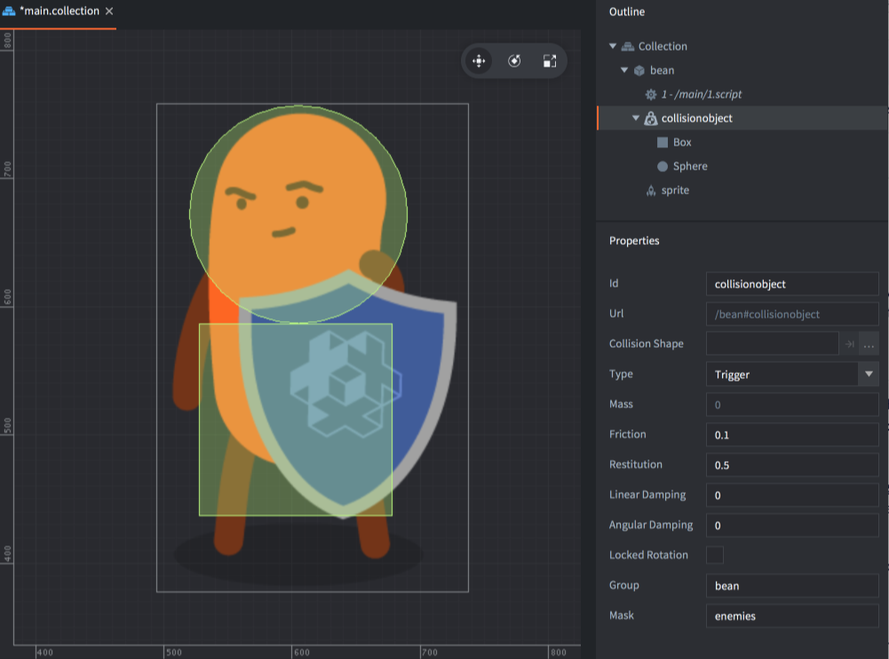

# Obiekty kolizji

Obiekty kolizji (ang. collision object) w Defoldzie to, wbrew nazwie, komponenty, które nadają obiektowi gry zachowanie fizyczne i pozwalają być analizowane przez silnik fizyki gry. Obiekt kolizji ma właściwości fizyczne, takie jak masa, współczynnik restytucji (uderzenia) i współczynnik tarcia, a jego rozszerzenie przestrzenne (ang. spatial extension) jest określane przez jeden lub więcej _kształtów_ (ang. shapes), które dołączasz do komponentu. Defold obsługuje następujące rodzaje obiektów kolizji:

Static objects
: Obiekty statyczne nigdy się nie poruszają, ale obiekt dynamiczny, który koliduje z obiektem statycznym, zareaguje odbijaniem i/lub ślizganiem. Obiekty statyczne są bardzo przydatne do tworzenia geometrii poziomu (np. podłogi i ścian), która się nie rusza. Są także "tańsze" pod względem wydajności niż obiekty dynamiczne. Nie możesz przesuwać, ani w żaden inny sposób zmieniać obiektów statycznych.

Dynamic objects
: Obiekty dynamiczne są symulowane przez silnik fizyki gry. Silnik fizyczny rozwiązuje wszystkie kolizje i stosuje wynikowe siły. Obiekty dynamiczne nadają się dla obiektów, które powinny zachowywać się realistycznie, ale nie możesz bezpośrednio manipulować pozycją i orientacją obiektu dynamicznego. Jedynym sposobem na ich wpływanie jest wpływ pośredni - poprzez stosowanie zewnętrznych [sił (forces)](/ref/physics/#apply_force) lub zmianę [tłumienia kątowego (angular damping)](/ref/stable/physics/#angular_damping) i [prędkości liniowej (linear velocity)](/ref/stable/physics/#linear_velocity) oraz [tłumienia liniowego (linear damping)](/ref/stable/physics/#linear_damping) i [prędkości kątowej (angular velocity)](/ref/stable/physics/#angular_velocity).

Kinematic objects
: Obiekty kinematyczne rejestrują kolizje z innymi obiektami fizycznymi, ale silnik fizyczny nie przeprowadza automatycznej symulacji. Rozstrzyganie kolizji lub ignorowanie ich pozostawione jest Tobie ([dowiedz się więcej](/manuals/physics-resolving-collisions)). Obiekty kinematyczne są bardzo dobre dla obiektów sterowanych przez gracza lub skrypt, które wymagają precyzyjnej kontroli nad reakcjami fizycznymi, takie jak np. postać gracza.

Triggers
: Wyzwalacze to obiekty, które rejestrują proste kolizje. Wyzwalacze to bardzo "lekkie" obiekty kolizji. Są podobne do specjalnych, fizycznych [promieni (ang. ray casts)](/manuals/physics-ray-casts), ponieważ tylko odczytują świat fizyczny bez oddziaływania na niego. Nadają się do obiektów, które muszą tylko zarejestrować trafienie (np. pocisk) lub jako część logiki gry, w której chcesz wyzwalać określone akcje, gdy obiekt osiągnie określony punkt (często wykorzystywane waypointy, checkpointy, wyzwalacze miejsca, itp.). Wyzwalacze są obliczeniowo tańsze niż obiekty kinematyczne i powinny być stosowane zamiast nich, jeśli tylko jest to możliwe.

## Dodawanie komponentu obiektu kolizji

Komponent obiektu kolizji ma zestaw *Properties* (Właściwości), które określają jego typ i właściwości fizyczne. Zawiera także jeden lub więcej Kształtów (*Shapes*), które definiują całą formę obiektu fizycznego.

Aby dodać komponent obiektu kolizji do obiektu gry:

1. W panelu *Outline*, <kbd>kliknij prawym przyciskiem myszy</kbd> obiekt gry i wybierz z menu kontekstowego <kbd>Add Component ▸ Collision Object</kbd>. Tworzy to nowy komponent bez Kształtów.
2. <kbd>Kliknij prawym przyciskiem myszy</kbd> nowy komponent i wybierz <kbd>Add Shape ▸ Box / Capsule / Sphere</kbd>. Dodaje to nowy Kształt (odpowiednio: Prostopadłościan / Kapsuła / Sfera) do komponentu obiektu kolizji. Możesz dodać dowolną liczbę kształtów do komponentu. Możesz także użyć mapy kafelków (tilemap) lub powłoki wypukłej (convex hull), aby zdefiniować Kształt obiektu fizycznego.
3. Użyj narzędzi do przesuwania, obracania i skalowania, aby edytować Kształty.
4. Wybierz komponent w panelu *Outline* i edytuj *Properties* obiektu kolizji.



## Dodawanie kształtu kolizji
Komponent kolizji może używać kilku podstawowych kształtów (primitive shapes) lub pojedynczego, skomplikowanego kształtu. Dowiedz się więcej o różnych kształtach i jak je dodawać do komponentu kolizji w [instrukcji do Kształtów Kolizji](/manuals/physics-shapes).

## Właściwości obiektu kolizji

Id
: Identyfikator komponentu.

Collision Shape
: Kształt Kolizji - ta właściwość jest używana dla geometrii mapy kafelków (tile map) lub kształtów wypukłych (convex shapes), które nie używają kształtów podstawowych. Zobacz szczegóły w [instrukcji do Kształtów Kolizji](/manuals/physics-shapes).

Type
: Typ obiektu kolizji: `Dynamic` - dynamiczny, `Kinematic` - kinematyczny, `Static` - statyczny lub `Trigger` - wyzwalacz. Jeśli ustawisz obiekt jako dynamiczny, to _musisz_ ustawić wartość *Mass* (Masa) na wartość niezerową. Dla obiektów dynamicznych lub statycznych powinieneś także sprawdzić, czy wartości *Friction* - Tarcia i *Restitution* - Restytucji są odpowiednie dla twojego przypadku użycia.

Friction
: Tarcie - pozwala na realistyczne ocieranie/ślizganie się obiektów względem siebie. Wartość współczynnika tarcia jest zazwyczaj ustawiana między 0 (brak tarcia — bardzo śliski obiekt) a 1 (duże tarcie — obiekt ścierny). Jednakże dowolna wartość dodatnia jest poprawna.

  Siła tarcia jest proporcjonalna do siły normalnej (nazywa się to tarciem Coulomba). Gdy obliczana jest siła tarcia między dwoma kształtami (`A` i `B`), wartości tarcia obu obiektów są łączone za pomocą średniej geometrycznej:

```math
F = sqrt( F_A * F_B )
```

  Oznacza to, że jeśli jeden z obiektów ma współczynnik tarcia równy zeru, to kontakt między nimi będzie miał tarcie równe zeru.

Restitution
: Wartość restytucji (inaczej współczynnik uderzenia) określa "sprężystość" obiektu. Wartość ta zazwyczaj mieści się między 0 (kolizja anelastyczna — obiekt w ogóle nie odbija się) a 1 (kolizja idealnie elastyczna — prędkość obiektu będzie dokładnie odbita).

  Wartości restytucji między dwoma kształtami (`A` i `B`) są łączone za pomocą następującej formuły:

```math
R = max( R_A, R_B )
```

  Gdy kształt ma wiele kontaktów, restytucja jest przybliżana, ponieważ Box2D (węwnetrznie używany silnik fizyki) używa rozwiązywania iteracyjnego. Box2D stosuje również kolizje anelastyczne, gdy prędkość kolizji jest mała, aby zapobiec drganiom odbicia (bounce-jitter).

Linear damping
: Tłumienie liniowe - zmniejsza liniową prędkość ciała. Różni się od tarcia, które występuje tylko podczas kontaktu, i może być używane, aby obiektom nadawać efekt "unoszenia się", jakby poruszały się przez coś gęstszego niż powietrze. Poprawne wartości mieszczą się w zakresie od 0 do 1.

  Box2D przybliża tłumienie w celu utrzymania lepszej stabilności i wydajności. Przy małych wartościach efekt tłumienia jest niezależny od kroku czasowego, podczas gdy przy większych wartościach tłumienia efekt tłumienia zmienia się w zależności od kroku czasowego. Jeśli uruchamiasz swoją grę z ustalonym krokiem czasowym, nie jest to problemem.

Angular damping
: Tłumienie kątowe - działa jak tłumienie liniowe, ale zmniejsza prędkość kątową ciała. Poprawne wartości mieszczą się w zakresie od 0 do 1.

Locked rotation
: Zablokowana rotacja - Ustawiając tę właściwość całkowicie wyłącza się obracanie na obiekcie kolizji, niezależnie od sił, jakie na niego działają.

Bullet
: (ang. pocisk) Ustawienie tej właściwości umożliwia ciągłe wykrywanie kolizji (ang. Continuous Collision Detection - CCD) między obiektem kolizji a innymi dynamicznymi obiektami kolizji. Właściwość *Bullet* jest ignorowana, jeśli typ nie jest ustawiony na `Dynamic` - Dynamiczny.

Group
: Nazwa grupy kolizji, do której obiekt powinien należeć. Możesz mieć 16 różnych grup i nadajesz im nazwy, jakie uważasz za stosowne w swojej grze. Na przykład "gracze", "pociski", "wrogowie" czy "świat". Jeśli Kształt Kolizji jest ustawiony na Mapę Kafelków (Tile Map), to pole to nie jest używane, a nazwy grup są pobierane ze Źródła Kafelków (Tile Source). Dowiedz się więcej [tutaj o grupach kolizji](/manuals/physics-groups).

Mask
: Maska - inne grupy, z którymi ten obiekt powinien kolidować. Możesz nazwać jedną grupę lub podać wiele grup oddzielonych przecinkiem. Jeśli pozostawisz pole `Mask` puste, obiekt nie będzie kolidować z niczym. Dowiedz się więcej [tutaj o grupach kolizji](/manuals/physics-groups).

## Właściwości w trakcie działania gry

Obiekt fizyczny ma wiele różnych właściwości, które można odczytywać i zmieniać za pomocą `go.get()` i `go.set()` w trakcie działania programu (runtime):

`angular_damping`
: Wartość tłumienia kątowego komponentu obiektu kolizji (typ `number`). [Dokumentacja API](/ref/physics/#angular_damping).

`angular_velocity`
: Bieżąca prędkość kątowa komponentu obiektu kolizji (typ `vector3`). [Dokumentacja API](/ref/physics/#angular_velocity).

`linear_damping`
: Wartość tłumienia liniowego obiektu kolizji (typ `number`). [Dokumentacja API](/ref/physics/#linear_damping).

`linear_velocity`
: Bieżąca prędkość liniowa komponentu obiektu kolizji (typ `vector3`). [Dokumentacja API](/ref/physics/#linear_velocity).

`mass`
: Określona masa fizyczna komponentu obiektu kolizji. TYLKO DO ODCZYTU. (typ `number`). [Dokumentacja API](/ref/physics/#mass).
