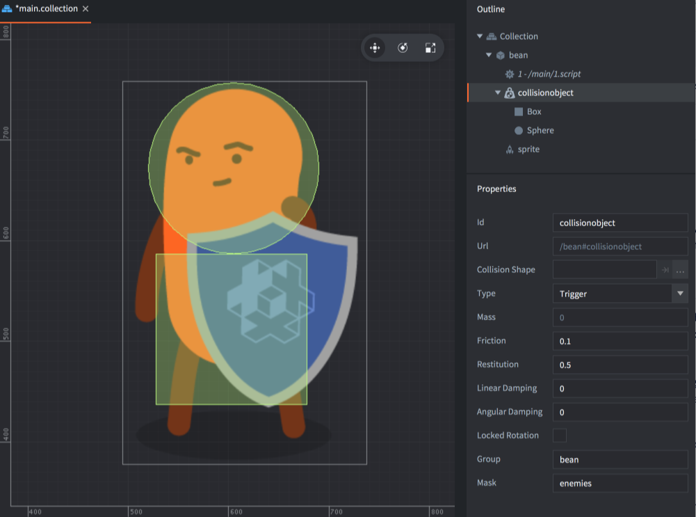

# Obiekty kolizji

Obiekt kolizji to komponent, którego używasz, aby nadać obiektowi gry zachowanie fizyczne. Ma on właściwości fizyczne, takie jak masa, restytucja i tarcie, a jego zasięg przestrzenny jest definiowany przez jeden lub więcej _kształtów_, które dołączasz do komponentu. Defold obsługuje następujące typy obiektów kolizji:

Static objects
: Obiekty statyczne nigdy się nie poruszają, ale obiekt dynamiczny, który zderzy się z obiektem statycznym, zareaguje odbiciem i/lub ześlizgnięciem się. Obiekty statyczne są bardzo przydatne do budowania geometrii poziomu, takiej jak podłoga i ściany, która się nie porusza. Pod względem wydajności są też tańsze niż obiekty dynamiczne. Nie można ich przesuwać ani w inny sposób zmieniać.

Dynamic objects
: Obiekty dynamiczne są symulowane przez silnik fizyki. Silnik rozwiązuje wszystkie kolizje i stosuje wynikowe siły. Obiekty dynamiczne dobrze sprawdzają się tam, gdzie elementy powinny zachowywać się realistycznie. Najczęściej wpływa się na nie pośrednio, przez [stosowanie sił](/ref/physics/#apply_force) albo zmianę [tłumienia](/ref/stable/physics/#angular_damping) i [prędkości](/ref/stable/physics/#linear_velocity) kątowej oraz liniowego [tłumienia](/ref/stable/physics/#linear_damping) i [prędkości](/ref/stable/physics/#angular_velocity). Można też bezpośrednio manipulować pozycją i orientacją obiektu dynamicznego, gdy włączone jest ustawienie [Allow Dynamic Transforms](/manuals/project-settings/#allow-dynamic-transforms) w pliku *game.project*.

Kinematic objects
: Obiekty kinematyczne rejestrują kolizje z innymi obiektami fizycznymi, ale silnik fizyki nie wykonuje żadnej automatycznej symulacji. Zadanie rozstrzygania kolizji albo ich ignorowania pozostaje po Twojej stronie ([dowiedz się więcej](/manuals/physics-resolving-collisions)). Obiekty kinematyczne bardzo dobrze nadają się do obiektów sterowanych przez gracza lub skrypt, które wymagają precyzyjnej kontroli reakcji fizycznych, takich jak postać gracza.

Triggers
: Wyzwalacze to obiekty, które rejestrują proste kolizje. Są to lekkie obiekty kolizji. Są podobne do [ray casts](/manuals/physics-ray-casts), ponieważ odczytują świat fizyki zamiast wchodzić z nim w interakcję. Dobrze sprawdzają się w przypadku obiektów, które muszą tylko zarejestrować trafienie, na przykład pocisku, albo jako część logiki gry, w której chcesz uruchamiać określone akcje, gdy obiekt osiągnie konkretny punkt. Wyzwalacze są obliczeniowo tańsze niż obiekty kinematyczne i jeśli to możliwe, należy używać ich zamiast nich.


## Dodawanie komponentu obiektu kolizji

Komponent obiektu kolizji ma zestaw *Properties*, które określają jego typ i właściwości fizyczne. Zawiera też jeden lub więcej *Shapes*, które definiują cały kształt obiektu fizycznego.

Aby dodać komponent obiektu kolizji do obiektu gry:

1. W widoku *Outline* kliknij prawym przyciskiem myszy obiekt gry i wybierz z menu kontekstowego <kbd>Add Component ▸ Collision Object</kbd>. Spowoduje to utworzenie nowego komponentu bez żadnych kształtów.
2. Kliknij prawym przyciskiem myszy nowy komponent i wybierz <kbd>Add Shape ▸ Box / Capsule / Sphere</kbd>. Spowoduje to dodanie nowego kształtu do komponentu obiektu kolizji. Możesz dodać dowolną liczbę kształtów do komponentu. Możesz też użyć mapy kafelków albo wypukłej otoczki, aby zdefiniować kształt obiektu fizycznego.
3. Użyj narzędzi do przesuwania, obracania i skalowania, aby edytować kształty.
4. Wybierz komponent w widoku *Outline* i edytuj *Properties* obiektu kolizji.




## Dodawanie kształtu kolizji

Komponent kolizji może używać kilku prostych kształtów albo jednego złożonego kształtu. Więcej informacji o różnych kształtach i o tym, jak dodawać je do komponentu kolizji, znajdziesz w [manualu Collision Shapes](/manuals/physics-shapes).


## Właściwości obiektu kolizji

Id
: Tożsamość komponentu.

Collision Shape
: Ta właściwość służy do geometrii z mapy kafelków albo do kształtów wypukłych, które nie korzystają z prostych kształtów. Więcej informacji znajdziesz w [Collision Shapes](/manuals/physics-shapes).

Type
: Typ obiektu kolizji: `Dynamic`, `Kinematic`, `Static` albo `Trigger`. Jeśli ustawisz obiekt jako dynamiczny, _musisz_ ustawić właściwość *Mass* na wartość różną od zera. W przypadku obiektów dynamicznych lub statycznych warto też sprawdzić, czy wartości *Friction* i *Restitution* są odpowiednie dla danego zastosowania.

Friction
: Tarcie umożliwia realistyczne ślizganie się obiektów względem siebie. Wartość tarcia zwykle ustawia się w zakresie od `0` (brak tarcia, bardzo śliski obiekt) do `1` (duże tarcie, obiekt o chropowatej powierzchni). Każda dodatnia wartość jest jednak poprawna.

  Siła tarcia jest proporcjonalna do siły normalnej (nazywa się to tarciem Coulomba). Gdy siła tarcia jest obliczana dla dwóch kształtów (`A` i `B`), wartości tarcia obu obiektów są łączone za pomocą średniej geometrycznej:

```math
F = sqrt( F_A * F_B )
```

  Oznacza to, że jeśli jeden z obiektów ma tarcie równe zero, kontakt między nimi również będzie miał tarcie równe zero.

Restitution
: Wartość restytucji określa "sprężystość" obiektu. Zwykle mieści się ona w zakresie od 0 (kolizja nieelastyczna, obiekt w ogóle się nie odbija) do 1 (kolizja idealnie sprężysta, prędkość obiektu zostanie dokładnie odbita).

  Wartości restytucji dla dwóch kształtów (`A` i `B`) są łączone za pomocą następującego wzoru:

```math
R = max( R_A, R_B )
```

  Gdy kształt ma wiele kontaktów, restytucja jest symulowana w przybliżeniu, ponieważ Box2D używa iteracyjnego solvera. Box2D stosuje też kolizje nieelastyczne, gdy prędkość kolizji jest mała, aby zapobiec drganiom odbicia.

Linear damping
: Tłumienie liniowe zmniejsza liniową prędkość ciała. Różni się od tarcia, które występuje tylko podczas kontaktu, i można go użyć, aby nadać obiektom wrażenie unoszenia się, jakby poruszały się w czymś gęstszym niż powietrze. Prawidłowe wartości mieszczą się w zakresie od 0 do 1.

  Box2D przybliża tłumienie ze względów stabilności i wydajności. Przy małych wartościach efekt tłumienia jest niezależny od kroku czasowego, natomiast przy większych wartościach zależy od kroku czasowego. Jeśli uruchamiasz grę ze stałym krokiem czasowym, nie stanowi to problemu.

Angular damping
: Tłumienie kątowe działa jak tłumienie liniowe, ale zmniejsza kątową prędkość ciała. Prawidłowe wartości mieszczą się w zakresie od 0 do 1.

Locked rotation
: Ustawienie tej właściwości całkowicie wyłącza obrót obiektu kolizji, niezależnie od działających na niego sił.

Bullet
: Ustawienie tej właściwości włącza ciągłe wykrywanie kolizji (CCD) między obiektem kolizji a innymi dynamicznymi obiektami kolizji. Właściwość Bullet jest ignorowana, jeśli Type nie jest ustawione na `Dynamic`.

Group
: Nazwa grupy kolizji, do której obiekt powinien należeć. Możesz mieć 16 różnych grup i nadać im dowolne nazwy odpowiednie dla gry. Na przykład "players", "bullets", "enemies" i "world". Jeśli *Collision Shape* jest ustawione na mapę kafelków, to pole to nie jest używane, a nazwy grup są pobierane ze źródła kafelków. [Dowiedz się więcej o grupach kolizji](/manuals/physics-groups).

Mask
: Inne _grupy_, z którymi ten obiekt ma się zderzać. Możesz podać jedną grupę albo kilka grup w liście rozdzielonej przecinkami. Jeśli zostawisz pole Mask puste, obiekt nie będzie z niczym kolidował. [Dowiedz się więcej o grupach kolizji](/manuals/physics-groups).

Generate Collision Events
: Jeśli włączone, obiekt będzie mógł wysyłać zdarzenia kolizji.

Generate Contact Events
: Jeśli włączone, obiekt będzie mógł wysyłać zdarzenia kontaktu.

Generate Trigger Events
: Jeśli włączone, obiekt będzie mógł wysyłać zdarzenia wyzwalacza.


## Właściwości w czasie działania

Obiekt fizyczny ma kilka różnych właściwości, które można odczytywać i zmieniać za pomocą `go.get()` i `go.set()`:

`angular_damping`
: Wartość tłumienia kątowego komponentu obiektu kolizji (`number`). [Dokumentacja API](/ref/physics/#angular_damping).

`angular_velocity`
: Bieżąca kątowa prędkość komponentu obiektu kolizji (`vector3`). [Dokumentacja API](/ref/physics/#angular_velocity).

`linear_damping`
: Wartość tłumienia liniowego obiektu kolizji (`number`). [Dokumentacja API](/ref/physics/#linear_damping).

`linear_velocity`
: Bieżąca liniowa prędkość komponentu obiektu kolizji (`vector3`). [Dokumentacja API](/ref/physics/#linear_velocity).

`mass`
: Zdefiniowana masa fizyczna komponentu obiektu kolizji. TYLKO DO ODCZYTU. (`number`). [Dokumentacja API](/ref/physics/#mass).
