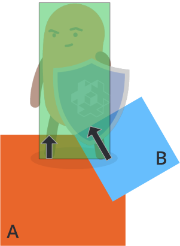
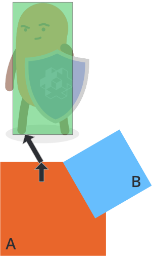
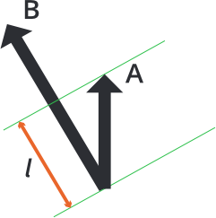

# Rozwiązywanie kolizji kinematycznych

Korzystanie z kinematycznych obiektów kolizji (kinematic collision objects) wymaga się od Ciebie ręcznego rozwiązywania kolizji i przemieszczania obiektów jako reakcji na nie. Proste podejście do rozdzielenia dwóch kolidujących obiektów wygląda następująco:

```lua
function on_message(self, message_id, message, sender)
  -- Handle collision
  if message_id == hash("contact_point_response") then
    local newpos = go.get_position() + message.normal * message.distance
    go.set_position(newpos)
  end
end
```

Ten kod rozdzieli Twój obiekt kinematyczny od innych obiektów fizycznych, które penetruje, ale rozdzielenie często jest zbyt duże, co prowadzi do drgań w wielu przypadkach. Aby lepiej zrozumieć problem, rozważmy następujący przypadek, w którym postać gracza koliduje z dwoma obiektami, *A* i *B*:

{srcset="images/physics/collision_multi@2x.png 2x"}

Silnik fizyki wyśle wiele wiadomości `"contact_point_response"`, jedną dla obiektu *A* i jedną dla obiektu *B* w klatce, w której wystąpiła kolizja. Jeśli przesuniesz postać w odpowiedzi na każde przeniknięcie, jak w prostym kodzie powyżej, to rozdzielenie będzie się prezentować następująco:

- Przesuń postać poza obiekt *A* zgodnie z jego odległością penetracji (czarna strzałka).
- Przesuń postać poza obiekt *B* zgodnie z jego odległością penetracji (czarna strzałka).

Kolejność tych działań jest dowolna, ale wynik jest taki sam w obu przypadkach: całkowite rozdzielenie, które stanowi *sumę wektorów penetracji* poszczególnych obiektów:

{srcset="images/physics/separation_naive@2x.png 2x"}

Aby właściwie rozdzielić postać od obiektów *A* i *B*, musisz obsłużyć odległość penetracji punktów kontaktowych i sprawdzić, czy jakiekolwiek wcześniejsze rozdzielenia już całkowicie lub częściowo rozwiązały problem rozdzielenia.

Załóżmy, że pierwsza wiadomość punktu kontaktowego pochodzi od obiektu *A* i przesuwasz postać poza obiekt *A* zgodnie z wektorem penetracji *A*:

{srcset="images/physics/separation_step1@2x.png 2x"}

Wtedy postać zostaje już częściowo rozdzielona od obiektu *B*. Ostateczna korekta konieczna do pełnego rozdzielenia od obiektu *B* jest wskazana czarną strzałką powyżej. Długość wektora kompensacji (compensation vector) można obliczyć, projektując wektor penetracji *A* na wektor penetracji *B*:

{srcset="images/physics/projection@2x.png 2x"}

```
l = vmath.project(A, B) * vmath.length(B)
```

Wektor kompensacji można znaleźć, zmniejszając długość *B* o *l*. Aby obliczyć to dla dowolnej liczby penetracji, można akumulować niezbędną korektę w wektorze, który zaczyna się od wektora kompensacji o zerowej długości:

1. Zweryfikuj projekcję bieżącej korekcji na wektor penetracji kontaktu.
2. Oblicz, ile kompensacji pozostało z wektora penetracji (zgodnie z powyższym wzorem).
3. Przesuń obiekt o wektor kompensacji.
4. Dodaj kompensację do akumulowanej korekty.

Pełna implementacja wygląda tak:

```lua
function init(self)
  -- wektor korekcji (kompensacji)
  self.correction = vmath.vector3()
end

function update(self, dt)
  -- zresetuj wektor korekcji
  self.correction = vmath.vector3()
end

function on_message(self, message_id, message, sender)
  -- Obsługa kolizji
  if message_id == hash("contact_point_response") then
    -- Pobierz informacje potrzebne do rozdzielenia kolizji. Możemy
    -- otrzymać wiele punktów kontaktowych i musimy obliczyć,
    -- jak się z nich wycofać, akumulując korekcję
    -- na tę klatkę:
    if message.distance > 0 then
      -- Po pierwsze, zweryfikuj projektowaną korekcję na
      -- wektor penetracji akumulowany
      local proj = vmath.project(self.correction, message.normal * message.distance)
      if proj < 1 then
        -- Weź pod uwagę tylko projekcje, które nie przestrzeliły.
        local comp = (message.distance - message.distance * proj) * message.normal
        -- Dodaj kompensację
        go.set_position(go.get_position() + comp)
        -- Akumuluj korekcję
        self.correction = self.correction + comp
      end
    end
  end
end
```
