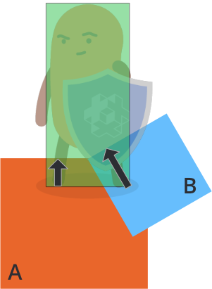
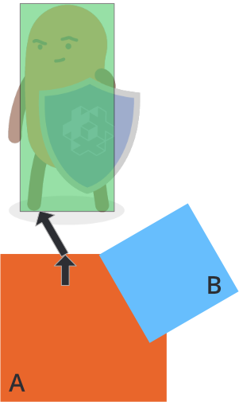
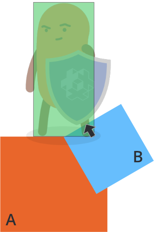
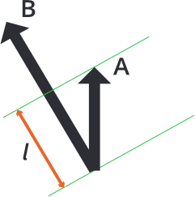

# Rozwiązywanie kolizji kinematycznych

Korzystanie z kinematic collision objects wymaga ręcznego rozwiązywania kolizji i przesuwania obiektów w reakcji na nie. Naive implementation, czyli proste podejście do rozdzielenia dwóch kolidujących obiektów, wygląda tak:

```lua
function on_message(self, message_id, message, sender)
  -- Obsługa kolizji
  if message_id == hash("contact_point_response") then
    local newpos = go.get_position() + message.normal * message.distance
    go.set_position(newpos)
  end
end
```

Ten kod odsunie kinematic object od innych obiektów fizycznych, w które wchodzi, ale takie rozdzielenie często jest zbyt duże i w wielu przypadkach powoduje drgania. Żeby lepiej zrozumieć problem, rozważ następującą sytuację, w której postać gracza zderza się z dwoma obiektami, *A* i *B*:



Silnik fizyki wyśle wiele wiadomości `"contact_point_response"`: jedną dla obiektu *A* i jedną dla obiektu *B* w klatce, w której doszło do kolizji. Jeśli przesuniesz postać w odpowiedzi na każde przeniknięcie, tak jak w prostym kodzie powyżej, rozdzielenie będzie wyglądało tak:

- Przesuń postać poza obiekt *A* zgodnie z jego odległością penetracji (czarna strzałka).
- Przesuń postać poza obiekt *B* zgodnie z jego odległością penetracji (czarna strzałka).

Kolejność tych działań jest dowolna, ale wynik będzie taki sam w obu przypadkach: całkowite rozdzielenie, które stanowi *sumę wektorów penetracji* poszczególnych obiektów:



Aby poprawnie odsunąć postać od obiektów *A* i *B*, trzeba uwzględnić odległość penetracji każdego punktu kontaktowego i sprawdzić, czy któreś z wcześniejszych przesunięć nie rozwiązało już częściowo albo całkowicie problemu.

Załóżmy, że pierwsza wiadomość o punkcie kontaktowym pochodzi od obiektu *A* i przesuwasz postać poza obiekt *A* zgodnie z jego wektorem penetracji:



Wtedy postać jest już częściowo odsunięta od obiektu *B*. Ostateczna korekta potrzebna do pełnego oddzielenia od obiektu *B* jest wskazana czarną strzałką powyżej. Długość wektora kompensacji można obliczyć, rzutując wektor penetracji *A* na wektor penetracji *B*:



```
l = vmath.project(A, B) * vmath.length(B)
```

Wektor kompensacji można wyznaczyć, skracając długość *B* o *l*. Aby obliczyć to dla dowolnej liczby przeniknięć, można akumulować potrzebną korektę w wektorze, który na początku ma zerową długość:

1. Oblicz projekcję bieżącej korekty na wektor penetracji kontaktu.
2. Wyznacz, ile kompensacji pozostaje z wektora penetracji, zgodnie z powyższym wzorem.
3. Przesuń obiekt o wektor kompensacji.
4. Dodaj kompensację do skumulowanej korekty.

Pełna implementacja wygląda tak:

```lua
function init(self)
  -- Wektor korekty
  self.correction = vmath.vector3()
end

function update(self, dt)
  -- Zresetuj wektor korekty
  self.correction = vmath.vector3()
end

function on_message(self, message_id, message, sender)
  -- Obsługa kolizji
  if message_id == hash("contact_point_response") then
    -- Pobierz informacje potrzebne do wyjścia z kolizji. Możemy
    -- dostać kilka punktów kontaktowych i musimy obliczyć,
    -- jak wycofać się ze wszystkich z nich, akumulując korektę
    -- dla tej klatki:
    if message.distance > 0 then
      -- Najpierw sprawdź projekcję skumulowanej korekty na
      -- wektor penetracji
      local proj = vmath.project(self.correction, message.normal * message.distance)
      if proj < 1 then
        -- Bierz pod uwagę tylko projekcje, które nie są zbyt duże.
        local comp = (message.distance - message.distance * proj) * message.normal
        -- Zastosuj kompensację
        go.set_position(go.get_position() + comp)
        -- Skumuluj zastosowaną korektę
        self.correction = self.correction + comp
      end
    end
  end
end
```
