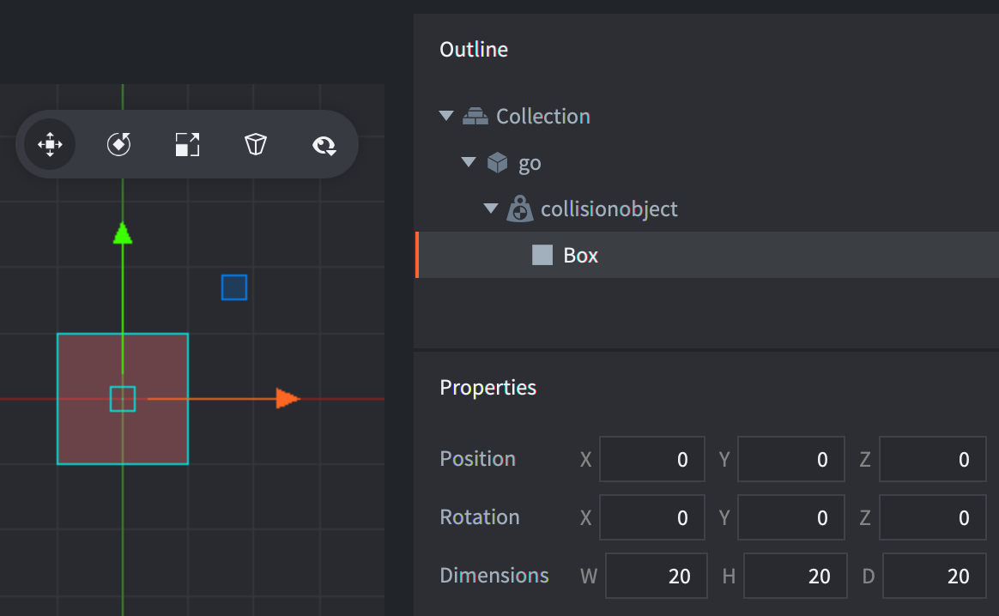
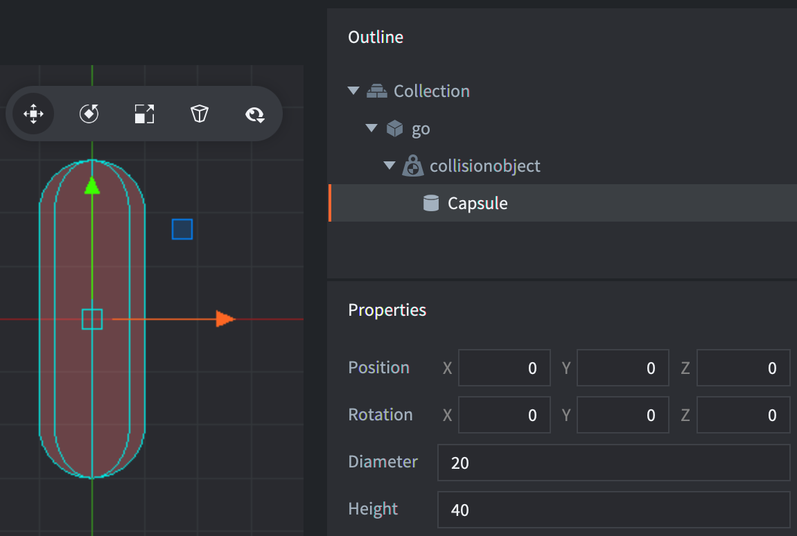

# Kształty Kolizji

Komponent Obiektu Kolizji (Collision Object) może używać kilku kształtów podstawowych (ang. primitive shapes) lub pojedynczego kształtu złożonego.

### Kształty podstawowe

Podstawowe kształty to *box* - prostokąt, *sphere* - sfera i *capsule* - kapsuła. Aby dodać kształt podstawowy, <kbd>kliknij prawym przyciskiem myszy</kbd> obiekt kolizji, a następnie wybierz <kbd>Add Shape</kbd>:

## Kształt prostokątny
Kształt prostokątny (box) posiada pozycję, rotację i wymiary (szerokość, wysokość i głębokość):

## Kształt sfery
Sfera (sphere) posiada pozycję, rotację i średnicę:

## Kształt kapsuły
Kapsuła posiada pozycję, rotację, średnicę i wysokość:

::: important
Kształty kapsuły są obsługiwane tylko w przypadku korzystania z fizyki 3D (skonfigurowanej w sekcji *Physics* w pliku *game.project*).
:::

### Kształty złożone
Kształty złożone (ang. complex shapes) można utworzyć z komponentu mapy kafelków lub z kształtu wypukłego (convex hull shape).

## Kształt kolizji mapy kafelków
Defold zawiera funkcję, która umożliwia łatwe generowanie kształtów fizyki dla Źródła Kafelków (Tile Source) używanego przez mapę kafelków. W [instrukcji Źródła Kafelków](/manuals/tilesource/#tile-source-collision-shapes) wyjaśniono, jak dodać grupy kolizji do źródła kafelków i przypisać kafelki do grup kolizji ([przykład](/examples/tilemap/collisions/)).

Aby dodać kolizję do mapy kafelków:

1. Dodaj mapę kafelków do obiektu gry, <kbd>klikając go prawym przyciskiem myszy</kbd> i wybierając <kbd>Add Component File</kbd>. Wybierz plik mapy kafelków.
2. Dodaj komponent obiektu kolizji do obiektu gry, <kbd>klikając go prawym przyciskiem myszy</kbd> i wybierając <kbd>Add Component ▸ Collision Object</kbd>.
3. Zamiast dodawać kształty do komponentu, ustaw właściwość Kształt kolizji na plik mapa kafelków (*tilemap*).
4. Skonfiguruj *Properties* komponentu obiektu kolizji.

{srcset="images/physics/collision_tilemap@2x.png 2x"}

::: important
Należy zauważyć, że właściwość *Group* **nie** jest tutaj używana, ponieważ grupy kolizji są definiowane w źródle kafelków (tile source) mapy kafelków.
:::

## Kształt kolizji wypukłej
Defold zawiera funkcję, która umożliwia tworzenie kształtu wypukłego (convex hull shape) z trzech lub więcej punktów. Możesz użyć zewnętrznego narzędzia, takiego jak [Defold Polygon Editor](/assets/defoldpolygoneditor/) lub [Physics Body Editor](https://selimanac.github.io/physics-body-editor/), aby utworzyć kształt wypukły.

1. Utwórz plik kształtu wypukłego (o rozszerzeniu pliku .`.convexshape`) za pomocą zewnętrznego edytora.
2. Zamiast dodawać kształty do komponentu obiektu kolizji, ustaw właściwość *Collision Shape* na plik *convex shape*.

::: sidenote
Kształt taki nie będzie rysowany w Edytorze. Możesz włączyć [debugowanie fizyki](/manuals/debugging/#debugging-problems-with-physics) podczas działania programu, aby zobaczyć kształt.
:::

# Skalowanie kształtów kolizji

Obiekt kolizji i jego kształty dziedziczą skalę obiektu gry. Aby wyłączyć to zachowanie, odznacz pole wyboru "[Allow Dynamic Transforms](/manuals/project-settings/#allow-dynamic-transforms)", czyli Zezwalaj na dynamiczne transformacje w sekcji *Physics* pliku *game.project*. Należy pamiętać, że obsługiwane jest tylko skalowanie jednolite (uniform), a jeśli skala nie jest jednolita, zostanie użyta najmniejsza wartość skali.

# Obracanie kształtów kolizji

## Obracanie kształtów kolizji w fizyce 3D
Kształty kolizji w fizyce 3D można obracać wokół wszystkich osi.

## Obracanie kształtów kolizji w fizyce 2D
Kształty kolizji w fizyce 2D można obracać tylko wokół osi Z. Obrót wokół osi X lub Y spowoduje nieprawidłowe wyniki i powinno się go unikać, nawet przy obracaniu o 180 stopni, aby efektywnie odwrócić kształt wzdłuż osi x lub y. Aby odwrócić kształt fizyczny, zaleca się korzystanie z [`physics.set_hlip(url, flip)`](/ref/stable/physics/?#physics.set_hflip:url-flip) i [`physics.set_vlip(url, flip)`](/ref/stable/physics/?#physics.set_vflip:url-flip).
