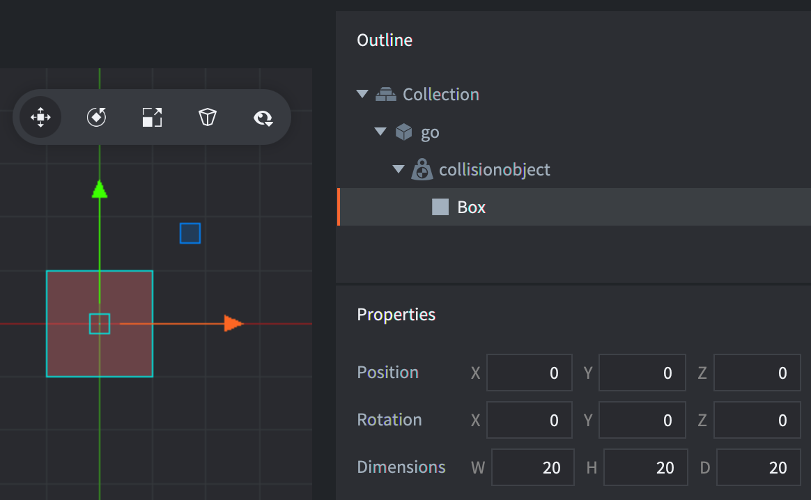
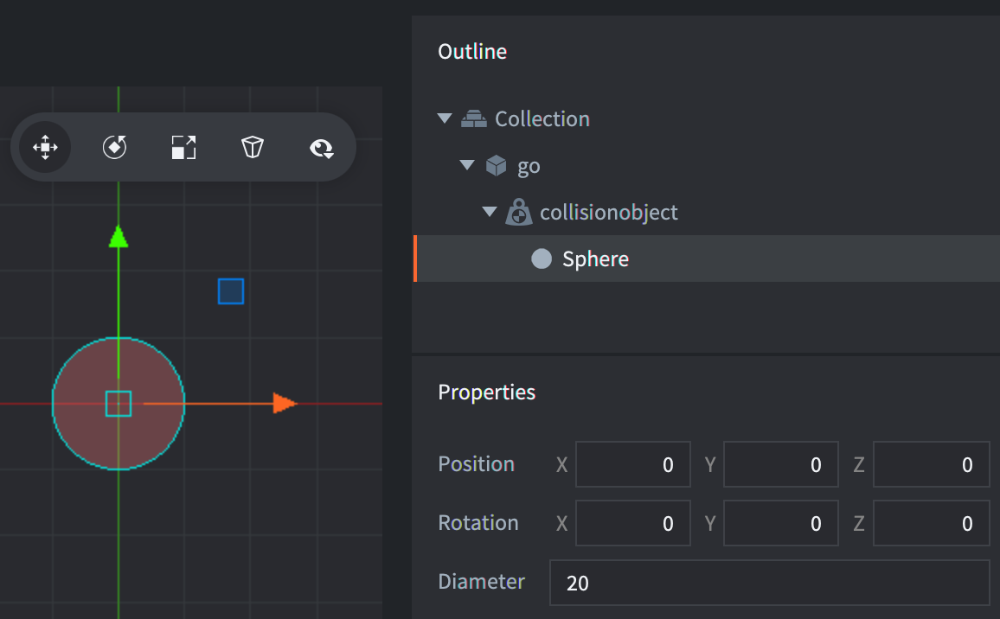
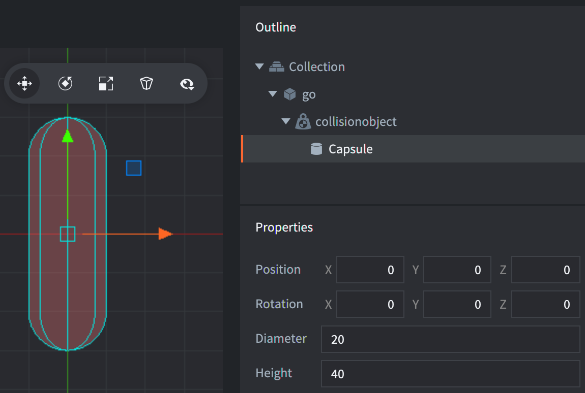
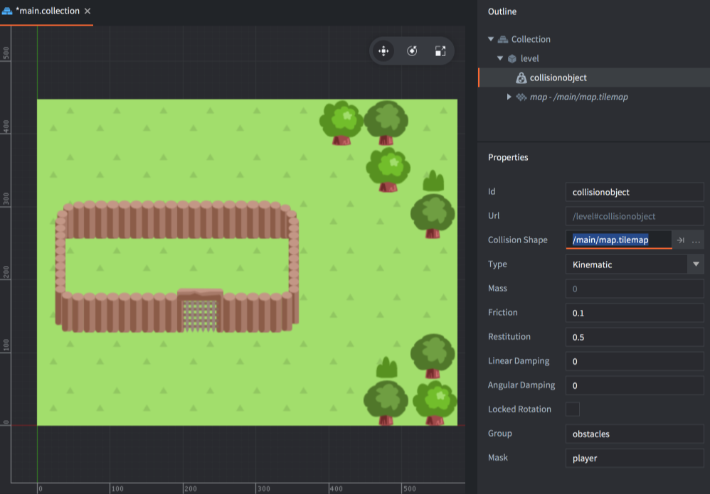

# Kształty kolizji

Komponent obiektu kolizji może używać kilku kształtów podstawowych albo jednego kształtu złożonego.

### Kształty podstawowe

Kształty podstawowe to *box*, *sphere* i *capsule*. Aby dodać kształt podstawowy, kliknij prawym przyciskiem myszy obiekt kolizji i wybierz <kbd>Add Shape</kbd>:


## Kształt prostopadłościanu

Kształt prostopadłościanu ma pozycję, obrót i wymiary: szerokość, wysokość oraz głębokość:



## Kształt sfery

Kształt sfery ma pozycję, obrót i średnicę:



## Kształt kapsuły

Kształt kapsuły ma pozycję, obrót, średnicę i wysokość:



::: important
Kształty kapsuły są obsługiwane tylko w fizyce 3D, skonfigurowanej w sekcji Physics pliku *game.project*.
:::

### Kształty złożone

Kształt złożony można utworzyć albo z komponentu mapy kafelków, albo z kształtu convex hull.

## Kształt kolizji mapy kafelków

Defold zawiera funkcję, która pozwala łatwo generować kształty fizyki dla źródła kafelków używanego przez mapę kafelków. W [instrukcji Tile source](/manuals/tilesource/#tile-source-collision-shapes) wyjaśniono, jak dodawać grupy kolizji do źródła kafelków i przypisywać kafelki do grup kolizji ([przykład](/examples/tilemap/collisions/)).

Aby dodać kolizję do mapy kafelków:

1. Dodaj mapę kafelków do obiektu gry, klikając prawym przyciskiem myszy obiekt gry i wybierając <kbd>Add Component File</kbd>. Następnie wybierz plik mapy kafelków.
2. Dodaj komponent obiektu kolizji do obiektu gry, klikając prawym przyciskiem myszy obiekt gry i wybierając <kbd>Add Component ▸ Collision Object</kbd>.
3. Zamiast dodawać kształty do komponentu, ustaw właściwość *Collision Shape* na plik *tilemap*.
4. Skonfiguruj *Properties* komponentu obiektu kolizji jak zwykle.



::: important
Zwróć uwagę, że właściwość *Group* **nie** jest tutaj używana, ponieważ grupy kolizji są definiowane w źródle kafelków mapy.
:::

## Kształt wypukły (convex hull)

Defold zawiera funkcję pozwalającą tworzyć kształt wypukły (convex hull) z trzech lub większej liczby punktów.

1. Utwórz plik kształtu convex hull o rozszerzeniu `.convexshape` przy użyciu zewnętrznego edytora.
2. Edytuj plik ręcznie w edytorze tekstu albo przy użyciu zewnętrznego narzędzia, opisanego poniżej.
3. Zamiast dodawać kształty do komponentu obiektu kolizji, ustaw właściwość *Collision Shape* na plik *convex shape*.

### Format pliku

Format pliku convex hull używa tego samego formatu danych co pozostałe pliki Defold, czyli tekstowego formatu protobuf. Kształt convex hull definiuje punkty bryły. W fizyce 2D punkty powinny być podane w kolejności przeciwnej do ruchu wskazówek zegara. W trybie fizyki 3D używana jest abstrakcyjna chmura punktów. Przykład dla 2D:

```
shape_type: TYPE_HULL
data: 200.000
data: 100.000
data: 0.0
data: 400.000
data: 100.000
data: 0.0
data: 400.000
data: 300.000
data: 0.0
data: 200.000
data: 300.000
data: 0.0
```

Powyższy przykład definiuje cztery narożniki prostokąta:

```
 200x300   400x300
    4---------3
    |         |
    |         |
    |         |
    |         |
    1---------2
 200x100   400x100
```

## Narzędzia zewnętrzne

Istnieje kilka narzędzi zewnętrznych, których można użyć do tworzenia kształtów kolizji:

* [Physics Editor](https://www.codeandweb.com/physicseditor/tutorials/how-to-create-physics-shapes-for-defold) od CodeAndWeb pozwala tworzyć obiekty gry ze sprite’ami i pasującymi do nich kształtami kolizji.
* [Defold Polygon Editor](https://rossgrams.itch.io/defold-polygon-editor) można użyć do tworzenia kształtów convex hull.
* [Physics Body Editor](https://selimanac.github.io/physics-body-editor/) również można użyć do tworzenia kształtów convex hull.


# Skalowanie kształtów kolizji

Obiekt kolizji i jego kształty dziedziczą skalę obiektu gry. Aby wyłączyć to zachowanie, odznacz pole [Allow Dynamic Transforms](/manuals/project-settings/#allow-dynamic-transforms) w sekcji Physics pliku *game.project*. Zwróć uwagę, że obsługiwane jest tylko skalowanie jednolite, a jeśli skala nie jest jednolita, użyta zostanie najmniejsza wartość skali.

# Zmienianie rozmiaru kształtów kolizji

Rozmiar kształtów obiektu kolizji można zmieniać w czasie działania przy użyciu `physics.set_shape()`. Przykład:

```lua
-- ustaw dane kształtu kapsuły
local capsule_data = {
  type = physics.SHAPE_TYPE_CAPSULE,
  diameter = 10,
  height = 20,
}
physics.set_shape("#collisionobject", "my_capsule_shape", capsule_data)

-- ustaw dane kształtu sfery
local sphere_data = {
  type = physics.SHAPE_TYPE_SPHERE,
  diameter = 10,
}
physics.set_shape("#collisionobject", "my_sphere_shape", sphere_data)

-- ustaw dane kształtu prostopadłościanu
local box_data = {
  type = physics.SHAPE_TYPE_BOX,
  dimensions = vmath.vector3(10, 10, 5),
}
physics.set_shape("#collisionobject", "my_box_shape", box_data)
```

::: sidenote
Na obiekcie kolizji musi już istnieć kształt właściwego typu o podanym id.
:::

# Obracanie kształtów kolizji

## Obracanie kształtów kolizji w fizyce 3D

Kształty kolizji w fizyce 3D można obracać wokół wszystkich osi.


## Obracanie kształtów kolizji w fizyce 2D

Kształty kolizji w fizyce 2D można obracać tylko wokół osi Z. Obracanie wokół osi X albo Y daje nieprawidłowe wyniki i należy go unikać, nawet przy obrocie o 180 stopni, który pozornie miałby tylko odwrócić kształt wzdłuż osi X albo Y. Do odwracania kształtu fizyki zaleca się używać [`physics.set_hlip(url, flip)`](/ref/stable/physics/?#physics.set_hflip:url-flip) oraz [`physics.set_vlip(url, flip)`](/ref/stable/physics/?#physics.set_vflip:url-flip).


# Debugowanie

Możesz [włączyć debugowanie fizyki](/manuals/debugging/#debugging-problems-with-physics), aby zobaczyć kształty kolizji w czasie działania.
