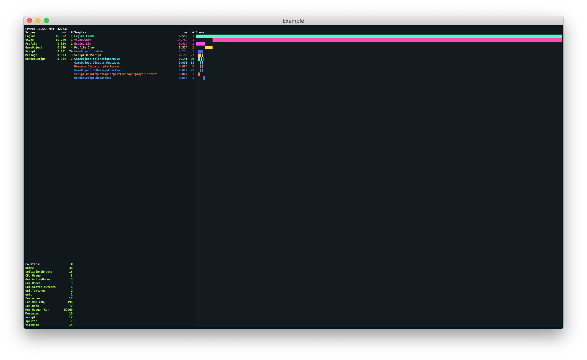
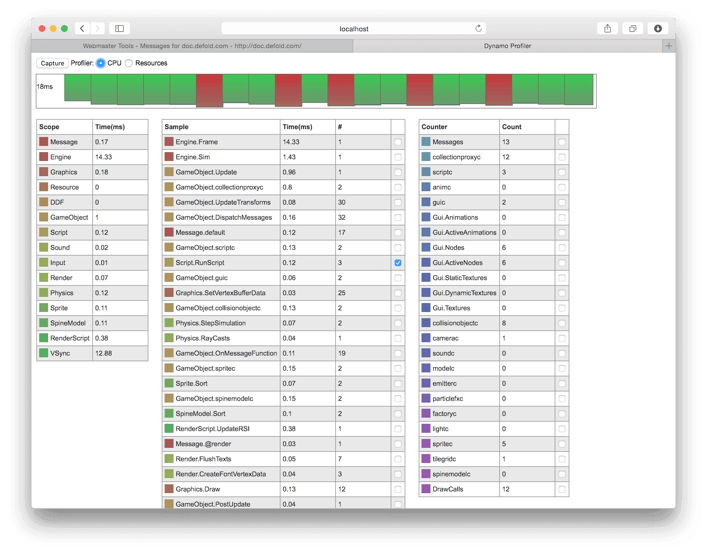
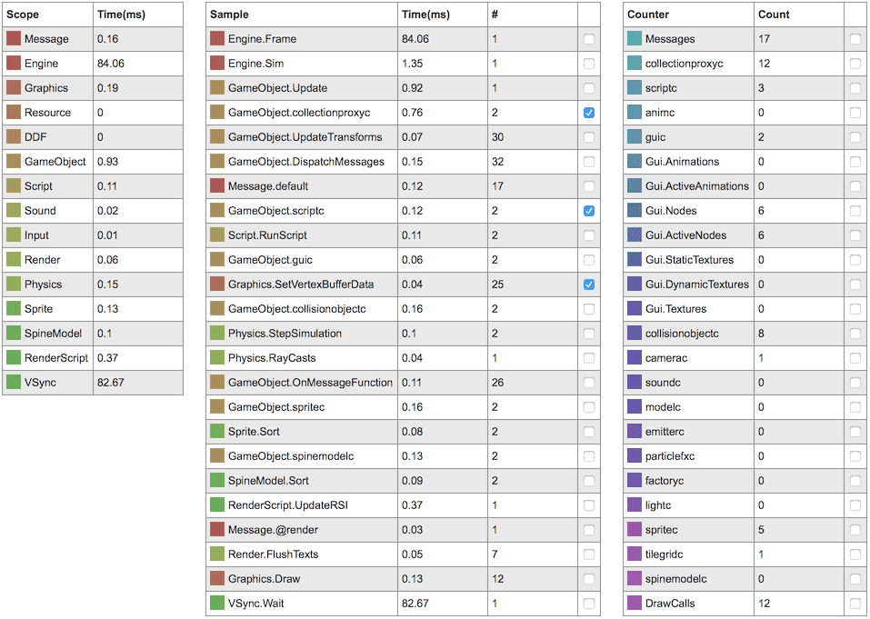
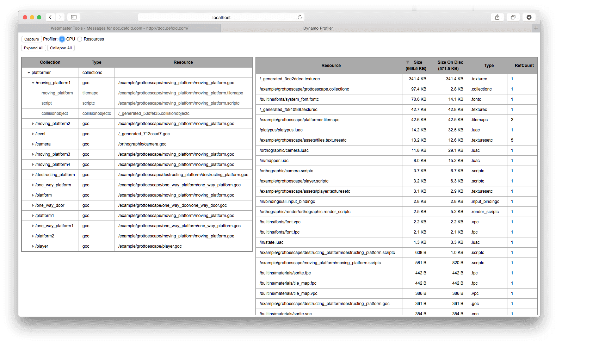
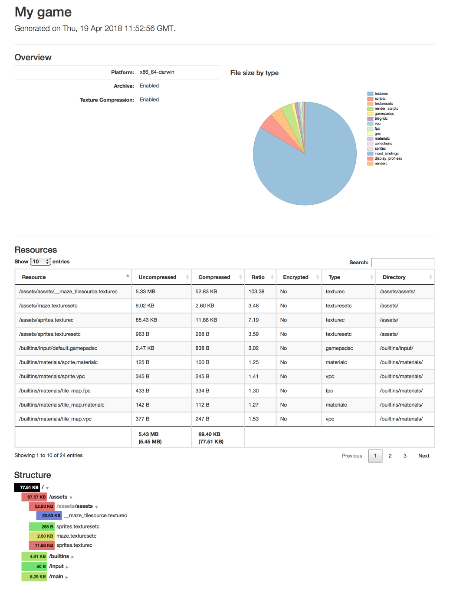
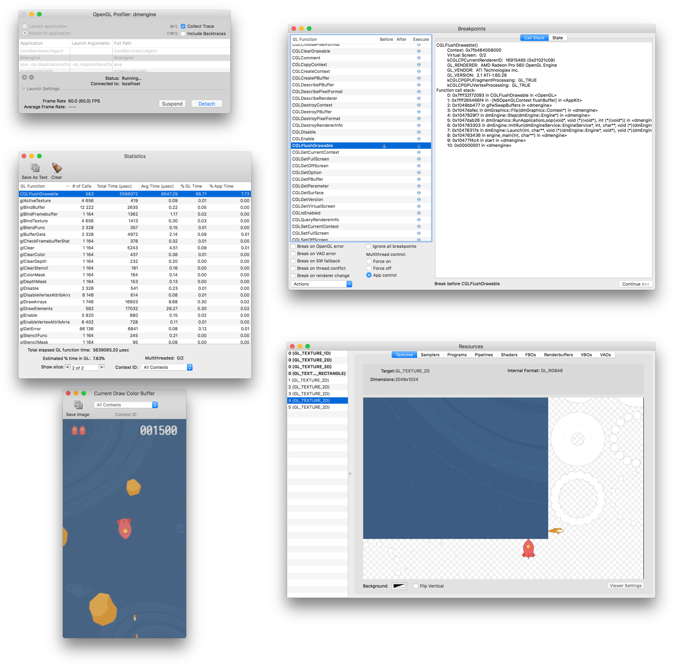
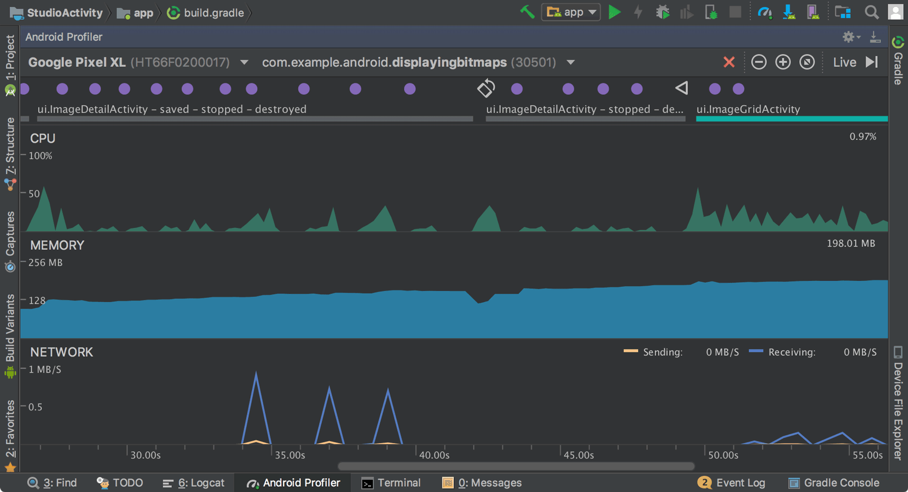

# Profilowanie

Defold zawiera zestaw narzędzi profilujących zintegrowanych z silnikiem i procesem budowania. Służą one do znajdowania problemów z wydajnością oraz użyciem pamięci. Wbudowane profilery są dostępne tylko w buildach debug. Profiler klatek używany w Defold to [Remotery profiler firmy Celtoys](https://github.com/Celtoys/Remotery).

## Profiler ekranowy w czasie działania

Buildy debug zawierają profiler ekranowy działający w czasie rzeczywistym, który pokazuje bieżące informacje renderowane jako nakładka na uruchomioną aplikację:

```lua
function on_reload(self)
    -- Toggle the visual profiler on hot reload.
    profiler.enable_ui(true)
end
```



Profiler ekranowy udostępnia kilka funkcji, których można użyć do zmiany sposobu prezentacji danych:

```lua

profiler.set_ui_mode()
profiler.set_ui_view_mode()
profiler.view_recorded_frame()
```

Więcej informacji o funkcjach profilera znajdziesz w [dokumentacji API profilera](/ref/stable/profiler/).

## Profiler internetowy
Podczas uruchamiania builda debug gry można w przeglądarce otworzyć interaktywny profiler internetowy.

### Profiler klatek
Profiler klatek pozwala profilować grę podczas działania i analizować poszczególne klatki szczegółowo. Aby otworzyć profiler:

1. Uruchom grę na urządzeniu docelowym.
2. Wybierz menu <kbd>Debug ▸ Open Web Profiler</kbd>.

Profiler klatek jest podzielony na kilka sekcji, z których każda pokazuje inny widok uruchomionej gry. Naciśnij przycisk <kbd>Pause</kbd> w prawym górnym rogu, aby tymczasowo zatrzymać odświeżanie widoków przez profiler.



::: sidenote
Gdy używasz jednocześnie wielu urządzeń docelowych, możesz ręcznie przełączać się między nimi, zmieniając pole Connection Address u góry strony tak, aby odpowiadało adresowi URL profilera Remotery widocznemu w konsoli po uruchomieniu celu:

```
INFO:ENGINE: Defold Engine 1.3.4 (80b1b73)
INFO:DLIB: Initialized Remotery (ws://127.0.0.1:17815/rmt)
INFO:ENGINE: Loading data from: build/default
```
:::

Sample Timeline
: `Sample Timeline` pokazuje klatki danych zebranych w silniku, z osobną poziomą osią czasu dla każdego wątku. `Main` to główny wątek, w którym uruchamiana jest cała logika gry i większość kodu silnika. `Remotery` służy samemu profilerowi, a `Sound` to wątek miksowania i odtwarzania dźwięku. Możesz przybliżać i oddalać widok kółkiem myszy oraz zaznaczać poszczególne klatki, aby zobaczyć ich szczegóły w widoku `Frame Data`.

  


Frame Data
: Widok `Frame Data` jest tabelą, w której wszystkie dane dla aktualnie zaznaczonej klatki są rozbite na szczegóły. Możesz sprawdzić, ile milisekund jest zużywane w każdym zakresie silnika.

  


Global Properties
: Widok `Global Properties` pokazuje tabelę liczników. Ułatwia to na przykład śledzenie liczby wywołań rysowania albo liczby komponentów określonego typu.

  

::: sidenote
Wartość `LuaMem` to ilość pamięci w kilobajtach używana przez maszynę wirtualną Lua, zgodnie z raportem garbage collectora Lua. `Memory` to ilość pamięci w kilobajtach używana przez silnik.
:::

### Profiler zasobów
Profiler zasobów pozwala analizować grę podczas działania i szczegółowo badać użycie zasobów. Aby otworzyć profiler:

1. Uruchom grę na urządzeniu docelowym.
2. Otwórz przeglądarkę i przejdź do http://localhost:8002

Profiler zasobów jest podzielony na 2 sekcje: jedna pokazuje hierarchiczny widok kolekcji, obiektów gry i komponentów aktualnie utworzonych w grze, a druga pokazuje wszystkie aktualnie załadowane zasoby.



Collection view
: Widok `Collection view` pokazuje hierarchiczną listę wszystkich obiektów gry i komponentów aktualnie utworzonych w grze oraz kolekcji, z których pochodzą. To bardzo przydatne narzędzie, gdy musisz dokładnie sprawdzić i zrozumieć, co zostało utworzone w grze w danym momencie i skąd pochodzą te obiekty.

Resources view
: Widok `Resources view` pokazuje wszystkie zasoby aktualnie załadowane do pamięci, ich rozmiar oraz liczbę odwołań do każdego zasobu. Jest to przydatne podczas optymalizowania użycia pamięci w aplikacji, gdy musisz zrozumieć, co jest załadowane do pamięci w danym momencie.


## Raporty budowania
Podczas bundlowania gry możesz utworzyć raport budowania. Jest to bardzo przydatne, jeśli chcesz zorientować się w rozmiarze wszystkich zasobów, które wchodzą w skład bundla gry. Po prostu zaznacz pole <kbd>Generate build report</kbd> podczas bundlowania gry.


Narzędzie budujące utworzy plik o nazwie `report.html` obok bundla gry. Otwórz ten plik w przeglądarce internetowej, aby przejrzeć raport:



Sekcja *Overview* przedstawia ogólny podział rozmiaru projektu według typu zasobu.

*Resources* pokazuje szczegółową listę zasobów, którą możesz sortować według rozmiaru, współczynnika kompresji, szyfrowania, typu i nazwy katalogu. Użyj pola "search", aby filtrować wyświetlane wpisy zasobów.

Sekcja *Structure* pokazuje rozmiary na podstawie tego, jak zasoby są zorganizowane w strukturze plików projektu. Wpisy są kolorowane od zielonego (jasne) do niebieskiego (ciężkie) zgodnie ze względnym rozmiarem zawartości pliku i katalogu.


## Narzędzia zewnętrzne
Oprócz wbudowanych narzędzi dostępny jest szeroki wybór darmowych, wysokiej jakości narzędzi do śledzenia i profilowania. Oto kilka z nich:

ProFi (Lua)
: Nie dostarczamy wbudowanego profilera Lua, ale dostępne są zewnętrzne biblioteki, które są wystarczająco łatwe w użyciu. Aby sprawdzić, gdzie skrypty spędzają czas, możesz samodzielnie wstawić pomiary czasu do kodu albo użyć biblioteki do profilowania Lua, takiej jak [ProFi](https://github.com/jgrahamc/ProFi).

  Pamiętaj, że profilery napisane w czystym Lua dodają dość duży narzut przy każdym instalowanym hooku. Z tego powodu warto podchodzić z ostrożnością do profili czasowych uzyskanych takim narzędziem. Profilery zliczające są jednak wystarczająco dokładne.

Instruments (macOS i iOS)
: To narzędzie do analizy wydajności i wizualizacji, będące częścią Xcode. Umożliwia śledzenie i badanie zachowania jednej lub wielu aplikacji albo procesów, sprawdzanie funkcji specyficznych dla urządzenia, takich jak Wi-Fi i Bluetooth, oraz wiele więcej.

  

Profiler OpenGL (macOS)
: Część pakietu "Additional Tools for Xcode", który możesz pobrać od Apple (wybierz <kbd>Xcode ▸ Open Developer Tool ▸ More Developer Tools...</kbd> w menu Xcode).

  To narzędzie pozwala analizować uruchomioną aplikację Defold i sprawdzać, jak korzysta z OpenGL. Umożliwia śledzenie wywołań funkcji OpenGL, ustawianie breakpointów na funkcjach OpenGL, badanie zasobów aplikacji (tekstur, programów, shaderów itd.), podgląd zawartości buforów i sprawdzanie innych aspektów stanu OpenGL.

  

Android Profiler (Android)
: https://developer.android.com/studio/profile/android-profiler.html

  Zestaw narzędzi profilowania, który zbiera dane w czasie rzeczywistym o CPU, pamięci i aktywności sieciowej gry. Możesz wykonywać próbkowe śledzenie wywołań metod, zrzuty sterty, podglądać alokacje pamięci i analizować szczegóły plików przesyłanych przez sieć. Korzystanie z tego narzędzia wymaga ustawienia `android:debuggable="true"` w `AndroidManifest.xml`.

  

  Uwaga: od Android Studio 4.1 można też [uruchamiać narzędzia profilowania bez uruchamiania Android Studio](https://developer.android.com/studio/profile/android-profiler.html#standalone-profilers).

Graphics API Debugger (Android)
: https://github.com/google/gapid

  To zestaw narzędzi, który pozwala inspekcjonować, dostosowywać i odtwarzać wywołania z aplikacji do sterownika graficznego. Aby użyć tego narzędzia, trzeba ustawić `android:debuggable="true"` w `AndroidManifest.xml`.

  
