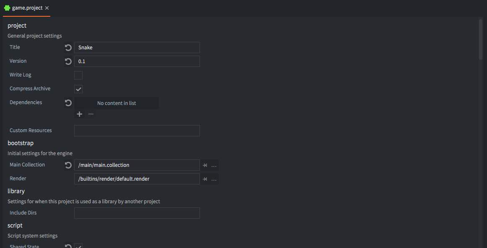

# Ustawienie projektu

Plik *game.project* zawiera wszystkie ustawienia wykorzystywane w projekcie. Jest to specjalny plik i musi pozostać w głównej lokalizacji Twojego projektu, a nazwa musi pozostać niezmieniona - *game.project*. Pierwsza rzeczą jaką zajmuje się silnik Defold zaraz po starcie Twojej gry jest właśnie wyszukanie tego pliku. (W systemie Windows można przypisać plik .project do domyślnego otwierania za pomocą aplikacji Defold)

Każde ustawienie w tym pliku przynależy do konkretnej kategorii. Defold wyświetla ustawienia z tego pliku podzielone właśnie na te kategorie.



Poniżej przedstawiono wszystkie dostępne ustawienia, poukładane w sekcje. Niektóre z nich nie są pokazywane po otwarciu w Edytorze Defold (oznaczono je "hidden setting" (z ang. ukryte ustawienie))), ale wciąż można je zmienić ręcznie otwierając plik *game.project* w edytorze tekstu: <kbd>Open With ▸ Text Editor</kbd>.

## Project

#### Title
Tytuł aplikacji

#### Version
Wersja aplikacji

#### Write Log
Kiedy opcja zapisu logów jest zaznaczona, silnik zapisze wszystkie logi do pliku *log.txt* w głównej lokalizacji Twojego projektu. Gdy uruchomisz grę na systemie iOS, plik można będzie otworzyć przez iTunes w zakładce *Apps* w sekcji *File Sharing*. W systemie Android natomiast, plik jest przechowywany w zewnętrznej lokalizacji aplikacji (ang. app's external storage). Podczas uruchamiania aplikacji deweloperskiej *dmengine*, możesz podejrzeć logi używając komendy:

```bash
$ adb shell cat /mnt/sdcard/Android/data/com.defold.dmengine/files/log.txt
```

#### Compress Archive
Umożliwia kompresowanie archiwów podczas budowania paczki. Zauważ, że dotyczy to wszystkich platform oprócz systemu Android, gdzie plik apk zawiera od razy skompresowane dane.

#### Dependencies
Zależoności - lista adresów URL do projektów bibliotek (*Library URL*s). Więcej szczegółów znajdziesz w [instrukcji do Bibliotek](/manuals/libraries/).

#### Custom Resources
Własne zasoby - lista oddzielonych przecinkami zasobów, które będą dołączone do projektu. Jeśli określone są lokalizacje, wszystkie pliki i katalogi w danej lokalizacji są rekursywnie załączane. Zasoby te można załadować w trakcie działania programu używając [`sys.load_resource()`](/ref/sys/#sys.load_resource).

#### Bundle Resources
Zasoby paczki - lista oddzielonych przecinkami lokalizacji zasobów zawierających pliki i katalogi, które można skopiować w obecnym stanie do paczki wynikowej podczas budowania. Lokalizacje muszą być opisane ścieżkami bezwzględnymi od poziomu głównego katalogu Twojego projektu, np. `/res`. Taka lokalizacja z zasobami musi zawierać podfoldery nazwane zgodnie z platformą (`platform` lub `architecure-platform`).

  Wspierane platformy to: `ios`, `android`, `osx`, `win32`, `linux`, `web`.

  Dozwolony jest również podfolder `common` zawierający zasoby wspólne dla wszystkich platform.

#### Bundle Exclude Resources
Zasoby, które należy usunąć z paczki - lista oddzielonych przecinkami zasobów, które nie będą dołączane do paczki.

## Bootstrap (Ustawienia początkowe)

#### Main Collection
Główna kolekcja - referencja do pliku kolekcji używanej w aplikacji jako startowa, domyślnie: `/logic/main.collection`.

#### Render
Referencja do pliku render określającego sposób renderowania, domyślnie: `/builtins/render/default.render`.

## Library (Biblioteki)

#### Include Dirs
Dołączane lokalizacje - lista oddzielonych spacjami lokalizacji, które będą współdzielone z Twojego projektu poprzez udostępnianie bibliotek.

## Script (Skrypy)

#### Shared State
Stan współdzielony - Gdy opcja ta jest zaznaczona, projekt dzieli wspólny, pojedynczy stan Lua pomiędzy wszystkimi skryptami. Domyślnie odznaczone.

## Engine (silnik)

#### Run While Iconified
Kontynuuj po zminimalizowaniu okna - pozwól silnikowi na kontynuację pracy, gdy okno aplikacji jest zminimalizowane (dotyczy tylko komputerów), domyślnie odznaczone - `false`.

## Display (Wyświetlanie)

#### Width
Szerokość okna aplikacji w pikselach, domyślnie: `960`.

#### Height
Wysokość okna aplikacji w pikselach, domyślnie: `640`.

#### High Dpi
Tworzy bufor High Dpi na wyświetlaczach, które to wspierają. Gra zostanie wyrenderowana w rozdzielczości dwukrotnie większej niż podana w ustawieniach *Width* i *Height*, ale podana rozdzielczość będzie nadal rozdzielczością dla logiki gry.

#### Samples
Określa jak wiele próbek aplikacja ma używać przy anty-aliasingu. Ustawia wartość GLFW_FSAA_SAMPLES dla okna. Domyślnie: `0`, co oznacza, że anty-aliasing jest wyłączony.

#### Fullscreen
Zaznacz, żeby aplikacja startowała w trybie pełnego ekranu. Odznacz, żeby startowała w oknie.

#### Frame Cap
Jeśli opcja `Vsync` jest zaznaczona, przybliż do najbliższego pasującego przedziału wymiany dla ustawionego limiu ramki, jeśli monitor jest wykryty. W przeciwnym przypadku używaj timer'ów w celu zgodności z ustawioną wartością. 0 oznacza, że nie ma limitu. Ustawienie to dotyczy `display.update_frequency`.

#### Vsync
Vertical sync, czyli pionowa synchronizacja - polegaj na sprzętowej synchronizacji do określania czasu ramki. Może być nadpisane w zależności od sterownika karty graficznej i specyfiki platformy.

#### Display Profiles
Profile wyświetlania - określa, których profili używać, domyślnie: `/builtins/render/default.display_profilesc`. Więce szczegółów znajdziesz w [instrukcji do layout'ów GUI](/manuals/gui-layouts/#creating-display-profiles).

#### Dynamic Orientation
Dynamiczna orientacja - zaznacz, żeby pozwolić aplikacji dynamicznie zmieniać między ustawieniem horyzontalnym i portretowym w zależności od orientacji urządzenia. Aplikacja deweloperska dmegine obecnie nie respektuje tego ustawienia.

## Render (Renderowanie)

#### Clear Color Red
Czerwona składowa koloru czyszczenia ekranu, używana przez skrypt renderowania, kiedy okno jest tworzone. Dodano w 1.2.167.

#### Clear Color Green
Zielona składowa koloru czyszczenia ekranu, używana przez skrypt renderowania, kiedy okno jest tworzone. Dodano w 1.2.167.

#### Clear Color Blue
Niebieska składowa koloru czyszczenia ekranu, używana przez skrypt renderowania, kiedy okno jest tworzone. Dodano w 1.2.167.

#### Clear Color Alpha
Składowa koloru czyszczenia ekranu odpowiedzialna za transparentność, używana przez skrypt renderowania, kiedy okno jest tworzone. Dodano w 1.2.167.

## Physics (Fizyka)

#### Type
Jaki typ fizyki jest używany: `2D` (domyślnie) albo `3D`.

#### Gravity Y
Składowa Y wektora siły grawitacji, domyślnie `-10` (ziemska grawitacja).

#### Debug
Zaznacz, żeby wizualizować fizykę do celów debugowania.

#### Debug Alpha
Składowa koloru wizualizacji fizyki odpowiedzialna za transparentność z przedziału `0`--`1`. Domyślnie: `0.9`.

#### World Count
Maksymalna liczba oddzielnych światów z fizyką, domyślnie: `4`. Jeśli wczytujesz więcej niż 4 światy poprzez pełnomocników kolekcji (collection proxies) musisz zwiększyć tę wartość. Pamiętaj, że każdy osobny świat fizyki zajmuje odpowiednią ilość pamięci.

#### Gravity X
Składowa X wektora siły grawitacji, domyślnie `0`.

#### Gravity Z
Składowa Z wektora siły grawitacji, domyślnie `0`.

#### Scale
Skala fizyki - pomaga silnikowi określić w jaki sposób skalować wartości świata fizyki, aby zachować precyzję numeryczną, z przedziału `0.01`--`1.0`. Jeśli ustawisz wartość `0.02`, oznacza to, że świat fizyki będzie postrzegał 50 jednostek jako jeden metr.($1 / 0.02$). Domyślnie: `1.0`.

#### Allow Dynamic Transforms
Zaznacz, aby silnik fizyki skalował obiekty kolizji używając skali obiektów gry, do których należą.

#### Debug Scale
Określa jak duże rysować obiekty służące do debugowania fizyki - np. wektory normalne, domyślnie `30`.

#### Max Collisions
Określa jak wiele kolizji będzie obsługiwanych przez skrypty, domyślnie `64`.

#### Max Contacts
Określa jak wiele punktów styku będzie obsługiwanych przez skrypty, domyślnie `128`.

#### Contact Impulse Limit
Silnik zignoruje zderzenia z impulsem mniejszym niż ta wartość, domyślnie `0.0`.

#### Ray Cast Limit 2d
Maksymalna liczba promieni 2D rzucanych w czasie jednej ramki, domyślnie `64`.

#### Ray Cast Limit 3d
Maksymalna liczba promieni 3D rzucanych w czasie jednej ramki, domyślnie `128`.

#### Trigger Overlap Capacity
Maksymalna liczba pokrywających się przełączników (triggers), domyślnie `16`.

## Graphics (Grafika)

#### Default Texture Min Filter
Określa jakiego filtra używać podczas pomniejszającego filtrowania tekstur, `linear` (domyślnie) lub `nearest`.

#### Default Texture Mag Filter
Określa jakiego filtra używać podczas powiększającego filtrowania tekstur, `linear` (domyślnie) lub `nearest`.

#### Max Draw Calls
Maksymalna liczba wywołań rysowania grafiki (renderowania, ang. render calls), domyślnie `1024`.

#### Max Characters:
Maksymalna liczba znaków zaalokowanych wcześniej w buforze renderowania tekstu, czyli liczba znaków, które można wyświetlić w każdej ramce, domyślnie `8192`.

#### Max Debug Vertices
Maksymalna liczba punktów służących do debugowania, między innymi do rysowania kształtów silnika fizyki, domyślnie `10000`.

#### Texture Profiles
Określa jakiego profilu teksturowania należy używać do tego projektu, domyślnie `/builtins/graphics/default.texture_profiles`.

## Input (Wejścia)

#### Repeat Delay
Czas w sekundach, który należy odczekać po odczytaniu danego wejścia, zanim to samo wejście może zostać powtórzone, domyślnie `0.5`.

#### Repeat Interval
Czas w sekundach, który należy odczekać po odczytaniu danego wejścia, które jest ciągle wciskane, zanim to samo wejście może zostać odczytane jako powtórzone, domyślnie `0.2`.

#### Gamepads
Określa jakiego pliku należy używać do konfiguracji kontrolerów, który mapuje wejścia kontrolera do systemu operacyjnego, domyślnie `/builtins/input/default.gamepads`.

#### Game Binding
Określa jakiego pliku należy używać do konfiguracji wejść, który mapuje wejścia sprzętowe do podanych akcji, domyślnie `/input/game.input_binding`.

#### Use Accelerometer
Zaznacz, żeby silnik mógł otrzymywać dane z akceleratora jako wejście dla każdej ramki. Wyłączenie akcelerometra może dawać korzyści pod względem wydajności. Domyślnie zaznaczone.

## Resource (Źródła)

#### Http Cache
Kiedy zaznaczone, pamięć podręczna (cache) HTTP jest aktywowana, aby szybciej ładować zasoby przez sieć do działającego na urządzeniu silnika. Domyślnie odznaczone.

#### Uri
Wskazuje gdzie szukać danych do budowania projektu, w formacie URI.

#### Max Resources
Maksymalna liczba zasobów, które mogą być załadowane jednocześnie, domyślnie `1024`.

## Network (Sieć)

#### Http Timeout
Czas w sekundach do zaniechania czekania na odpowiedź HTTP. Ustaw na `0`, żeby wyłączyć timeout, domyślnie właśnie wyłączony, czyli czeka na odpowiedź nieskończenie długo.

## Collection (Kolekcje)

#### Max Instances
Maksymalna liczba instancji obiektów gry w jednej kolekcji, domyślnie `1024`.

## Sound (Dźwięk)

#### Gain
Globalne wzmocnienie dźwięku (volume), `0`--`1`, domyślnie `1`.

#### Max Sound Data
Maksymalna liczba źródeł dźwięku, czyli liczba unikalnych plików dźwiękowych, które można otworzyć jednocześnie, domyślnie `128`.

#### Max Sound Buffers
(Obecnie nie używane) Maksymalna liczba jednocześnie istniejących buforów dźwiękowych, domyślnie `32`.

#### Max Sound Sources
(Obecnie nie używane) Maksymalna liczba jednocześnie istniejących źródeł dźwięku, domyślnie `16`.

#### Max Sound Instances
Maksymalna liczba jednocześnie istniejących instancji dźwięku, czyli liczba aktualnych dźwięków odtwarzanych w tym samym momencie, domyślnie `256`.

## Sprite (Obrazy)

#### Max Count
Maksymalna liczba sprite'ów w jednej kolekcji, domyślnie `128`.

#### Subpixels
Zaznacz, aby pozwolić sprite'om pojawiać się nieprzylegając do pełnych pikseli, domyślnie zaznaczone.

## Tilemap (Mapy kafelków)

#### Max Count
Maksymalna liczba map kafelków w jednej kolekcji, domyślnie `16`.

#### Max Tile Count
Maksymalna liczba jednocześnie widocznych kafelków w jednej kolekcji, domyślnie `2048`.

## Spine

#### Max Count
Maksymalna liczba modeli szkieletowych Spine, domyślnie `128`.

## GUI

#### Max Count
Maksymalna liczba komponentów GUI, domyślnie `64`.

#### Max Particlefx Count
Maksymalna liczba jednocześnie istniejących emiterów cząsteczek w GUI, domyślnie `64`.

#### Max Particle Count
Maksymalna liczba jednocześnie istniejących cząsteczek w GUI, domyślnie `1024`.

## Label (Etykieta)

#### Max Count
Maksymalna liczba etykiet z tekstem, domyślnie `64`.

#### Subpixels
Zaznacz, aby pozwolić etykietom pojawiać się nieprzylegając do pełnych pikseli, domyślnie zaznaczone.

## Particle FX (Efekty cząsteczkowe)

#### Max Count
Maksymalna liczba jednocześnie istniejących emiterów cząsteczek, domyślnie `64`.

#### Max Particle Count
Maksymalna liczba jednocześnie istniejących cząsteczek, domyślnie `1024`.

## Collection proxy (Pełnomocnicy kolekcji)

#### Max Count
Maksymalna liczba pełnomocników kolekcji, domyślnie `8`.

## Collection factory (Fabryki kolekcji)

#### Max Count
Maksymalna liczba fabryk kolekcji, domyślnie `128`.

## Factory (Fabryki)

#### Max Count
Maksymalna liczba fabryk, domyślnie `128`.

## iOS

#### App Icon 57x57--180x180
Plik graficzny (.png) używany jako ikona aplikacji o podanych wymiarach `W` &times; `H`.

#### Launch Screen
Plik Storyboard (.storyboard). Więcej szczegółów znajdziesz w [instrukcji do systemu iOS](/manuals/ios/#creating-a-storyboard).

#### Pre Rendered Icons
(Dotyczy iOS 6 i wcześniejszych wersji) Zaznacz, żeby ikony były pre-renderowane. Jeśli ta opcja nie jest zaznaczona ikony będą miały automatycznie dodany świetlistą poświatę.

#### Bundle Identifier
Identyfikator paczki - pozwala systemowi iOS rozpoznawać Twoją aplikację przy aktualizacjach. ID Twojej paczki musi być zarejestrowane przez Apple i być dla niej unikalne. Nie można używać tego samego identyfikatora dla aplikacji iOS i macOS.

#### Info.plist
Jeśli podany - używany będzie określony plik info.plist podczas budowania paczki aplikacji.

#### Entitlements
Uprawnienia - jeśli podane, mogą nadpisać domyślne uprawnienia określone w profilach nadzorujących (`.entitlements`, `.xcent`, `.plist`).

#### Default Language
Domyślny jeżyk aplikacji - używany, jeśli użytkownik nie posiada wybranego preferowanego języka domyślnego w liście `Localizations` (zobacz: [CFBundleDevelopmentRegion](https://developer.apple.com/library/archive/documentation/General/Reference/InfoPlistKeyReference/Articles/CoreFoundationKeys.html#//apple_ref/doc/uid/20001431-130430)). Należy tutaj użyć dwuznakowego symbolu kraju zgodnego ze standardem ISO 639-1, jeśli preferowany język znajduje się w standardzie, w przeciwnym przypadku - trójznakowego symbolu ze standardu ISO 639-2.

#### Localizations
Ustawienia regionalne - pole zawiera oddzielone przecinkami słowa (strings) identyfikujące nazwę języka lub oznaczenie języka ISO wspieranych lokalizacji (zobacz: [CFBundleLocalizations](https://developer.apple.com/library/archive/documentation/General/Reference/InfoPlistKeyReference/Articles/CoreFoundationKeys.html#//apple_ref/doc/uid/20001431-109552)).

## Android

#### App Icon 36x36--192x192
Plik graficzny (.png) używany jako ikona aplikacji o podanych wymiarach `W` &times; `H`.

#### Push Icon Small--LargeXxxhdpi
Plik graficzny (.png) używany jako ikona aplikacji w powiadomieniach *push* systemu Android. Ikony będą używane automatycznie zarówno do lokalnych i zdalnych powiadomień. Jeśli nie podano ikony, domyślna ikona aplikacji będzie używana.

#### Push Field Title
Określa jakie pole z pliku JSON (payload) ma być użyte jako tytuł powiadomienia. Pozostawienie tego pola pustego sprawia, że domyślnie używana jest nazwa aplikacji.

#### Push Field Text
Określa jakie pole z pliku JSON (payload) ma być użyte jako treść powiadomienia. Pozostawienie tego pola pustego sprawia, że domyślnie używany jest tekst `alert`, tak jak dla iOS.

#### Version Code
Kod wersji - wartość numeryczna całkowita (integer) określająca wersję aplikacji. Zwiększaj tę wartość przy każdej aktualizacji.

#### Package
Identyfikator paczki.

#### Gcm Sender Id
Google Cloud Messaging Sender Id. Podaj tutaj string przypisany przez Google, aby aktywować powiadomienia *push*.

#### Manifest
Plik XML - jeśli podany, będzie używany podczas budowania paczki.

#### Iap Provider
Określa jakiego sklepu używać do zakupów wewnątrz aplikacji (ang. In App Purchases). Możliwe opcje to `Amazon` i `GooglePlay` (domyślnie).

#### Input Method
Określa jakich sposobów obsługi klawiatury na urządzeniach z Androidem używać. Możliwe opcje to `KeyEvent` (stara metoda, domyślna) i `HiddenInputField` (nowa).

#### Immersive Mode
Tryb imersyjny. Jeśli ustawiony, ukrywa przyciski nawigacji i górny pasek statusu systemu Android oraz pozwala aplikacji na wykrywanie i przechwytywanie dotyku na powierzchni całego ekranu.

#### Debuggable
Określa czy aplikacja może być debugowana używając takich narzędzi jak [GAPID](https://github.com/google/gapid) lub [Android Studio](https://developer.android.com/studio/profile/android-profiler). Ustawia flagę `android:debuggable` w manifeście systemu Android.

## macOS

#### App Icon
Plik graficzny (.png) używany jako ikona aplikacji w systemie macOS.

#### Info.plist
Jeśli podany - używany będzie określony plik info.plist podczas budowania paczki aplikacji.

#### Bundle Identifier
Identyfikator paczki - pozwala systemowi iOS rozpoznawać Twoją aplikację przy aktualizacjach. ID Twojej paczki musi być zarejestrowane przez Apple i być dla niej unikalne. Nie można używać tego samego identyfikatora dla aplikacji iOS i macOS.

#### Default Language
Domyślny jeżyk aplikacji - używany, jeśli użytkownik nie posiada wybranego preferowanego języka domyślnego w liście `Localizations` (zobacz: [CFBundleDevelopmentRegion](https://developer.apple.com/library/archive/documentation/General/Reference/InfoPlistKeyReference/Articles/CoreFoundationKeys.html#//apple_ref/doc/uid/20001431-130430)). Należy tutaj użyć dwuznakowego symbolu kraju zgodnego ze standardem ISO 639-1, jeśli preferowany język znajduje się w standardzie, w przeciwnym przypadku - trójznakowego symbolu ze standardu ISO 639-2.

#### Localizations
Ustawienia regionalne - pole zawiera oddzielone przecinkami słowa (strings) identyfikujące nazwę języka lub oznaczenie języka ISO wspieranych lokalizacji (zobacz: [CFBundleLocalizations](https://developer.apple.com/library/archive/documentation/General/Reference/InfoPlistKeyReference/Articles/CoreFoundationKeys.html#//apple_ref/doc/uid/20001431-109552)).

## Windows

#### App Icon
Plik graficzny (.ico) używany jako ikona aplikacji w systemie Windows. Więcej szczegółów na temat tworzenia plików .ico znajdziesz w [instrukcji do systemu Windows](/manuals/windows).

#### Iap Provider
Określa jakiego sklepu używać do zakupów wewnątrz aplikacji (ang. In App Purchases). Możliwe opcje to `None`(domyślnie) i `Gameroom`.

## HTML5

#### Heap Size
Rozmiar sterty (liczba megabajtów) dla użycia przez Emscripten. Domyślnie 256MB.

#### .html Shell
Używaj określonego szablonu HTML podczas budowania paczki aplikacji, domyślnie: `/builtins/manifests/web/engine_template.html`.

#### Custom .css
Używaj określonego pliku z motywem CSS podczas budowania paczki aplikacji, domyślnie: `/builtins/manifests/web/light_theme.css`.

#### Splash Image
Jeśli określony, użyj podanej grafiki jako ekranu startowego podczas budowania paczki aplikacji zamiast domyślnego logo Defold.

#### Archive Location Prefix
Podczas budowania paczki aplikacji dane gry HTML5 są rozdzielane na jeden lub więcej plików archiwów. Kiedy silnik uruchamia aplikację, archiwa te są ładowane do pamięci. Użyj tego pola, aby określić lokalizację danych, domyślnie: `archive`.

#### Archive Location Suffix
Przyrostek dodawany do plików archiwów. Użyteczny na przykład przy wymuszaniu nie-buforowanych (non-cache) zawartości z CDN (na przykład: `?version2`).

#### Engine Arguments
Lista argumentów, które zostaną przekazane do silnika.

#### Show Fullscreen Button
Dodaje przycisk trybu pełnoekranowego do pliku `index.html`. Domyślnie `true`.

#### Show Made With Defold
Dodaje link Made With Defold link do pliku `index.html`. Domyślnie `true`.

#### Scale Mode
Określa jakiego sposobu skalowania kanwy (obszaru wyświetlania) gry używać. Domyślnie `Downscale Fit`.

## IAP (Zakupy wewnątrz aplikacji)

#### Auto Finish Transactions
Zaznacz, żeby automatycznie kończyć proces transakcji zakupów IAP. Jeśli odznaczony, musisz jawnie wywołać `iap.finish()` po udanej transakcji, domyślnie zaznaczony.

## Live update (Aktualizacje na żywo)

#### Private Key
Jeśli zaznaczone, użyj podanego klucza prywatnego podczas budowania paczki aplikacji z zawartością do aktualizacji *live update*. Jeśli nie podany, zostanie automatycznie wygenerowany.

#### Public Key
Jeśli zaznaczone, użyj podanego klucza publicznego podczas budowania paczki aplikacji z zawartością do aktualizacji *live update*. Jeśli nie podany, zostanie automatycznie wygenerowany.

## Native extension (Rozszerzenia natywne)

#### _App Manifest_
Jeśli zaznaczone, użyj manifestu aplikacji do personalizacji wersji silnika (engine build). Pozwala to na usunięcie zbędnych części z silnika umożliwiając zmniejszenie ostatecznej wagi aplikacji. Funkcjonalność ta jest w wersji alpha. Odwiedź porszę [ten post na forum](https://forum.defold.com/t/native-extensions/4946/142), aby dowiedzieć się więcej.

## Profiler

#### Track Cpu
Jeśli zaznaczone, aktywowane będzie profilowanie CPU w wersji release. Normalnie można profilować tylko w wersji debug.

## Format pliku

Format pliku z ustawieniami jest plikiem tekstowym (INI format) i może być dowolnie modyfikowany przez każdy edytor tekstu. Format wygląda następująco:

```ini
[category1]
setting1 = value
setting2 = value
[category2]
...
```

Przykład:

```ini
[bootstrap]
main_collection = /main/main.collectionc
```

co oznacza, że ustawienie *main_collection* należy do kategorii *bootstrap*.
Kiedy używana jest referencja do pliku, jak w powyższym przykładzie, ścieżka musi być zakończona znakiem 'c', co oznacza, że odnosisz się do skompilowanej wersji pliku.
Zauważ również, że folder zawieracjący plik *game.project* będzie folderem głównym projektu (root), stąd początkowy znak '/' w ścieżce do pliku.

## Ustawianie wartości przy starcie silnika

Kiedy silnik zostaje uruchomiony jest możliwe podanie wartości konfiguracji z lini wiersza poleceń, które nadpiszą wartości w pliku *game.project*:

```bash
# Określ kolekcę główną/bootstrapową
$ dmengine --config=bootstrap.main_collection=/my.collectionc

# Ustaw dwie wartości:
$ dmengine --config=test.my_value=4711 --config=test2.my_value2=1234
```

Twoje wartości mogą ---tak jak każde inne wartości konfiguracji--- być odczytane w trakcie działania aplikacji dzięki funkcji [`sys.get_config()`](/ref/sys/#sys.get_config):

```lua
local my_value = tonumber(sys.get_config("test.my_value"))
```

## Vsync, frame cap, i swap interval
Po pierwsze na komputerach osobistych opcja `Vsync` (synchronizacja pionowa) może być kontrolowana globalnie przez ustawienia karty graficznej. Jeśli przykładowo opcja vsync jest wymuszona jako ustawiona w panelu kontrolnym karty graficznej, nie jest już możliwe zmienienie jej z poziomu użytkownika, czyli Defold nie może mieć do niej dostępu ani jej zmodyfikować. Większość urządzeń ma opcję vsync uruchomioną domyślnie.

Kiedy opcja `Vsync` jest zaznaczona w pliku *game.project* silnik będzie polegał na sprzętowym wsparciu synchronizacji pionowej i używał stałej wartości długości ramki `dt` bazującej na wartości częstotliwości odświeżania monitora. Jest to domyślne ustawienie. Kiedy opcja `Vsync` jest zaznaczona, a `Frame cap` > 0, wartość długości będzie zmniejszona do interwału przejścia odpowiadającego częstotliwości odświeżania głównego wykrytego monitora. Kiedy opcja `Vsync` jest odznaczona, a `Frame cap` = 0, wartość długości ramki nie jest stała, tylko używa aktualnej przyblizonej wartości różnicy czasowej dla wartości `dt`. Kiedy opcja `Vsync` jest odznaczona, a `Frame cap` > 0, używane są timery, aby dostosować się do podanej wartości frame cap. Nie ma niestety gwarancji, że wartość frame cap zostanie osiągnięta na różnych platformach i w zależności od różnych ustawień sprzętowych.

Interwał zmiany (Swap interval) jest przedziałem czasowym określającym kiedy zamienić przedni i tylni bufor podczas synchronizacji z pionowymi pustkami (vertical blanks - v-blank), sprzętowe wydarzenie, gdzie ekran jest aktualizowany danymi z przedniego bufora. Wartość 1 pozwala na zamianę buforów przy każdym v-blanku, wartość 2 zamienia bufory przy co drugim v-blanku itd. Wartość 0 wyłącza oczekiwanie na v-blank przed zamianą buforów\*. Ustawienie `swap_interval` można zmienić dzięki funkcji [```set_vsync_swap_interval```](/ref/sys/#sys.set_vsync_swap_interval:swap_interval).

### Zastrzeżenie
Obecnie, Defold odpytuje o częstotliwość odświeżania monitora podczas inicjalizacji silnika i używa tej wartości jako bazy przy wyborze stałej wartości `dt`. Jeśli chcesz wspierać monitory ze zmienną wartością częstotliwości odświeżania (np. GSync albo FreeSync) lub w innych scenariuszach gdzie wartość częstotliwości odświeżania nie jest trywialna do ustalenia, odznacz opcję `Vsync`, żeby pozwolić silnikowi dobrać `dt` podczas każdej ramki, zamiast polegać na stałej wartości.

### Vsync i frame cap w Defoldzie*

<table>
  <tr>
    <th></th>
    <th><b>Frame cap 0 (default)</b></th>
    <th><b>Frame cap > 0</b></th>
  </tr>
  <tr>
    <td><b>Vsync checked (default)</b></td>
    <td>Relies on hardware vsync. Fixed <code>dt</code> of <code>1/(detected monitor refresh rate)</code>.</td>
    <td>Fixed <code>dt</code> of <code>(swap interval)/(detected monitor refresh rate)</code> where swap interval is clamped to the closest matching monitor refresh rate frame cap multiple.</td>
  </tr>
  <tr>
    <td><b>Vsync unchecked</b></td>
    <td>Calculates <code>dt</code> each frame based on elapsed system time. Vsync might still be enabled in driver settings.</td>
    <td>Uses a fixed <code>dt</code> of <code>1 / (Frame cap)</code>. Uses timers and sleeps to respect the set frame cap.</td>
  </tr>
</table>
