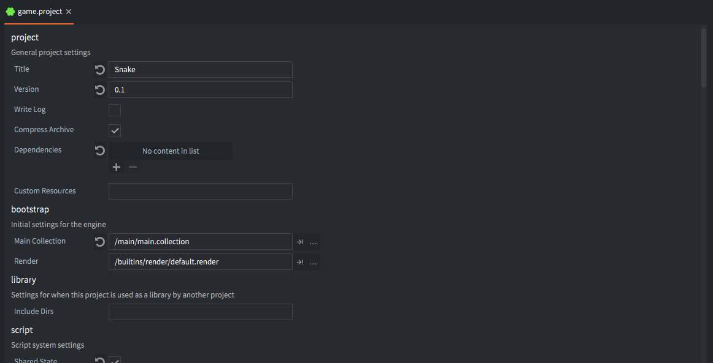

# Ustawienia projektu

Plik *game.project* zawiera wszystkie ustawienia obowiązujące w całym projekcie. Musi znajdować się w katalogu głównym projektu i musi mieć nazwę *game.project*. Pierwszą rzeczą, jaką silnik robi podczas uruchamiania gry, jest odszukanie tego pliku.

Każde ustawienie w tym pliku należy do kategorii. Po otwarciu pliku Defold prezentuje wszystkie ustawienia pogrupowane według kategorii.



## Format pliku

Ustawienia w *game.project* zwykle zmienia się z poziomu Defold, ale plik można też edytować w dowolnym standardowym edytorze tekstu. Plik używa standardowego formatu INI i wygląda tak:

```ini
[category1]
setting1 = value
setting2 = value
[category2]
...
```

Prawdziwy przykład:

```ini
[bootstrap]
main_collection = /main/main.collectionc
```

co oznacza, że ustawienie *main_collection* należy do kategorii *bootstrap*. Gdy używasz odwołania do pliku, jak w powyższym przykładzie, ścieżka musi zostać zakończona literą 'c', co oznacza odwołanie do skompilowanej wersji pliku. Zwróć też uwagę, że katalog zawierający *game.project* jest katalogiem głównym projektu, dlatego ścieżka ustawienia zaczyna się od /.

## Dostęp w czasie działania

Każdą wartość z *game.project* można odczytać w czasie działania za pomocą funkcji [`sys.get_config_string(key)`](/ref/sys/#sys.get_config_string), [`sys.get_config_number(key)`](/ref/sys/#sys.get_config_number) i [`sys.get_config_int(key)`](/ref/sys/#sys.get_config_int). Przykłady:

```lua
local title = sys.get_config_string("project.title")
local gravity_y = sys.get_config_number("physics.gravity_y")
```

::: sidenote
Klucz jest połączeniem nazwy kategorii i nazwy ustawienia, oddzielonych kropką, zapisanym małymi literami, a spacje zastępuje się znakami podkreślenia. Na przykład pole "Title" z kategorii "Project" staje się `project.title`, a pole "Gravity Y" z kategorii "Physics" staje się `physics.gravity_y`.
:::

## Sekcje i ustawienia

Poniżej znajdują się wszystkie dostępne ustawienia, uporządkowane według kategorii.

### Project

#### Title
Tytuł aplikacji.

#### Version
Wersja aplikacji.

#### Publisher
Nazwa wydawcy.

#### Developer
Nazwa dewelopera.

#### Write Log File
Określa, kiedy silnik zapisuje plik logu. Dostępne opcje:

- "Never": nie zapisuj pliku logu.
- "Debug": zapisuj plik logu tylko dla buildów Debug.
- "Always": zapisuj plik logu zarówno dla buildów Debug, jak i Release.

Jeśli uruchamiasz z edytora więcej niż jedną instancję, plik będzie miał nazwę *instance_2_log.txt*, gdzie `2` oznacza indeks instancji. Przy pojedynczej instancji lub uruchomieniu z bundla plik będzie miał nazwę *log.txt*. Lokalizacja pliku logu będzie jedną z poniższych ścieżek, sprawdzanych w tej kolejności:

1. Ścieżka określona w *project.log_dir* (ukryte ustawienie)
2. Systemowa ścieżka logów:
  * macOS/iOS: `NSDocumentDirectory`
  * Android: `Context.getExternalFilesDir()`
  * Pozostałe platformy: katalog główny aplikacji
3. Ścieżka danych wsparcia aplikacji:
  * macOS/iOS: `NSApplicationSupportDirectory`
  * Windows: `CSIDL_APPDATA` (na przykład `C:\Users\<username>\AppData\Roaming`)
  * Android: `Context.getFilesDir()`
  * Linux: zmienna środowiskowa `HOME`

#### Minimum Log Level
Określa minimalny poziom logowania. Wyświetlane będą tylko komunikaty na tym poziomie lub wyższym.

#### Compress Archive
Włącza kompresję archiwów podczas bundlowania. Obecnie dotyczy to wszystkich platform poza Androidem, gdzie plik APK i tak zawiera już skompresowane dane.

#### Dependencies
Lista adresów URL do projektów będących *Library URL*. Więcej informacji znajdziesz w [instrukcji Libraries](/manuals/libraries/).

#### Custom Resources
`custom_resources`
:[Zasoby niestandardowe](../shared/custom-resources.md)

Ładowanie zasobów niestandardowych opisano dokładniej w [instrukcji File Access](/manuals/file-access/#how-to-access-files-bundled-with-the-application).

#### Bundle Resources
`bundle_resources`
:[Zasoby bundla](../shared/bundle-resources.md)

Ładowanie zasobów bundla opisano dokładniej w [instrukcji File Access](/manuals/file-access/#how-to-access-files-bundled-with-the-application).

#### Bundle Exclude Resources
`bundle_exclude_resources`
Lista zasobów rozdzielonych przecinkami, które nie powinny zostać dołączone do bundla. Są usuwane z wyniku kroku zbierania zasobów `bundle_resources`.

---

### Bootstrap

#### Main Collection
Odwołanie do pliku kolekcji używanej do uruchamiania aplikacji. Domyślnie `/logic/main.collection`.

#### Render
Plik konfiguracji renderowania definiujący pipeline renderowania. Domyślnie `/builtins/render/default.render`.

---

### Library

#### Include Dirs
Lista katalogów rozdzielonych spacjami, które mają być współdzielone z projektu przez mechanizm bibliotek. Więcej informacji znajdziesz w [instrukcji Libraries](/manuals/libraries/).

---

### Script

#### Shared State
Zaznacz, aby współdzielić pojedynczy stan Lua między wszystkimi typami skryptów.

---

### Engine

#### Run While Iconified
Pozwala silnikowi działać dalej, gdy okno aplikacji jest zminimalizowane lub zredukowane do ikony. Dotyczy tylko platform desktopowych.

#### Fixed Update Frequency
Częstotliwość aktualizacji funkcji cyklu życia `fixed_update(self, dt)`, wyrażona w hercach.

#### Max Time Step
Jeśli krok czasu w pojedynczej klatce stanie się zbyt duży, zostanie ograniczony do tej maksymalnej wartości. Jednostką są sekundy.

---

### Display

#### Width
Szerokość okna aplikacji w pikselach.

#### Height
Wysokość okna aplikacji w pikselach.

#### High Dpi
Tworzy bufor o wysokim DPI na wyświetlaczach, które to obsługują. Zwykle gra będzie renderowana w rozdzielczości dwukrotnie wyższej od ustawień *Width* i *Height*, ale nadal będzie to logiczna rozdzielczość używana w skryptach i właściwościach.

#### Samples
Liczba próbek używanych do supersamplingu antyaliasingu. Ustawia wartość podpowiedzi okna GLFW_FSAA_SAMPLES. Wartość `0` wyłącza antyaliasing.

#### Fullscreen
Zaznacz, jeśli aplikacja ma startować w trybie pełnoekranowym. Gdy pole nie jest zaznaczone, aplikacja uruchomi się w oknie.

#### Update Frequency
Docelowa liczba klatek na sekundę, wyrażona w hercach. Ustaw 0, aby używać zmiennej liczby klatek. Wartość większa od 0 powoduje użycie stałej liczby klatek ograniczanej w czasie działania do rzeczywistej częstotliwości, co oznacza, że pętla gry nie może zostać wykonana dwa razy w ramach jednej klatki silnika. Wartość można zmieniać w czasie działania funkcją [`sys.set_update_frequency(hz)`](https://defold.com/ref/stable/sys/?q=set_update_frequency#sys.set_update_frequency:frequency). To ustawienie działa także w buildach headless.

#### Swap interval
Ta liczba całkowita steruje sposobem obsługi vsync. 0 wyłącza vsync, a wartością domyślną jest 1. Przy adapterze OpenGL wartość określa liczbę klatek pomiędzy [zamianami buforów](https://www.khronos.org/opengl/wiki/Swap_Interval). W przypadku Vulkana nie istnieje wbudowane pojęcie swap interval, więc wartość określa po prostu, czy vsync ma być włączony.

#### Vsync
Polegaj na sprzętowym vsync przy wyznaczaniu czasu klatki. To ustawienie może zostać nadpisane przez sterownik graficzny lub specyfikę platformy. Aby uzyskać przestarzałe zachowanie 'variable_dt', odznacz tę opcję i ustaw limit liczby klatek na 0.

#### Display Profiles
Określa plik profili wyświetlania, którego należy użyć. Domyślnie `/builtins/render/default.display_profilesc`. Więcej informacji znajdziesz w [instrukcji GUI Layouts](/manuals/gui-layouts/#creating-display-profiles).

#### Dynamic Orientation
Zaznacz, jeśli aplikacja ma dynamicznie przełączać się między orientacją pionową i poziomą po obróceniu urządzenia. Aplikacja deweloperska obecnie nie respektuje tego ustawienia.

#### Display Device Info
Wypisuje informacje o GPU do konsoli podczas uruchamiania.

---

### Render

#### Clear Color Red
Czerwony kanał koloru czyszczenia, używany przez skrypt renderujący i podczas tworzenia okna.

#### Clear Color Green
Zielony kanał koloru czyszczenia, używany przez skrypt renderujący i podczas tworzenia okna.

#### Clear Color Blue
Niebieski kanał koloru czyszczenia, używany przez skrypt renderujący i podczas tworzenia okna.

#### Clear Color Alpha
Kanał alfa koloru czyszczenia, używany przez skrypt renderujący i podczas tworzenia okna.

---

### Font

#### Runtime Generation
Używa generowania fontów w czasie działania.

---

### Physics

#### Max Collision Object Count
Maksymalna liczba obiektów kolizji.

#### Type
Typ fizyki, którego należy użyć: `2D` albo `3D`.

#### Gravity X
Grawitacja świata wzdłuż osi X, w metrach na sekundę.

#### Gravity Y
Grawitacja świata wzdłuż osi Y, w metrach na sekundę.

#### Gravity Z
Grawitacja świata wzdłuż osi Z, w metrach na sekundę.

#### Debug
Zaznacz, aby wizualizować fizykę do celów debugowania.

#### Debug Alpha
Wartość składowej alfa dla wizualizacji fizyki, z zakresu `0`--`1`.

#### World Count
Maksymalna liczba jednoczesnych światów fizyki. Domyślnie `4`. Jeśli przez pełnomocników kolekcji wczytujesz więcej niż 4 światy jednocześnie, musisz zwiększyć tę wartość. Pamiętaj, że każdy świat fizyki zużywa sporą ilość pamięci.

#### Scale
Informuje silnik fizyki, jak skalować świat fizyczny względem świata gry dla zachowania precyzji numerycznej, w zakresie `0.01`--`1.0`. Jeśli wartość wynosi `0.02`, oznacza to, że silnik fizyki traktuje 50 jednostek jako 1 metr ($1 / 0.02$).

#### Allow Dynamic Transforms
Zaznacz, jeśli silnik fizyki ma stosować transformację obiektu gry do dołączonych komponentów obiektu kolizji. Umożliwia to przesuwanie, skalowanie i obracanie kształtów kolizji, także tych dynamicznych.

#### Use Fixed Timestep
Zaznacz, jeśli silnik fizyki ma używać stałych, niezależnych od liczby klatek aktualizacji. Tego ustawienia należy używać razem z funkcją cyklu życia `fixed_update(self, dt)` oraz ustawieniem projektu `engine.fixed_update_frequency`, aby wchodzić w interakcję z fizyką w regularnych odstępach. Dla nowych projektów zalecaną wartością jest `true`.

#### Debug Scale
Określa rozmiar obiektów jednostkowych rysowanych w debugowaniu fizyki, takich jak osie lokalne i normalne.

#### Max Collisions
Określa, ile kolizji zostanie przekazanych do skryptów.

#### Max Contacts
Określa, ile punktów kontaktu zostanie przekazanych do skryptów.

#### Contact Impulse Limit
Ignoruje impulsy kontaktu o wartościach mniejszych niż to ustawienie.

#### Ray Cast Limit 2d
Maksymalna liczba zapytań ray cast 2D na klatkę.

#### Ray Cast Limit 3d
Maksymalna liczba zapytań ray cast 3D na klatkę.

#### Trigger Overlap Capacity
Maksymalna liczba nakładających się triggerów fizyki.

#### Velocity Threshold
Minimalna prędkość powodująca zderzenia sprężyste.

#### Max Fixed Timesteps
Maksymalna liczba kroków symulacji przy użyciu stałego kroku czasu. Dotyczy tylko 3D.

---

### Graphics

#### Default Texture Min Filter
Określa filtr używany przy minifikacji tekstur.

#### Default Texture Mag Filter
Określa filtr używany przy magnifikacji tekstur.

#### Max Draw Calls
Maksymalna liczba wywołań renderowania.

#### Max Characters:
Liczba znaków prealokowanych w buforze renderowania tekstu, czyli liczba znaków możliwych do wyświetlenia w każdej klatce.

#### Max Font Batches
Maksymalna liczba partii tekstu, które można wyświetlić w każdej klatce.

#### Max Debug Vertices
Maksymalna liczba wierzchołków debugowania. Używana między innymi do renderowania kształtów fizyki.

#### Texture Profiles
Plik profili teksturowania używany przez projekt, domyślnie `/builtins/graphics/default.texture_profiles`.

#### Verify Graphics Calls
Sprawdza wartość zwrotną po każdym wywołaniu grafiki i raportuje błędy w logu.

#### OpenGL Version Hint
Podpowiedź dotycząca wersji kontekstu OpenGL. Jeśli wybierzesz konkretną wersję, będzie ona używana jako minimalnie wymagana wersja. Nie dotyczy OpenGL ES.

#### OpenGL Core Profile Hint
Ustawia podpowiedź profilu 'core' podczas tworzenia kontekstu. Profil core usuwa wszystkie przestarzałe funkcje OpenGL, takie jak renderowanie w trybie immediate. Nie dotyczy OpenGL ES.

---

### Shader

#### Exclude GLES 2.0
Nie kompiluj shaderów dla urządzeń używających OpenGLES 2.0 / WebGL 1.0.

---

### Input

#### Repeat Delay
Liczba sekund oczekiwania, zanim przytrzymane wejście zacznie się powtarzać.

#### Repeat Interval
Liczba sekund pomiędzy kolejnymi powtórzeniami przytrzymanego wejścia.

#### Gamepads
Odwołanie do pliku konfiguracji gamepadów mapującego sygnały gamepada na system operacyjny. Domyślnie `/builtins/input/default.gamepads`.

#### Game Binding
Odwołanie do pliku konfiguracji wejść mapującego sprzętowe wejścia na akcje. Domyślnie `/input/game.input_binding`.

#### Use Accelerometer
Zaznacz, aby silnik otrzymywał zdarzenia z akcelerometru w każdej klatce. Wyłączenie akcelerometru może przynieść pewne korzyści wydajnościowe.

---

### Resource

#### Http Cache
Po zaznaczeniu włącza pamięć podręczną HTTP, aby szybciej ładować przez sieć zasoby do silnika uruchomionego na urządzeniu.

#### Uri
Określa lokalizację danych builda projektu w formacie URI.

#### Max Resources
Maksymalna liczba zasobów, które mogą być załadowane jednocześnie.

---

### Network

#### Http Timeout
Limit czasu HTTP w sekundach. Ustaw `0`, aby wyłączyć limit czasu.

#### Http Thread Count
Liczba wątków roboczych używanych przez usługę HTTP.

#### Http Cache Enabled
Zaznacz, aby włączyć pamięć podręczną HTTP dla żądań sieciowych wykonywanych przez `http.request()`. Cache HTTP przechowuje odpowiedź skojarzoną z żądaniem i ponownie używa jej przy kolejnych żądaniach. Obsługiwane są nagłówki odpowiedzi `ETag` i `Cache-Control: max-age`.

#### SSL Certificates
Plik zawierający główne certyfikaty SSL używane przy weryfikacji łańcucha certyfikatów podczas handshake SSL.

---

### Collection

#### Max Instances
Maksymalna liczba instancji obiektów gry w kolekcji. Domyślnie `1024`. Zobacz też informacje o [optymalizacji liczników maksymalnych komponentów](#component-max-count-optimizations).

#### Max Input Stack Entries
Maksymalna liczba obiektów gry na stosie wejścia.

---

### Sound

#### Gain
Globalne wzmocnienie dźwięku (głośność), `0`--`1`.

#### Use Linear Gain
Po włączeniu wzmocnienie jest liniowe. Po wyłączeniu używana jest krzywa wykładnicza.

#### Max Sound Data
Maksymalna liczba zasobów dźwiękowych, czyli unikalnych plików dźwiękowych dostępnych w czasie działania.

#### Max Sound Buffers
(Obecnie nieużywane) Maksymalna liczba jednoczesnych buforów dźwięku.

#### Max Sound Sources
(Obecnie nieużywane) Maksymalna liczba jednocześnie odtwarzanych dźwięków.

#### Max Sound Instances
Maksymalna liczba jednoczesnych instancji dźwięku, czyli rzeczywistych dźwięków odtwarzanych w tym samym momencie.

#### Max Component Count
Maksymalna liczba komponentów dźwięku w jednej kolekcji.

#### Sample Frame Count
Liczba próbek używanych przy każdej aktualizacji audio. 0 oznacza tryb automatyczny (1024 dla 48 kHz, 768 dla 44.1 kHz).

#### Use Thread
Po zaznaczeniu system dźwięku używa wątków do odtwarzania audio, aby zmniejszyć ryzyko zacięć, gdy główny wątek jest mocno obciążony.

#### Stream Enabled
Po zaznaczeniu system dźwięku używa streamingu do ładowania plików źródłowych.

#### Stream Cache Size
Maksymalny rozmiar cache fragmentów dźwięku zawierającego wszystkie fragmenty. Domyślnie `2097152` bajty. Ta wartość powinna być większa niż liczba załadowanych plików dźwiękowych pomnożona przez rozmiar fragmentu streamingu. W przeciwnym razie nowe fragmenty mogą być usuwane z cache w każdej klatce.

#### Stream Chunk Size
Rozmiar w bajtach każdego fragmentu ładowanego strumieniowo.

#### Stream Preload Size
Określa rozmiar w bajtach początkowego fragmentu plików dźwiękowych wczytywanych z archiwum.

---

### Sprite

#### Max Count
Maksymalna liczba sprite'ów w jednej kolekcji. Zobacz też informacje o [optymalizacji liczników maksymalnych komponentów](#component-max-count-optimizations).

#### Subpixels
Zaznacz, aby pozwolić sprite'om pojawiać się poza siatką pełnych pikseli.

---

### Tilemap

#### Max Count
Maksymalna liczba map kafelków w jednej kolekcji. Zobacz też informacje o [optymalizacji liczników maksymalnych komponentów](#component-max-count-optimizations).

#### Max Tile Count
Maksymalna liczba jednocześnie widocznych kafelków w jednej kolekcji.

---

### Spine

#### Max Count
Maksymalna liczba komponentów modelu Spine. Zobacz też informacje o [optymalizacji liczników maksymalnych komponentów](#component-max-count-optimizations).

---

### Mesh

#### Max Count
Maksymalna liczba komponentów Mesh w jednej kolekcji. Zobacz też informacje o [optymalizacji liczników maksymalnych komponentów](#component-max-count-optimizations).

---

### Model

#### Max Count
Maksymalna liczba komponentów Model w jednej kolekcji. Zobacz też informacje o [optymalizacji liczników maksymalnych komponentów](#component-max-count-optimizations).

#### Split Meshes
Podziel siatki mające więcej niż 65536 wierzchołków na nowe siatki.

#### Max Bone Matrix Texture Width
Maksymalna szerokość tekstury macierzy kości. Używany jest tylko rozmiar potrzebny animacjom, zaokrąglany w górę do najbliższej potęgi dwójki.

#### Max Bone Matrix Texture Height
Maksymalna wysokość tekstury macierzy kości. Używany jest tylko rozmiar potrzebny animacjom, zaokrąglany w górę do najbliższej potęgi dwójki.

---

### GUI

#### Max Count
Maksymalna liczba komponentów GUI. Zobacz też informacje o [optymalizacji liczników maksymalnych komponentów](#component-max-count-optimizations).

#### Max Particle Count
Maksymalna liczba jednoczesnych cząsteczek w GUI.

#### Max Animation Count
Maksymalna liczba aktywnych animacji w GUI.

---

### Label

#### Max Count
Maksymalna liczba etykiet. Zobacz też informacje o [optymalizacji liczników maksymalnych komponentów](#component-max-count-optimizations).

#### Subpixels
Zaznacz, aby pozwolić etykietom pojawiać się poza siatką pełnych pikseli.

---

### Particle FX

#### Max Count
Maksymalna liczba jednoczesnych emiterów. Zobacz też informacje o [optymalizacji liczników maksymalnych komponentów](#component-max-count-optimizations).

#### Max Particle Count
Maksymalna liczba jednoczesnych cząsteczek.

---

### Box2D

#### Velocity Iterations
Liczba iteracji prędkości dla solvera fizyki Box2D 2.2.

#### Position Iterations
Liczba iteracji pozycji dla solvera fizyki Box2D 2.2.

#### Sub Step Count
Liczba podkroków dla solvera fizyki Box2D 3.x.

---

### Collection proxy

#### Max Count
Maksymalna liczba pełnomocników kolekcji. Zobacz też informacje o [optymalizacji liczników maksymalnych komponentów](#component-max-count-optimizations).

---

### Collection factory

#### Max Count
Maksymalna liczba fabryk kolekcji. Zobacz też informacje o [optymalizacji liczników maksymalnych komponentów](#component-max-count-optimizations).

---

### Factory

#### Max Count
Maksymalna liczba fabryk obiektów gry. Zobacz też informacje o [optymalizacji liczników maksymalnych komponentów](#component-max-count-optimizations).

---

### iOS

#### App Icon 57x57--180x180
Plik obrazu .png używany jako ikona aplikacji dla podanych wymiarów `W` &times; `H`.

#### Launch Screen
Plik storyboard .storyboard. Więcej informacji o tworzeniu storyboardu znajdziesz w [instrukcji iOS](/manuals/ios/#creating-a-storyboard).

#### Icons Asset
Plik zasobu ikon .car zawierający ikony aplikacji.

#### Prerendered Icons
(iOS 6 i starsze) Zaznacz, jeśli ikony są prerenderowane. Gdy to pole nie jest zaznaczone, ikony zostaną automatycznie wzbogacone o błyszczący efekt.

#### Bundle Identifier
Identyfikator bundla pozwalający iOS rozpoznawać aktualizacje aplikacji. Musi być zarejestrowany w Apple i unikalny dla aplikacji. Nie można używać tego samego identyfikatora dla aplikacji iOS i macOS. Musi składać się z co najmniej dwóch segmentów oddzielonych kropką. Każdy segment musi zaczynać się literą i może zawierać tylko litery alfanumeryczne, znak podkreślenia lub myślnik (-). Zobacz [`CFBundleIdentifier`](https://developer.apple.com/library/archive/documentation/General/Reference/InfoPlistKeyReference/Articles/CoreFoundationKeys.html#//apple_ref/doc/uid/20001431-130430).

#### Bundle Name
Krótka nazwa bundla, maksymalnie 15 znaków. Zobacz [`CFBundleName`](https://developer.apple.com/library/archive/documentation/General/Reference/InfoPlistKeyReference/Articles/CoreFoundationKeys.html#//apple_ref/doc/uid/20001431-130430).

#### Bundle Version
Wersja bundla zapisana jako liczba albo x.y.z. Zobacz [`CFBundleVersion`](https://developer.apple.com/library/archive/documentation/General/Reference/InfoPlistKeyReference/Articles/CoreFoundationKeys.html#//apple_ref/doc/uid/20001431-130430).

#### Info.plist
Jeśli ustawiono, podczas bundlowania aplikacji zostanie użyty wskazany plik *`info.plist`*.

#### Privacy Manifest
Apple Privacy Manifest dla aplikacji. Domyślna wartość pola to `/builtins/manifests/ios/PrivacyInfo.xcprivacy`.

#### Custom Entitlements
Jeśli ustawiono, uprawnienia z dostarczonego profilu provisioning (`.entitlements`, `.xcent`, `.plist`) zostaną połączone z uprawnieniami z profilu provisioning podanego podczas bundlowania aplikacji.

#### Default Language
Język używany, jeśli aplikacja nie zawiera preferowanego języka użytkownika na liście `Localizations`. Zobacz [`CFBundleDevelopmentRegion`](https://developer.apple.com/library/archive/documentation/General/Reference/InfoPlistKeyReference/Articles/CoreFoundationKeys.html#//apple_ref/doc/uid/20001431-130430). Użyj dwuliterowego standardu ISO 639-1, jeśli preferowany język jest tam dostępny, w przeciwnym razie trzy-literowego ISO 639-2.

#### Localizations
Pole zawierające oddzielone przecinkami ciągi identyfikujące nazwę języka lub oznaczenie ISO dla obsługiwanych lokalizacji. Zobacz [`CFBundleLocalizations`](https://developer.apple.com/library/archive/documentation/General/Reference/InfoPlistKeyReference/Articles/CoreFoundationKeys.html#//apple_ref/doc/uid/20001431-109552).

---

### Android

#### App Icon 36x36--192x192
Plik obrazu .png używany jako ikona aplikacji dla podanych wymiarów `W` &times; `H`.

#### Push Icon Small--LargeXxxhdpi
Pliki obrazów .png używane jako własne ikony powiadomień push na Androidzie. Ikony będą automatycznie używane zarówno dla powiadomień lokalnych, jak i zdalnych. Jeśli nie są ustawione, domyślnie używana będzie ikona aplikacji.

#### Push Field Title
Określa, które pole JSON z payloadu ma zostać użyte jako tytuł powiadomienia. Jeśli pole jest puste, jako tytuł używana jest nazwa aplikacji.

#### Push Field Text
Określa, które pole JSON z payloadu ma zostać użyte jako treść powiadomienia. Jeśli pole jest puste, używana jest wartość z pola `alert`, tak jak na iOS.

#### Version Code
Całkowita wartość liczbowa oznaczająca wersję aplikacji. Należy ją zwiększać przy każdej kolejnej aktualizacji.

#### Minimum SDK Version
Minimalny poziom API wymagany do uruchomienia aplikacji (`android:minSdkVersion`).

#### Target SDK Version
Poziom API, na który aplikacja jest targetowana (`android:targetSdkVersion`).

#### Package
Identyfikator pakietu. Musi składać się z co najmniej dwóch segmentów oddzielonych kropką. Każdy segment musi zaczynać się literą i może zawierać tylko litery alfanumeryczne oraz znak podkreślenia.

#### GCM Sender Id
Google Cloud Messaging Sender Id. Ustaw tutaj ciąg znaków przypisany przez Google, aby włączyć powiadomienia push.

#### FCM Application Id
Identyfikator aplikacji Firebase Cloud Messaging.

#### Manifest
Jeśli ustawiono, podczas bundlowania zostanie użyty wskazany plik Android Manifest XML.

#### Iap Provider
Określa, którego sklepu używać. Poprawne wartości to `Amazon` i `GooglePlay`. Więcej informacji znajdziesz w [extension-iap](/extension-iap/).

#### Input Method
Określa metodę pobierania wejścia z klawiatury na urządzeniach z Androidem. Poprawne wartości to `KeyEvent` (stara metoda) oraz `HiddenInputField` (nowa).

#### Immersive Mode
Po włączeniu ukrywa pasek nawigacji i pasek stanu oraz pozwala aplikacji przechwytywać wszystkie zdarzenia dotyku na ekranie.

#### Display Cutout
Pozwala rozszerzyć obraz na obszar wycięcia ekranu.

#### Debuggable
Określa, czy aplikację można debugować narzędziami takimi jak [GAPID](https://github.com/google/gapid) albo [Android Studio](https://developer.android.com/studio/profile/android-profiler). Ustawia flagę `android:debuggable` w Android Manifest. Zobacz [oficjalną dokumentację](https://developer.android.com/guide/topics/manifest/application-element#debug).

#### ProGuard config
Własny plik ProGuard pomagający usunąć zbędne klasy Java z końcowego APK.

#### Extract Native Libraries
Określa, czy instalator pakietu ma rozpakowywać biblioteki natywne z APK do systemu plików. Jeśli ustawisz `false`, biblioteki będą przechowywane nieskompresowane wewnątrz APK. APK może być wtedy większy, ale aplikacja będzie ładować się szybciej, bo biblioteki będą ładowane bezpośrednio z APK w czasie działania. To ustawienie ustawia flagę `android:extractNativeLibs` w Android Manifest. Zobacz [oficjalną dokumentację](https://developer.android.com/guide/topics/manifest/application-element#extractNativeLibs).

---

### macOS

#### App Icon
Plik ikony bundla .icns używany jako ikona aplikacji w macOS.

#### Info.plist
Jeśli ustawiono, podczas bundlowania zostanie użyty wskazany plik info.plist.

#### Privacy Manifest
Apple Privacy Manifest dla aplikacji. Domyślna wartość pola to `/builtins/manifests/osx/PrivacyInfo.xcprivacy`.

#### Bundle Identifier
Identyfikator bundla pozwalający macOS rozpoznawać aktualizacje aplikacji. Musi być zarejestrowany w Apple i unikalny dla aplikacji. Nie można używać tego samego identyfikatora dla aplikacji iOS i macOS. Musi składać się z co najmniej dwóch segmentów oddzielonych kropką. Każdy segment musi zaczynać się literą i może zawierać tylko litery alfanumeryczne, znak podkreślenia lub myślnik (-).

#### Default Language
Język używany, jeśli aplikacja nie zawiera preferowanego języka użytkownika na liście `Localizations`. Zobacz [`CFBundleDevelopmentRegion`](https://developer.apple.com/library/archive/documentation/General/Reference/InfoPlistKeyReference/Articles/CoreFoundationKeys.html#//apple_ref/doc/uid/20001431-130430). Użyj dwuliterowego standardu ISO 639-1, jeśli preferowany język jest tam dostępny, w przeciwnym razie trzy-literowego ISO 639-2.

#### Localizations
Pole zawierające oddzielone przecinkami ciągi identyfikujące nazwę języka lub oznaczenie ISO dla obsługiwanych lokalizacji. Zobacz [`CFBundleLocalizations`](https://developer.apple.com/library/archive/documentation/General/Reference/InfoPlistKeyReference/Articles/CoreFoundationKeys.html#//apple_ref/doc/uid/20001431-109552).

---

### Windows

#### App Icon
Plik obrazu .ico używany jako ikona aplikacji w Windows. Więcej informacji o tworzeniu plików .ico znajdziesz w [instrukcji Windows](/manuals/windows).

---

### HTML5

Więcej informacji o wielu z tych opcji znajdziesz w [instrukcji platformy HTML5](/manuals/html5/).

#### Heap Size
Rozmiar sterty w megabajtach używanej przez Emscripten.

#### .html Shell
Podczas bundlowania używaj wskazanego szablonu HTML. Domyślnie `/builtins/manifests/web/engine_template.html`.

#### Custom .css
Podczas bundlowania używaj wskazanego pliku motywu CSS. Domyślnie `/builtins/manifests/web/light_theme.css`.

#### Splash Image
Jeśli ustawiono, podczas bundlowania użyj wskazanego obrazu startowego zamiast logo Defold.

#### Archive Location Prefix
Podczas bundlowania dla HTML5 dane gry są dzielone na jeden lub więcej plików archiwum. Gdy silnik uruchamia grę, pliki te są wczytywane do pamięci. To ustawienie określa lokalizację tych danych.

#### Archive Location Suffix
Sufiks dodawany do plików archiwum. Przydaje się na przykład do wymuszania pobierania niebuforowanej zawartości z CDN, jak `?version2`.

#### Engine Arguments
Lista argumentów przekazywanych do silnika.

#### Wasm Streaming
Włącza streaming pliku wasm. Jest szybszy i zużywa mniej pamięci, ale wymaga typu MIME `application/wasm`.

#### Show Fullscreen Button
Włącza przycisk Fullscreen w pliku `index.html`.

#### Show Made With Defold
Włącza link Made With Defold w pliku `index.html`.

#### Show Console Banner
Po włączeniu ta opcja wypisuje informacje o silniku i jego wersji w konsoli przeglądarki za pomocą `console.log()` podczas startu silnika.

#### Scale Mode
Określa metodę skalowania kanwy gry.

#### Retry Count
Liczba prób pobrania pliku przy uruchamianiu silnika. Zobacz także `Retry Time`.

#### Retry Time
Liczba sekund oczekiwania między kolejnymi próbami pobrania pliku po nieudanym pobraniu. Zobacz także `Retry Count`.

#### Transparent Graphics Context
Zaznacz, jeśli kontekst grafiki ma mieć przezroczyste tło.

---

### IAP

#### Auto Finish Transactions
Zaznacz, aby automatycznie finalizować transakcje IAP. Jeśli pole jest odznaczone, po udanej transakcji trzeba jawnie wywołać `iap.finish()`.

---

### Live update

#### Settings
Plik zasobu ustawień Liveupdate używany podczas bundlowania.

#### Mount On Start
Włącza automatyczne montowanie wcześniej zamontowanych zasobów przy starcie aplikacji.

---

### Native extension

#### _App Manifest_
Jeśli ustawiono, użyj manifestu aplikacji do dostosowania builda silnika. Pozwala to usunąć nieużywane części silnika i zmniejszyć rozmiar końcowego pliku binarnego. Jak wykluczać nieużywane funkcje opisano w [instrukcji Application Manifest](/manuals/app-manifest).

---

### Profiler

#### Enabled
Włącza profiler w grze.

#### Track Cpu
Po zaznaczeniu włącza profilowanie CPU w buildach release. Zwykle informacje profilujące są dostępne tylko w buildach debug.

#### Sleep Between Server Updates
Liczba milisekund uśpienia pomiędzy aktualizacjami serwera.

#### Performance Timeline Enabled
Włącza przeglądarkową oś czasu wydajności. Dotyczy tylko HTML5.

---

## Ustawianie wartości konfiguracji podczas uruchamiania silnika

Podczas uruchamiania silnika można przekazać z linii poleceń wartości konfiguracji, które nadpiszą ustawienia z *game.project*:

```bash
# Określ kolekcję bootstrapową
$ dmengine --config=bootstrap.main_collection=/my.collectionc

# Ustaw dwie własne wartości konfiguracyjne
$ dmengine --config=test.my_value=4711 --config=test2.my_value2=foobar
```

Własne wartości można odczytywać tak samo jak każdą inną wartość konfiguracyjną, za pomocą [`sys.get_config_string()`](/ref/sys/#sys.get_config_string) albo [`sys.get_config_number()`](/ref/sys/#sys.get_config_number):

```lua
local my_value = sys.get_config_number("test.my_value")
local my_value2 = sys.get_config_string("test.my_value2")
```

:[Optymalizacje liczników maksymalnych komponentów](../shared/component-max-count-optimizations.md)

## Własne ustawienia projektu

Można definiować własne ustawienia dla głównego projektu albo dla [native extension](/manuals/extensions/). Własne ustawienia dla głównego projektu należy zdefiniować w pliku `game.properties` w katalogu głównym projektu. W przypadku rozszerzenia natywnego należy je zdefiniować w pliku `ext.properties` obok pliku `ext.manifest`.

Plik ustawień używa tego samego formatu INI co *game.project*, a atrybuty właściwości zapisuje się notacją z kropką i sufiksem:

```
[my_category]
my_property.private = 1
...
```

Domyślny plik meta, który jest zawsze stosowany, jest dostępny [tutaj](https://github.com/defold/defold/blob/dev/com.dynamo.cr/com.dynamo.cr.bob/src/com/dynamo/bob/meta.properties).

Obecnie dostępne są następujące atrybuty:

```
[my_extension]
// `type` - używany przy parsowaniu wartości tekstowej
my_property.type = string // jedna z wartości: bool, string, number, integer, string_array, resource

// `help` - używany jako podpowiedź pomocy w edytorze (na razie nieużywany)
my_property.help = string

// `default` - wartość używana jako domyślna, jeśli użytkownik nie ustawił jej ręcznie
my_property.default = string

// `private` - wartość prywatna używana podczas procesu bundlowania, ale usuwana z samego bundla
my_property.private = 1 // wartość logiczna 1 albo 0

// `label` - etykieta pola wejściowego w edytorze
my_property.label = My Awesome Property

// `minimum` i/lub `maximum` - prawidłowy zakres dla właściwości liczbowych, walidowany w UI edytora
my_property.minimum = 0
my_property.maximum = 255

// `options` - opcje listy rozwijanej w UI edytora, zapisane jako oddzielone przecinkami pary value[:label]
my_property.options = android: Android, ios: iOS

// tylko dla typu `resource`:
my_property.filter = jpg,png // dozwolone rozszerzenia plików w selektorze zasobu
my_property.preserve-extension = 1 // użyj oryginalnego rozszerzenia zasobu zamiast rozszerzenia builda

// oznaczanie jako przestarzałe
my_property.deprecated = 1 // oznacz właściwość jako przestarzałą
my_property.severity-default = warning // gdy przestarzała właściwość jest ustawiona, ale ma wartość domyślną
my_property.severity-override = error  // gdy przestarzała właściwość jest ustawiona i ma wartość inną niż domyślna

```
Dodatkowo na kategorii ustawień można ustawić następujące atrybuty:
```
[my_extension]
// `group` - grupa kategorii w game.project, np. Main, Platforms, Components, Runtime, Distribution
group = Runtime
// `title` - wyświetlany tytuł kategorii
title = My Awesome Extension
// `help` - wyświetlana pomoc kategorii
help = Settings for My Awesome Extension
```

Obecnie właściwości meta są używane tylko w `bob.jar` podczas bundlowania aplikacji, ale w przyszłości będą też parsowane przez edytor i prezentowane w widoku *game.project*.
