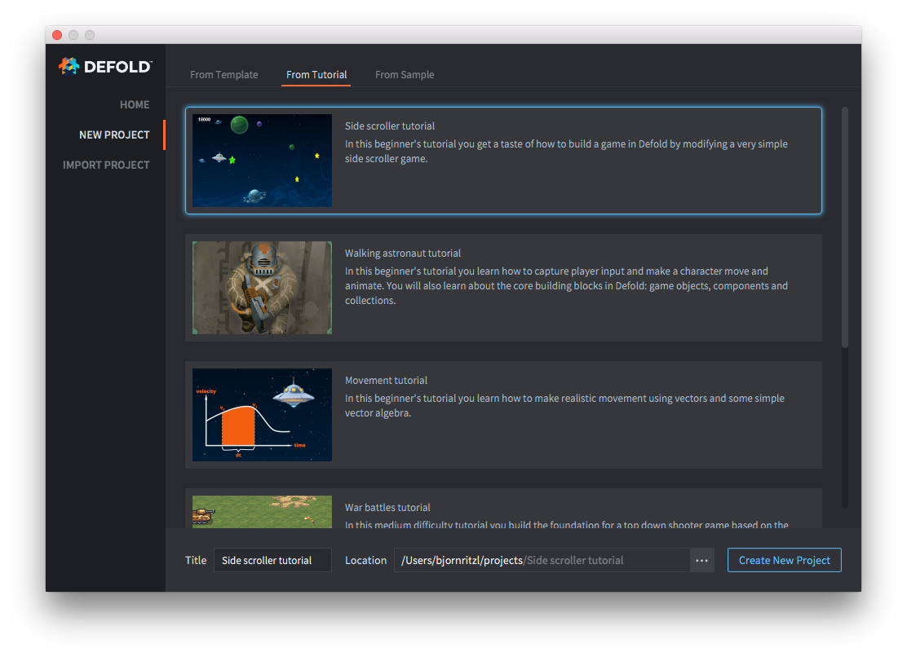

# Tworzenie projektu

Możesz z łatwością utworzyć nowy projekt z poziomu Edytora Defold. Masz również opcję otwarcia istniejącego projektu znajdującego się na Twoim komputerze.

## Tworzenie nowego projektu lokalnie

Kliknij <kbd>New Project</kbd> (Nowy Projekt) i wybierz jaki rodzaj projektu chcesz utworzyć. Określ lokalizację plików na dysku twardym. Kliknij <kbd>Create New Project</kbd> (Utwórz nowy projekt) aby utworzyć wybrany projekt w wybranej lokalizacji. Możesz utworzyć projekt z szablonów:

lub z oficjalnych tutoriali z inrtukcjami krok po kroku:

lub z gotowych, przykładowych gier:

### Dodawanie projektu na Githuba

Lokalny projekt nie ma integracji z żadnym systemem kontroli wersji, pliki są jedynie na Twoim nośniku fizycznym. Jakiekolwiek zmiany dokonujesz są one nieodwracalne i nie ma możliwości przywrócenia usuniętych na stałe plików. Zalecamy więc korzystanie z systemu kontroli wersji, np. Git, żeby śledzić zmiany w Twoim projekcie. Ułatwia to również współpracę wielu osób nad jednym projektem. Dodanie projektu na GitHuba może być zrobione w kilku krokach:

1. Utwórz lub zaloguj się na swoje konto [GitHub](https://github.com/)
2. Utwórz nowe repozytorium klikając [New Repository](https://help.github.com/en/articles/creating-a-new-repository)
3. Załaduj wszystkie pliki projektu poprzez opcję [Upload Files](https://help.github.com/en/articles/adding-a-file-to-a-repository)

Projekt jest teraz w systemie kontroli wersji. Powinieneś [sklonować projekt](https://help.github.com/en/articles/cloning-a-repository) na swój dysk i pracować od tej pory w tej lokalizacji.

## Otwieranie istniejącego projektu

Kliknij <kbd>Open From Disk</kbd> (Otwórz z dysku), żeby otworzyć projekt, który jest już na Twoim komputerze.

## Otwarcie ostatniego projektu

Kiedy projekt jest otwierany w Edytorze Defold, pojawia się on na liście ostatnich projektów (ang. Recent Projects). Lista pokaże projekty, nad którymi ostatnio pracowano i będzie można wybrać dowolny z nich poprzez podwójne kliknięcie.