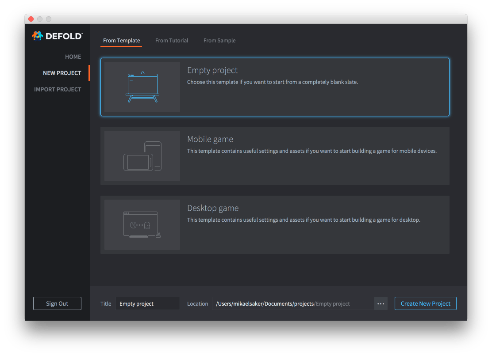
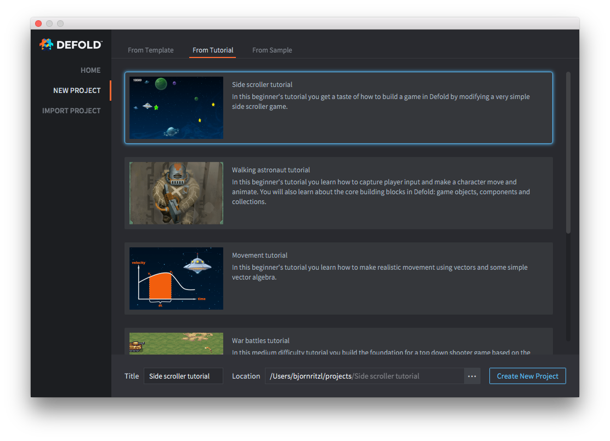
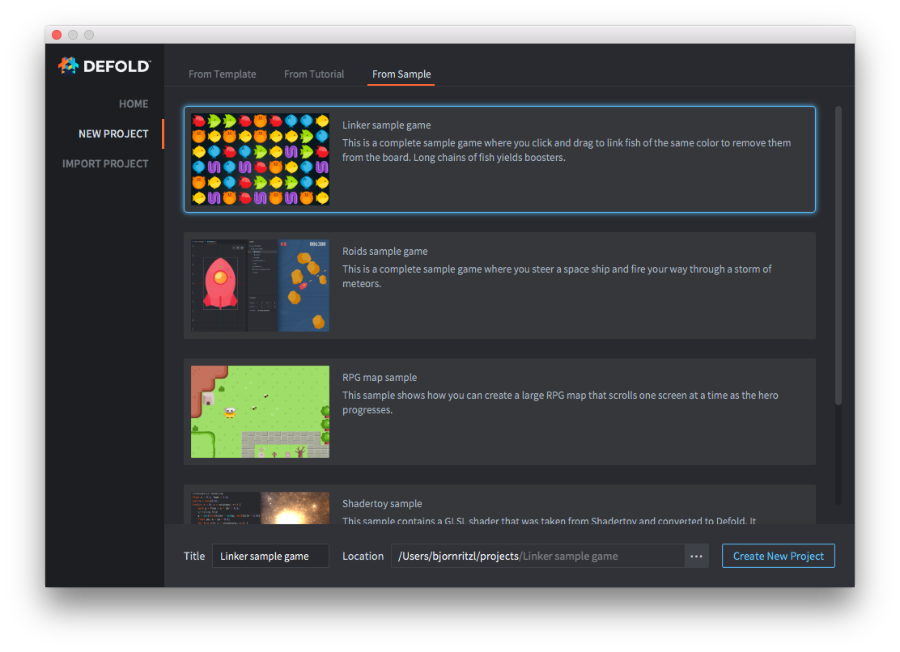

# Tworzenie projektu

Możesz z łatwością utworzyć nowy projekt z poziomu Edytora Defold. Masz również opcję otwarcia istniejącego projektu znajdującego się na Twoim komputerze.

## Tworzenie nowego projektu lokalnie {#creating-a-new-project}

Kliknij <kbd>New Project</kbd> (Nowy Projekt) i wybierz jaki rodzaj projektu chcesz utworzyć. Określ lokalizację plików na dysku twardym. Kliknij <kbd>Create New Project</kbd> (Utwórz nowy projekt) aby utworzyć wybrany projekt w wybranej lokalizacji. Możesz utworzyć projekt z szablonów:

lub z oficjalnych tutoriali z inrtukcjami krok po kroku:

lub z gotowych, przykładowych gier:

### Dodawanie projektu na Githuba

Lokalny projekt nie jest zintegrowany z żadnym systemem kontroli wersji, więc pliki znajdują się wyłącznie na dysku i nie istnieje historia, która pozwalałaby cofnąć zmiany. Pliki usuwane przez panel Assets edytora są przenoszone do systemowego kosza, gdy jest to obsługiwane, ale mogą zostać trwale usunięte, jeśli ta operacja jest niedostępna lub się nie powiedzie. Kosz nie chroni przed dowolnymi zmianami ani nie zapewnia historii wersji, dlatego zalecamy używanie systemu kontroli wersji, takiego jak Git, do śledzenia zmian w plikach. Ułatwia to również współpracę wielu osób nad jednym projektem. Dodanie lokalnego projektu do GitHuba wymaga tylko kilku kroków:

1. Utwórz lub zaloguj się na swoje konto [GitHub](https://github.com/)
2. Utwórz nowe repozytorium klikając [New Repository](https://help.github.com/en/articles/creating-a-new-repository)
3. Załaduj wszystkie pliki projektu poprzez opcję [Upload Files](https://help.github.com/en/articles/adding-a-file-to-a-repository)

Projekt jest teraz w systemie kontroli wersji. Powinieneś [sklonować projekt](https://help.github.com/en/articles/cloning-a-repository) na swój dysk i pracować od tej pory w tej lokalizacji.

## Otwieranie istniejącego projektu

Kliknij <kbd>Open From Disk</kbd> (Otwórz z dysku), żeby otworzyć projekt, który jest już na Twoim komputerze.

## Otwarcie ostatniego projektu

Kiedy projekt jest otwierany w Edytorze Defold, pojawia się on na liście ostatnich projektów (ang. Recent Projects). Lista pokaże projekty, nad którymi ostatnio pracowano i będzie można wybrać dowolny z nich poprzez podwójne kliknięcie.
