# Animacja właściwości

Wszystkie właściwości (ang. properties) będące zmiennymi numerycznymi (typy Lua: numbers, vector3, vector4 i quaterions (kwaterniony)) oraz stałe shaderów mogą być animowane w Defoldzie wykorzystując wbudowany system animacji, używając funkcji `go.animate()`. Silnik będzie automatycznie dopasowywał wartość (ang. tween) uwzględniając wybrany tryb odtwarzania (playback mode) i funkcję wygładzania (easing function). Można również definiować własne funkcje wygładzania.

  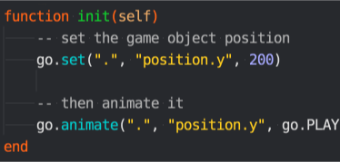
  

## Animowanie właściwości

Aby animować właściwości (ang. properties) obiektu lub komponentu użyj funkcji `go.animate()`. Dla właściwości węzłów GUI, analogiczną funkcją jest `gui.animate()`.

```lua
-- Ustaw pozycję w osi Y - właściwość komponentu na 200
go.set(".", "position.y", 200)
-- Następnie przeprowadź animację właściwości do 100 i z powrotem
go.animate(".", "position.y", go.PLAYBACK_LOOP_PINGPONG, 100, go.EASING_OUTBOUNCE, 2)
```

Aby zatrzymać wszystkie animacje danej właściwości, wywołaj `go.cancel_animations()`, a dla węzłów GUI, analogicznie: `gui.cancel_animation()` lub dookreśl, które właściwości chcesz zatrzymać:

```lua
-- Zatrzymaj rotację eulera na osi Z obecnego obiektu gry
go.cancel_animations(".", "euler.z")
```

Jeśli zatrzymasz animacje właściwości, która jest właściwością "kompozytową" (składającą się z kilku osobnych wartości, jak np. `vector3 position`), osobne animacje każdego z elementów składowych danej właściwości (`position.x`, `position.y` i `position.z`) zostaną zatrzymane.

[Instrukcja do właściwości](/manuals/properties) zawiera wszystkie informacje na temat dostępnych właściwości obiektów, komponentów i węzłów GUI.

## Animowanie właściwości węzłów GUI

Prawie każdą właściwość węzła GUI można animować. Możesz, przykładowo, ukryć węzeł poprzez ustawienie jego koloru (`color`) na całkowicie przezroczysty, a następnie pokazać go przez płynne pojawianie się animując kolor do wartości koloru białego (nieprzezroczystego):

```lua
local node = gui.get_node("button")
local color = gui.get_color(node)
-- Animuj kolor do białego
gui.animate(node, gui.PROP_COLOR, vmath.vector4(1, 1, 1, 1), gui.EASING_INOUTQUAD, 0.5)
-- Animuj kolor obrzeży do czerwonego
gui.animate(node, "outline.x", 1, gui.EASING_INOUTQUAD, 0.5)
-- I animuj pozycję wzdłuż osi X do 100
gui.animate(node, hash("position.x"), 100, gui.EASING_INOUTQUAD, 0.5)
```

## Funkcje po zakończeniu animacji

Funkcje do animacji właściwości `go.animate()` i `gui.animate()` wspierają opcjonalną funkcję tzw. callback jako ostatni argument. Funkcja ta zostanie wywołana po zakończeniu animacji. Funkcja nigdy nie jest wywoływana dla animacji w pętli, więc takich, których tryby odtwarzania zaczynają się od: `PLAYBACK_LOOP_*`, ani w przypadku ręcznego anulowania animacji za pomocą `go.cancel_animations()`. Funkcję zwrotną można wykorzystać do wyzwalania zdarzeń po zakończeniu animacji lub do połączenia różnych animacji w serie, jedna za drugą.

## Wygładzanie

Wygładzanie (ang. easing) określa w jaki sposób animowana będzie wartość w czasie. Poniżej zaprezentowano wykresy funkcji wygładzania przedstawiające wartość w czasie.

Tutaj przedstawione są funkcje wygładzania dostępne dla funkcji `go.animate()`:

|---|---|
| go.EASING_LINEAR | |
| go.EASING_INBACK | go.EASING_OUTBACK |
| go.EASING_INOUTBACK | go.EASING_OUTINBACK |
| go.EASING_INBOUNCE | go.EASING_OUTBOUNCE |
| go.EASING_INOUTBOUNCE | go.EASING_OUTINBOUNCE |
| go.EASING_INELASTIC | go.EASING_OUTELASTIC |
| go.EASING_INOUTELASTIC | go.EASING_OUTINELASTIC |
| go.EASING_INSINE | go.EASING_OUTSINE |
| go.EASING_INOUTSINE | go.EASING_OUTINSINE |
| go.EASING_INEXPO | go.EASING_OUTEXPO |
| go.EASING_INOUTEXPO | go.EASING_OUTINEXPO |
| go.EASING_INCIRC | go.EASING_OUTCIRC |
| go.EASING_INOUTCIRC | go.EASING_OUTINCIRC |
| go.EASING_INQUAD | go.EASING_OUTQUAD |
| go.EASING_INOUTQUAD | go.EASING_OUTINQUAD |
| go.EASING_INCUBIC | go.EASING_OUTCUBIC |
| go.EASING_INOUTCUBIC | go.EASING_OUTINCUBIC |
| go.EASING_INQUART | go.EASING_OUTQUART |
| go.EASING_INOUTQUART | go.EASING_OUTINQUART |
| go.EASING_INQUINT | go.EASING_OUTQUINT |
| go.EASING_INOUTQUINT | go.EASING_OUTINQUINT |

Tutaj przedstawione są funkcje wygładzania dostępne dla funkcji `gui.animate()`:

|---|---|
| gui.EASING_LINEAR | |
| gui.EASING_INBACK | gui.EASING_OUTBACK |
| gui.EASING_INOUTBACK | gui.EASING_OUTINBACK |
| gui.EASING_INBOUNCE | gui.EASING_OUTBOUNCE |
| gui.EASING_INOUTBOUNCE | gui.EASING_OUTINBOUNCE |
| gui.EASING_INELASTIC | gui.EASING_OUTELASTIC |
| gui.EASING_INOUTELASTIC | gui.EASING_OUTINELASTIC |
| gui.EASING_INSINE | gui.EASING_OUTSINE |
| gui.EASING_INOUTSINE | gui.EASING_OUTINSINE |
| gui.EASING_INEXPO | gui.EASING_OUTEXPO |
| gui.EASING_INOUTEXPO | gui.EASING_OUTINEXPO |
| gui.EASING_INCIRC | gui.EASING_OUTCIRC |
| gui.EASING_INOUTCIRC | gui.EASING_OUTINCIRC |
| gui.EASING_INQUAD | gui.EASING_OUTQUAD |
| gui.EASING_INOUTQUAD | gui.EASING_OUTINQUAD |
| gui.EASING_INCUBIC | gui.EASING_OUTCUBIC |
| gui.EASING_INOUTCUBIC | gui.EASING_OUTINCUBIC |
| gui.EASING_INQUART | gui.EASING_OUTQUART |
| gui.EASING_INOUTQUART | gui.EASING_OUTINQUART |
| gui.EASING_INQUINT | gui.EASING_OUTQUINT |
| gui.EASING_INOUTQUINT | gui.EASING_OUTINQUINT |


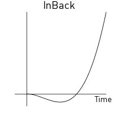


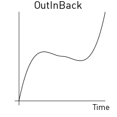

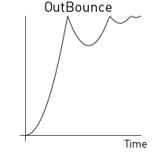


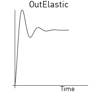
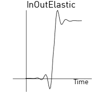


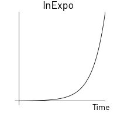


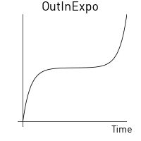


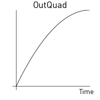
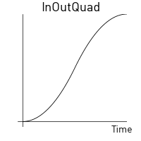
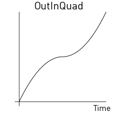

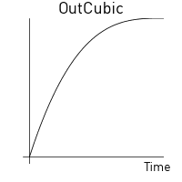

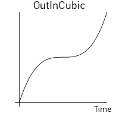
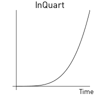
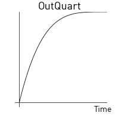


## Własne funkcje wygładzania

Możesz tworzyć własne funkcje wygładzania zdefiniowane jako specjalny `vector` ze zbiorem odpowiednich, kolejnych wartości i użyć go zamiast predefiniowanych stałych przedstawionych powyżej. Wektor ten reprezentuje krzywą zmiany wartości numerycznej od wartości startowej (`0`) do wartości końcowej (`1`). Silnik interpoluje w czasie działania programu te wartości liniowo.

For example, the vector:

```lua
local values = { 0, 0.4, 0.2, 0.2, 0.5, 1 }
local my_easing = vmath.vector(values)
```

stworzy następującą krzywą:


W poniższym przykładzie wartość y pozycji obiektu skacze między aktualną pozycją startową, a pozycją docelową 200:

```lua
local values = { 0, 0, 0, 0, 0, 0, 0, 0,
                 1, 1, 1, 1, 1, 1, 1, 1,
                 0, 0, 0, 0, 0, 0, 0, 0,
                 1, 1, 1, 1, 1, 1, 1, 1,
                 0, 0, 0, 0, 0, 0, 0, 0,
                 1, 1, 1, 1, 1, 1, 1, 1,
                 0, 0, 0, 0, 0, 0, 0, 0,
                 1, 1, 1, 1, 1, 1, 1, 1 }
local square_easing = vmath.vector(values)
go.animate("go", "position.y", go.PLAYBACK_LOOP_PINGPONG, 200, square_easing, 2.0)
```

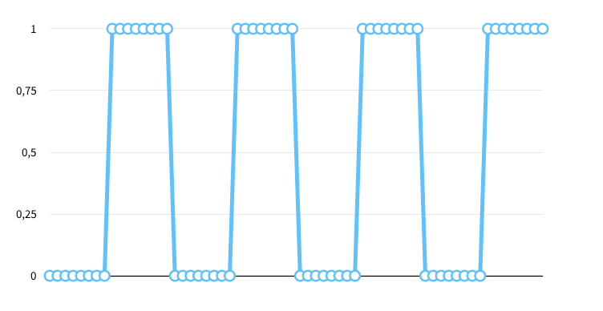
