# Animacja właściwości

Wszystkie właściwości liczbowe, czyli number, vector3, vector4 i kwaterniony, a także stałe shaderów, można animować za pomocą wbudowanego systemu animacji i funkcji `go.animate()`. Silnik automatycznie interpoluje wartości zgodnie z wybranym trybem odtwarzania i funkcją easing. Możesz też definiować własne funkcje easing.

  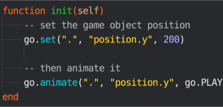
  

## Animacja właściwości

Aby animować właściwość obiektu gry albo komponentu, użyj `go.animate()`. W przypadku właściwości węzłów GUI odpowiednikiem jest `gui.animate()`.

```lua
-- Ustaw składową y właściwości position na 200
go.set(".", "position.y", 200)
-- Następnie ją animuj
go.animate(".", "position.y", go.PLAYBACK_LOOP_PINGPONG, 100, go.EASING_OUTBOUNCE, 2)
```

Aby zatrzymać wszystkie animacje danej właściwości, wywołaj `go.cancel_animations()`, a dla węzłów GUI `gui.cancel_animation()`:

```lua
-- Zatrzymaj animację obrotu euler.z bieżącego obiektu gry
go.cancel_animations(".", "euler.z")
```

Jeśli anulujesz animację właściwości złożonej, takiej jak `position`, anulowane zostaną również animacje jej składowych, czyli `position.x`, `position.y` i `position.z`.

[Instrukcja o właściwościach](/manuals/properties) zawiera listę wszystkich dostępnych właściwości obiektów gry, komponentów i węzłów GUI.

## Animacja właściwości węzłów GUI

Prawie wszystkie właściwości węzłów GUI można animować. Możesz na przykład ukryć węzeł, ustawiając jego właściwość `color` na pełną przezroczystość, a następnie płynnie go wyświetlić, animując kolor do bieli, czyli bez dodatkowego zabarwienia.

```lua
local node = gui.get_node("button")
local color = gui.get_color(node)
-- Animuj kolor do bieli
gui.animate(node, gui.PROP_COLOR, vmath.vector4(1, 1, 1, 1), gui.EASING_INOUTQUAD, 0.5)
-- Animuj czerwony składnik koloru obramowania
gui.animate(node, "outline.x", 1, gui.EASING_INOUTQUAD, 0.5)
-- I przesuń do pozycji x równej 100
gui.animate(node, hash("position.x"), 100, gui.EASING_INOUTQUAD, 0.5)
```

## Wywołania zwrotne po zakończeniu

Funkcje animacji właściwości `go.animate()` i `gui.animate()` obsługują opcjonalną funkcję zwrotną jako ostatni argument. Zostanie ona wywołana po zakończeniu animacji. Taka funkcja zwrotna nigdy nie jest wywoływana dla animacji zapętlonych ani wtedy, gdy animacja została ręcznie anulowana przez `go.cancel_animations()` lub `gui.cancel_animation()`. Można jej używać do wyzwalania zdarzeń po zakończeniu animacji albo do łączenia kilku animacji w sekwencję.

## Krzywe easing

Easing określa, jak animowana wartość zmienia się w czasie. Poniższe obrazy pokazują funkcje używane do tworzenia poszczególnych krzywych easing.

Poniżej znajdują się poprawne wartości easing dla `go.animate()`:

|---|---|
| `go.EASING_LINEAR` | |
| `go.EASING_INBACK` | `go.EASING_OUTBACK` |
| `go.EASING_INOUTBACK` | `go.EASING_OUTINBACK` |
| `go.EASING_INBOUNCE` | `go.EASING_OUTBOUNCE` |
| `go.EASING_INOUTBOUNCE` | `go.EASING_OUTINBOUNCE` |
| `go.EASING_INELASTIC` | `go.EASING_OUTELASTIC` |
| `go.EASING_INOUTELASTIC` | `go.EASING_OUTINELASTIC` |
| `go.EASING_INSINE` | `go.EASING_OUTSINE` |
| `go.EASING_INOUTSINE` | `go.EASING_OUTINSINE` |
| `go.EASING_INEXPO` | `go.EASING_OUTEXPO` |
| `go.EASING_INOUTEXPO` | `go.EASING_OUTINEXPO` |
| `go.EASING_INCIRC` | `go.EASING_OUTCIRC` |
| `go.EASING_INOUTCIRC` | `go.EASING_OUTINCIRC` |
| `go.EASING_INQUAD` | `go.EASING_OUTQUAD` |
| `go.EASING_INOUTQUAD` | `go.EASING_OUTINQUAD` |
| `go.EASING_INCUBIC` | `go.EASING_OUTCUBIC` |
| `go.EASING_INOUTCUBIC` | `go.EASING_OUTINCUBIC` |
| `go.EASING_INQUART` | `go.EASING_OUTQUART` |
| `go.EASING_INOUTQUART` | `go.EASING_OUTINQUART` |
| `go.EASING_INQUINT` | `go.EASING_OUTQUINT` |
| `go.EASING_INOUTQUINT` | `go.EASING_OUTINQUINT` |

Poniżej znajdują się poprawne wartości easing dla `gui.animate()`:

|---|---|
| `gui.EASING_LINEAR` | |
| `gui.EASING_INBACK` | `gui.EASING_OUTBACK` |
| `gui.EASING_INOUTBACK` | `gui.EASING_OUTINBACK` |
| `gui.EASING_INBOUNCE` | `gui.EASING_OUTBOUNCE` |
| `gui.EASING_INOUTBOUNCE` | `gui.EASING_OUTINBOUNCE` |
| `gui.EASING_INELASTIC` | `gui.EASING_OUTELASTIC` |
| `gui.EASING_INOUTELASTIC` | `gui.EASING_OUTINELASTIC` |
| `gui.EASING_INSINE` | `gui.EASING_OUTSINE` |
| `gui.EASING_INOUTSINE` | `gui.EASING_OUTINSINE` |
| `gui.EASING_INEXPO` | `gui.EASING_OUTEXPO` |
| `gui.EASING_INOUTEXPO` | `gui.EASING_OUTINEXPO` |
| `gui.EASING_INCIRC` | `gui.EASING_OUTCIRC` |
| `gui.EASING_INOUTCIRC` | `gui.EASING_OUTINCIRC` |
| `gui.EASING_INQUAD` | `gui.EASING_OUTQUAD` |
| `gui.EASING_INOUTQUAD` | `gui.EASING_OUTINQUAD` |
| `gui.EASING_INCUBIC` | `gui.EASING_OUTCUBIC` |
| `gui.EASING_INOUTCUBIC` | `gui.EASING_OUTINCUBIC` |
| `gui.EASING_INQUART` | `gui.EASING_OUTQUART` |
| `gui.EASING_INOUTQUART` | `gui.EASING_OUTINQUART` |
| `gui.EASING_INQUINT` | `gui.EASING_OUTQUINT` |
| `gui.EASING_INOUTQUINT` | `gui.EASING_OUTINQUINT` |


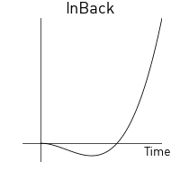

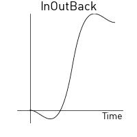
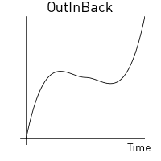


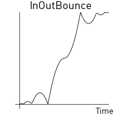


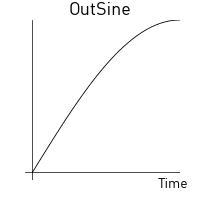
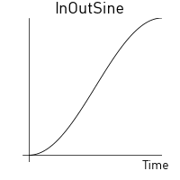
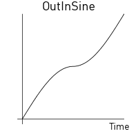
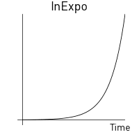


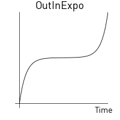


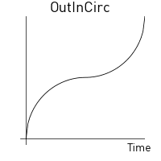
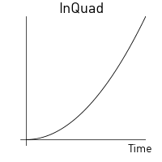

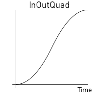

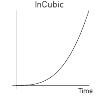
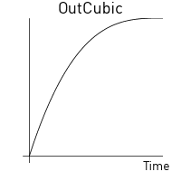

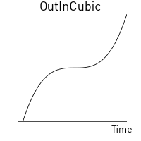
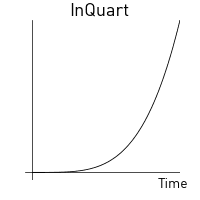
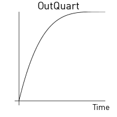
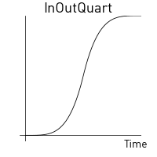

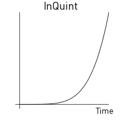
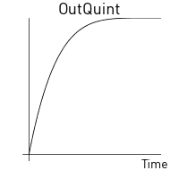


## Własne krzywe easing

Możesz tworzyć własne krzywe easing, definiując `vector` z zestawem wartości i przekazując go zamiast jednej z predefiniowanych stałych easing opisanych wyżej. Wartości wektora opisują krzywą od wartości początkowej (`0`) do wartości docelowej (`1`). W czasie działania silnik pobiera próbki z wektora i liniowo interpoluje wartości pomiędzy punktami opisanymi w tym wektorze.

Na przykład taki wektor:

```lua
local values = { 0, 0.4, 0.2, 0.2, 0.5, 1 }
local my_easing = vmath.vector(values)
```

da następującą krzywą:

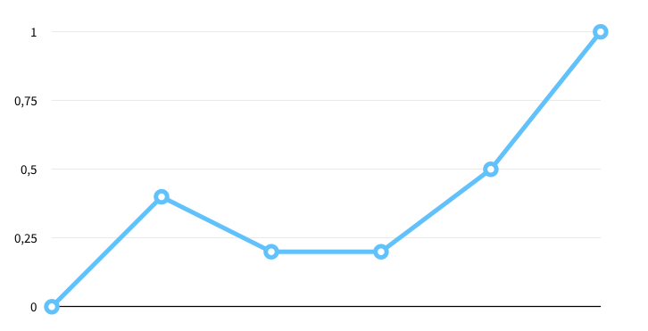

W kolejnym przykładzie pozycja y obiektu gry będzie przeskakiwać między bieżącą pozycją a wartością 200 zgodnie z przebiegiem przypominającym falę prostokątną:

```lua
local values = { 0, 0, 0, 0, 0, 0, 0, 0,
                 1, 1, 1, 1, 1, 1, 1, 1,
                 0, 0, 0, 0, 0, 0, 0, 0,
                 1, 1, 1, 1, 1, 1, 1, 1,
                 0, 0, 0, 0, 0, 0, 0, 0,
                 1, 1, 1, 1, 1, 1, 1, 1,
                 0, 0, 0, 0, 0, 0, 0, 0,
                 1, 1, 1, 1, 1, 1, 1, 1 }
local square_easing = vmath.vector(values)
go.animate("go", "position.y", go.PLAYBACK_LOOP_PINGPONG, 200, square_easing, 2.0)
```

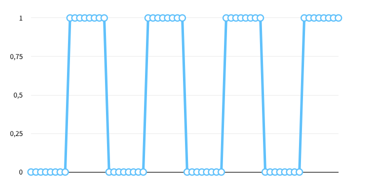
