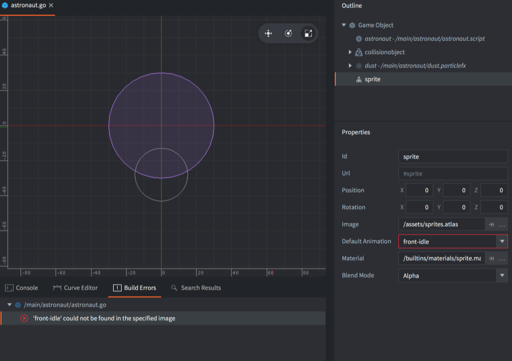

# Refaktoryzacja

Refaktoryzacja (Refactoring) odnosi się do procesu restrukturyzacji istniejącego kodu i zasobów. W trakcie rozwoju projektu często pojawia się potrzeba zmiany lub przeniesienia elementów: nazwy muszą być zmieniane, aby odpowiadać konwencjom nazewniczym lub zwiększyć czytelność, a pliki kodu lub zasobów muszą być przenoszone do bardziej logicznych miejsc w hierarchii projektu.

Defold pomaga w efektywnej refaktoryzacji, śledząc, jakie zasoby są używane. Automatycznie aktualizuje odwołania do zasobów, które zostały zmienione lub przeniesione. Jako programista, powinieneś czuć się swobodnie w swojej pracy. Twój projekt to elastyczna struktura, którą możesz dowolnie zmieniać, nie obawiając się, że wszystko ulegnie awarii i rozpadnie się na kawałki.

::: important
Automatyczna refaktoryzacja będzie działać tylko wtedy, gdy zmiany zostaną dokonane wewnątrz Edytora Defold. Jeśli zmienisz nazwę lub przeniesiesz plik poza Edytorem, odwołania do tego pliku nie zostaną automatycznie zmienione.
:::

Jednakże, jeśli uszkodzisz odwołanie, na przykład usuwając zasób z posiomu systemu operacyjnego, Edytor nie będzie w stanie rozwiązać problemu, ale dostarczy pomocne sygnały błędów. Na przykład, jeśli usuniesz animację z atlasu, a ta animacja jest używana gdzieś, Defold zasygnalizuje błąd podczas próby uruchomienia gry. Edytor również oznaczy, gdzie występują błędy, aby pomóc Ci szybko zlokalizować problem:

Błędy kompilacji pojawiają się w panelu *Build Errors* na dole edytora. <kbd>Double clicking</kbd> na błędzie, który jest linkiem, przenosi cię do miejsca, gdzie wystąpił problem.
