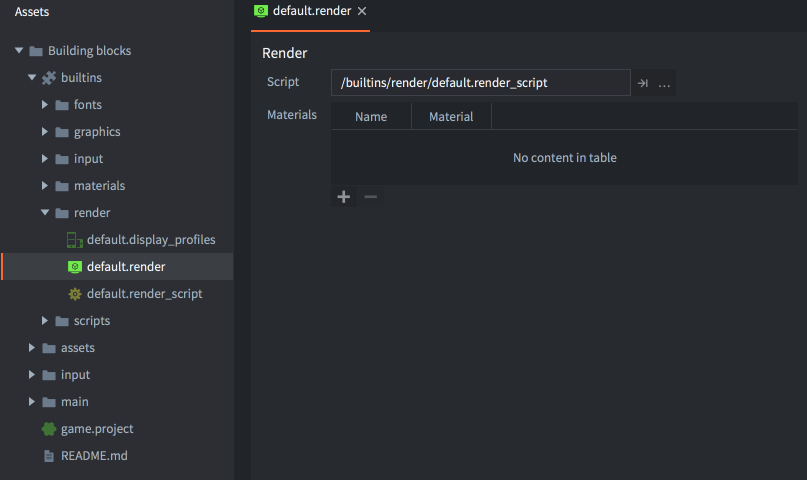
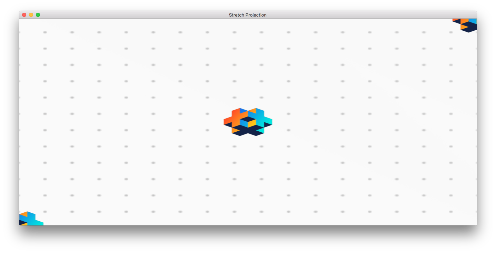
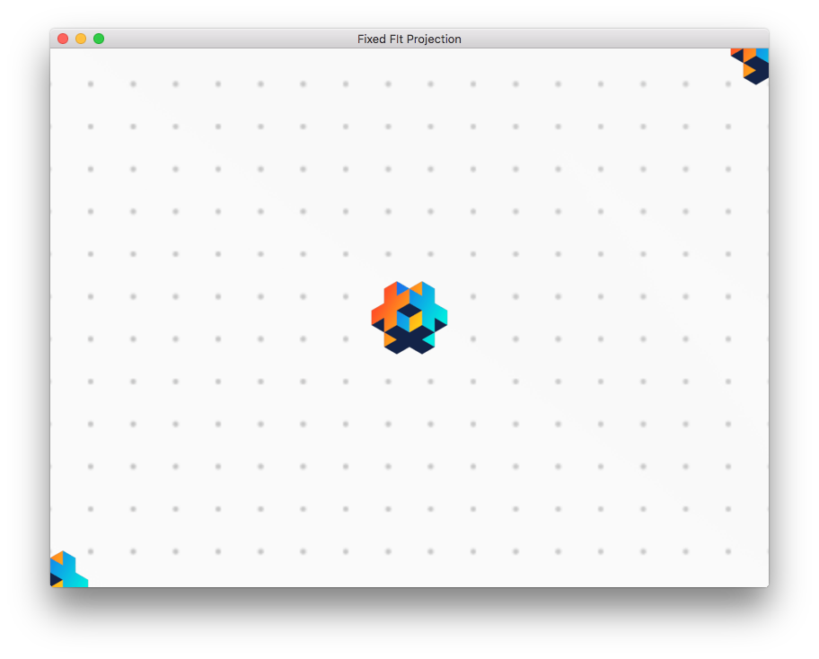
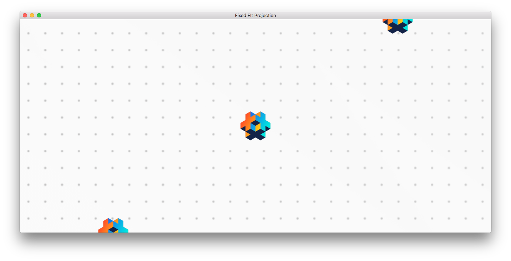
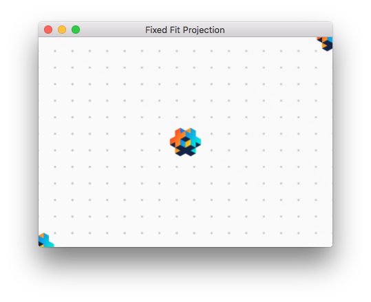
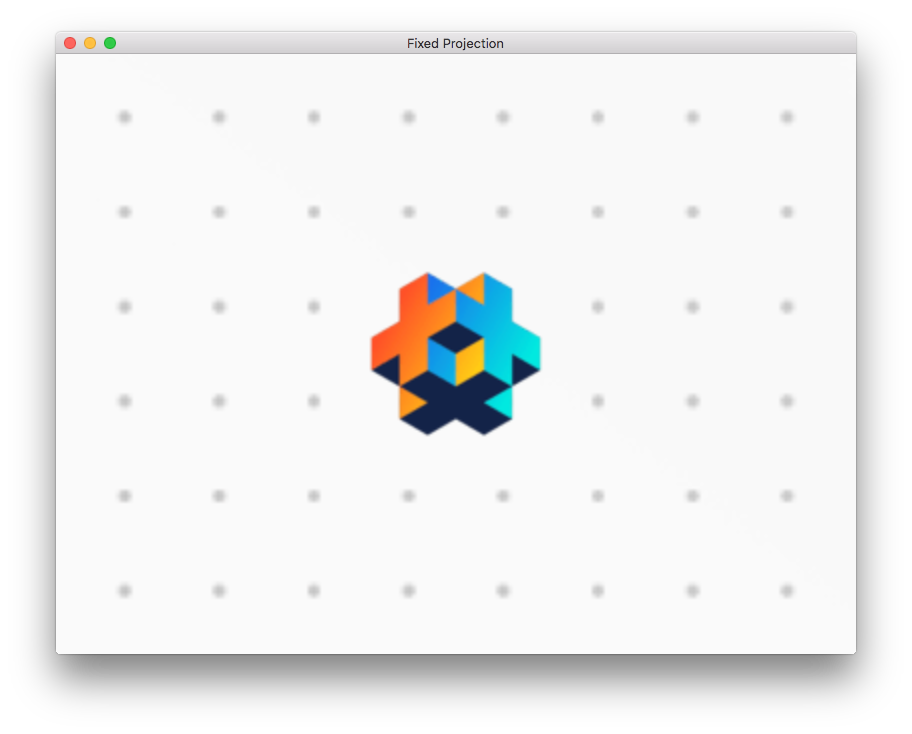
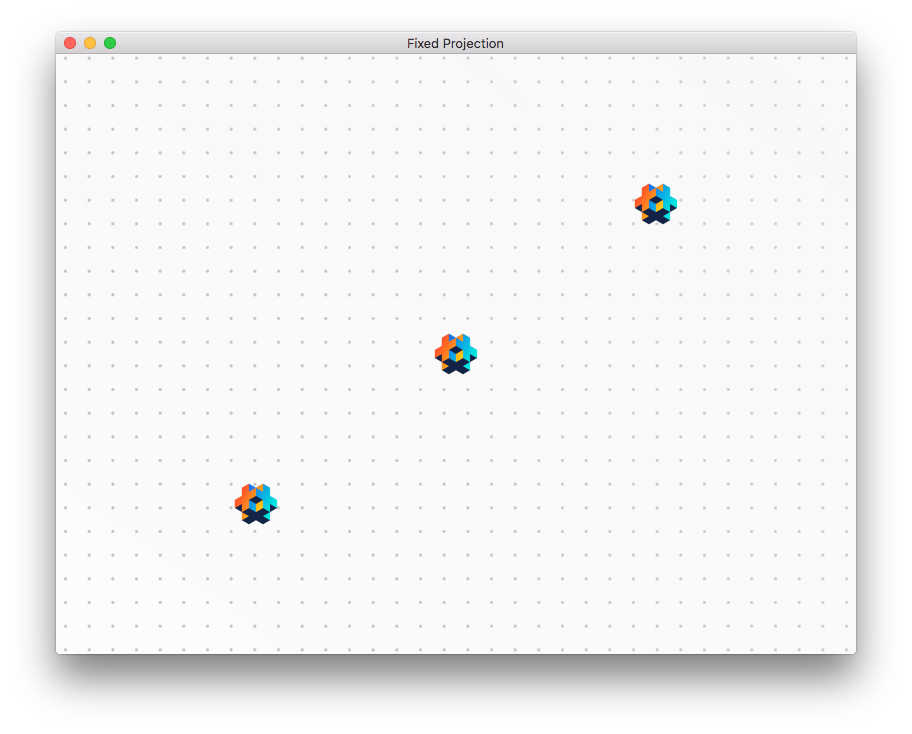
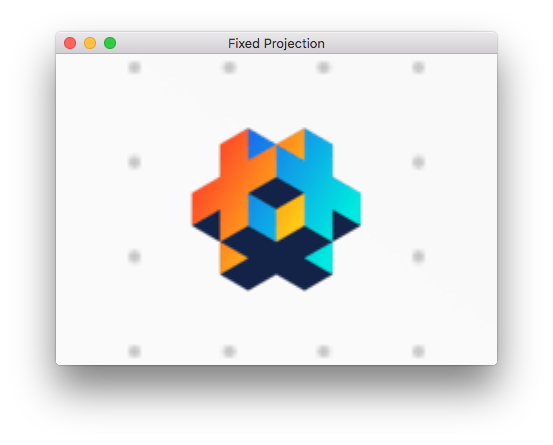

# Render

Każdy obiekt wyświetlany przez silnik na ekranie, taki jak sprite'y, modele, mapy kafelków, cząsteczki albo węzły GUI, jest rysowany przez renderer. W samym sercu renderera znajduje się skrypt do renderowania, który steruje potokiem renderowania. Domyślnie każdy obiekt 2D jest rysowany z właściwą bitmapą, przy użyciu określonego mieszania i na właściwej głębokości Z, więc poza kolejnością rysowania i prostym mieszaniem możesz nigdy nie musieć myśleć o renderowaniu. W większości gier 2D domyślny potok działa dobrze, ale twoja gra może mieć szczególne wymagania. W takim przypadku Defold pozwala napisać własny, dopasowany do potrzeb potok renderowania.

### Potok renderowania - co, kiedy i gdzie?

Potok renderowania kontroluje, co należy wyrenderować, kiedy to zrobić i gdzie to narysować. To, co ma być renderowane, kontrolują [predykaty renderowania](#render-predicates). To, kiedy renderować predykat, jest kontrolowane w [skrypcie do renderowania](#the-render-script), a to, gdzie go renderować, jest kontrolowane przez [projekcję widoku](#default-view-projection). Potok renderowania może też odrzucać grafiki rysowane przez predykat renderowania, które znajdują się poza zdefiniowaną bryłą ograniczającą albo bryłą widokową. Ten proces nazywa się odrzucaniem poza bryłą widokową (frustum culling).

## Domyślny render

Plik render zawiera odwołanie do bieżącego skryptu do renderowania, a także do niestandardowych materiałów, które mają być dostępne w skrypcie do renderowania (użyj [`render.enable_material()`](/ref/render/#render.enable_material))

W samym sercu potoku renderowania znajduje się _skrypt do renderowania_. To skrypt Lua z funkcjami `init()`, `update()` i `on_message()`, używany przede wszystkim do współpracy z niskopoziomowym API graficznym. Skrypt do renderowania zajmuje szczególne miejsce w cyklu życia gry. Szczegóły znajdziesz w [dokumentacji cyklu życia aplikacji](/manuals/application-lifecycle).

W folderze "Builtins" projektu znajdziesz domyślny zasób render ("default.render") oraz domyślny skrypt do renderowania ("default.render_script").



Aby skonfigurować własny renderer:

1. Skopiuj pliki "default.render" i "default.render_script" do wybranego miejsca w hierarchii projektu. Oczywiście możesz też utworzyć skrypt do renderowania od zera, ale dobrym pomysłem jest zacząć od kopii domyślnego skryptu, zwłaszcza jeśli dopiero zaczynasz pracę z Defold albo z programowaniem grafiki.

2. Otwórz swoją kopię pliku "default.render" i zmień właściwość *Script*, aby wskazywała na twoją kopię skryptu do renderowania.

3. Zmień właściwość *Render* (w sekcji *bootstrap*) w pliku ustawień *game.project*, aby wskazywała na twoją kopię pliku "default.render".


## Predykaty renderowania

Aby kontrolować kolejność rysowania obiektów, tworzysz predykaty renderowania. Predykat określa, co ma zostać narysowane, na podstawie wybranych tagów materiału.

Każdy obiekt rysowany na ekranie ma przypisany materiał, który kontroluje, jak ma być rysowany. W materiale określasz jeden lub więcej tagów, które mają być z nim powiązane.

W skrypcie do renderowania możesz następnie utworzyć *predykat renderowania* i określić, które tagi mają do niego należeć. Gdy każesz silnikowi narysować predykat, zostanie narysowany każdy obiekt z materiałem zawierającym wszystkie tagi określone dla tego predykatu.

```
Sprite 1        Sprite 2        Sprite 3        Sprite 4
Material A      Material A      Material B      Material C
  outlined        outlined        greyscale       outlined
  tree            tree            tree            house
```

```lua
-- predykat dopasowujący wszystkie sprite'y z tagiem "tree"
local trees = render.predicate({"tree"})
-- narysuje Sprite 1, 2 i 3
render.draw(trees)

-- predykat dopasowujący wszystkie sprite'y z tagiem "outlined"
local outlined = render.predicate({"outlined"})
-- narysuje Sprite 1, 2 i 4
render.draw(outlined)

-- predykat dopasowujący wszystkie sprite'y z tagami "outlined" ORAZ "tree"
local outlined_trees = render.predicate({"outlined", "tree"})
-- narysuje Sprite 1 i 2
render.draw(outlined_trees)
```


Szczegółowy opis działania materiałów znajdziesz w [dokumentacji materiału](/manuals/material).


## Domyślna projekcja widoku

Domyślny skrypt do renderowania jest skonfigurowany tak, aby używać projekcji ortograficznej odpowiedniej dla gier 2D. Udostępnia trzy różne projekcje ortograficzne: `Stretch` (domyślna), `Fixed Fit` i `Fixed`. Jako alternatywę dla projekcji ortograficznych w domyślnym skrypcie do renderowania możesz też użyć macierzy projekcji udostępnianej przez komponent kamery.

### Projekcja Stretch

Projekcja Stretch zawsze narysuje obszar gry o wymiarach ustawionych w *game.project*, nawet po zmianie rozmiaru okna. Jeśli zmieni się współczynnik proporcji, zawartość gry zostanie rozciągnięta pionowo albo poziomo:


*Projekcja Stretch przy oryginalnym rozmiarze okna*



*Projekcja Stretch z poziomo rozciągniętym oknem*

Projekcja Stretch jest projekcją domyślną, ale jeśli ją zmieniłeś i chcesz wrócić, zrobisz to, wysyłając wiadomość do skryptu do renderowania:

```lua
msg.post("@render:", "use_stretch_projection", { near = -1, far = 1 })
```

### Projekcja Fixed Fit

Tak jak projekcja Stretch, projekcja Fixed Fit zawsze pokaże obszar gry o wymiarach ustawionych w *game.project*, ale jeśli okno zostanie zmienione i współczynnik proporcji się zmieni, zawartość gry zachowa oryginalny współczynnik proporcji, a dodatkowa część gry będzie widoczna pionowo albo poziomo:



*Projekcja Fixed Fit przy oryginalnym rozmiarze okna*



*Projekcja Fixed Fit z poziomo rozciągniętym oknem*



*Projekcja Fixed Fit z oknem zmniejszonym do 50% oryginalnego rozmiaru*

Projekcję Fixed Fit włączasz, wysyłając wiadomość do skryptu do renderowania:

```lua
msg.post("@render:", "use_fixed_fit_projection", { near = -1, far = 1 })
```

### Projekcja Fixed

Projekcja Fixed zachowa oryginalny współczynnik proporcji i będzie renderować zawartość gry z ustalonym poziomem zoomu. Oznacza to, że jeśli zoom zostanie ustawiony na wartość inną niż 100%, zobaczysz większy albo mniejszy obszar gry zdefiniowany przez wymiary w *game.project*:



*Projekcja Fixed z zoomem ustawionym na 2*



*Projekcja Fixed z zoomem ustawionym na 0.5*



*Projekcja Fixed z zoomem ustawionym na 2 i oknem zmniejszonym do 50% oryginalnego rozmiaru*

Projekcję Fixed włączasz, wysyłając wiadomość do skryptu do renderowania:

```lua
msg.post("@render:", "use_fixed_projection", { near = -1, far = 1, zoom = 2 })
```

### Projekcja kamery

Gdy używasz domyślnego skryptu do renderowania i w projekcie są dostępne włączone [komponenty Camera](/manuals/camera), mają one pierwszeństwo przed każdym innym widokiem / projekcją ustawionymi w skrypcie do renderowania. Aby dowiedzieć się więcej o pracy z komponentami kamery w skryptach do renderowania, zapoznaj się z [dokumentacją kamery](/manuals/camera).

Kamery ortograficzne obsługują `Orthographic Mode`, który kontroluje, jak kamera dostosowuje się do okna:
- `Fixed` używa wartości `Orthographic Zoom` kamery.
- `Auto Fit` (contain) zachowuje widoczny cały obszar projektu.
- `Auto Cover` (cover) wypełnia okno i może przycinać obraz.

Tryby możesz przełączać w Edytorze albo w czasie działania przez Camera API:

```lua
-- Użyj zachowania auto-fit z kamerą ortograficzną
camera.set_orthographic_mode("main:/go#camera", camera.ORTHO_MODE_AUTO_FIT)
-- Sprawdź bieżący tryb
local mode = camera.get_orthographic_mode("main:/go#camera")
```

## Odrzucanie poza bryłą widokową

API renderowania w Defold pozwala programistom wykonywać coś, co nazywa się odrzucaniem poza bryłą widokową. Gdy ta funkcja jest włączona, każda grafika znajdująca się poza zdefiniowanym pudełkiem ograniczającym albo bryłą widokową zostanie zignorowana. W dużym świecie gry, w którym jednocześnie widoczna jest tylko część obszaru, odrzucanie poza bryłą widokową może znacznie zmniejszyć ilość danych, które trzeba wysłać do GPU w celu renderowania, a tym samym zwiększyć wydajność i oszczędzać baterię na urządzeniach mobilnych. Do utworzenia pudełka ograniczającego często używa się widoku i projekcji kamery. Domyślny skrypt do renderowania używa widoku i projekcji z kamery, aby obliczyć bryłę widokową.

Odrzucanie poza bryłą widokową jest w silniku implementowane osobno dla każdego typu komponentu. Aktualny stan (Defold 1.9.0):

| Component   | Supported |
|-------------|-----------|
| Sprite      | YES       |
| Model       | YES       |
| Mesh        | YES (1)   |
| Label       | YES       |
| Spine       | YES       |
| Particle fx | NO        |
| Tilemap     | YES       |
| Rive        | NO        |

1 = Pudełko ograniczające siatki musi zostać ustawione przez dewelopera. [Dowiedz się więcej](/manuals/mesh/#frustum-culling).


## Układy współrzędnych

Gdy komponenty są renderowane, zwykle mówi się o tym, w jakim układzie współrzędnych są renderowane. W większości gier część komponentów jest rysowana w przestrzeni świata, a część w przestrzeni ekranu.

Komponenty GUI i ich węzły są zwykle rysowane w układzie współrzędnych przestrzeni ekranu, gdzie lewy dolny róg ekranu ma współrzędne (0,0), a prawy górny róg to (szerokość ekranu, wysokość ekranu). Układ współrzędnych przestrzeni ekranu nigdy nie jest przesuwany ani w inny sposób przekształcany przez kamerę. Dzięki temu węzły GUI zawsze będą rysowane na ekranie niezależnie od tego, jak renderowany jest świat.

Sprite'y, mapy kafelków i inne komponenty używane przez obiekty gry istniejące w twoim świecie gry są zwykle rysowane w układzie współrzędnych przestrzeni świata. Jeśli nie wprowadzisz żadnych zmian do skryptu do renderowania i nie użyjesz komponentu kamery do zmiany projekcji widoku, ten układ jest taki sam jak układ współrzędnych przestrzeni ekranu, ale gdy tylko dodasz kamerę i przesuniesz ją albo zmienisz projekcję widoku, oba układy zaczną się różnić. Gdy kamera się porusza, lewy dolny róg ekranu będzie przesunięty względem (0, 0), aby renderować inne części świata. Jeśli zmieni się projekcja, współrzędne zostaną zarówno przekształcone, czyli przesunięte względem (0, 0), jak i przeskalowane.


## Skrypt do renderowania

Poniżej znajduje się kod niestandardowego skryptu do renderowania, który jest lekko zmodyfikowaną wersją wbudowanego.

init()
: Funkcja `init()` służy do ustawienia predykatów, widoku i koloru czyszczenia. Te zmienne będą używane podczas właściwego renderowania.

```lua
function init(self)
    -- Zdefiniuj predykaty renderowania. Każdy predykat jest rysowany osobno i
    -- dzięki temu możemy zmieniać stan OpenGL między kolejnymi rysowaniami.
    self.predicates = create_predicates("tile", "gui", "text", "particle", "model")

    -- Utwórz i wypełnij tabele danych używane w update()
    local state = create_state()
    self.state = state
    local camera_world = create_camera(state, "camera_world", true)
    init_camera(camera_world, get_stretch_projection)
    local camera_gui = create_camera(state, "camera_gui")
    init_camera(camera_gui, get_gui_projection)
    update_state(state)
end
```

update()
: Funkcja `update()` jest wywoływana raz na każdą klatkę. Jej zadaniem jest wykonanie właściwego rysowania przez wywołanie niskopoziomowych interfejsów API OpenGL ES. Aby dobrze zrozumieć, co dzieje się w funkcji `update()`, trzeba znać zasady działania OpenGL. Dostępnych jest wiele świetnych materiałów o OpenGL ES. Oficjalna strona to dobre miejsce na start. Znajdziesz ją pod adresem https://www.khronos.org/opengles/

  Ten przykład zawiera konfigurację potrzebną do rysowania modeli 3D. Funkcja `init()` zdefiniowała predykat `self.predicates.model`. Gdzie indziej został utworzony materiał z tagiem "model". Są też komponenty modelu, które używają tego materiału:

```lua
function update(self)
    local state = self.state
     if not state.valid then
        if not update_state(state) then
            return
        end
    end

    local predicates = self.predicates
    -- Wyczyść bufory ekranu
    --
    render.set_depth_mask(true)
    render.set_stencil_mask(0xff)
    render.clear(state.clear_buffers)

    local camera_world = state.cameras.camera_world
    render.set_viewport(0, 0, state.window_width, state.window_height)
    render.set_view(camera_world.view)
    render.set_projection(camera_world.proj)


    -- Renderuj modele
    --
    render.set_blend_func(render.BLEND_SRC_ALPHA, render.BLEND_ONE_MINUS_SRC_ALPHA)
    render.enable_state(render.STATE_CULL_FACE)
    render.enable_state(render.STATE_DEPTH_TEST)
    render.set_depth_mask(true)
    render.draw(predicates.model_pred)
    render.set_depth_mask(false)
    render.disable_state(render.STATE_DEPTH_TEST)
    render.disable_state(render.STATE_CULL_FACE)

     -- Renderuj świat (sprite'y, mapy kafelków, cząsteczki itd.)
     --
    render.set_blend_func(render.BLEND_SRC_ALPHA, render.BLEND_ONE_MINUS_SRC_ALPHA)
    render.enable_state(render.STATE_DEPTH_TEST)
    render.enable_state(render.STATE_STENCIL_TEST)
    render.enable_state(render.STATE_BLEND)
    render.draw(predicates.tile)
    render.draw(predicates.particle)
    render.disable_state(render.STATE_STENCIL_TEST)
    render.disable_state(render.STATE_DEPTH_TEST)

    -- Debug
    render.draw_debug3d()

    -- Renderuj GUI
    --
    local camera_gui = state.cameras.camera_gui
    render.set_view(camera_gui.view)
    render.set_projection(camera_gui.proj)
    render.enable_state(render.STATE_STENCIL_TEST)
    render.draw(predicates.gui, camera_gui.frustum)
    render.draw(predicates.text, camera_gui.frustum)
    render.disable_state(render.STATE_STENCIL_TEST)
end
```

Jak dotąd jest to prosty i przejrzysty skrypt do renderowania. Rysuje w ten sam sposób w każdej pojedynczej klatce. Czasem jednak warto wprowadzić stan do skryptu do renderowania i wykonywać różne operacje w zależności od tego stanu. Przydatna może też być komunikacja ze skryptem do renderowania z innych części kodu gry.

on_message()
: Skrypt do renderowania może zdefiniować funkcję `on_message()` i odbierać wiadomości z innych części gry lub aplikacji. Częstym przypadkiem, gdy zewnętrzny komponent wysyła informacje do skryptu do renderowania, jest _kamera_. Komponent kamery, który przejął fokus kamery, automatycznie będzie wysyłał swój widok i projekcję do skryptu do renderowania w każdej klatce. Ta wiadomość nazywa się `"set_view_projection"`:

```lua
local MSG_CLEAR_COLOR =         hash("clear_color")
local MSG_WINDOW_RESIZED =      hash("window_resized")
local MSG_SET_VIEW_PROJ =       hash("set_view_projection")

function on_message(self, message_id, message)
    if message_id == MSG_CLEAR_COLOR then
        -- Ktoś wysłał nam nowy kolor czyszczenia do użycia.
        update_clear_color(state, message.color)
    elseif message_id == MSG_SET_VIEW_PROJ then
        -- Komponent kamery z przechwyconym fokusem kamery będzie wysyłał wiadomości set_view_projection
        -- do gniazda @render. Możemy użyć informacji o kamerze, aby
        -- ustawić widok (i ewentualnie projekcję) renderowania.
        camera.view = message.view
        self.camera_projection = message.projection or vmath.matrix4()
        update_camera(camera, state)
    end
end
```

Każdy skrypt lub skrypt GUI może jednak wysyłać wiadomości do skryptu do renderowania przez specjalne gniazdo `@render`:

```lua
-- Zmień kolor czyszczenia.
msg.post("@render:", "clear_color", { color = vmath.vector4(0.3, 0.4, 0.5, 0) })
```

## Zasoby renderowania
Aby przekazać do skryptu do renderowania określone zasoby silnika, możesz dodać je do tabeli `Render Resources` w pliku .render przypisanym do projektu:


Korzystanie z tych zasobów w skrypcie do renderowania:

```lua
-- "my_material" będzie teraz używany dla wszystkich wywołań rysowania powiązanych z predykatem
render.enable_material("my_material")
-- wszystko narysowane przez predykat trafi do "my_render_target"
render.set_render_target("my_render_target")
render.draw(self.my_full_screen_predicate)
render.set_render_target(render.RENDER_TARGET_DEFAULT)
render.disable_material()

-- podłącz wynikową teksturę render targetu do tego, co jest renderowane przez predykat
render.enable_texture(0, "my_render_target", render.BUFFER_COLOR0_BIT)
render.draw(self.my_tile_predicate)
```

::: sidenote
Obecnie Defold obsługuje jako odwoływane zasoby renderowania tylko `Materials` i `Render Targets`, ale z czasem system ten będzie obsługiwał więcej typów zasobów.
:::

## Uchwyt tekstur

W Defold tekstury są wewnętrznie reprezentowane jako uchwyt, który w praktyce odpowiada liczbie mającej jednoznacznie identyfikować obiekt tekstury w dowolnym miejscu silnika. Oznacza to, że możesz połączyć świat obiektów gry ze światem renderowania, przekazując te uchwyty między systemem renderowania a skryptem obiektu gry. Na przykład skrypt może utworzyć dynamiczną teksturę w skrypcie dołączonym do obiektu gry i wysłać ją do renderera, aby użyć jej jako globalnej tekstury w poleceniu rysowania.

W pliku `.script`:

```lua
local my_texture_resource = resource.create_texture("/my_texture.texture", tparams)
-- uwaga: my_texture_resource to hash ścieżki zasobu, którego nie można użyć jako uchwytu!
local my_texture_handle = resource.get_texture_info(my_texture_resource)
-- my_texture_handle zawiera informacje o teksturze, takie jak szerokość, wysokość itd.
-- zawiera też uchwyt, o który nam chodzi
msg.post("@render:", "set_texture", { handle = my_texture_handle.handle })
```

W pliku .render_script:

```lua
function on_message(self, message_id, message)
    if message_id == hash("set_texture") then
        self.my_texture = message.handle
    end
end

function update(self)
    -- podłącz niestandardową teksturę do stanu rysowania
    render.enable_texture(0, self.my_texture)
    -- wykonaj rysowanie..
end
```

::: sidenote
Obecnie nie ma możliwości zmiany tekstury, na którą ma wskazywać zasób; w skrypcie do renderowania można używać wyłącznie surowych uchwytów w taki sposób.
:::

## Obsługiwane API graficzne
API skryptu do renderowania Defold tłumaczy operacje renderowania na następujące interfejsy graficzne:

:[Interfejsy graficzne](../shared/graphics-api.md)


## Komunikaty systemowe

`"set_view_projection"`
: Ta wiadomość jest wysyłana przez komponenty kamery, które zdobyły fokus kamery.

`"window_resized"`
: Silnik wyśle tę wiadomość przy zmianie rozmiaru okna. Możesz nasłuchiwać tej wiadomości, aby zmieniać renderowanie, gdy zmienia się docelowy rozmiar okna. Na desktopie oznacza to zmianę rzeczywistego rozmiaru okna gry, a na urządzeniach mobilnych wiadomość jest wysyłana przy każdej zmianie orientacji.

```lua
local MSG_WINDOW_RESIZED =      hash("window_resized")

function on_message(self, message_id, message)
  if message_id == MSG_WINDOW_RESIZED then
    -- Okno zostało zmienione. message.width i message.height zawierają nowe wymiary.
    ...
  end
end
```

`"draw_line"`
: Rysuje linię debugowania. Użyj jej, aby wizualizować ray_casty, wektory i inne rzeczy. Linie są rysowane za pomocą wywołania `render.draw_debug3d()`.

```lua
-- narysuj białą linię
local p1 = vmath.vector3(0, 0, 0)
local p2 = vmath.vector3(1000, 1000, 0)
local col = vmath.vector4(1, 1, 1, 1)
msg.post("@render:", "draw_line", { start_point = p1, end_point = p2, color = col } )  
```

`"draw_text"`
: Rysuje tekst debugowania. Użyj tego, aby wypisać informacje diagnostyczne. Tekst jest rysowany wbudowanym fontem `always_on_top.font`. Font systemowy ma materiał z tagiem `debug_text` i jest renderowany razem z innym tekstem w domyślnym skrypcie do renderowania.

```lua
-- narysuj komunikat tekstowy
local pos = vmath.vector3(500, 500, 0)
msg.post("@render:", "draw_text", { text = "Hello world!", position = pos })  
```

Wizualny profiler dostępny przez wiadomość `"toggle_profile"` wysyłaną do gniazda `@system` nie jest częścią renderera sterowanego skryptem. Jest rysowany oddzielnie od twojego skryptu do renderowania.


## Wywołania rysowania i grupowanie

Wywołanie rysowania to termin opisujący proces przygotowania GPU do narysowania obiektu na ekranie z użyciem tekstury i materiału oraz opcjonalnych dodatkowych ustawień. Proces ten jest zwykle zasobożerny, dlatego zaleca się, aby liczba wywołań rysowania była jak najmniejsza. Liczbę wywołań rysowania i czas potrzebny na ich wyrenderowanie możesz zmierzyć za pomocą [wbudowanego profilera](/manuals/profiling/).

Defold będzie próbował grupować operacje renderowania, aby zmniejszyć liczbę wywołań rysowania zgodnie z zestawem reguł opisanych poniżej. Reguły różnią się między komponentami GUI a wszystkimi pozostałymi typami komponentów.


### Zasady grupowania dla komponentów innych niż GUI

Renderowanie odbywa się zgodnie z kolejnością Z, od niskiej do wysokiej. Silnik zacznie od posortowania listy rzeczy do narysowania i przejdzie po niej od najniższych do najwyższych wartości Z. Każdy obiekt z listy zostanie dołączony do tego samego wywołania rysowania co poprzedni obiekt, jeśli spełnione są następujące warunki:

* Należy do tego samego pełnomocnika kolekcji
* Jest tego samego typu komponentu (sprite, particle fx, tilemap itd.)
* Używa tej samej tekstury (atlasu albo źródła kafelków)
* Ma ten sam materiał
* Ma te same stałe shaderów (takie jak tint)

Oznacza to, że jeśli dwa komponenty sprite w tym samym pełnomocniku kolekcji mają sąsiadujące albo identyczne wartości Z (a więc znajdują się obok siebie na posortowanej liście), używają tej samej tekstury, materiału i stałych, zostaną zgrupowane w to samo wywołanie rysowania.


### Zasady grupowania dla komponentów GUI

Renderowanie węzłów w komponencie GUI odbywa się od góry do dołu listy węzłów. Każdy węzeł na liście zostanie dołączony do tego samego wywołania rysowania co poprzedni węzeł, jeśli spełnione są następujące warunki:

* Jest tego samego typu (box, text, pie itd.)
* Używa tej samej tekstury (atlasu albo źródła kafelków)
* Ma ten sam tryb mieszania
* Ma ten sam font (tylko dla węzłów tekstowych)
* Ma te same ustawienia stencil

::: sidenote
Renderowanie węzłów odbywa się per komponent. Oznacza to, że węzły z różnych komponentów GUI nie będą grupowane.
:::

Możliwość porządkowania węzłów w hierarchie ułatwia grupowanie ich w zarządzalne jednostki. Hierarchie mogą jednak skutecznie psuć grupowanie renderowania, jeśli mieszasz różne typy węzłów. Można skuteczniej grupować węzły GUI przy zachowaniu hierarchii węzłów, używając warstw GUI. Więcej o warstwach GUI i o tym, jak wpływają na wywołania rysowania, przeczytasz w [instrukcji GUI](/manuals/gui#layers-and-draw-calls).
