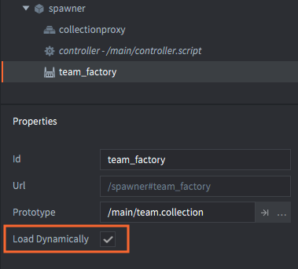
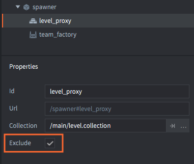

# Zarządzanie zasobami

Jeśli tworzysz bardzo małą grę, ograniczenia platformy docelowej (rozmiar pamięci, rozmiar paczki, moc obliczeniowa i zużycie baterii) mogą nigdy nie stanowić problemu. Jednak tworząc większe gry, zwłaszcza na urządzeniach przenośnych czy na przeglądarki, zużycie pamięci będzie prawdopodobnie jednym z największych ograniczeń. Doświadczony zespół będzie starannie zarządzać zasobami w oparciu o ograniczenia platformy. Defold dostarcza szereg funkcji do zarządzania pamięcią i rozmiarem paczki. Ta instrukcja pozwala się z nimi zapoznać.

## Statyczne drzewo zasobów

Podczas tworzenia gry w Defoldzie deklarujesz statycznie drzewo zasobów. Każda część gry jest łączona z drzewem, począwszy od kolekcji rozruchowej (ang. bootrstrap collection), zwykle nazywanej "main.collection". Drzewo zasobów podąża za każdym odniesieniem i zawiera wszystkie zasoby powiązane z tymi odniesieniami:

- Dane obiektów gry (game objects) i komponentów (atlasy, dźwięki itp).
- Prototypy komponentów fabryki (obiekty gry i kolekcje).
- Odniesienia komponentów pełnomocników kolekcji (kolekcje).
- Niestandardowe zasoby deklarowane w *game.project*.

Podczas tworzenia i pakowania gry, tylko to, co znajduje się w drzewie zasobów, zostanie uwzględnione w paczce. To, czego nie ma w drzewie, jest pomijane. Nie ma potrzeby ręcznego wybierania, co ma być uwzględnione lub wyłączone z paczki.

Podczas *uruchamiania* gry, silnik rozpoczyna działanie od korzenia drzewa rozruchowego (ang. bootstrap root) i ściąga zasoby do pamięci:

- Każda kolekcja, do której odniesienie istnieje, wraz z jej zawartością.
- Obiekty gry i dane komponentów.
- Prototypy komponentów fabryki (obiekty gry i kolekcje).

Defold nie ładuje jednak automatycznie następujących rodzajów odniesionych zasobów podczas działania:

- Kolekcji świata gry, do której odniesienie istnieje przez proxy kolekcji. Światy gry są stosunkowo duże, więc będziesz musiał ręcznie uruchamiać i wyłączać ich ładowanie w kodzie. Zobacz [instrukcję do pełnomocników kolekcji](/manuals/collection-proxy), aby poznać szczegóły.
- Pliki dodane za pomocą ustawienia *Custom Resources* (Niestandardowe zasoby) w *game.project*. Te pliki są ręcznie ładowane za pomocą funkcji [sys.load_resource()](/ref/sys/#sys.load_resource).

Domyślny sposób, w jaki Defold pakuje i ładuje zasoby, można zmienić, aby uzyskać kontrolę nad tym, jak i kiedy zasoby wchodzą do pamięci.

## Dynamiczne ładowanie zasobów fabryki

Zasoby odniesione przez komponenty fabryki (ang. factory components) są zazwyczaj ładowane do pamięci, w momencie, gdy komponent jest ładowany. Zasoby są gotowe do użycia w grze, zanim fabryka zostanie utworzona w czasie działania. Aby zmienić domyślne zachowanie i opóźnić ładowanie zasobów fabryki, można po prostu zaznaczyć w właściwościach fabryki opcję *Load Dynamically* (Ładuj dynamicznie).

Zaznaczenie tej opcji spowoduje, że silnik wciąż zawierać będzie odniesione zasoby w paczce gry, ale nie załaduje ich automatycznie. Zamiast tego masz dwie opcje:

1. Wywołać funckję [`factory.create()`](/ref/factory/#factory.create) lub [`collectionfactory.create()`](/ref/collectionfactory/#collectionfactory.create), gdy chcesz tworzyć obiekty. To spowoduje synchroniczne ładowanie zasobów, a następnie tworzenie nowych instancji.
2. Wywołać funckję [`factory.load()`](/ref/factory/#factory.load) lub [`collectionfactory.load()`](/ref/collectionfactory/#collectionfactory.load), aby asynchronicznie ładować zasoby. Gdy zasoby będą gotowe do tworzenia, zostanie odebrane odpowiednie wywołanie zwrotne (callback).

Zobacz [instrukcję do fabryk](/manuals/factory) i [instrukcję do fabryk kolekcji](/manuals/collection-factory) po szczegóły dotyczące działania tych opcji.

## Dynamiczne zwalnianie ładowanych zasobów

Defold zachowuje liczniki odniesień dla wszystkich zasobów. Jeśli licznik odniesienia zasobu wynosi zero, oznacza to, że nie ma do niego już żadnego odniesienia. Zasób zostaje wtedy automatycznie usunięty z pamięci. Na przykład, jeśli usuniesz wszystkie obiekty utworzone przez fabrykę i dodatkowo usuniesz obiekt zawierający komponent fabryki, zasoby wcześniej odniesione przez fabrykę zostaną usunięte z pamięci.

Dla fabryk oznaczonych jako *Load Dynamically* można wywołać funkcję [`factory.unload()`](/ref/factory/#factory.unload) albo [`collectionfactory.unload()`](/ref/collectionfactory/#collectionfactory.unload). To wywołanie usuwa odniesienie komponentu fabryki do zasobu. Jeśli nic innego nie odnosi się do zasobu (np. wszystkie utworzone obiekty są usunięte), zasób zostanie zwolniony z pamięci.

## Wykluczanie zasobów z paczki

Dzięki proxy (pełnomocnikom) kolekcji można pominąć wszystkie zasoby, do których odnosi się komponent, w procesie pakowania (bundling). Jest to przydatne, jeśli potrzebujesz zachować minimalny rozmiar paczki. Na przykład, podczas uruchamiania gier w sieci jako HTML5, przeglądarka pobierze całą paczkę przed uruchomieniem gry.

Zaznaczenie opcji pełnomocnika kolekcji nazwanej *Exclude* (Wyklucz) spowoduje, że odniesienie do zasobu zostanie pominięte w paczce gry. Zamiast tego można przechowywać wyłączone kolekcje w wybranym przechowywaniu w chmurze. W [instrukcji do aktualizacji na żywo - Live update](/manuals/live-update/) wyjaśniono, jak działa ta funkcja.
