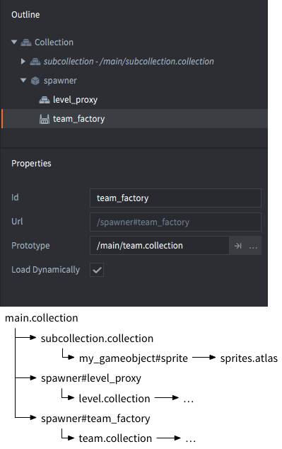
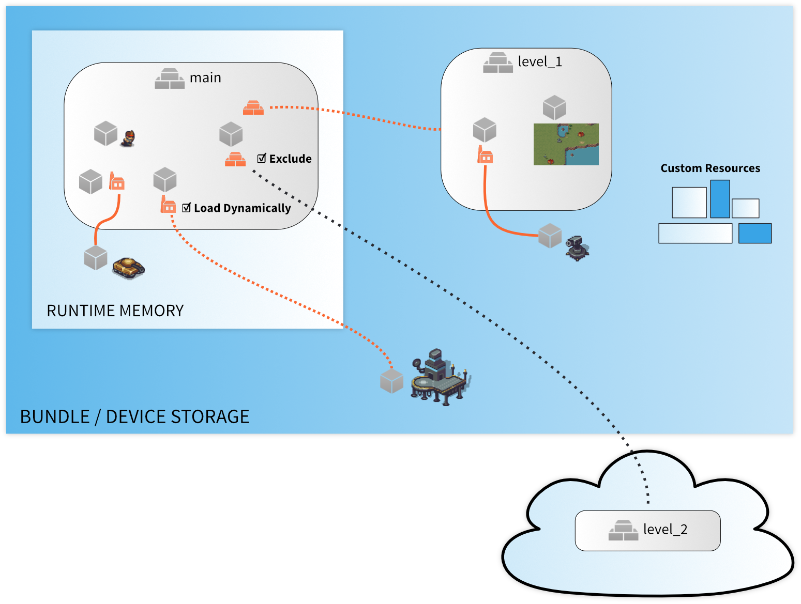
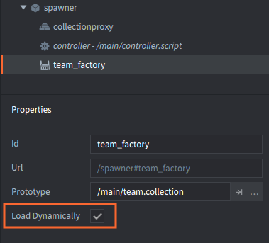
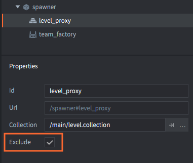

# Zarządzanie zasobami

Jeśli tworzysz bardzo małą grę, ograniczenia platformy docelowej, takie jak zużycie pamięci, rozmiar pakietu, moc obliczeniowa czy pobór energii, mogą w ogóle nie stanowić problemu. Przy większych grach, zwłaszcza na urządzeniach przenośnych, zużycie pamięci szybko staje się jednym z głównych ograniczeń. Doświadczony zespół planuje budżety zasobów z uwzględnieniem ograniczeń platformy. Defold udostępnia zestaw funkcji, które pomagają kontrolować pamięć i rozmiar pakietu. Ta instrukcja zawiera ich przegląd.

## Statyczne drzewo zasobów

Podczas budowania gry w Defold statycznie deklarujesz drzewo zasobów. Każdy element gry trafia do tego drzewa, począwszy od kolekcji bootstrapowej, zwykle o nazwie main.collection. Drzewo zasobów podąża za wszystkimi odwołaniami i obejmuje wszystkie zasoby z nimi powiązane:

- dane obiektów gry i komponentów, na przykład atlasy, dźwięki itd.
- prototypy komponentów Factory i Collection factory, czyli obiekty gry oraz kolekcje
- odwołania komponentów Collection proxy
- zasoby Custom Resources zadeklarowane w *game.project*

::: sidenote
Defold ma też pojęcie [zasobów pakietu](/manuals/project-settings/#bundle-resources). Są one dołączane do pakietu aplikacji, ale nie należą do drzewa zasobów. Mogą to być zarówno pliki pomocnicze zależne od platformy, jak i zewnętrzne pliki [wczytywane z systemu plików](/manuals/file-access/#how-to-access-files-bundled-with-the-application) używane przez grę, na przykład banki dźwięków FMOD.
:::

Podczas *tworzenia pakietu* gry dołączane jest tylko to, co znajduje się w drzewie zasobów. Wszystko, do czego nie prowadzi żadne odwołanie w drzewie, zostaje pominięte. Nie trzeba ręcznie wybierać, co ma trafić do pakietu, a co ma zostać z niego wykluczone.

Podczas *uruchamiania* gry silnik zaczyna od bootstrapowego korzenia drzewa i ładuje zasoby do pamięci:

- dowolną odwołaną kolekcję wraz z jej zawartością
- obiekty gry i dane komponentów
- prototypy komponentów Factory i Collection factory

Silnik nie ładuje jednak automatycznie następujących typów zasobów wskazanych w drzewie:

- kolekcji świata gry wskazywanych przez Collection proxy; takie światy są stosunkowo duże, więc ich ładowanie i zwalnianie trzeba wyzwalać ręcznie w kodzie. Szczegóły znajdziesz w [instrukcji Collection proxy](/manuals/collection-proxy)
- plików dodanych przez ustawienie Custom Resources w *game.project*; te pliki wczytuje się ręcznie funkcją sys.load_resource()

Domyślny sposób, w jaki Defold pakuje i ładuje zasoby, można zmienić tak, aby zyskać precyzyjną kontrolę nad tym, kiedy i jak trafiają one do pamięci.

## Dynamiczne ładowanie zasobów Factory

Zasoby wskazywane przez komponenty Factory są zwykle ładowane do pamięci razem z samym komponentem. Dzięki temu są gotowe do tworzenia obiektów od razu, gdy fabryka istnieje w czasie działania gry. Aby zmienić to zachowanie i odroczyć *ładowanie* zasobów Factory, zaznacz <kbd>Load Dynamically</kbd>.

Po zaznaczeniu tego pola silnik nadal dołączy wskazane zasoby do pakietu gry, ale nie załaduje ich automatycznie. Zamiast tego masz dwie możliwości:

1. Wywołaj [factory.create()](/ref/factory/#factory.create) albo [collectionfactory.create()](/ref/collectionfactory/#collectionfactory.create), gdy chcesz tworzyć obiekty. Zasoby zostaną wtedy załadowane synchronicznie, a następnie pojawią się nowe instancje.
2. Wywołaj [factory.load()](/ref/factory/#factory.load) albo [collectionfactory.load()](/ref/collectionfactory/#collectionfactory.load), aby załadować zasoby asynchronicznie. Gdy zasoby będą gotowe do tworzenia, zostanie wywołana funkcja zwrotna.

Szczegóły działania znajdziesz w [instrukcji Factory](/manuals/factory) i [instrukcji Collection factory](/manuals/collection-factory).

## Zwalnianie dynamicznie ładowanych zasobów

Defold utrzymuje liczniki referencji dla wszystkich zasobów. Jeśli licznik zasobu spadnie do zera, oznacza to, że nic już się do niego nie odwołuje. Zasób jest wtedy automatycznie zwalniany z pamięci. Na przykład jeśli usuniesz wszystkie obiekty utworzone przez fabrykę i dodatkowo usuniesz obiekt zawierający komponent Factory, zasoby wcześniej wskazywane przez tę fabrykę zostaną zwolnione z pamięci.

W przypadku *fabryk* oznaczonych <kbd>Load Dynamically</kbd> możesz wywołać [`factory.unload()`](/ref/factory/#factory.unload) albo [`collectionfactory.unload()`](/ref/collectionfactory/#collectionfactory.unload). To wywołanie usuwa odwołanie komponentu Factory do zasobu. Jeśli nic innego nie odwołuje się już do tego zasobu, na przykład wszystkie utworzone obiekty zostały usunięte, zasób zostanie zwolniony z pamięci.

## Wykluczanie zasobów z pakietu

W przypadku Collection proxy można pominąć w procesie tworzenia pakietu wszystkie zasoby, do których odwołuje się komponent. Jest to przydatne, jeśli chcesz zminimalizować rozmiar pakietu. Na przykład podczas uruchamiania gry w przeglądarce jako HTML5 przeglądarka pobiera cały pakiet, zanim uruchomi grę.

Po oznaczeniu Collection proxy jako <kbd>Exclude</kbd> wskazany zasób zostanie pominięty w pakiecie gry. Zamiast tego możesz przechowywać *wykluczone kolekcje* w wybranym magazynie w chmurze. [Instrukcja Live update](/manuals/live-update/) wyjaśnia, jak działa ta funkcja.
