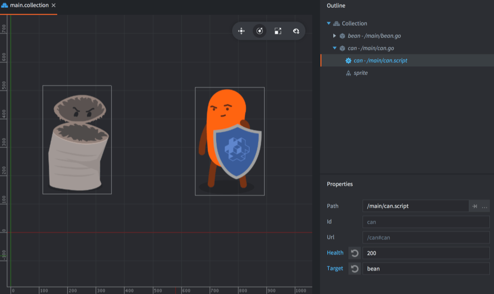
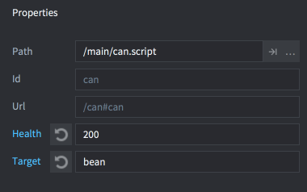
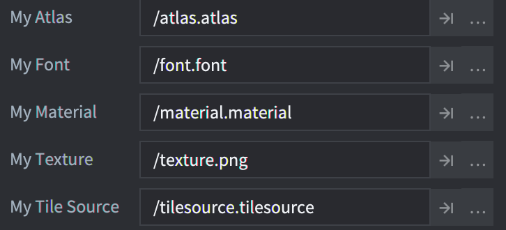

# Właściwości skryptu

Właściwości skryptu to prosty i zarazem skuteczny sposób definiowania oraz udostępniania niestandardowych właściwości dla konkretnej instancji obiektu gry. Takie właściwości można edytować bezpośrednio w edytorze dla wybranych instancji, a ich wartości wykorzystać w kodzie do zmiany zachowania obiektu gry. Właściwości skryptu są szczególnie przydatne w wielu sytuacjach:

* gdy chcesz nadpisać wartości dla konkretnych instancji w edytorze i dzięki temu zwiększyć możliwość ponownego użycia skryptu,
* gdy chcesz utworzyć obiekt gry z wartościami początkowymi,
* gdy chcesz animować wartości właściwości,
* gdy chcesz odczytywać dane stanu z jednego skryptu w innym. (Jeśli często odwołujesz się do właściwości między obiektami, lepiej przenieść dane do współdzielonego magazynu.)

Typowe zastosowania to ustawianie zdrowia lub prędkości konkretnego przeciwnika sterowanego przez AI, koloru obiektu zbieralnego, atlasu sprite'a albo wiadomości, którą obiekt przycisku ma wysłać po naciśnięciu, a także miejsca docelowego, do którego ma ją wysłać.

## Definiowanie właściwości skryptu

Właściwości skryptu dodaje się do komponentu skryptu przez zdefiniowanie ich za pomocą specjalnej funkcji `go.property()`. Funkcję trzeba wywołać na najwyższym poziomie, poza funkcjami cyklu życia, takimi jak `init()` i `update()`. Domyślna wartość podana dla właściwości określa jej typ: `number`, `boolean`, `hash`, `msg.url`, `vmath.vector3`, `vmath.vector4`, `vmath.quaternion` oraz `resource` (patrz niżej).

::: important
Odwracanie wartości hash działa tylko w buildzie Debug, co ułatwia debugowanie. W buildzie Release odwrócony ciąg znaków nie istnieje, więc używanie `tostring()` na wartości `hash` w celu wyciągnięcia z niej tekstu nie ma sensu.
:::


```lua
-- can.script
-- Definiowanie właściwości skryptu dla zdrowia i celu ataku
go.property("health", 100)
go.property("target", msg.url())

function init(self)
  -- zapisanie początkowej pozycji celu.
  -- self.target to url wskazujący na inny obiekt.
  self.target_pos = go.get_position(self.target)
  ...
end

function on_message(self, message_id, message, sender)
  if message_id == hash("take_damage") then
    -- zmniejszenie wartości właściwości zdrowia
    self.health = self.health - message.damage
    if self.health <= 0 then
      go.delete()
    end
  end
end
```

Każda instancja komponentu skryptu utworzona z tego skryptu może następnie ustawiać wartości tych właściwości.



Wybierz komponent skryptu w widoku *<kbd>Outline</kbd>* w edytorze, a właściwości pojawią się w widoku *<kbd>Properties</kbd>*, co pozwoli je edytować:



Każda właściwość, która zostanie nadpisana nową wartością właściwą dla danej instancji, jest oznaczona na niebiesko. Kliknij przycisk resetowania obok nazwy właściwości, aby przywrócić wartość domyślną ustawioną w skrypcie.


::: important
Właściwości skryptu są parsowane podczas budowania projektu. Wyrażenia wartości nie są obliczane. Oznacza to, że coś takiego jak `go.property("hp", 3+6)` nie zadziała, podczas gdy `go.property("hp", 9)` będzie działać.
:::

## Uzyskiwanie dostępu do właściwości skryptu

Każda zdefiniowana właściwość skryptu jest dostępna jako przechowywany człon w `self`, czyli odwołaniu do instancji skryptu:

```lua
-- my_script.script
go.property("my_property", 1)

function update(self, dt)
  -- Odczyt i zapis właściwości
  if self.my_property == 1 then
      self.my_property = 3
  end
end
```

Właściwości skryptu zdefiniowane przez użytkownika można też odczytywać i modyfikować za pomocą funkcji get, set i animate, tak samo jak każdą inną właściwość:

```lua
-- another.script

-- zwiększenie "my_property" w "myobject#my_script" o 1
local val = go.get("myobject#my_script", "my_property")
go.set("myobject#my_script", "my_property", val + 1)

-- animowanie "my_property" w "myobject#my_script"
go.animate("myobject#my_script", "my_property", go.PLAYBACK_LOOP_PINGPONG, 100, go.EASING_LINEAR, 2.0)
```

## Obiekty tworzone przez fabryki

Jeśli używasz fabryki do tworzenia obiektu gry, możesz ustawić właściwości skryptu już w momencie tworzenia:

```lua
local props = { health = 50, target = msg.url("player") }
local id = factory.create("#can_factory", nil, nil, props)

-- Dostęp do właściwości skryptu utworzonych przez fabrykę
local url = msg.url(nil, id, "can")
local can_health = go.get(url, "health")
```

Podczas tworzenia hierarchii obiektów gry za pomocą `collectionfactory.create()` trzeba sparować identyfikatory obiektów z tabelami właściwości. Są one łączone w jedną tabelę i przekazywane do funkcji `create()`:

```lua
local props = {}
props[hash("/can1")] = { health = 150 }
props[hash("/can2")] = { health = 250, target = msg.url("player") }
props[hash("/can3")] = { health = 200 }

local ids = collectionfactory.create("#cangang_factory", nil, nil, props)
```

Wartości właściwości przekazane przez `factory.create()` i `collectionfactory.create()` zastępują zarówno wartość ustawioną w pliku prototypu, jak i domyślne wartości ze skryptu.

Jeśli kilka komponentów skryptu dołączonych do obiektu gry definiuje tę samą właściwość, każdy komponent zostanie zainicjalizowany wartością przekazaną przez `factory.create()` lub `collectionfactory.create()`.


## Właściwości zasobów

Właściwości zasobów definiuje się dokładnie tak samo jak właściwości skryptu dla podstawowych typów danych:

```lua
go.property("my_atlas", resource.atlas("/atlas.atlas"))
go.property("my_font", resource.font("/font.font"))
go.property("my_material", resource.material("/material.material"))
go.property("my_texture", resource.texture("/texture.png"))
go.property("my_tile_source", resource.tile_source("/tilesource.tilesource"))
```

Gdy właściwość zasobu zostanie zdefiniowana, pojawia się w widoku *<kbd>Properties</kbd>* tak samo jak każda inna właściwość skryptu, ale jako pole przeglądarki plików i zasobów:



Właściwości zasobów odczytuje się i wykorzystuje za pomocą `go.get()` albo przez odwołanie do instancji skryptu `self` i użycie `go.set()`:

```lua
function init(self)
  go.set("#sprite", "image", self.my_atlas)
  go.set("#label", "font", self.my_font)
  go.set("#sprite", "material", self.my_material)
  go.set("#model", "texture0", self.my_texture)
  go.set("#tilemap", "tile_source", self.my_tile_source)
end
```
