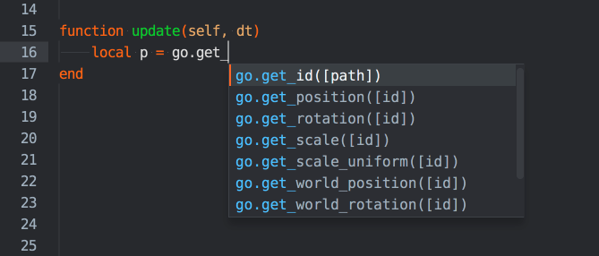

# Skrypty

Komponent typu skrypt (ang. script) pozwala na tworzenie logiki gry przy użyciu języka programowania Lua. Skrypty dodawane są do obiektów gry dokładnie tak samo jak każdy inny [komponent](/manuals/components), a Defold wykona kod Lua w ramach funkcji cyklu życia silnika.

## Typy skryptów

W Defoldzie występują trzy rodzaje skryptów Lua, z dostępem do różnych bibliotek Defolda.

Skrypty logiczne (.script)
: Uruchamiane przez komponenty skryptu w obiektach gry. Skrypty logiczne są zazwyczaj używane do kontrolowania obiektów gry i logiki łączącej grę z ładowaniem poziomów, zasadami gry itp. Skrypty logiczne mają dostęp do wszystkich funkcji bibliotek Defold, z wyjątkiem funkcji [GUI](/ref/gui) i [Render](/ref/render).

Skrypty GUI (.gui_script)
: Uruchamiane przez komponenty GUI i zazwyczaj zawierają logikę wymaganą do wyświetlania elementów interfejsu użytkownika, takich jak wyświetlacze informacji, menu itp. Skrypty GUI mają dostęp do funkcji biblioteki [GUI](/ref/gui).

Skrypty renderowania (.render_script)
: Uruchamiane przez potok renderowania (rendering pipeline) i zawierają logikę wymaganą do renderowania grafiki aplikacji/gry w każdej klatce. Skrypty renderowania mają dostęp do funkcji biblioteki [Render](/ref/render).

## Wykonywanie skryptów, wywołania zwrotne i "self"

Defold wykonuje skrypty Lua jako część cyklu życia silnika i ujawnia cykl życia przez zestaw predefiniowanych funkcji wywołania zwrotnego. Gdy dodasz komponent skryptu do obiektu gry, skrypt staje się częścią cyklu życia obiektu gry i jego komponentu (lub komponentów). Skrypt jest oceniany w kontekście Lua, gdy jest wczytywany, a następnie silnik wykonuje następujące funkcje i przekazuje odniesienie do bieżącej instancji komponentu skryptu. Możesz użyć tego odniesienia "self" do przechowywania stanu w instancji komponentu.

::: ważne
"Self" to obiekt typu userdata, który działa jak tabela Lua, ale nie można go przeglądać za pomocą pairs() ani ipairs(), ani drukować za pomocą pprint().
:::

init(self)
: Wywoływane, gdy komponent jest inicjowany.

  ```lua
  function init(self)
      -- These variables are available through the lifetime of the component instance
      self.my_var = "something"
      self.age = 0
  end
  ```

final(self)
: Wywoływane, gdy komponent jest usuwany. Przydatne do celów sprzątania, na przykład, jeśli utworzyłeś obiekty gry, które powinny być usunięte, gdy komponent jest usuwany.

  ```lua
  function final(self)
      if self.my_var == "something" then
          -- wykonaj jakiś kod
      end
  end

update(self, dt)
: Wywoływane raz w każdej klatce. dt zawiera czas delta od ostatniej klatki.

  ```lua
  function update(self, dt)
      self.age = self.age + dt -- increase age with the timestep
  end
  ```

fixed_update(self, dt)
: Aktualizacja niezależna od liczby klatek. dt zawiera czas delta od ostatniej aktualizacji. Ta funkcja jest wywoływana, gdy engine.fixed_update_frequency jest włączony (!= 0) i jest przydatna, gdy chcesz manipulować obiektami fizycznymi w regularnych odstępach czasu, aby uzyskać stabilną symulację fizyki, gdy physics.use_fixed_timestep jest włączone w game.project.

  ```lua
  function fixed_update(self, dt)
      msg.post("#co", "apply_force", {force = vmath.vector3(1, 0, 0), position = go.get_world_position()})
  end
  ```

on_message(self, message_id, message, sender)
: Gdy wiadomości są wysyłane do komponentu skryptu za pomocą msg.post(), silnik wywołuje tę funkcję komponentu odbiorczego. Dowiedz się więcej na temat przekazywania wiadomości.

  ```lua
  function on_message(self, message_id, message, sender)
      if message_id == hash("increase_score") then
          self.total_score = self.total_score + message.score
      end
  end
```

on_input(self, action_id, action)
: Jeśli ten komponent uzyskał fokus wejścia (zobacz acquire_input_focus), silnik wywołuje tę funkcję, gdy zostanie zarejestrowane wejście. Dowiedz się więcej na temat obsługi wejścia.'

  ```lua
  function on_input(self, action_id, action)
      if action_id == hash("touch") and action.pressed then
          print("Touch", action.x, action.y)
      end
  end
  ```

on_reload(self)
: Ta funkcja jest wywoływana, gdy skrypt jest ponownie wczytywany za pomocą funkcji edytora "hot reload" (<kbd>Edytuj ▸ Ponownie załaduj zasób</kbd>). Jest bardzo przydatna do celów debugowania, testowania i dostrojenia. Dowiedz się więcej na temat ponownego ładowania na gorąco.

  ```lua
  function on_reload(self)
      print(self.age) -- wyświetl wartość zmiennej self.age
  end
  ```

## Logika reaktywna

Obiekt gry z komponentem skryptu implementuje pewną logikę. Często zależy ona od pewnego czynnika zewnętrznego. Przykładowo sztuczna inteligencja przeciwnika może reagować na gracza znajdującego się w określonym promieniu od przeciwnika, drzwi mogą odblokować się i otworzyć w wyniku interakcji gracza itp.

Funkcja `update()` pozwala na implementację złożonych zachowań zdefiniowanych jako automat stanów, który działa w każdej klatce - czasami jest to odpowiednie podejście. Jednak z każdym wywołaniem `update()` wiąże się pewien koszt. Jeśli naprawdę nie potrzebujesz tej funkcji, powinieneś ją usunąć i spróbować budować swoją logikę w sposób reaktywny. Oczekiwanie biernie na jakąś wiadomość, która wyzwoli reakcję, jest "tańsze" niż aktywne przeszukiwanie świata gry w poszukiwaniu danych do analizy. Ponadto rozwiązanie danego problemu w sposób reaktywny zazwyczaj prowadzi do czystszego i bardziej stabilnego projektu i jego implementacji.

Przyjrzyjmy się konkretnemu przykładowi. Załóżmy, że chcesz, aby komponent skryptu wysłał wiadomość 2 sekundy po inicjalizacji. Następnie powinien oczekiwać na określoną wiadomość odpowiedzi i po jej otrzymaniu, wysłać inną wiadomość 5 sekund później. Niereaktywny kod dla tego wyglądałby mniej więcej tak:

```lua
function init(self)
    -- Licznik czasu.
    self.counter = 0
    -- Potrzebujemy tego do śledzenia naszego stanu.
    self.state = "first"
end

function update(self, dt)
    self.counter = self.counter + dt
    if self.counter >= 2.0 and self.state == "first" then
        -- wysłanie wiadomości po 2 sekundach
        msg.post("some_object", "some_message")
        self.state = "waiting"
    end
    if self.counter >= 5.0 and self.state == "second" then
        -- wysłanie wiadomości 5 sekund po otrzymaniu "response"
        msg.post("another_object", "another_message")
        -- Wyczyszczenie stanu, aby nie wykonać tego bloku stanu ponownie.
        self.state = nil
    end
end

function on_message(self, message_id, message, sender)
    if message_id == hash("response") then
        -- Stan "pierwszy" zakończony, wchodzi kolejny
        self.state = "second"
        -- Wyzerowanie licznika
        self.counter = 0
    end
end
```

Even in this quite simple case we get fairly tangled up logic. It's possible to make this look better with the help of coroutines in a module (see below), but let's instead try to make this reactive and use a built-in timing mechanism.

```lua
local function send_first()
	msg.post("some_object", "some_message")
end

function init(self)
	-- Poczekaj 2 s, a następnie wywołaj send_first()
	timer.delay(2, false, send_first)
end

local function send_second()
	msg.post("another_object", "another_message")
end

function on_message(self, message_id, message, sender)
	if message_id == hash("response") then
		-- Poczekaj 5 s, a następnie wywołaj send_second()
		timer.delay(5, false, send_second)
	end
end
```

To jest bardziej przejrzyste i łatwiejsze do śledzenia. Pozbywamy się wewnętrznych zmiennych stanu, które często są trudne do śledzenia przez logikę - i które mogą prowadzić do subtelnych błędów. Dodatkowo całkowicie rezygnujemy z funkcji `update()`. Zwalnia to silnik z wywoływania naszego skryptu 60 razy na sekundę.

## Preprocessing
Przetwarzanie wstępne, czyli preprocessing wykrozystuje preprocesor Lua i specjalne znaczniki, aby warunkowo dołączać kod w zależności od wariantu budowy. Przykład:

```lua
-- Użyj jednego z tych słów kluczowych: RELEASE, DEBUG lub HEADLESS
--#IF DEBUG
local lives_num = 999
--#ELSE 
local lives_num = 3
--#ENDIF
```

Preprocesor jest dostępny jako rozszerzenie budowania. Dowiedz się więcej na temat sposobu instalacji i użycia na [stronie rozszerzenia na GitHubie](https://github.com/defold/extension-lua-preprocessor).

## Wsparcie Edytora

Edytor Defold obsługuje edycję skryptów Lua z kolorowaniem składni i autouzupełnianiem. Aby wyświetlić nazwy funkcji Defold, naciśnij <kbd>Ctrl</kbd>+<kbd>Spacja</kbd>, aby wyświetlić listę funkcji pasujących do tego, co wpisujesz.


