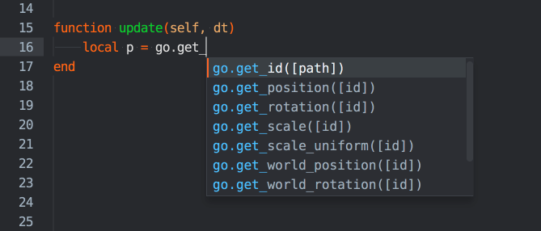

# Skrypty

Komponenty skryptowe pozwalają tworzyć logikę gry przy użyciu [języka Lua](/manuals/lua).

## Typy skryptów

W Defold istnieją trzy typy skryptów Lua, a każdy z nich ma dostęp do innego zestawu bibliotek Defold.

Skrypty obiektów gry
: Rozszerzenie _.script_. Te skrypty dodaje się do obiektów gry dokładnie tak samo jak każdy inny [komponent](/manuals/components), a Defold wykonuje kod Lua w ramach funkcji cyklu życia silnika. Skrypty obiektów gry zwykle służą do sterowania obiektami gry oraz logiką, która spaja grę z ładowaniem poziomów, regułami gry i innymi podobnymi elementami. Skrypty obiektów gry mają dostęp do funkcji [GO](/ref/go) oraz do wszystkich bibliotek Defold poza funkcjami [GUI](/ref/gui) i [Render](/ref/render).

Skrypty GUI
: Rozszerzenie _.gui_script_. Są uruchamiane przez komponenty GUI i zwykle zawierają logikę potrzebną do wyświetlania elementów interfejsu, takich jak HUD-y, menu itp. Defold wykonuje kod Lua w ramach funkcji cyklu życia silnika. Skrypty GUI mają dostęp do funkcji [GUI](/ref/gui) oraz do wszystkich bibliotek Defold poza funkcjami [GO](/ref/go) i [Render](/ref/render).

Skrypty renderowania
: Rozszerzenie _.render_script_. Są uruchamiane przez potok renderowania i zawierają logikę potrzebną do renderowania całej grafiki aplikacji lub gry w każdej klatce. Skrypt renderowania zajmuje szczególne miejsce w cyklu życia gry. Szczegóły znajdziesz w [dokumentacji cyklu życia aplikacji](/manuals/application-lifecycle). Skrypty renderowania mają dostęp do funkcji [Render](/ref/render) oraz do wszystkich bibliotek Defold poza funkcjami [GO](/ref/go) i [GUI](/ref/gui).

## Wykonywanie skryptów, wywołania zwrotne i `self`

Defold wykonuje skrypty Lua jako część cyklu życia silnika i udostępnia ten cykl za pomocą zestawu predefiniowanych funkcji wywołania zwrotnego. Gdy dodasz komponent skryptu do obiektu gry, skrypt staje się częścią cyklu życia tego obiektu oraz jego komponentów. Skrypt jest interpretowany w kontekście Lua podczas wczytywania, a następnie silnik wywołuje poniższe funkcje i przekazuje referencję do bieżącej instancji komponentu skryptu jako parametr. Możesz używać tej referencji `self` do przechowywania stanu w instancji komponentu.

::: important
`self` jest obiektem userdata, który zachowuje się jak tabela Lua, ale nie można po nim iterować za pomocą `pairs()` ani `ipairs()` i nie można go wypisać przez `pprint()`.
:::

#### `init(self)`
Wywoływana podczas inicjalizacji komponentu.

```lua
function init(self)
  -- Te zmienne są dostępne przez cały czas życia instancji komponentu
  self.my_var = "something"
  self.age = 0
end
```

#### `final(self)`
Wywoływana podczas usuwania komponentu. Przydaje się do porządkowania zasobów, na przykład jeśli utworzono obiekty gry, które powinny zostać usunięte razem z komponentem.

```lua
function final(self)
  if self.my_var == "something" then
      -- wykonaj czynności porządkowe
  end
end
```

#### `fixed_update(self, dt)`
Aktualizacja niezależna od liczby klatek. Parametr `dt` zawiera czas, jaki upłynął od poprzedniej aktualizacji. Ta funkcja jest wywoływana `0-N` razy, zależnie od czasu trwania klatki i częstotliwości aktualizacji stałokrokowej. Jest wywoływana tylko wtedy, gdy `Physics`-->`Use Fixed Timestep` jest włączone, a `Engine`-->`Fixed Update Frequency` ma wartość większą od 0 w *game.project*. Jest przydatna, gdy chcesz manipulować obiektami fizycznymi w regularnych odstępach, aby uzyskać stabilną symulację fizyki.

```lua
function fixed_update(self, dt)
  msg.post("#co", "apply_force", {force = vmath.vector3(1, 0, 0), position = go.get_world_position()})
end
```

#### `update(self, dt)`
Wywoływana raz na każdą klatkę po callbacku `fixed_update` wszystkich skryptów, jeśli włączono Fixed Timestep. Parametr `dt` zawiera czas, jaki upłynął od poprzedniej klatki.

```luadifferent
function update(self, dt)
  self.age = self.age + dt -- zwiększ wiek o krok czasu
end
```

#### `late_update(self, dt)`
Wywoływana raz na każdą klatkę po callbacku `update` wszystkich skryptów, ale tuż przed renderowaniem. Parametr `dt` zawiera czas, jaki upłynął od poprzedniej klatki.

```lua
function late_update(self, dt)
  go.set_position("/camera", self.final_camera_position)
end
```

#### `on_message(self, message_id, message, sender)`
Gdy wiadomości są wysyłane do komponentu skryptu przez [`msg.post()`](/ref/msg#msg.post), silnik wywołuje tę funkcję w komponencie odbiorcy. Więcej informacji znajdziesz w [instrukcji o przesyłaniu wiadomości](/manuals/message-passing).

```lua
function on_message(self, message_id, message, sender)
    if message_id == hash("increase_score") then
        self.total_score = self.total_score + message.score
    end
end
```

#### `on_input(self, action_id, action)`
Jeśli komponent przechwycił fokus wejścia (zob. [`acquire_input_focus`](/ref/go/#acquire_input_focus)), silnik wywołuje tę funkcję, gdy wejście zostanie zarejestrowane. Więcej informacji znajdziesz w [instrukcji o obsłudze wejścia](/manuals/input).

```lua
function on_input(self, action_id, action)
    if action_id == hash("touch") and action.pressed then
        print("Touch", action.x, action.y)
    end
end
```

#### `on_reload(self)`
Ta funkcja jest wywoływana, gdy skrypt zostaje przeładowany przez funkcję szybkiego przeładowania edytora (<kbd>Edit ▸ Reload Resource</kbd>). Jest bardzo przydatna podczas debugowania, testowania i strojenia. Więcej informacji znajdziesz w [instrukcji o szybkim przeładowaniu](/manuals/hot-reload).

```lua
function on_reload(self)
  print(self.age) -- wypisz wiek tego obiektu gry
end
```

## Logika reaktywna

Obiekt gry z komponentem skryptowym implementuje jakąś logikę. Często zależy ona od czynników zewnętrznych. Sztuczna inteligencja przeciwnika może reagować na to, że gracz znajdzie się w określonym promieniu, drzwi mogą się odblokować i otworzyć w wyniku interakcji gracza itd.

Funkcja `update()` pozwala implementować złożone zachowania zdefiniowane jako automat stanów uruchamiany w każdej klatce. Czasami jest to właściwe podejście. Każde wywołanie `update()` wiąże się jednak z kosztem. Jeśli naprawdę nie potrzebujesz tej funkcji, usuń ją i spróbuj zbudować logikę _reaktywnie_. Taniej jest biernie czekać, aż wiadomość wywoła reakcję, niż aktywnie sprawdzać świat gry w poszukiwaniu danych do obsługi. Co więcej, reaktywne rozwiązanie problemu projektowego często prowadzi do czytelniejszego i stabilniejszego projektu oraz implementacji.

Spójrzmy na konkretny przykład. Załóżmy, że chcesz, aby komponent skryptu wysłał wiadomość 2 sekundy po uruchomieniu. Następnie ma poczekać na określoną wiadomość odpowiedzi, a po jej otrzymaniu wysłać kolejną wiadomość 5 sekund później. Kod niereaktywny wyglądałby mniej więcej tak:

```lua
function init(self)
    -- Licznik do śledzenia czasu
    self.counter = 0
    -- Potrzebujemy tego do śledzenia stanu
    self.state = "first"
end

function update(self, dt)
    self.counter = self.counter + dt
    if self.counter >= 2.0 and self.state == "first" then
        -- wyślij wiadomość po 2 sekundach
        msg.post("some_object", "some_message")
        self.state = "waiting"
    end
    if self.counter >= 5.0 and self.state == "second" then
        -- wyślij wiadomość 5 sekund po otrzymaniu "response"
        msg.post("another_object", "another_message")
        -- Ustaw stan na nil, aby nie wejść w ten blok ponownie.
        self.state = nil
    end
end

function on_message(self, message_id, message, sender)
    if message_id == hash("response") then
        -- Zakończono stan "first". Przejdź do następnego.
        self.state = "second"
        -- Wyzeruj licznik
        self.counter = 0
    end
end
```

Nawet w tak prostym przypadku logika bardzo szybko się komplikuje. Można ją uporządkować przy pomocy korutyn w module, zobacz niżej, ale spróbujmy zamiast tego podejścia reaktywnego i użyjmy wbudowanego mechanizmu odmierzania czasu.

```lua
local function send_first()
	msg.post("some_object", "some_message")
end

function init(self)
	-- Poczekaj 2 s, a potem wywołaj send_first()
	timer.delay(2, false, send_first)
end

local function send_second()
	msg.post("another_object", "another_message")
end

function on_message(self, message_id, message, sender)
	if message_id == hash("response") then
		-- Poczekaj 5 s, a potem wywołaj send_second()
		timer.delay(5, false, send_second)
	end
end
```

To podejście jest czytelniejsze i łatwiejsze do śledzenia. Pozbywamy się wewnętrznych zmiennych stanu, które często trudno prześledzić w toku logiki i które mogą prowadzić do subtelnych błędów. Dodatkowo całkowicie usuwamy funkcję `update()`. Dzięki temu silnik nie musi wywoływać naszego skryptu 60 razy na sekundę, nawet jeśli nic się w nim nie dzieje.

## Wstępne przetwarzanie

Można używać preprocesora Lua i specjalnych znaczników, aby warunkowo dołączać kod zależnie od wariantu kompilacji. Przykład:

```lua
-- Użyj jednego z następujących słów kluczowych: RELEASE, DEBUG lub HEADLESS
--#IF DEBUG
local lives_num = 999
--#ELSE
local lives_num = 3
--#ENDIF
```

Preprocesor jest dostępny jako rozszerzenie procesu budowania. Więcej informacji o instalacji i użyciu znajdziesz na [stronie rozszerzenia na GitHubie](https://github.com/defold/extension-lua-preprocessor).

## Wsparcie edytora

Edytor Defold obsługuje edycję skryptów Lua z kolorowaniem składni i autouzupełnianiem. Aby uzupełnić nazwy funkcji Defold, naciśnij *Ctrl+Space*, aby wyświetlić listę funkcji pasujących do wpisywanego tekstu.


