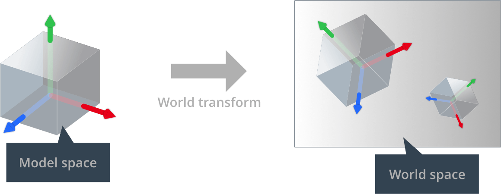
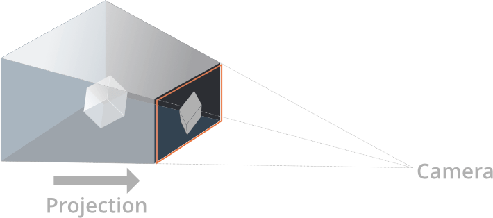
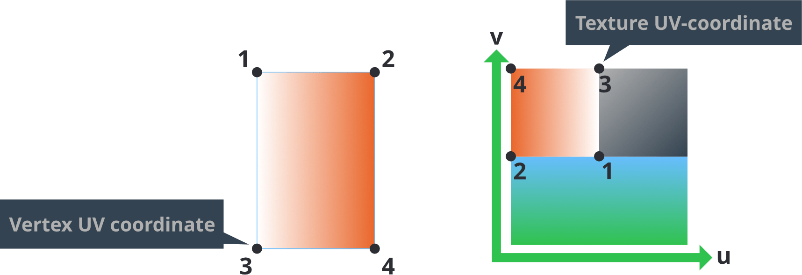
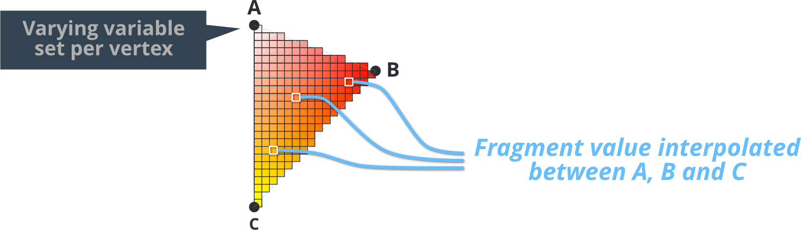
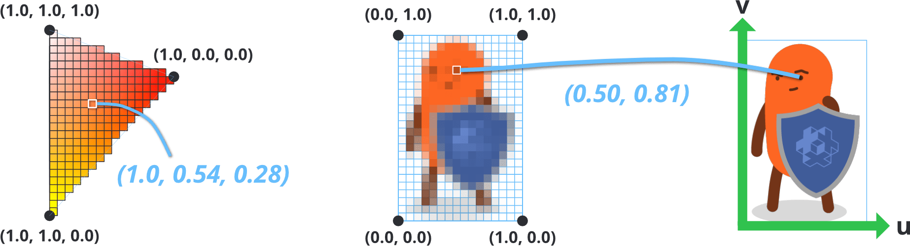
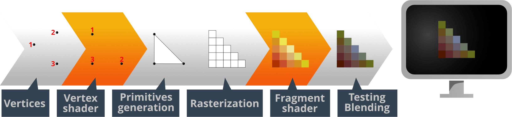
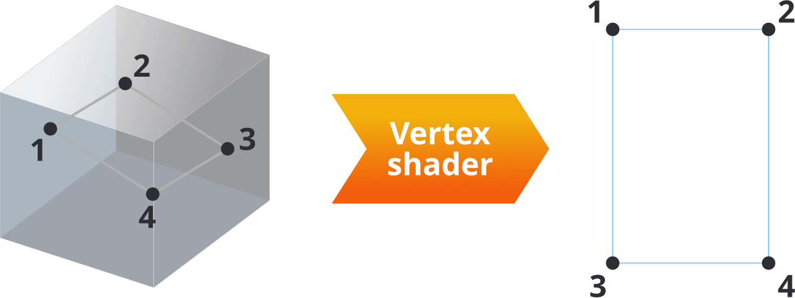
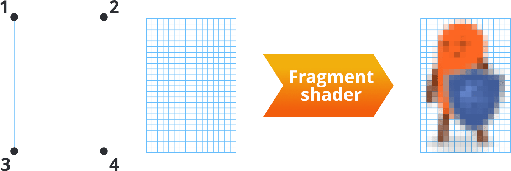

# Shadery

Programy shaderów są podstawą renderowania grafiki. To programy napisane w języku podobnym do C, zwanym GLSL (GL Shading Language), które uruchamia sprzęt graficzny, aby wykonywać operacje na danych 3D bazowych (wierzchołkach) albo na pikselach, które trafiają na ekran (czyli na „fragmentach”). Shaderów używa się do rysowania sprite'ów, oświetlania modeli 3D, tworzenia pełnoekranowych efektów postprocessingu i do wielu, wielu innych rzeczy.

Ta instrukcja opisuje, jak potok renderowania Defold współpracuje z shaderami GPU. Aby tworzyć shadery dla swoich zasobów, musisz też rozumieć pojęcie materiałów oraz to, jak działa potok renderowania.

* Szczegóły potoku renderowania znajdziesz w [instrukcji renderowania](/manuals/render).
* Szczegóły dotyczące materiałów znajdziesz w [instrukcji do materiałów](/manuals/material).
* Szczegóły dotyczące programów compute znajdziesz w [instrukcji do programów compute](/manuals/compute).

Specyfikacje OpenGL ES 2.0 (OpenGL for Embedded Systems) oraz OpenGL ES Shading Language znajdziesz w [Khronos OpenGL Registry](https://www.khronos.org/registry/gles/).

Zwróć uwagę, że na komputerach stacjonarnych można pisać shadery z użyciem funkcji niedostępnych w OpenGL ES 2.0. Sterownik twojej karty graficznej może bez problemu skompilować i uruchomić kod shaderów, który nie będzie działał na urządzeniach mobilnych.


## Pojęcia

Shader wierzchołków
: Shader wierzchołków (ang. vertex shader) nie może tworzyć ani usuwać wierzchołków, może jedynie zmieniać pozycję wierzchołka. Shaderów wierzchołków używa się zwykle do przekształcania pozycji wierzchołków z trójwymiarowej przestrzeni świata do dwuwymiarowej przestrzeni ekranu.

  Wejściem shadera wierzchołków są dane wierzchołków (w postaci `attributes`) oraz stałe (`uniforms`). Typowymi stałymi są macierze potrzebne do przekształcania i projekcji pozycji wierzchołka do przestrzeni ekranu.

  Wyjściem shadera wierzchołków jest obliczona pozycja wierzchołka na ekranie (`gl_Position`). Można też przekazywać dane z shadera wierzchołków do shadera fragmentów za pomocą zmiennych `varying`.

Shader fragmentów
: Gdy shader wierzchołków zakończy pracę, shader fragmentów decyduje o kolorze każdego fragmentu (czyli piksela) wynikowych prymitywów.

  Wejściem shadera fragmentów są stałe (`uniforms`) oraz wszystkie zmienne `varying` ustawione przez shader wierzchołków.

  Wyjściem shadera fragmentów jest wartość koloru dla konkretnego fragmentu (`gl_FragColor`).

Shader obliczeniowy
: Shader obliczeniowy (ang. compute shader) to shader ogólnego przeznaczenia, którego można użyć do wykonania dowolnego rodzaju pracy na GPU. Nie należy on w ogóle do potoku graficznego. Shadery obliczeniowe działają w osobnym kontekście wykonania i nie zależą od wejścia z żadnego innego shadera.

  Wejściem shadera obliczeniowego są bufory stałych (`uniforms`), obrazy tekstur (`image2D`), samplery (`sampler2D`) i bufory przechowywania (`buffer`).

  Wyjście shadera obliczeniowego nie jest jawnie zdefiniowane. W przeciwieństwie do shaderów wierzchołków i fragmentów nie trzeba generować żadnego konkretnego rodzaju wyjścia. Ponieważ shadery obliczeniowe są ogólne, to programista decyduje, jaki rodzaj wyniku ma wygenerować shader obliczeniowy.

Macierz świata
: Pozycje wierzchołków kształtu modelu są przechowywane względem początku modelu. Nazywa się to „przestrzenią modelu”. Świat gry jest jednak „przestrzenią świata”, w której pozycja, orientacja i skala każdego wierzchołka są wyrażane względem początku świata. Dzięki oddzieleniu tych przestrzeni silnik gry może przesuwać, obracać i skalować każdy model bez niszczenia oryginalnych wartości wierzchołków zapisanych w komponencie modelu.

  Gdy model jest umieszczany w świecie gry, jego lokalne współrzędne wierzchołków trzeba przekształcić do współrzędnych świata. To przekształcenie wykonuje *macierz transformacji świata*, która określa, jakie przemieszczenie, obrót i skalowanie należy zastosować do wierzchołków modelu, aby poprawnie umieścić go w układzie współrzędnych świata gry.

  

Macierz widoku i projekcji
: Aby umieścić wierzchołki świata gry na ekranie, trójwymiarowe współrzędne każdego wierzchołka są najpierw przekształcane do współrzędnych względnych względem kamery. Robi się to za pomocą _macierzy widoku_. Następnie wierzchołki są rzutowane na dwuwymiarową przestrzeń ekranu za pomocą _macierzy projekcji_:

  

Atrybuty
: Wartość powiązana z pojedynczym wierzchołkiem. Atrybuty są przekazywane do shadera przez silnik, a jeśli chcesz odczytać atrybut, wystarczy zadeklarować go w programie shadera. Różne typy komponentów mają różne zestawy atrybutów:
  - Sprite ma `position` i `texcoord0`.
  - Tilegrid ma `position` i `texcoord0`.
  - Węzeł GUI ma `position`, `textcoord0` i `color`.
  - ParticleFX ma `position`, `texcoord0` i `color`.
  - Model ma `position`, `texcoord0` i `normal`.
  - Font ma `position`, `texcoord0`, `face_color`, `outline_color` i `shadow_color`.

Stałe
: Stałe shaderów pozostają niezmienne przez czas trwania pojedynczego wywołania rysowania. Stałe dodaje się do sekcji *Constants* w pliku materiału, a następnie deklaruje jako `uniform` w programie shadera. Uniformy samplera dodaje się do sekcji *Samplers* materiału, a następnie deklaruje jako `uniform` w programie shadera. Macierze potrzebne do wykonywania przekształceń wierzchołków w shaderze wierzchołków są dostępne jako stałe:

  - `CONSTANT_TYPE_WORLD` to *macierz świata*, która mapuje lokalną przestrzeń współrzędnych obiektu do przestrzeni świata.
  - `CONSTANT_TYPE_VIEW` to *macierz widoku*, która mapuje przestrzeń świata do przestrzeni kamery.
  - `CONSTANT_TYPE_PROJECTION` to *macierz projekcji*, która mapuje przestrzeń kamery do przestrzeni ekranu.
  - Dostępne są też macierze `world * view`, `view * projection` oraz `world * view * projection`.
  - `CONSTANT_TYPE_USER` to stała typu `vec4`, której możesz używać dowolnie.

  [Instrukcja do materiałów](/manuals/material) wyjaśnia, jak określać stałe.

Samplery
: Shadery mogą deklarować zmienne uniform typu *sampler*. Samplery służą do odczytu wartości ze źródła obrazu:

  - `sampler2D` pobiera próbki z dwuwymiarowej tekstury obrazu.
  - `sampler2DArray` pobiera próbki z dwuwymiarowej tekstury tablicowej. Najczęściej używa się tego w atlasach wielostronicowych.
  - `samplerCube` pobiera próbki z sześciennej tekstury cubemap złożonej z 6 obrazów.
  - `image2D` wczytuje (i potencjalnie zapisuje) dane tekstury do obiektu obrazu. Najczęściej używa się tego w shaderach obliczeniowych do przechowywania danych.

  Samplera możesz używać tylko w funkcjach wyszukiwania tekstur z biblioteki standardowej GLSL. [Instrukcja do materiałów](/manuals/material) wyjaśnia, jak określać ustawienia samplerów.

Współrzędne UV
: Dwuwymiarowa współrzędna jest powiązana z wierzchołkiem i mapuje się na punkt w dwuwymiarowej teksturze. Dzięki temu część tekstury, albo cała tekstura, może zostać nałożona na kształt opisany przez zestaw wierzchołków.

  

  Mapa UV jest zwykle generowana w programie do modelowania 3D i przechowywana w siatce. Współrzędne tekstury dla każdego wierzchołka są przekazywane do shadera wierzchołków jako atrybut. Następnie zmienna varying służy do wyznaczenia współrzędnej UV dla każdego fragmentu przez interpolację z wartości wierzchołków.

Zmienne varying
: Zmienne typu varying służą do przekazywania informacji między etapem wierzchołków a etapem fragmentów.

  1. Zmienna varying jest ustawiana w shaderze wierzchołków dla każdego wierzchołka.
  2. Podczas rasteryzacji ta wartość jest interpolowana dla każdego fragmentu renderowanego prymitywu. Odległość fragmentu od wierzchołków kształtu wpływa na wartość interpolowaną.
  3. Zmienna jest ustawiana dla każdego wywołania shadera fragmentów i może być używana w obliczeniach fragmentów.

  

  Na przykład ustawienie varying na wartość koloru RGB `vec3` w każdym rogu trójkąta spowoduje interpolację kolorów na całym kształcie. Podobnie ustawienie współrzędnych odczytu mapy tekstur (czyli *współrzędnych UV*) dla każdego wierzchołka w prostokącie pozwala shaderowi fragmentów odczytać wartości koloru tekstury dla całego obszaru kształtu.

  

## Pisanie nowoczesnych shaderów GLSL

Ponieważ silnik Defold obsługuje wiele platform i interfejsów API grafiki, pisanie shaderów działających wszędzie musi być dla twórców proste. Potok zasobów realizuje to głównie na dwa sposoby, dalej nazywane `shader pipelines`:

1. Starszy potok, w którym shadery są pisane w kodzie GLSL zgodnym z ES2.
2. Nowoczesny potok, w którym shadery są pisane w kodzie GLSL zgodnym ze SPIR-V.

Od Defold 1.9.2 zaleca się pisać shadery korzystające z nowego potoku. Aby to osiągnąć, większość shaderów trzeba przepisać do wersji co najmniej 140 (OpenGL 3.1). Aby przenieść shader, upewnij się, że spełnione są następujące wymagania:

### Deklaracja wersji
Umieść #version 140 na początku shadera:

```glsl
#version 140
```

Tak wybierany jest potok shaderów w procesie budowania, dlatego nadal można używać starych shaderów. Jeśli nie zostanie znaleziony preprocesor wersji, Defold przełączy się na starszy potok.

### Atrybuty
W shaderach wierzchołków zastąp słowo kluczowe `attribute` przez `in`:

```glsl
// zamiast:
// attribute vec4 position;
// użyj:
in vec4 position;
```

Uwaga: Shadery fragmentów (i shadery obliczeniowe) nie przyjmują żadnych wejść wierzchołków.

### Zmienne varying
W shaderach wierzchołków zmienne varying powinny mieć prefiks `out`. W shaderach fragmentów zmienne varying stają się `in`:

```glsl
// W shaderze wierzchołków, zamiast:
// varying vec4 var_color;
// użyj:
out vec4 var_color;

// W shaderze fragmentów, zamiast:
// varying vec4 var_color;
// użyj:
in vec4 var_color;
```

### Uniformy (w Defold nazywane stałymi)

Nieprzezroczyste typy uniformów (samplery, obrazy, atomiki, SSBO) nie wymagają żadnej migracji, można ich używać tak jak dotychczas:

```glsl
uniform sampler2D my_texture;
uniform image2D my_image;
```

Dla nieprzezroczystych typów uniformów trzeba je umieścić w `uniform block`. Blok uniformów to po prostu kolekcja zmiennych uniform, deklarowana za pomocą słowa kluczowego `uniform`:

```glsl
uniform vertex_inputs
{
    mat4 mtx_world;
    mat4 mtx_proj;
    mat4 mtx_view;
    mat4 mtx_normal;
    ...
};

void main()
{
    // Pojedyncze elementy bloku uniformów można używać bezpośrednio
    gl_Position = mtx_proj * mtx_view * mtx_world * vec4(position, 1.0);
}
```

Wszystkie elementy bloku uniformów są udostępniane materiałom i komponentom jako pojedyncze stałe. Do używania buforów stałych renderowania ani `go.set` i `go.get` nie jest potrzebna żadna migracja.

### Wbudowane zmienne

W shaderach fragmentów `gl_FragColor` jest przestarzały od wersji 140. Zamiast tego użyj `out`:

```glsl
// zamiast:
// gl_FragColor = vec4(1.0, 0.0, 0.0, 1.0);
// użyj:
out vec4 color_out;

void main()
{
    color_out = vec4(1.0, 0.0, 0.0, 1.0);
}
```

### Funkcje tekstur

Konkretne funkcje pobierania próbek tekstur, takie jak `texture2D` i `texture2DArray`, już nie istnieją. Zamiast nich użyj po prostu funkcji `texture`:

```glsl
uniform sampler2D my_texture;
uniform sampler2DArray my_texture_array;

// zamiast:
// vec4 sampler_2d = texture2D(my_texture, uv);
// vec4 sampler_2d_array = texture2DArray(my_texture_array, vec3(uv, slice));
// użyj:
vec4 sampler_2d = texture(my_texture, uv);
vec4 sampler_2d_array = texture(my_texture_array, vec3(uv, slice));
```

### Precyzja

Wcześniej jawne ustawienie precyzji dla zmiennych, wejść, wyjść i podobnych elementów było wymagane, aby zachować zgodność z kontekstami OpenGL ES. Nie jest to już potrzebne, ponieważ precyzja jest teraz ustawiana automatycznie na platformach, które to obsługują.

### Składamy to razem

Na koniec, jako przykład łączący wszystkie te zasady, poniżej pokazano wbudowane shadery sprite'a przekonwertowane do nowego formatu:

```glsl
#version 140

uniform vx_uniforms
{
    mat4 view_proj;
};

// pozycje są w przestrzeni świata
in vec4 position;
in vec2 texcoord0;

out vec2 var_texcoord0;

void main()
{
    gl_Position = view_proj * vec4(position.xyz, 1.0);
    var_texcoord0 = texcoord0;
}
```

```glsl
#version 140

in vec2 var_texcoord0;

out vec4 color_out;

uniform sampler2D texture_sampler;

uniform fs_uniforms
{
    vec4 tint;
};

void main()
{
    // Premnożenie alfa, ponieważ wszystkie tekstury używane w czasie działania już tak są zapisane
    vec4 tint_pm = vec4(tint.xyz * tint.w, tint.w);
    color_out = texture(texture_sampler, var_texcoord0.xy) * tint_pm;
}
```

## Dołączanie fragmentów kodu do shaderów

Shadery w Defold obsługują dołączanie kodu źródłowego z plików w projekcie, które mają rozszerzenie `.glsl`. Aby dołączyć plik GLSL z poziomu shadera, użyj dyrektywy `#include` z cudzysłowami albo nawiasami ostrymi. Dołączane pliki muszą mieć ścieżkę względną względem projektu albo ścieżkę względną względem pliku, który wykonuje dołączenie:

```glsl
// W pliku /main/my-shader.fp

// Ścieżka bezwzględna
#include "/main/my-snippet.glsl"
// Plik znajduje się w tym samym folderze
#include "my-snippet.glsl"
// Plik znajduje się w podfolderze na tym samym poziomie co 'my-shader'
#include "sub-folder/my-snippet.glsl"
// Plik znajduje się w podfolderze katalogu nadrzędnego, tj. /some-other-folder/my-snippet.glsl
#include "../some-other-folder/my-snippet.glsl"
// Plik znajduje się w katalogu nadrzędnym, tj. /root-level-snippet.glsl
#include "../root-level-snippet.glsl"
```

Do sposobu działania dołączeń obowiązują pewne zastrzeżenia:

  - Pliki muszą być względne względem projektu, co oznacza, że można dołączać tylko pliki znajdujące się w projekcie. Każda ścieżka bezwzględna musi zaczynać się od `/`.
  - Kod można dołączać w dowolnym miejscu pliku, ale nie można dołączać pliku w środku instrukcji. Na przykład `const float #include "my-float-name.glsl" = 1.0` nie zadziała.

### Osłony nagłówkowe

Fragmenty kodu mogą same dołączać inne pliki `.glsl`, co oznacza, że ostatecznie wygenerowany shader może zawierać ten sam kod kilka razy. W zależności od zawartości tych plików może to prowadzić do problemów z kompilacją, ponieważ te same symbole są zadeklarowane więcej niż raz. Aby temu zapobiec, możesz użyć *osłon nagłówkowych* (header guards), czyli rozwiązania znanego z wielu języków programowania. Przykład:

```glsl
// W my-shader.vs
#include "math-functions.glsl"
#include "pi.glsl"

// W math-functions.glsl
#include "pi.glsl"

// W pi.glsl
const float PI = 3.14159265359;
```

W tym przykładzie stała `PI` zostanie zdefiniowana dwa razy, co spowoduje błędy kompilatora podczas uruchamiania projektu. Zamiast tego należy zabezpieczyć zawartość za pomocą osłon nagłówkowych:

```glsl
// W pi.glsl
#ifndef PI_GLSL_H
#define PI_GLSL_H

const float PI = 3.14159265359;

#endif // PI_GLSL_H
```

Kod z `pi.glsl` zostanie rozwinięty dwa razy w `my-shader.vs`, ale ponieważ został opakowany osłonami nagłówkowymi, symbol PI zostanie zdefiniowany tylko raz i shader skompiluje się poprawnie.

Nie zawsze jest to jednak konieczne, zależnie od przypadku użycia. Jeśli chcesz ponownie wykorzystać kod lokalnie, wewnątrz funkcji albo gdzieś indziej, gdzie nie potrzebujesz globalnej dostępności wartości w kodzie shadera, prawdopodobnie nie powinieneś używać osłon nagłówkowych. Przykład:

```glsl
// W red-color.glsl
vec3 my_red_color = vec3(1.0, 0.0, 0.0);

// W my-shader.fp
vec3 get_red_color()
{
  #include "red-color.glsl"
  return my_red_color;
}

vec3 get_red_color_inverted()
{
  #include "red-color.glsl"
  return 1.0 - my_red_color;
}
```

## Kod shadera specyficzny dla edytora

Gdy shadery są renderowane w widoku edytora Defold, dostępna jest definicja preprocesora `EDITOR`. Pozwala to pisać kod shaderów, który zachowuje się inaczej podczas działania w edytorze niż w rzeczywistym silniku gry.

Jest to szczególnie przydatne do:
  - Dodawania debugowych wizualizacji, które mają pojawiać się tylko w edytorze.
  - Implementowania funkcji specyficznych dla edytora, takich jak tryb wireframe albo podgląd materiałów.
  - Zapewniania zastępczego renderowania dla materiałów, które mogą nie działać poprawnie w widoku edytora.

Użyj dyrektywy preprocesora `#ifdef EDITOR`, aby warunkowo kompilować kod, który ma działać tylko w edytorze:

```glsl
#ifdef EDITOR
    // Ten kod wykona się tylko wtedy, gdy shader jest renderowany w edytorze Defold
    color_out = vec4(1.0, 0.0, 1.0, 1.0); // kolor magenta do podglądu w edytorze
#else
    // Ten kod wykona się podczas uruchamiania gry
    color_out = texture(texture_sampler, var_texcoord0) * tint_pm;
#endif
```

## Proces renderowania

Zanim dane tworzone dla gry trafią na ekran, przechodzą przez serię etapów:



Wszystkie komponenty wizualne (sprite'y, węzły GUI, efekty cząsteczkowe i modele) składają się z wierzchołków, czyli punktów w świecie 3D opisujących kształt komponentu. Zaletą tego podejścia jest możliwość oglądania kształtu z dowolnego kąta i z dowolnej odległości. Zadaniem programu shadera wierzchołków jest wzięcie pojedynczego wierzchołka i przekształcenie go do pozycji w oknie widoku, tak aby kształt mógł pojawić się na ekranie. Dla kształtu z 4 wierzchołkami program shadera wierzchołków uruchamia się 4 razy, każdorazowo równolegle.



Wejściem programu jest pozycja wierzchołka (oraz inne dane atrybutów powiązane z tym wierzchołkiem), a wyjściem jest nowa pozycja wierzchołka (`gl_Position`) oraz wszystkie zmienne `varying`, które mają zostać zinterpolowane dla każdego fragmentu.

Najprostszy program shadera wierzchołków po prostu ustawia pozycję wyjściową na wierzchołek zerowy (co nie jest zbyt przydatne):

```glsl
void main()
{
    gl_Position = vec4(0.0,0.0,0.0,1.0);
}
```

Bardziej kompletnym przykładem jest wbudowany shader wierzchołków sprite'a:

```glsl
-- sprite.vp
uniform mediump mat4 view_proj;             -- [1]

attribute mediump vec4 position;            -- [2]
attribute mediump vec2 texcoord0;

varying mediump vec2 var_texcoord0;         -- [3]

void main()
{
  gl_Position = view_proj * vec4(position.xyz, 1.0);    -- [4]
  var_texcoord0 = texcoord0;                            -- [5]
}
```
1. Stała `uniform` zawierająca pomnożone macierze widoku i projekcji.
2. Atrybuty dla wierzchołka sprite'a. `position` jest już przekształcone do przestrzeni świata. `texcoord0` zawiera współrzędną UV dla wierzchołka.
3. Zadeklarowanie wyjściowej zmiennej `varying`. Ta zmienna będzie interpolowana dla każdego fragmentu pomiędzy wartościami ustawionymi dla każdego wierzchołka i zostanie przekazana do shadera fragmentów.
4. `gl_Position` zostaje ustawione na pozycję wyjściową bieżącego wierzchołka w przestrzeni projekcji. Ta wartość ma 4 składowe: `x`, `y`, `z` i `w`. Składowa `w` służy do obliczania interpolacji z korekcją perspektywy. Zwykle ma wartość 1.0 dla każdego wierzchołka przed zastosowaniem jakiejkolwiek macierzy przekształcenia.
5. Ustawienie interpolowanej współrzędnej UV dla tej pozycji wierzchołka. Po rasteryzacji zostanie ona zinterpolowana dla każdego fragmentu i przekazana do shadera fragmentów.


Po cieniowaniu wierzchołków ustalana jest widoczna na ekranie postać komponentu: generowane są i rasteryzowane prymitywy, czyli sprzęt graficzny dzieli każdy kształt na *fragmenty* albo piksele. Następnie uruchamia program shadera fragmentów, raz dla każdego fragmentu. Dla obrazu o rozmiarze 16x24 piksele program uruchamia się 384 razy, każdorazowo równolegle.



Wejściem programu jest to, co dostarczą potok renderowania i shader wierzchołków, zwykle *współrzędne UV* fragmentu, kolory tint itd. Wyjściem jest końcowy kolor piksela (`gl_FragColor`).

Najprostszy program shadera fragmentów po prostu ustawia kolor każdego piksela na czarny (znów, nie jest to zbyt użyteczny program):

```glsl
void main()
{
    gl_FragColor = vec4(0.0,0.0,0.0,1.0);
}
```

Ponownie, bardziej kompletnym przykładem jest wbudowany shader fragmentów sprite'a:

```glsl
// sprite.fp
varying mediump vec2 var_texcoord0;             // [1]

uniform lowp sampler2D DIFFUSE_TEXTURE;         // [2]
uniform lowp vec4 tint;                         // [3]

void main()
{
  lowp vec4 tint_pm = vec4(tint.xyz * tint.w, tint.w);          // [4]
  lowp vec4 diff = texture2D(DIFFUSE_TEXTURE, var_texcoord0.xy);// [5]
  gl_FragColor = diff * tint_pm;                                // [6]
}
```
1. Zadeklarowana jest zmienna współrzędnych tekstury `varying`. Jej wartość będzie interpolowana dla każdego fragmentu pomiędzy wartościami ustawionymi dla każdego wierzchołka kształtu.
2. Zadeklarowana jest zmienna uniform typu `sampler2D`. Sampler, razem z interpolowanymi współrzędnymi tekstury, służy do pobierania tekstury, aby sprite mógł zostać poprawnie teksturowany. Ponieważ to jest sprite, silnik przypisze ten sampler do obrazu ustawionego we właściwości *Image* sprite'a.
3. W materiale zdefiniowano stałą typu `CONSTANT_TYPE_USER` i zadeklarowano ją jako `uniform`. Jej wartość służy do koloryzacji sprite'a. Domyślnie jest to czysta biel.
4. Wartość koloru tint jest mnożona przez alfa, ponieważ wszystkie tekstury używane w czasie działania już zawierają pre-mnożoną alfę.
5. Pobierz próbkę tekstury pod interpolowaną współrzędną i zwróć pobraną wartość.
6. `gl_FragColor` zostaje ustawione na kolor wyjściowy fragmentu: kolor diffuse z tekstury pomnożony przez wartość tint.

Wynikowy fragment następnie przechodzi przez testy. Częstym testem jest *depth test*, w którym wartość głębi fragmentu jest porównywana z wartością bufora głębi dla piksela, który jest testowany. W zależności od wyniku testu fragment może zostać odrzucony albo nowa wartość zostanie zapisana do bufora głębi. Częstym zastosowaniem tego testu jest pozwolenie, aby grafika bliżej kamery zasłaniała grafikę znajdującą się dalej.

Jeśli test uzna, że fragment ma zostać zapisany do bufora ramki, zostanie *blended* z już obecnymi w buforze danymi pikseli. Parametry mieszania ustawione w skrypcie renderowania pozwalają połączyć kolor źródłowy (wartość zapisaną przez shader fragmentów) i kolor docelowy (kolor z obrazu w buforze ramki) na różne sposoby. Częstym zastosowaniem mieszania jest umożliwienie renderowania przezroczystych obiektów.

## Dalsza lektura

- [Shadertoy](https://www.shadertoy.com) zawiera ogromną liczbę shaderów tworzonych przez użytkowników. To świetne źródło inspiracji, z którego można się uczyć różnych technik cieniowania. Wiele shaderów pokazanych na stronie można przenieść do Defold przy bardzo niewielkim wysiłku. [Samouczek Shadertoy](https://www.defold.com/tutorials/shadertoy/) przeprowadza przez kroki konwersji istniejącego shadera do Defold.

- [Samouczek Grading](https://www.defold.com/tutorials/grading/) pokazuje, jak stworzyć pełnoekranowy efekt korekcji kolorów z użyciem tekstur tabeli lookup do gradingu.

- [The Book of Shaders](https://thebookofshaders.com/00/) nauczy cię, jak używać shaderów i integrować je z projektami, poprawiając ich wydajność i jakość grafiki.
