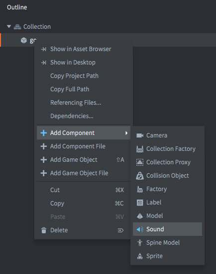
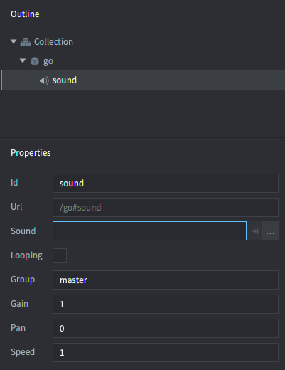

# Dźwięk

Komponent Dźwięku (Sound) w Defoldzie jest prosty, ale potężny. Istnieją tylko dwie koncepcje, o których musisz wiedzieć:

Komponenty dźwięku
: Te komponenty zawierają rzeczywisty dźwięk, który ma być odtwarzany i potrafią go odtwarzać.

Grupy dźwięku
: Każdy komponent dźwięku może być przypisany do grupy (Sound group). Grupy ułatwiają zarządzanie dźwiękami, które powinny być ze sobą powiązane w intuicyjny sposób. Na przykład grupa "sound_fx" może być utworzona, a każdy dźwięk należący do tej grupy może być wyciszany za pomocą jednego prostego wywołania funkcji.

## Tworzenie komponentu dźwięku

Komponenty dźwięku można tworzyć tylko w miejscu w obiekcie gry. Aby utworzyć nowy obiekt gry, kliknij go prawym przyciskiem myszy i wybierz <kbd>Add Component ▸ Sound</kbd> oraz kliknij "OK".



Utworzony komponent ma zestaw właściwości (properties), które powinny zostać ustawione:



*Sound*
: dźwięk - powinien być ustawiony na plik dźwiękowy w twoim projekcie. Plik powinien być w formacie _Wave_ lub _Ogg Vorbis_. Defold obsługuje pliki dźwiękowe zapisane z głębią bitową 16 bitów i częstotliwością próbkowania 44100.

*Looping*
: Jeśli jest zaznaczone, dźwięk będzie odtwarzany _Loopcount_ razy lub do momentu ręcznego zatrzymania.

*Loopcount*
: Liczba razy, jakie dźwięk odtworzy w przypadku pętli (0 oznacza, że dźwięk będzie odtwarzany w pętli, aż zostanie ręcznie zatrzymany).

*Group*
: nazwa grupy dźwięku, do której dźwięk powinien należeć. Jeśli to pole pozostanie puste, dźwięk zostanie przypisany do wbudowanej grupy "master".

*Gain*
: Wzmocnienie - możesz ustawić wzmocnienie dźwięku bezpośrednio na komponencie. Pozwala to na łatwe dostosowanie wzmocnienia dźwięku bez konieczności powrotu do programu dźwiękowego i ponownego eksportu. Zobacz poniżej, aby dowiedzieć się, jak jest obliczane wzmocnienie.

*Pan*
: Panorama - możesz ustawić wartość tzw. panoramy dźwięku bezpośrednio na komponencie. Panorama musi mieć wartość między -1 (lewo - 45 stopni) a 1 (prawo - 45 stopni). Dzięki panoramie mamy kontrolę nad tym, z której strony (lub też – z którego głośnika) dźwięk odtwarzany jest z większa głośnością.

*Speed*
: Prędkość - możesz ustawić wartość prędkości dźwięku bezpośrednio na komponencie. Wartość 1.0 to normalna prędkość, 0.5 to prędkość o połowę mniejsza, a 2.0 to prędkość podwójna.

## Odtwarzanie dźwięku

Gdy masz komponent dźwięku właściwie skonfigurowany, możesz spowodować odtworzenie dźwięku, wywołując [`sound.play()`](/ref/sound/#sound.play:url-[play_properties]-[complete_function]):

```lua
sound.play("go#sound", {delay = 1, gain = 0.5, pan = -1.0, speed = 1.25})
```

Można też wysłać wiadomość `"play_sound"` do komponentu dźwięku ([szczegóły w dokumentacji](https://defold.com/ref/sound/#play_sound)):

```lua
msg.post("#sound", "play_sound", {delay = 1, gain = 0.5})
```

::: sidenote
Dźwięk będzie nadal odtwarzany nawet wtedy, gdy obiekt gry, do którego należy komponent dźwięku, zostanie usunięty. Możesz wywołać [`sound.stop()`](/ref/sound/#sound.stop:url), aby zatrzymać dźwięk (patrz poniżej).
:::

Każda wywołanie tej funkcji lub wiadomość wysłana do komponentu spowoduje odtworzenie kolejnego wystąpienia dźwięku, aż dostępny bufor dźwięku zostanie wypełniony, a silnik wyświetli błędy w konsoli. Zaleca się zaimplementowanie mechanizmu filtrowania i grupowania dźwięków.

## Zatrzymywanie dźwięku

If you wish to stop playing a sound you can call [`sound.stop()`](/ref/sound/#sound.stop:url):

```lua
sound.stop("go#sound")
```

Można też wysłać wiadomość "stop_sound":

```lua
msg.post("#sound", "stop_sound")
```

## Wzmocnienie


System dźwięku ma 4 poziomy wzmocnienia (gain):

- Wzmocnienie ustawione na komponencie dźwięku.
- Wzmocnienie ustawione podczas rozpoczęcia odtwarzania dźwięku poprzez wywołanie `sound.play()` lub zmianę wzmocnienia na głosie poprzez wywołanie `sound.set_gain()`.
- Wzmocnienie ustawione w grupie za pomocą funkcji [`sound.set_group_gain()`](/ref/sound#sound.set_group_gain).
- Wzmocnienie ustawione w grupie "master". Można je zmieniać za pomocą `sound.set_group_gain(hash("master"))`.

Wzmocnienie wyjściowe jest wynikiem przemnóżenia tych 4 wzmocnień. Domyślne wzmocnienie wynosi wszędzie 1.0 (0 dB).

## Grupy dźwiękowe

Dowolny komponent dźwięku z określoną nazwą grupy dźwiękowej zostanie umieszczony w grupie dźwiękowej o tej nazwie. Jeśli nie określisz grupy, dźwięk zostanie przypisany do grupy wbudowanej "master". Możesz także jawnie ustawić grupę na komponencie dźwięku na "master", co ma ten sam efekt.

Dostępne są pewne funkcje, które pozwalają na pobranie wszystkich dostępnych grup, pobranie nazwy (stringa), ustawienie i pobranie wzmocnienia, średnią kwadratową RMS (patrz [http://pl.wikipedia.org/wiki/Root_mean_square](http://pl.wikipedia.org/wiki/Root_mean_square)) i wzmocnienie szczytowe (ang. peak gain). Istnieje również funkcja, która pozwala sprawdzić, czy czasem aktualnie nie działa odtwarzacz muzyki na urządzeniu docelowym:

```lua
-- Jeśli dźwięk jest odtwarzany na tym urządzeniu iPhone/Android, wycisz wszystko
if sound.is_music_playing() then
    for i, group_hash in ipairs(sound.get_groups()) do
        sound.set_group_gain(group_hash, 0)
    end
end
```

Grupy są identyfikowane za pomocą wartości hash. Nazwę (stringa) można pobrać za pomocą [`sound.get_group_name()`](/ref/sound#sound.get_group_name), co można wykorzystać do wyświetlania nazw grup w narzędziach deweloperskich, na przykład w mikserze do testowania poziomów grup.


::: important
Nie należy pisać kodu, który polega na wartości typu string grupy dźwiękowej, ponieważ nie są one dostępne w wersji końcowej, w release.
:::

Wszystkie wartości są liniowe w zakresie od 0 do 1.0 (0 dB). Aby przeliczyć na decybele, wystarczy użyć standardowej formuły:

$$
db = 20 \times \log \left( gain \right)
$$

```lua
for i, group_hash in ipairs(sound.get_groups()) do
    -- Nazwa w typie string jest dostępna tylko w trybie debug. Zwraca "unknown_*" w wersji końcowej.
    local name = sound.get_group_name(group_hash)
    local gain = sound.get_group_gain(group_hash)

    -- Przelicz na decybele.
    local db = 20 * math.log10(gain)

    -- Pobierz średnią kwadratową RMS (Root Mean Square). Lewy i prawy kanał oddzielnie.
    local left_rms, right_rms = sound.get_rms(group_hash, 2048 / 65536.0)
    left_rmsdb = 20 * math.log10(left_rms)
    right_rmsdb = 20 * math.log10(right_rms)

    -- Pobierz wzmocnienie szczytowe. Lewy i prawy kanał oddzielnie.
    left_peak, right_peak = sound.get_peak(group_hash, 2048 * 10 / 65536.0)
    left_peakdb = 20 * math.log10(left_peak)
    right_peakdb = 20 * math.log10(right_peak)
end

-- Ustaw wzmocnienie grupy "master" na +6 dB (math.pow(10, 6/20)).
sound.set_group_gain("master", 1.995)
```

## Filtrowanie dźwięków

Jeśli Twoja gra odtwarza ten sam dźwięk w przypadku zdarzenia, a to zdarzenie jest często wyzwalane, istnieje ryzyko odtwarzania tego samego dźwięku dwa lub więcej razy niemal jednocześnie. W takim przypadku dźwięki zostaną przesunięte fazowo, co może prowadzić do wyraźnych artefaktów.


Najprostszym sposobem radzenia sobie z tym problemem jest stworzenie bramy (gate), która filtrowałaby wiadomości dźwiękowe i nie pozwalałaby na odtworzenie tego samego dźwięku więcej niż raz w określonym odstępie czasu:

```lua
-- Nie pozwól na odtworzenie tego samego dźwięku w określonym odstępie czasu "gate_time".
local gate_time = 0.3

function init(self)
    -- Przechowuj timery odtwarzanych dźwięków w tabeli i odliczaj każdy klatkowy,
    -- aż będą w tabeli przez "gate_time" sekundy. Następnie usuń je.
    self.sounds = {}
end

function update(self, dt)
    -- Odliczaj zapisane timery
    for k,_ in pairs(self.sounds) do
        self.sounds[k] = self.sounds[k] - dt
        if self.sounds[k] < 0 then
            self.sounds[k] = nil
        end
    end
end

function on_message(self, message_id, message, sender)
    if message_id == hash("play_gated_sound") then
        -- Odtwarzaj tylko dźwięki, które nie znajdują się obecnie w tabeli filtrującej.
        if self.sounds[message.soundcomponent] == nil then
            -- Zapisz timer dźwięku w tabeli
            self.sounds[message.soundcomponent] = gate_time
            -- Odtwórz dźwięk
            sound.play(message.soundcomponent, { gain = message.gain })
        else
            -- Próba odtworzenia dźwięku była filtrowana
            print("gated " .. message.soundcomponent)
        end
    end
end
```

Aby skorzystać teraz z takiej bramy, po prostu wyślij jej wiadomość `play_gated_sound` i określ docelowy komponent dźwięku oraz wzmocnienie dźwięku. Brama wywoła `sound.play()` z docelowym komponentem dźwięku, jeśli jest otwarta:

```lua
msg.post("/sound_gate#script", "play_gated_sound", { soundcomponent = "/sounds#explosion1", gain = 1.0 })
```

::: important
Nie zadziała to, gdy brama nasłuchiwać będzie wiadomości `play_sound`, ponieważ ta nazwa jest zarezerwowana przez silnik Defold. Mamy do czynienia z nieoczekiwanym zachowaniem, jeśli użyjesz zarezerwowanych nazw wiadomości.
:::

## Manipulacja w czasie rzeczywistym

Możesz manipulować dźwiękami w czasie rzeczywistym za pomocą różnych właściwości (szczegóły w [dokumentacji API](/ref/sound/)). Następujące właściwości można manipulować przy użyciu `go.get()` i `go.set()`:

`gain`
: Wzmocnienie (głośność) komponentu dźwięku (`number`).

`pan`
: Panorama komponentu dźwięku (`number`). Panorama musi mieć wartość między -1 (lewo - 45 stopni) a 1 (prawo - 45 stopni). Dzięki panoramie mamy kontrolę nad tym, z której strony (lub też – z którego głośnika) dźwięk odtwarzany jest z większa głośnością.

`speed`
: Prędkość komponentu dźwięku (`number`). Wartość 1.0 to normalna prędkość, 0.5 to prędkość o połowę mniejsza, a 2.0 to prędkość podwójna.

`sound`
: Ścieżka do zasobu dźwięku (`hash)`. Możesz użyć ścieżki zasobu do zmiany dźwięku za pomocą `resource.set_sound(path, buffer)`. Przykład:

```lua
local boom = sys.load_resource("/sounds/boom.wav")
local path = go.get("#sound", "sound")
resource.set_sound(path, boom)
```

## Konfiguracja projektu

Plik *game.project* zawiera kilka [ustawień projektu związanych z komponentami dźwięku](/manuals/project-settings#sound).
