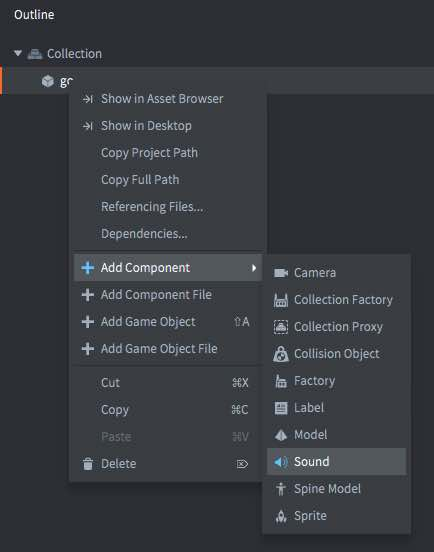
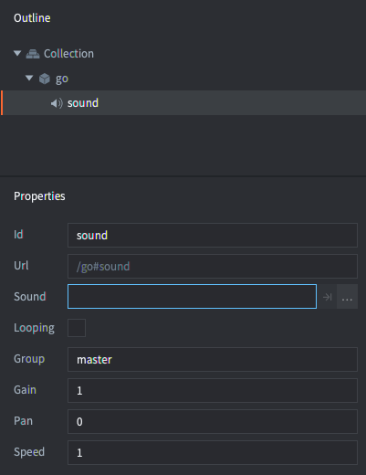
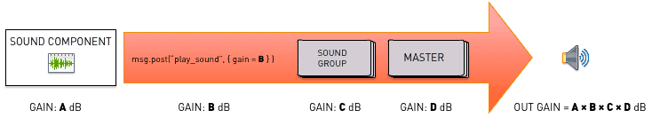

# Dźwięk

Implementacja dźwięku w Defoldzie jest prosta, ale potężna. Trzeba znać tylko dwie koncepcje:

Komponenty dźwięku
: Te komponenty zawierają rzeczywisty dźwięk, który ma zostać odtworzony, i potrafią go odtwarzać.

Grupy dźwięku
: Każdy komponent dźwięku może zostać przypisany do _grupy_. Grupy zapewniają prosty i intuicyjny sposób zarządzania dźwiękami, które należą do siebie. Na przykład grupę "sound_fx" można skonfigurować tak, aby każdy dźwięk należący do tej grupy dało się wyciszyć jednym wywołaniem funkcji.

## Tworzenie komponentu dźwięku

Komponenty dźwięku można instancjonować tylko bezpośrednio w obiekcie gry. Utwórz nowy obiekt gry, kliknij go prawym przyciskiem myszy i wybierz <kbd>Add Component ▸ Sound</kbd>, a następnie kliknij *OK*.



Utworzony komponent ma zestaw właściwości, które należy ustawić:



*Sound*
: Powinien wskazywać plik dźwiękowy w projekcie. Plik powinien być w formacie _Wave_, _Ogg Vorbis_ albo _Ogg Opus_. Defold obsługuje pliki dźwiękowe zapisane z głębią bitową 16 bitów.

*Looping*
: Jeśli opcja jest zaznaczona, dźwięk będzie odtwarzany _Loopcount_ razy albo do momentu jego jawnego zatrzymania.

*Loopcount*
: Liczba odtworzeń dźwięku zapętlonego przed zatrzymaniem (0 oznacza, że dźwięk ma być odtwarzany w pętli aż do jawnego zatrzymania).

*Group*
: Nazwa grupy dźwięku, do której dźwięk powinien należeć. Jeśli to pole pozostanie puste, dźwięk zostanie przypisany do wbudowanej grupy "master".

*Gain*
: Możesz ustawić wzmocnienie dźwięku bezpośrednio na komponencie. Pozwala to łatwo dostroić głośność bez wracania do programu dźwiękowego i ponownego eksportu. Szczegóły obliczania wzmocnienia znajdziesz poniżej.

*Pan*
: Możesz ustawić panoramę dźwięku bezpośrednio na komponencie. Wartość panoramy musi mieścić się w zakresie od -1 (45 stopni w lewo) do 1 (45 stopni w prawo).

*Speed*
: Możesz ustawić prędkość dźwięku bezpośrednio na komponencie. Wartość 1.0 oznacza normalną prędkość, 0.5 - połowę prędkości, a 2.0 - podwójną prędkość.

## Odtwarzanie dźwięku

Gdy komponent dźwięku jest poprawnie skonfigurowany, możesz odtworzyć dźwięk, wywołując [`sound.play()`](/ref/sound/#sound.play:url-[play_properties]-[complete_function]):

```lua
sound.play("go#sound", {delay = 1, gain = 0.5, pan = -1.0, speed = 1.25})
```

::: sidenote
Dźwięk będzie nadal odtwarzany, nawet jeśli obiekt gry, do którego należał komponent dźwięku, zostanie usunięty. Możesz wywołać [`sound.stop()`](/ref/sound/#sound.stop:url), aby zatrzymać dźwięk (patrz niżej).
:::

Każda wiadomość wysłana do komponentu spowoduje odtworzenie kolejnej instancji dźwięku, aż dostępny bufor dźwięku się zapełni, a silnik zacznie wypisywać błędy w konsoli. Zaleca się zaimplementowanie jakiejś formy bramkowania i mechanizmu grupowania dźwięków.

## Zatrzymywanie dźwięku

Jeśli chcesz zatrzymać odtwarzanie dźwięku, możesz wywołać [`sound.stop()`](/ref/sound/#sound.stop:url):

```lua
sound.stop("go#sound")
```

## Gain



System dźwięku ma 4 poziomy wzmocnienia:

- Wzmocnienie ustawione na komponencie dźwięku.
- Wzmocnienie ustawione przy uruchamianiu dźwięku przez wywołanie `sound.play()` albo przy zmianie wzmocnienia głosu przez wywołanie `sound.set_gain()`.
- Wzmocnienie ustawione na grupie przez wywołanie funkcji [`sound.set_group_gain()`](/ref/sound#sound.set_group_gain).
- Wzmocnienie ustawione na grupie "master". Można je zmienić wywołaniem `sound.set_group_gain(hash("master"))`.

Wzmocnienie wyjściowe jest wynikiem pomnożenia tych 4 wartości. Domyślne wzmocnienie wszędzie wynosi 1.0 (0 dB).

## Grupy dźwięku

Każdy komponent dźwięku, dla którego podano nazwę grupy, zostanie przypisany do grupy dźwięku o tej nazwie. Jeśli nie podasz grupy, dźwięk zostanie przypisany do grupy "master". Możesz też jawnie ustawić grupę komponentu dźwięku na "master", co daje ten sam efekt.

Dostępnych jest kilka funkcji, które pozwalają pobrać wszystkie dostępne grupy, pobrać nazwę jako string, pobrać i ustawić wzmocnienie, RMS (patrz http://en.wikipedia.org/wiki/Root_mean_square) oraz wzmocnienie szczytowe. Istnieje też funkcja, która pozwala sprawdzić, czy na urządzeniu docelowym działa odtwarzacz muzyki:

```lua
-- Jeśli dźwięk jest odtwarzany na tym urządzeniu iPhone/Android, wycisz wszystko
if sound.is_music_playing() then
    for i, group_hash in ipairs(sound.get_groups()) do
        sound.set_group_gain(group_hash, 0)
    end
end
```

Grupy są identyfikowane za pomocą wartości hash. Nazwę jako string można pobrać przez [`sound.get_group_name()`](/ref/sound#sound.get_group_name), co można wykorzystać na przykład do wyświetlania nazw grup w narzędziach deweloperskich, takich jak mikser do testowania poziomów grup.


::: important
Nie powinieneś pisać kodu, który opiera się na stringowej wartości grupy dźwięku, ponieważ nie są one dostępne w wersjach release.
:::

Wszystkie wartości są liniowe w zakresie od 0 do 1.0 (0 dB). Aby przeliczyć je na decybele, wystarczy użyć standardowego wzoru:

```math
db = 20 \times \log \left( gain \right)
```

```lua
for i, group_hash in ipairs(sound.get_groups()) do
    -- Nazwa jako string jest dostępna tylko w debug. Zwraca "unknown_*" w release.
    local name = sound.get_group_name(group_hash)
    local gain = sound.get_group_gain(group_hash)

    -- Przelicz na decybele.
    local db = 20 * math.log10(gain)

    -- Pobierz RMS (wzmocnienie Root Mean Square). Osobno dla lewego i prawego kanału.
    local left_rms, right_rms = sound.get_rms(group_hash, 2048 / 65536.0)
    left_rmsdb = 20 * math.log10(left_rms)
    right_rmsdb = 20 * math.log10(right_rms)

    -- Pobierz wzmocnienie szczytowe. Osobno dla lewego i prawego kanału.
    left_peak, right_peak = sound.get_peak(group_hash, 2048 * 10 / 65536.0)
    left_peakdb = 20 * math.log10(left_peak)
    right_peakdb = 20 * math.log10(right_peak)
end

-- Ustaw wzmocnienie grupy master na +6 dB (math.pow(10, 6/20)).
sound.set_group_gain("master", 1.995)
```

## Ograniczanie częstotliwości dźwięków

Jeśli twoja gra odtwarza ten sam dźwięk w reakcji na zdarzenie, a zdarzenie to jest wyzwalane często, istnieje ryzyko odtworzenia tego samego dźwięku dwa lub więcej razy niemal jednocześnie. Jeśli tak się stanie, dźwięki będą _przesunięte w fazie_, co może spowodować wyraźne artefakty.


Najprościej poradzić sobie z tym problemem, budując bramkę, która filtruje wiadomości dźwiękowe i nie pozwala odtworzyć tego samego dźwięku częściej niż raz w zadanym odstępie:

```lua
-- Nie pozwalaj odtworzyć tego samego dźwięku w odstępie "gate_time".
local gate_time = 0.3

function init(self)
    -- Przechowuj timery odtworzonych dźwięków w tabeli i odliczaj je co klatkę,
    -- aż znajdą się w tabeli przez "gate_time" sekund. Potem je usuń.
    self.sounds = {}
end

function update(self, dt)
    -- Odliczaj zapisane timery
    for k,_ in pairs(self.sounds) do
        self.sounds[k] = self.sounds[k] - dt
        if self.sounds[k] < 0 then
            self.sounds[k] = nil
        end
    end
end

function on_message(self, message_id, message, sender)
    if message_id == hash("play_gated_sound") then
        -- Odtwarzaj tylko dźwięki, które nie znajdują się obecnie w tabeli bramki.
        if self.sounds[message.soundcomponent] == nil then
            -- Zapisz timer dźwięku w tabeli
            self.sounds[message.soundcomponent] = gate_time
            -- Odtwórz dźwięk
            sound.play(message.soundcomponent, { gain = message.gain })
        else
            -- Próba odtworzenia dźwięku została zablokowana
            print("gated " .. message.soundcomponent)
        end
    end
end
```

Aby użyć bramki, po prostu wyślij do niej wiadomość `play_gated_sound` i podaj docelowy komponent dźwięku oraz wzmocnienie dźwięku. Bramka wywoła `sound.play()` z docelowym komponentem dźwięku, jeśli bramka jest otwarta:

```lua
msg.post("/sound_gate#script", "play_gated_sound", { soundcomponent = "/sounds#explosion1", gain = 1.0 })
```

::: important
Nie działa to, jeśli bramka nasłuchuje wiadomości `play_sound`, ponieważ ta nazwa jest zarezerwowana przez silnik Defold. Użycie zarezerwowanych nazw wiadomości spowoduje nieoczekiwane zachowanie.
:::

## Modyfikacja w czasie działania

Dźwięki można modyfikować w czasie działania za pomocą kilku różnych właściwości (szczegóły użycia znajdziesz w [dokumentacji API](/ref/sound/)). Następujące właściwości można zmieniać za pomocą `go.get()` i `go.set()`:

`gain`
: Wzmocnienie komponentu dźwięku (`number`).

`pan`
: Panorama komponentu dźwięku (`number`). Wartość panoramy musi mieścić się w zakresie od -1 (45 stopni w lewo) do 1 (45 stopni w prawo).

`speed`
: Prędkość komponentu dźwięku (`number`). Wartość 1.0 oznacza normalną prędkość, 0.5 - połowę prędkości, a 2.0 - podwójną prędkość.

`sound`
: Ścieżka zasobu dźwięku (`hash`). Możesz użyć ścieżki zasobu, aby zmienić dźwięk za pomocą `resource.set_sound(path, buffer)`. Przykład:

```lua
local boom = sys.load_resource("/sounds/boom.wav")
local path = go.get("#sound", "sound")
resource.set_sound(path, boom)
```

## Konfiguracja projektu

Plik *game.project* ma kilka [ustawień projektu](/manuals/project-settings#sound) związanych z komponentami dźwięku.

## Streaming dźwięku

Można też obsługiwać [streaming sounds](/manuals/sound-streaming)
