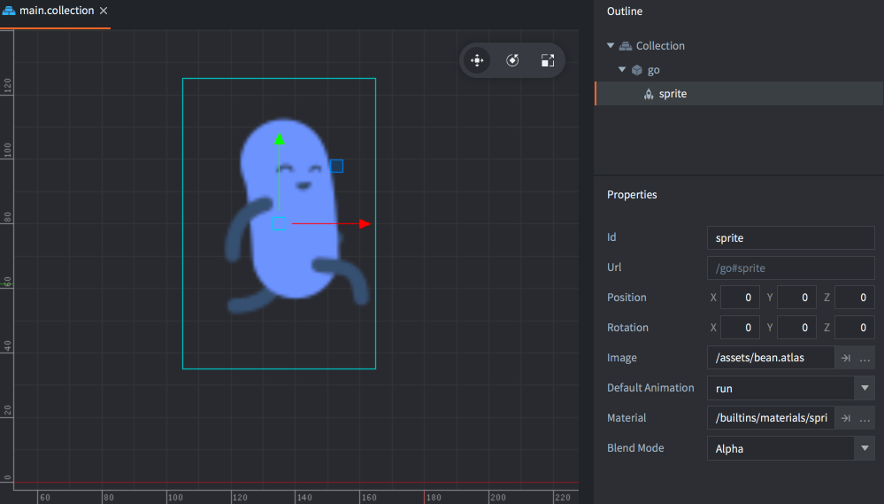

#  Sprite

Komponent typu Sprite (z ang. dosłownie: chochlik/duszek/krasnoludek - popularna w gamedevie od lat nazwa obrazków 2D w grach - przyp.tłum.) to dwuwymiarowa reprezentacja wizualna w grafice komputerowej wyświetlana jako pojedynczy obrazek lub animacja poklatkowa (flipbook animation).

Komponent typu Sprite może wykorzystywać jako teksturę galerię obrazów, tzw. [Atlas](/manuals/atlas) lub [Źródło kafelków - Tile Source](/manuals/tilesource).

## Właściwości Sprite'ów

Poza właściwościami takimi jak *Id*, *Position* i *Rotation* komponenty te posiadają swoje specyficzne właściwości (properties):

*Image*
: Obraz/tekstura dwuwymiarowa - może nią być Galeria - `Atlas` lub Źródło kafelków - `Tile Source`.

*Default Animation*
: Domyślna animacja używana przy wyświetlaniu obrazu.

*Material*
: Materiał służący do renderowania.

*Blend Mode*
: Tryb "mieszania"/blendowania używany również przy renderowaniu. Więcej szczegółów poniżej.

*Size Mode*
: Tryb rozmiaru - jeśli ustawiony na `Automatic`, to Edytor będzie ustawiał rozmiar sprite'a. Jeśli ustawiony na `Manual`, to możesz dopasować rozmiar sprite'a.

*Slice 9*
: Przekrój na 9 części - ustaw tę właściwość aby zachować prawidłowość pikseli na rogach sprite'a, kiedy jego rozmiar jest zmieniany.

:[Więcej o funkcjonalności Slice-9 tutaj.](../shared/slice-9-texturing.md)

### Blend modes - tryby blendowania
:[blend-modes](../shared/blend-modes.md)

## Manipulacja w trakcie działania programu

Możesz manipulować właściwościami Sprite'ów w trakcie działania programu dzięki wielu funkcjom i zmiennym właściwościom (szukaj przykładów użycia w [API](/ref/sprite/)). Funkcje:

* `sprite.play_flipbook()` - Odtwarzaj animację sprite'a.
* `sprite.set_hflip()` and `sprite.set_vflip()` - Odwróć w pionie lub poziomie animację/obraz sprite'a.

Sprite posiada również różne właściwości, którymi można manipulować przy użyciu funkcji `go.get()` i `go.set()`:

`cursor`
: Znormalizowany (czyli w przedziale 0-1) kursor animacji, czyli wskaźnik na klatki danej animacji poklatkowej (liczba - `number`).

`image`
: Obraz sprite'a (`hash`). Możesz użyć tej właściwości do podmiany tekstury sprite'a na inną galerią lub źródło kafelków, które mogą być właściwościami zasobu (resource property) i ustawić używając `go.set()`. Sprawdź szczegóły i przykłady w [API](/ref/sprite/#image).

`material`
: Materiał sprite'a (`hash`). Możesz podmienić materiał korzystając z właściwości zasobu (resource property) i ustawić używając `go.set()`. Sprawdź szczegóły i przykłady w [API](/ref/sprite/#material).

`playback_rate`
: Wskaźnik odtwarzania animacji, czyli prędkość z jaką odtwarzana jest animacja (`number`).

`scale`
: Skala obrazka (wektor - `vector3`).

`size`
: Rozmiar obrazka (`vector3`) (Wartość tylko do odczytu - pokazuje rozmiar tekstury).

## Stałe materiału



`tint`
: Kolor zabarwienia/odcienia obrazka (`vector4`). Wektor czterech komponentów reprezentuje zabarwienie, gdzie komponenty x, y, z, w odpowiadają składowym: czerwony, zielony, niebieski i przezroczystość (red, green, blue, alpha).

## Atrybuty materiału

Sprite może nadpisywać atrybuty wierzchołków (vertex attributes) aktualnie przypisanego materiały i przekazywać je do shadera wierzchołków (vertex shader) z komponentu (szczegóły znajdziesz w [instrukcji do materiałów](/manuals/material/#attributes)).

Atrybuty określone w materiale pokażą się jako zwykłe właściwości w widoku inspekcyjnym i mogą być ustawione na indywidualne komponenty sprite. Jeśli jakikolwiek atrybut jest nadpisany, zostanie on zaznaczony jako nadpisana właściwość i przechowana w pliku komponenty sprite na dysku.

::: sidenote
Niestandardowe atrybuty są dostępne od wersji Defold 1.4.8!
:::

## Konfiguracja projektu

Plik *game.project* zawiera [te ustawienia](/manuals/project-settings#sprite) dotyczące sprite'ów.
