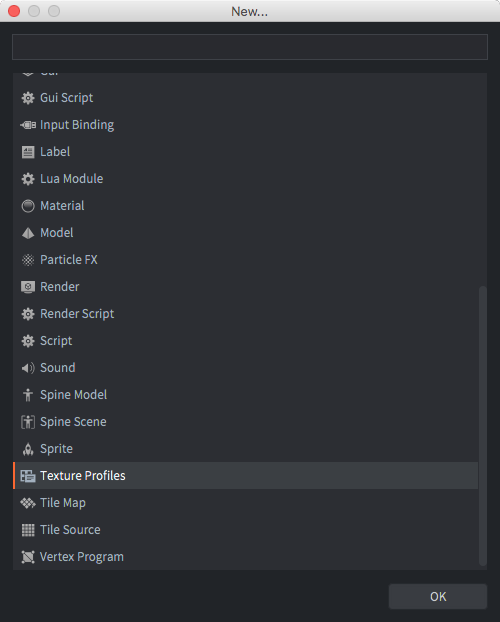
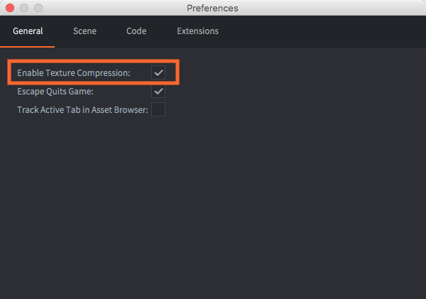
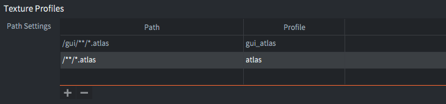
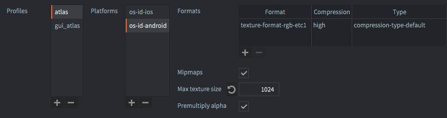

# Profile tekstur w Defoldzie

Defold obsługuje automatyczne przetwarzanie tekstur i kompresję danych obrazów (w Atlasie, Źródłach Kafelków (*Tile sources*), Mapach Kostkowych (*Cubemaps*) i samodzielnych teksturach używanych do modeli, GUI itp).

Istnieją dwa rodzaje kompresji: programowa i sprzętowa kompresja tekstur.

1. Programowa kompresja tekstur (software texture compression) (takie jak PNG i JPEG) zmniejsza rozmiar pamięci zasobów obrazu. Powoduje to zmniejszenie ostatecznego rozmiaru paczki z grą. Jednak pliki obrazów muszą być rozpakowane podczas wczytywania do pamięci, więc nawet jeśli obraz jest mały na dysku, może zajmować dużo miejsca w pamięci.

2. Sprzętowa kompresja tekstur (hardware texture compression) również zmniejsza rozmiar pamięci zasobów obrazu. Jednak w przeciwieństwie do kompresji programowej, zmniejsza rozmiar tekstur w pamięci. Dzieje się tak, ponieważ sprzęt graficzny może bezpośrednio zarządzać teksturami skompresowanymi, bez konieczności ich wcześniejszego dekompresowania.

Przetwarzanie tekstur jest konfigurowane za pomocą konkretnego profilu tekstury (ang. texture profile). W tym pliku tworzysz _profile_, które wyrażają, jakie skompresowane formaty i jakiego typu powinny być używane przy tworzeniu paczki z grą dla określonej platformy. _Profile_ są przypisane do odpowiadających im wzorców plików - _paths patterns_, co pozwala na dokładną kontrolę nad tym, które pliki w twoim projekcie powinny być kompresowane i w jaki sposób dokładnie.

Ponieważ każda dostępna sprzętowa kompresja tekstur jest stratna, otrzymasz tzw. artefakty w danych tekstury. Te artefakty są silnie zależne od tego, jak wygląda twój materiał źródłowy i jakie metody kompresji są używane. Powinieneś przetestować swój materiał źródłowy i eksperymentować, aby uzyskać najlepsze wyniki. Wujek Google może być twoim przyjacielem w tej kwestii.

Możesz wybrać, jakie kompresje obrazów oprogramowania są stosowane na ostatecznych danych tekstury (skompresowane lub nieskompresowane) w archiwum paczki (bundle archives). Defold obsługuje kompresję tekstury [Basis Universal](https://github.com/BinomialLLC/basis_universal), która kompresuje obraz w pośredni format. Ten format jest przekształcany w czasie rzeczywistym na format sprzętu odpowiedni dla GPU bieżącego urządzenia. Format Basis Universal jest formatem wysokiej jakości, ale stratnym. Wszystkie obrazy są również kompresowane za pomocą LZ4, aby jeszcze bardziej zmniejszyć rozmiar pliku, gdy są przechowywane w archiwum gry.

::: sidenote
Kompresja jest operacją czasochłonną i wymagającą sporych zasobów, która może spowodować bardzo długie czasy kompilacji, w zależności od liczby obrazów do skompresowania oraz wybranych formatów tekstury i rodzaju wybranej programowej kompresji tekstur.
:::

## Profile tekstur

Każdy projekt zawiera określony plik *.texture_profiles*, który zawiera konfigurację używaną podczas kompresji tekstur. Domyślnie ten plik to *builtins/graphics/default.texture_profiles* i zawiera konfigurację dopasowującą każdy zasób tekstury do profilu przy użyciu RGBA bez sprzętowej kompresji tekstur i z domyślną kompresją plików ZLib.

Aby dodać kompresję tekstur:

- Wybierz <kbd>File ▸ New...</kbd>, a następnie *Texture Profiles* (Profile tekstur), aby utworzyć nowy plik profili tekstur. (Albo skopiuj *default.texture_profiles* poza folder *builtins* na wybrane miejsce)
- Wybierz nazwę i lokalizację nowego pliku.
- Zmień wpis *texture_profiles* w *game.project*, aby wskazywał na nowy plik.
- Otwórz plik *.texture_profiles* i skonfiguruj go zgodnie z własnymi wymaganiami.

W preferencjach Edytora można włączyć i wyłączyć korzystanie z profili tekstur. Wybierz <kbd>File ▸ Preferences...</kbd>. Karta *General* zawiera opcję *Enable texture profiles* (Włącz profile tekstur).

## Ustawienia ścieżki

Sekcja *Path Settings* (Ustawienia ścieżki) w pliku profilów tekstur zawiera listę wzorców ścieżek i informacje, który *profil* ma być używany przy przetwarzaniu zasobów odpowiadających danej ścieżce. Ścieżki wyrażone są jako wzorce "Ant Glob" ([zobacz tutaj](http://ant.apache.org/manual/dirtasks.html#patterns) w celu uzyskania szczegółów). Wzorce można wyrazić przy użyciu następujących symboli wieloznacznych (wildcards):

`*`
: Dopasowanie do zera lub więcej znaków. Na przykład `sprite*.png` pasuje do plików `sprite.png`, `sprite1.png` i `sprite_with_a_long_name.png`.

`?`
: Dopasowanie dokładnie do jednego znaku. Na przykład `sprite?.png` pasuje do plików `sprite1.png`, `spriteA.png`, ale nie pasuje do `sprite.png` ani `sprite_with_a_long_name.png`.

`**`
: Dopasowanie do całego drzewa katalogów lub - gdy używane jako nazwa katalogu - do zera lub więcej katalogów. Na przykład `/gui/**` pasuje do wszystkich plików w katalogu `/gui` i wszystkich jego podkatalogach.

Ten przykład zawiera dwa wzorce ścieżek i odpowiadające im profile.

`/gui/**/*.atlas`
: Wszystkie pliki *.atlas* w katalogu */gui* lub którymkolwiek z jego podkatalogów będą przetwarzane zgodnie z profilem "gui_atlas".

`/**/*.atlas`
: Wszystkie pliki *.atlas* w dowolnym miejscu w projekcie będą przetwarzane zgodnie z profilem "atlas".

Należy zauważyć, że bardziej ogólna ścieżka jest podawana na końcu. Kryterium działania jest określone jako od góry do dołu. Pierwsze wystąpienie, które pasuje do ścieżki zasobu, zostanie użyte. Dopasowanie ścieżki niżej na liście nigdy nie zastępuje pierwszego trafienia. Gdyby ścieżki były podane w odwrotnej kolejności, każda mapa kostek zostałaby przetworzona profilem "atlas", nawet te w katalogu */gui*.

Zasoby tekstur, które _nie_ pasują do żadnej ścieżki w pliku profili, zostaną skompilowane i przeskalowane do najbliżej potęgi liczby 2, ale poza tym pozostaną nietknięte.

## Profile

Sekcja *profiles* (profile) w pliku profili tekstur zawiera listę nazwanych profili. Każdy profil zawiera jedną lub więcej platform (*platforms*), a każdą platformę opisuje lista właściwości.

*Platforms*
: Określa pasującą platformę. `OS_ID_GENERIC` pasuje do wszystkich platform, w tym do wersji dev-app na urządzeniu, `OS_ID_WINDOWS` pasuje do wersji docelowych systemów Windows, `OS_ID_IOS` pasuje do wersji na urządzenia iOS itp. Należy zauważyć, że jeśli określono `OS_ID_GENERIC`, zostanie on uwzględniony we wszystkich platformach.

::: important
Jeśli dwa [ustawienia ścieżki](#path-settings) pasują do tego samego pliku i ścieżka używa różnych profili z różnymi platformami, zostaną użyte **oba** profile i zostaną wygenerowane **dwie** tekstury.
:::

*Formats*
: Jedna lub więcej formatów tekstury do wygenerowania. Jeśli określono wiele formatów, zostaną wygenerowane tekstury dla każdego formatu i dołączone do paczki. Silnik wybiera tekstury formatu obsługiwanego przez platformę uruchomieniową.

*Mipmaps*
: Jeśli zaznaczone, generowane są [mipmapy](https://pl.wikipedia.org/wiki/Mipmapping) dla platformy. Domyślnie nie jest zaznaczone.

*Premultiply alpha*
: Jeśli zaznaczone, alfa, czyli wskaźnik przezroczystości, jest wstępnie mnożona do danych tekstury. Domyślnie jest zaznaczone.

*Max Texture Size*
: Maksymalny rozmiar tekstury. Jeśli ustawiono tę opcję na wartość różną od zera, tekstury są ograniczone pod względem liczby pikseli do określonej liczby. Każda tekstura, która ma szerokość lub wysokość większą niż określona wartość, zostanie przeskalowana w dół.

Do każdego profilu dodawane są następujące formaty (*Formats*):

*Format*
: Format do użycia podczas enkodowania tekstury. Poniżej znajdują się dostępne formaty tekstur.

*Compression*
: Kompresja. Wybiera poziom jakości wynikowego obrazu skompresowanego.

| Poziom   | Informacja                                      |
| -------- | ----------------------------------------------- |
| `FAST`   | Najszybsza kompresja. Niska jakość grafiki      |
| `NORMAL` | Domyślna kompresja. Najlepsza jakość grafiki    |
| `HIGH`   | Najwolniejsza kompresja. Mniejszy rozmiar pliku |
| `BEST`   | Wolna kompresja. Najmniejszy rozmiar pliku      |

::: sidenote
Od wersji 1.2.185 nazwy te zostały zmienione - zredefiniowane, aby uniknąć niejednoznaczności.
:::

*Type*
: Pozwala określić typ kompresji dla obrazów, `COMPRESSION_TYPE_DEFAULT` albo `COMPRESSION_TYPE_BASIS_UASTC`. Zobacz [Typy Kompresji tutaj](#compression-types).

## Formaty tekstur

Tekstury sprzętowe mogą być przetwarzane na dane nieskompresowane lub skompresowane *stratnie* o różnej liczbie kanałów i głębi bitowej. Kompresja sprzętowa oznacza, że ostateczny obraz będzie miał stały rozmiar, niezależnie od zawartości obrazu. Oznacza to, że utrata jakości podczas kompresji zależy od zawartości oryginalnej tekstury.

Ponieważ transkodowanie kompresji Basis Universal zależy od możliwości karty graficznej (GPU) urządzenia, zalecane formaty do użycia z kompresją Basis Universal to ogólne formaty, takie jak:
`TEXTURE_FORMAT_RGB`, `TEXTURE_FORMAT_RGBA`, `TEXTURE_FORMAT_RGB_16BPP`, `TEXTURE_FORMAT_RGBA_16BPP`, `TEXTURE_FORMAT_LUMINANCE` i `TEXTURE_FORMAT_LUMINANCE_ALPHA`.

Transkoder Basis Universal obsługuje wiele formatów wyjściowych, takich jak: `ASTC4x4`, `BCx`, `ETC2`, `ETC1` i `PVRTC1`.

Obecnie obsługiwane są następujące formaty kompresji stratnej:

| Format                            | Kompresja   | Szczegóły  |
| --------------------------------- | ----------- | -------------------------------- | ---- |
| `TEXTURE_FORMAT_RGB`              | brak        | Kolor 3-kanałowy. Alfa jest usuwana. |
| `TEXTURE_FORMAT_RGBA`             | brak        | Kolor 3-kanałowy i pełna alfa. |
| `TEXTURE_FORMAT_RGB_16BPP`        | brak        | Kolor 3-kanałowy. 5+6+5 bitów. |
| `TEXTURE_FORMAT_RGBA_16BPP`       | brak        | Kolor 3-kanałowy i pełna alfa. 4+4+4+4 bity. |
| `TEXTURE_FORMAT_LUMINANCE`        | brak        | Skala szarości 1-kanałowa, brak alfy. Kanały RGB pomnożone przez siebie. Alfa jest usuwana. |
| `TEXTURE_FORMAT_LUMINANCE_ALPHA`  | brak        | Skala szarości 1-kanałowa i pełna alfa. Kanały RGB pomnożone przez siebie. |

## Typy kompresji

Obsługiwane są następujące typy programowych kompresji obrazów. Dane są rozpakowywane, gdy plik tekstury jest ładowany do pamięci.

::: sidenote
Obecnie analizujemy, jak ponownie wprowadzić obsługę sprzętowa formatów, a także dodatkową obsługę kompresji WEBP.
Nasze obecne długotrwałe zadanie polegające na wprowadzeniu wtyczek do przetwarzania treści ma na celu rozwiązanie tego problemu.
:::

| Typ                               | Formaty                    | Szczegóły |
| --------------------------------- | -------------------------- | --------- |
| `COMPRESSION_TYPE_DEFAULT`        | Wszystkie formaty          | Ogólna kompresja danych bez utraty. Domyślna. |
| `COMPRESSION_TYPE_BASIS_UASTC`    | Wszystkie formaty RGB/RGBA | Wysoka jakość kompresji Basis Universal, utrata jakości. Niższy poziom jakości prowadzi do mniejszego rozmiaru. |

## Przykładowy obraz

Aby lepiej zrozumieć wyniki, oto przykład.
Należy pamiętać, że jakość obrazu, czas kompresji i rozmiar kompresji zawsze zależą od obrazu wejściowego i mogą się różnić.

Obraz oryginalny (1024x512):

### Czasy kompresji

| Poziom     | Czas kompresji   | Czasy relatywny |
| ----------------------------- | --------------- |
| `FAST`     | 0m0.143s         | 0.5x            |
| `NORMAL`   | 0m0.294s         | 1.0x            |
| `HIGH`     | 0m1.764s         | 6.0x            |
| `BEST`     | 0m1.109s         | 3.8x            |

### Utrata sygnału

Porównanie wykonuje się za pomocą narzędzia `basisu` (pomiar PSNR)
100 dB oznacza brak utraty sygnału (jest to to samo co oryginalny obraz)

| Poziom     | Sygnał                                          |
| ------------------------------------------------------------ |
| `FAST`     | Max:  34 Mean: 0.470 RMS: 1.088 PSNR: 47.399 dB |
| `NORMAL`   | Max:  35 Mean: 0.439 RMS: 1.061 PSNR: 47.620 dB |
| `HIGH`     | Max:  37 Mean: 0.898 RMS: 1.606 PSNR: 44.018 dB |
| `BEST`     | Max:  51 Mean: 1.298 RMS: 2.478 PSNR: 40.249 dB |

### Rozmiary plików skompresowanych

Oryginalny rozmiar pliku wynosi 1572882 bajtów.

| Poziom     | Rozmiar pliku | Procent  |
| ------------------------------------- |
| `FAST`     | 357225        | 22.71 %  |
| `NORMAL`   | 365548        | 23.24 %  |
| `HIGH`     | 277186        | 17.62 %  |
| `BEST`     | 254380        | 16.17 %  |

### Jakość obrazu

Oto wynikowe obrazy (pobrane z kodowania ASTC przy użyciu narzędzia `basisu`)

`FAST`

`NORMAL`

`HIGH`

`BEST`

