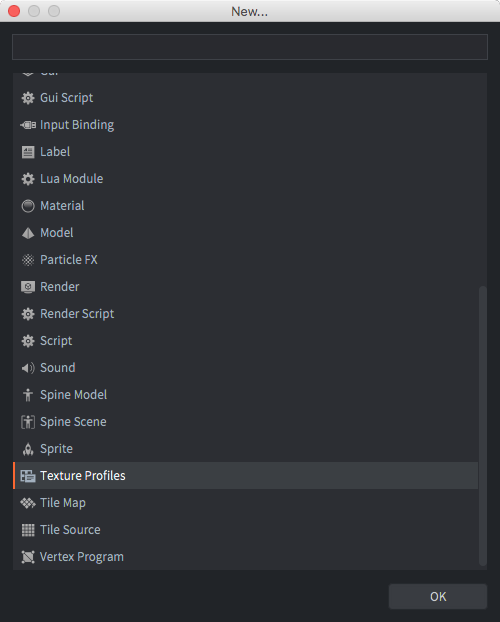
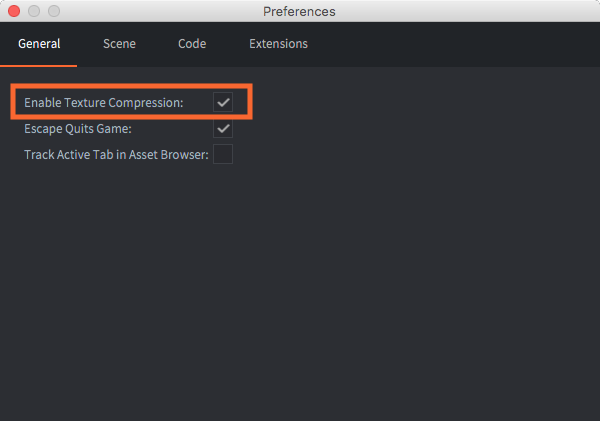
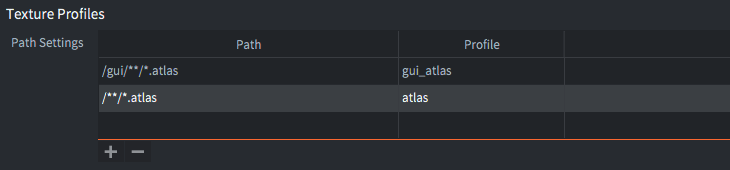
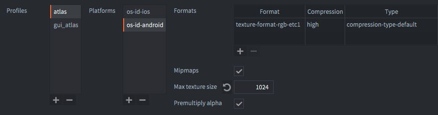

# Profile tekstur

Defold obsługuje automatyczne przetwarzanie tekstur i kompresję danych obrazów w zasobach typu *Atlas*, *Tile sources*, *Cubemaps* oraz w samodzielnych teksturach używanych w modelach, GUI itd.

Istnieją dwa typy kompresji: programowa kompresja obrazów oraz sprzętowa kompresja tekstur.

1. Programowa kompresja, taka jak PNG i JPEG, zmniejsza rozmiar zasobów obrazów. Dzięki temu końcowy bundle jest mniejszy. Jednak pliki obrazów trzeba zdekompresować po wczytaniu do pamięci, więc mimo małego rozmiaru na dysku mogą zajmować dużo pamięci.

2. Sprzętowa kompresja tekstur również zmniejsza rozmiar zasobów obrazów. W przeciwieństwie do kompresji programowej zmniejsza też zajętość pamięci przez tekstury, ponieważ układ graficzny może obsługiwać skompresowane tekstury bez ich wcześniejszego dekompresowania.

Przetwarzanie tekstur konfiguruje się za pomocą konkretnego profilu tekstur. W tym pliku tworzysz _profiles_, które określają, jaki skompresowany format lub formaty oraz jaki typ mają zostać użyte podczas tworzenia bundle dla konkretnej platformy. _Profiles_ są następnie powiązane z pasującymi wzorcami ścieżek (_paths patterns_), co pozwala bardzo precyzyjnie kontrolować, które pliki w projekcie mają zostać skompresowane i w jaki sposób.

Ponieważ wszystkie dostępne sprzętowe metody kompresji tekstur są stratne, w danych tekstur pojawią się artefakty. Ich wygląd zależy mocno od materiału źródłowego i użytej metody kompresji. Warto testować własne zasoby i eksperymentować, aby uzyskać najlepsze rezultaty. W tym przypadku Google jest Twoim przyjacielem.

Możesz wybrać, jaka programowa kompresja obrazu zostanie zastosowana do końcowych danych tekstury w archiwach bundla, niezależnie od tego, czy są one skompresowane, czy surowe. Defold obsługuje formaty kompresji [Basis Universal](https://github.com/BinomialLLC/basis_universal) oraz [ASTC](https://www.khronos.org/opengl/wiki/ASTC_Texture_Compression).

::: sidenote
Kompresja jest operacją zasobożerną i czasochłonną. W zależności od liczby tekstur przeznaczonych do kompresji oraz wybranych formatów tekstur i rodzaju kompresji programowej może bardzo wydłużyć czas builda.
:::

### Basis Universal

Basis Universal, w skrócie BasisU, kompresuje obraz do formatu pośredniego, który w czasie działania jest transkodowany do sprzętowego formatu odpowiedniego dla GPU bieżącego urządzenia. Format Basis Universal jest wysokiej jakości, ale stratny. Wszystkie obrazy są też kompresowane przy użyciu LZ4, aby jeszcze bardziej zmniejszyć rozmiar plików przechowywanych w archiwum gry.

### ASTC

ASTC to elastyczny i wydajny format kompresji tekstur opracowany przez ARM i ustandaryzowany przez Khronos Group. Oferuje szeroki zakres rozmiarów bloków i przepływności bitowej, dzięki czemu można skutecznie wyważyć jakość obrazu i zużycie pamięci. ASTC obsługuje rozmiary bloków od 4×4 do 12×12 texeli, co odpowiada przepływności od 8 bitów na texel do 0,89 bitu na texel. Ta elastyczność pozwala bardzo precyzyjnie sterować kompromisem między jakością tekstury a wymaganiami dotyczącymi miejsca.

ASTC obsługuje rozmiary bloków od 4×4 do 12×12 texeli, co odpowiada przepływności od 8 bitów na texel do 0,89 bitu na texel. Ta elastyczność pozwala bardzo precyzyjnie sterować kompromisem między jakością tekstury a wymaganiami dotyczącymi miejsca. Poniższa tabela pokazuje obsługiwane rozmiary bloków i odpowiadające im przepływności bitowe:

| Rozmiar bloku (szerokość x wysokość) | Bity na piksel |
| ------------------------------------ | -------------- |
| 4x4                                  | 8.00           |
| 5x4                                  | 6.40           |
| 5x5                                  | 5.12           |
| 6x5                                  | 4.27           |
| 6x6                                  | 3.56           |
| 8x5                                  | 3.20           |
| 8x6                                  | 2.67           |
| 10x5                                 | 2.56           |
| 10x6                                 | 2.13           |
| 8x8                                  | 2.00           |
| 10x8                                 | 1.60           |
| 10x10                                | 1.28           |
| 12x10                                | 1.07           |
| 12x12                                | 0.89           |

#### Obsługiwane urządzenia

Choć ASTC daje świetne rezultaty, nie jest wspierane przez wszystkie karty graficzne. Oto krótka lista obsługi według producenta GPU:

| Producent GPU      | Wsparcie                                                              |
| ------------------ | --------------------------------------------------------------------- |
| ARM (Mali)         | Wszystkie układy ARM Mali, które obsługują OpenGL ES 3.2 lub Vulkan, wspierają ASTC. |
| Qualcomm (Adreno)  | Układy Adreno obsługujące OpenGL ES 3.2 lub Vulkan wspierają ASTC.    |
| Apple              | GPU Apple od układu A8 wspierają ASTC.                                 |
| NVIDIA             | Wsparcie ASTC dotyczy głównie mobilnych GPU, np. układów opartych na Tegra. |
| AMD (Radeon)       | GPU AMD obsługujące Vulkan zwykle wspierają ASTC za pośrednictwem oprogramowania. |
| Intel (Integrated) | ASTC jest wspierane na nowoczesnych GPU Intela za pośrednictwem oprogramowania. |

## Texture profiles

Każdy projekt zawiera konkretny plik *.texture_profiles*, który przechowuje konfigurację używaną podczas kompresji tekstur. Domyślnie jest to *builtins/graphics/default.texture_profiles*, a jego konfiguracja przypisuje każdy zasób tekstury do profilu używającego RGBA bez sprzętowej kompresji tekstur i domyślnej kompresji plików ZLib.

Aby dodać kompresję tekstur:

- Wybierz <kbd>File ▸ New...</kbd> i utwórz nowy plik *Texture Profiles*. Alternatywnie skopiuj *default.texture_profiles* w miejsce poza *builtins*.
- Wybierz nazwę i lokalizację nowego pliku.
- Zmień wpis `texture_profiles` w `game.project`, aby wskazywał na nowy plik.
- Otwórz plik *.texture_profiles* i skonfiguruj go zgodnie z wymaganiami.

Użycie profili tekstur można włączać i wyłączać w preferencjach edytora. Wybierz <kbd>File ▸ Preferences...</kbd>. Karta *General* zawiera pole wyboru *Enable texture profiles*.

## Path Settings

Sekcja *Path Settings* w pliku profili tekstur zawiera listę wzorców ścieżek i informuje, którego *profile* użyć podczas przetwarzania zasobów pasujących do danej ścieżki. Ścieżki są wyrażane jako wzorce "Ant Glob" (szczegóły znajdziesz w [dokumentacji](http://ant.apache.org/manual/dirtasks.html#patterns)). Można używać następujących wildcardów:

`*`
: Dopasowuje zero lub więcej znaków. Na przykład `sprite*.png` pasuje do plików *`sprite.png`*, *`sprite1.png`* i *`sprite_with_a_long_name.png`*.

`?`
: Dopasowuje dokładnie jeden znak. Na przykład `sprite?.png` pasuje do plików *sprite1.png* i *`spriteA.png`*, ale nie do *`sprite.png`* ani *`sprite_with_a_long_name.png`*.

`**`
: Dopasowuje całe drzewo katalogów albo, gdy jest użyte jako nazwa katalogu, zero lub więcej katalogów. Na przykład `/gui/**` pasuje do wszystkich plików w katalogu */gui* i we wszystkich jego podkatalogach.

Ten przykład zawiera dwa wzorce ścieżek i odpowiadające im profile.

`/gui/**/*.atlas`
: Wszystkie pliki *.atlas* w katalogu *`/gui`* lub w jego podkatalogach będą przetwarzane zgodnie z profilem "gui_atlas".

`/**/*.atlas`
: Wszystkie pliki *.atlas* w dowolnym miejscu projektu będą przetwarzane zgodnie z profilem "atlas".

Zwróć uwagę, że bardziej ogólny wzorzec umieszczono na końcu. Algorytm dopasowania działa od góry do dołu. Użyte zostanie pierwsze wystąpienie pasujące do ścieżki zasobu. Dopasowanie niżej na liście nigdy nie nadpisuje pierwszego trafienia. Gdyby ścieżki umieszczono w odwrotnej kolejności, każdy atlas zostałby przetworzony profilem "atlas", nawet te w katalogu *`/gui`*.

Zasoby tekstur, które _nie_ pasują do żadnej ścieżki w pliku profili, zostaną skompilowane i przeskalowane do najbliższej potęgi 2, ale poza tym pozostaną bez zmian.

## Profiles

Sekcja *profiles* w pliku profili tekstur zawiera listę nazwanych profili. Każdy profil zawiera jedną lub więcej *platforms*, a każda platforma jest opisana listą właściwości.

*Platforms*
: Określa pasującą platformę. `OS_ID_GENERIC` pasuje do wszystkich platform, `OS_ID_WINDOWS` do bundle dla Windows, `OS_ID_IOS` do bundle dla iOS i tak dalej. Jeśli zostanie określony `OS_ID_GENERIC`, będzie on uwzględniony dla wszystkich platform.

::: important
Jeśli dwa [path settings](#path-settings) pasują do tego samego pliku, a ścieżka używa różnych profili z różnymi platformami, użyte zostaną **oba** profile i zostaną wygenerowane **dwie** tekstury.
:::

*Formats*
: Jeden lub więcej formatów tekstur do wygenerowania. Jeśli podasz kilka formatów, tekstury dla każdego z nich zostaną wygenerowane i dołączone do bundla. Silnik wybiera format tekstury obsługiwany przez bieżącą platformę uruchomieniową.

*Mipmaps*
: Jeśli zaznaczone, dla platformy zostaną wygenerowane mipmapy. Domyślnie wyłączone.

*Premultiply alpha*
: Jeśli zaznaczone, alfa zostanie premnożona w danych tekstury. Domyślnie zaznaczone.

*Max Texture Size*
: Jeśli ustawione na wartość różną od zera, rozmiar tekstur w pikselach zostanie ograniczony do podanej liczby. Każda tekstura, której szerokość lub wysokość przekracza tę wartość, zostanie przeskalowana w dół.

Każdy wpis *Formats* dodany do profilu ma następujące właściwości:

*Format*
: Format używany do kodowania tekstury. Poniżej znajdziesz listę wszystkich dostępnych formatów tekstur.

*Compressor*
: Kompresor używany do kodowania tekstury.

*Compressor Preset*
: Wybiera preset kompresji używany do kodowania wynikowego obrazu. Każdy preset jest specyficzny dla kompresora i jego ustawienia zależą od samego kompresora. Aby uprościć te ustawienia, obecne presety kompresji mają cztery poziomy:

| Preset    | Informacja                                  |
| --------- | ------------------------------------------- |
| `LOW`     | Najszybsza kompresja. Niska jakość obrazu   |
| `MEDIUM`  | Domyślna kompresja. Najlepsza jakość obrazu |
| `HIGH`    | Najwolniejsza kompresja. Mniejszy rozmiar pliku        |
| `HIGHEST` | Wolna kompresja. Najmniejszy rozmiar pliku           |

Pamiętaj, że kompresor `uncompressed` ma tylko jeden preset o nazwie `uncompressed`, co oznacza, że do tekstur nie zostanie zastosowana żadna kompresja.
Aby zobaczyć listę dostępnych kompresorów, zobacz [Compressors](#compressors).

## Texture formats

Tekstury sprzętowe można przetwarzać do danych nieskompresowanych albo *stratnie* skompresowanych, z różną liczbą kanałów i różną głębią bitową. Kompresja sprzętowa o stałym rozmiarze oznacza, że wynikowy obraz będzie miał stały rozmiar niezależnie od zawartości. Oznacza to, że utrata jakości podczas kompresji zależy od zawartości oryginalnej tekstury.

Ponieważ transkodowanie Basis Universal zależy od możliwości GPU urządzenia, zalecane formaty do użycia z kompresją Basis Universal to formaty ogólne, takie jak:
`TEXTURE_FORMAT_RGB`, `TEXTURE_FORMAT_RGBA`, `TEXTURE_FORMAT_RGB_16BPP`, `TEXTURE_FORMAT_RGBA_16BPP`, `TEXTURE_FORMAT_LUMINANCE` oraz `TEXTURE_FORMAT_LUMINANCE_ALPHA`.

Transkoder Basis Universal obsługuje wiele formatów wyjściowych, takich jak `ASTC4x4`, `BCx`, `ETC2`, `ETC1` i `PVRTC1`.

Poniższa tabela pokazuje obecnie obsługiwane formaty stratnej kompresji:

| Format                            | Kompresja | Szczegóły  |
| --------------------------------- | ----------- | -------------------------------- | ---- |
| `TEXTURE_FORMAT_RGB`              | none        | 3-kanałowy kolor. Kanał alfa jest odrzucany |
| `TEXTURE_FORMAT_RGBA`             | none        | 3-kanałowy kolor i pełna alfa.    |
| `TEXTURE_FORMAT_RGB_16BPP`        | none        | 3-kanałowy kolor. 5+6+5 bitów. |
| `TEXTURE_FORMAT_RGBA_16BPP`       | none        | 3-kanałowy kolor i pełna alfa. 4+4+4+4 bity. |
| `TEXTURE_FORMAT_LUMINANCE`        | none        | 1-kanałowa skala szarości, bez alfy. Kanały RGB są mnożone do jednego. Alfa jest odrzucana. |
| `TEXTURE_FORMAT_LUMINANCE_ALPHA`  | none        | 1-kanałowa skala szarości i pełna alfa. Kanały RGB są mnożone do jednego. |

Dla ASTC liczba kanałów zawsze wynosi 4 (RGB + alfa), a sam format określa rozmiar kompresji blokowej.
Pamiętaj, że te formaty są zgodne wyłącznie z kompresorem ASTC. Każda inna kombinacja spowoduje błąd builda.

`TEXTURE_FORMAT_RGBA_ASTC_4X4`
`TEXTURE_FORMAT_RGBA_ASTC_5X4`
`TEXTURE_FORMAT_RGBA_ASTC_5X5`
`TEXTURE_FORMAT_RGBA_ASTC_6X5`
`TEXTURE_FORMAT_RGBA_ASTC_6X6`
`TEXTURE_FORMAT_RGBA_ASTC_8X5`
`TEXTURE_FORMAT_RGBA_ASTC_8X6`
`TEXTURE_FORMAT_RGBA_ASTC_8X8`
`TEXTURE_FORMAT_RGBA_ASTC_10X5`
`TEXTURE_FORMAT_RGBA_ASTC_10X6`
`TEXTURE_FORMAT_RGBA_ASTC_10X8`
`TEXTURE_FORMAT_RGBA_ASTC_10X10`
`TEXTURE_FORMAT_RGBA_ASTC_12X10`
`TEXTURE_FORMAT_RGBA_ASTC_12X12`

## Compressors

Domyślnie obsługiwane są następujące kompresory tekstur. Dane zostaną zdekompresowane po wczytaniu pliku tekstury do pamięci.

| Name                              | Formats                   | Note                                                                                          |
| --------------------------------- | ------------------------- | --------------------------------------------------------------------------------------------- |
| `Uncompressed`                    | All formats               | No compression will be applied. Default.                                                      |
| `BasisU`                          | All RGB/RGBA formats      | Basis Universal high quality, lossy compression. Lower quality level results in smaller size. |
| `ASTC`                            | All ASTC formats          | ASTC lossy compression. Lower quality level results in smaller size.                          |

::: sidenote
Defold 1.9.7 przebudował pipeline kompresji tekstur tak, aby obsługiwał instalowalne kompresory, co jest pierwszym krokiem do umożliwienia implementowania algorytmu kompresji tekstur w rozszerzeniu, na przykład WEBP albo czegoś całkowicie własnego.
:::

## Example image

Aby lepiej pokazać wynik, poniżej znajduje się przykład.
Pamiętaj, że jakość obrazu, czas kompresji i rozmiar kompresji zawsze zależą od obrazu wejściowego i mogą się różnić.

Obraz bazowy (1024x512):

### Compression times

| Preset     | Compression time | Relative time   |
| ----------------------------- | --------------- |
| `LOW`     | 0m0.143s         | 0.5x            |
| `MEDIUM`  | 0m0.294s         | 1.0x            |
| `HIGH`    | 0m1.764s         | 6.0x            |
| `HIGHEST` | 0m1.109s         | 3.8x            |

### Signal loss

Porównanie wykonano narzędziem `basisu` (mierząc PSNR).
100 dB oznacza brak utraty sygnału, czyli identyczny obraz jak oryginał.

| Preset     | Signal                                          |
| ------------------------------------------------------------ |
| `LOW`     | Max:  34 Mean: 0.470 RMS: 1.088 PSNR: 47.399 dB |
| `MEDIUM`  | Max:  35 Mean: 0.439 RMS: 1.061 PSNR: 47.620 dB |
| `HIGH`    | Max:  37 Mean: 0.898 RMS: 1.606 PSNR: 44.018 dB |
| `HIGHEST` | Max:  51 Mean: 1.298 RMS: 2.478 PSNR: 40.249 dB |

### Compression file sizes

Oryginalny plik ma rozmiar 1572882 bajtów.

| Preset     | File Sizes | Ratio    |
| ---------------------------------- |
| `LOW`     | 357225     | 22.71 %  |
| `MEDIUM`  | 365548     | 23.24 %  |
| `HIGH`    | 277186     | 17.62 %  |
| `HIGHEST` | 254380     | 16.17 %  |

### Image quality

Poniżej znajdują się wynikowe obrazy, pobrane z kodowania ASTC przy użyciu narzędzia `basisu`.

`LOW`

`MEDIUM`

`HIGH`

`HIGHEST`

