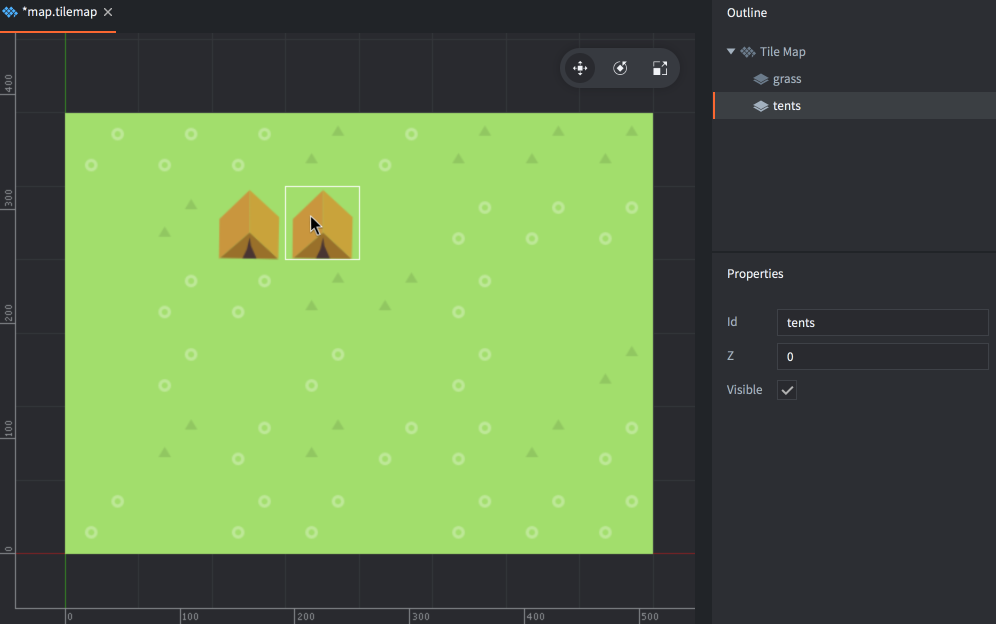
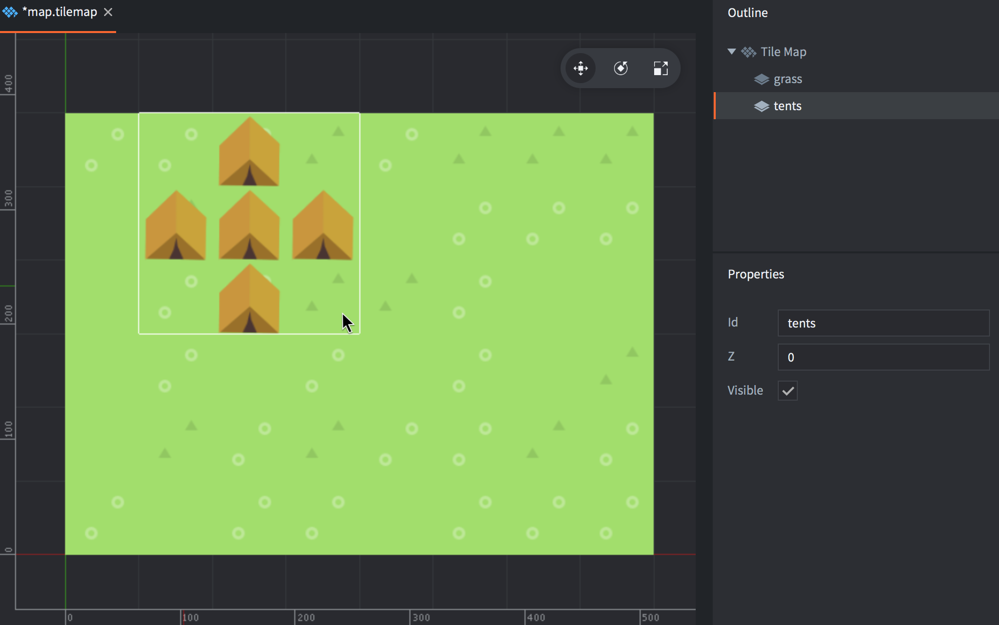

# Tile map

Mapa kafelków, czyli *Tile Map* jest komponentem pozwalającym składać większe obrazy z mniejszych kafelków (tiles) z dostępnego źródła kafelków (*Tile Source*) na kanwie o stałej siatce rozmieszczenia kafelków. Mapy te są często używane do budowania poziomów w grach (np. platformowych). Możesz również używać kształtu kolizji (*Collision Shapes*) pojedynczych kafelków ze źródła w Twojej mapie do wykrywania kolizji między poziomem a innymi obiektami fizyki ([- sprawdź przykład](/examples/tilemap/collisions/)).

Zanim utworzysz mapę kafelków musisz utworzyć ich źródło - galerię kafelków (Tile Source). Więcej szczegółów na temat tworzenia źródła kafelków znajdziesz w [tej instrukcji](/manuals/tilesource).

## Tworzenie mapy kafelków

To create a new tile map:

- <kbd>Kliknij prawym przyciskiem myszki</kbd> na wybraną lokację w panel *Assets* i wybierz <kbd>New... ▸ Tile Map</kbd>).
- Nazwij plik.
- Nowa mapa automatycznie utworzy się w Edytorze map.

  

- Ustaw źródła - właściwość *Tile Source* tak, żeby wskazywała na wcześniej przygotowane źródło kafelków.

W edytorze możesz rysować kafelkami swoje mapy, niczym pędzlem w edytorach graficznych:

1. Wybierz lub utwórz nową warstwę (*Layer*) w panelu *Outline*.
2. Wybierz kafelek do używania z palety otwieranej po naciśnięciu <kbd>Spacji</kbd>.

   

3. Maluj wybranym kafelkiem niczym pędzlem. Żeby wymazać kafelek albo wybierz pusty kafelek, żeby użyć go jak gumki, albo wybierz narzędzie gumki: <kbd>Edit ▸ Select Eraser</kbd>.

   

Możesz też pobierać kafelki bezpośrednio z warstwy na Twojej mapie i używać wybranego kafelka jak pędzla - naciśnij <kbd>Shift</kbd> i wybierz kafelek z mapy, żeby użyć go jako pędzla. Podczas trzymania klawisza <kbd>Shift</kbd> możesz wybrać więcej niż jeden kafelek - przeciągając zaznaczenie przez wiele z nich, żeby stworzyć większy pędzel składający się z kilku kafelków.



## Dodawanie mapy kafelków do Twojej gry

Aby dodać mapę do Twojej gry:

1. Utwórz obiekt gry. Nie jest istotne czy będzie to obiekt gry z prototypem zapisanym w pliku czy utworzonym bezpośrednio w kolekcji.
2. Kliknij prawym przyciskiem myszki na Twój obiekt i wybierz <kbd>Add Component File</kbd>.
3. Wybierz plik z Twoją mapą kafelków.


## Manipulacja w trakcie działania programu

Możesz też manipulować mapami w trakcie działania programu poprzez kilka funkcji i właściwości (sprawdź więcej szczegółów w [API](/ref/tilemap/)).

### Zmienianie pojedynczych kafelków z poziomu skryptu

Możesz zarówno odczytać kafelek z danego miejsca na mapie i zapisać inny kafelek w danym miejscu mapy dynamicznie. Używa się do tego funkcji [`tilemap.get_tile()`](/ref/tilemap/#tilemap.get_tile) i [`tilemap.set_tile()`](/ref/tilemap/#tilemap.set_tile) functions:

```lua
local tile = tilemap.get_tile("/level#map", "ground", x, y)

if tile == 2 then
    -- Zamień kafelek trawy (2) z kafelkiem z niebezpieczną dziurą (4).
    tilemap.set_tile("/level#map", "ground", x, y, 4)
end
```

## Właściwości map kafelków

Poza właściwościami takimi jak *Id*, *Position* i *Rotation* komponenty te posiadają swoje specyficzne właściwości:

*Tile Source*
: Źródło kafelków - galeria z mniejszymi obrazkami/kafelkami.

*Material*
: Materiał służący do renderowania.

*Blend Mode*
: Tryb "mieszania"/blendowania używany również przy renderowaniu. Więcej szczegółów poniżej.

### Blend modes - tryby blendowania
:[blend-modes](../shared/blend-modes.md)

### Zmiana właściwości w trakcie działania programu

Mapa kafelków ma kilka różnych właściwości, które można odczytywać i zmieniać w trakcie działania programu używając funkcji `go.get()` i `go.set()`:

`tile_source`
: Źródło kafelków (`hash`). Możesz użyć tej właściwości do podmiany źródła kafelków na inne, które mogą być właściwościami zasobu (resource property) i ustawić używając `go.set()`. Sprawdź szczegóły i przykłady w [API](/ref/tilemap/#tile_source).

`material`
: Materiał mapy (`hash`). Możesz podmienić materiał korzystając z właściwości zasobu (resource property) i ustawić używając `go.set()`. Sprawdź szczegóły i przykłady w [API](/ref/tilemap/#material).

### Stałe materiału



`tint`
: Kolor zabarwienia/odcienia mapy (`vector4`). Wektor czterech komponentów reprezentuje zabarwienie, gdzie komponenty x, y, z, w odpowiadają składowym: czerwony, zielony, niebieski i przezroczystość (red, green, blue, alpha).

## Konfiguracja projektu

Plik *game.project* zawiera [te ustawienia](/manuals/project-settings#tilemap) dotyczące map kafelków.
